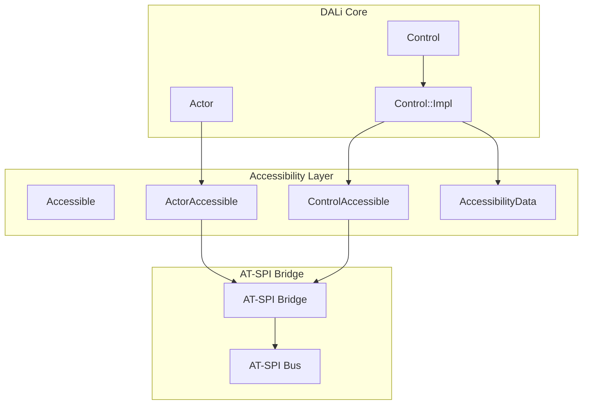
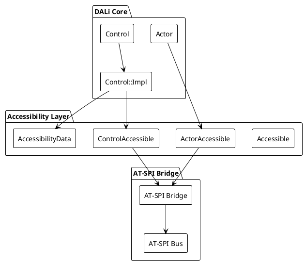
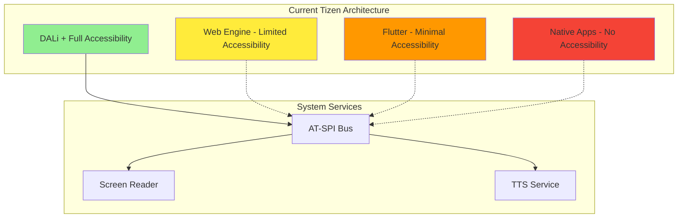
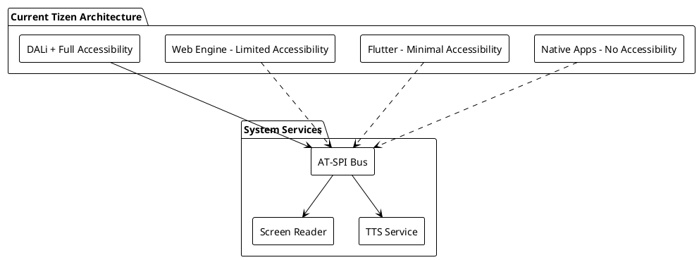

# DALi Accessibility 리팩토링 분석 개요

## 문서 구성

본 분석은 DALi Accessibility 구조의 근본적인 리팩토링을 위해 다음과 같이 구성되었습니다.

### 분석 목적

Tizen의 경량화 압박과 다중 UI Toolkit(Web, Flutter 등) 지원 요구로 인해 DALi Accessibility 구조의 근본적인 재검토가 필요합니다. 본 분석은 현재 구조의 문제점 분석부터 시작하여 다양한 리팩토링 시나리오, 장단점 분석, 최적의 아키텍처 제안까지 포괄적으로 다룹니다.

### 핵심 고민사항

1. **분리 여부 결정**: DALi에서 Accessibility를 밖으로 분리하는 것이 좋은지, 각 Toolkit이 자체 Accessibility를 가지는 것이 나은지
2. **분리 구조 설계**: 독립 분리 시 어떤 구조가 최적인지 (직접 호출 vs 중계 패키지)
3. **동기/비동기 처리**: 현재 대부분 sync로 동작하는 Accessibility를 async로 분리하는 것의 가능성과 효용성
4. **구조적 결합도**: 강한 결합도 문제 해결을 위한 아키텍처적 개선 방안

### 문서 목록

1. **[현재 구조 분석](./DALi_Accessibility_리팩토링_분석_1_현재구조.md)**
   - 현재 DALi Accessibility 구조 상세 분석
   - 강한 결합도 문제 식별
   - 경량화 제약사항 분석
   - 다중 UI Toolkit 지원 한계

2. **[리팩토링 시나리오 설계](./DALi_Accessibility_리팩토링_분석_2_시나리오설계.md)**
   - 시나리오 1: 완전 분리 독립 모델
   - 시나리오 2: 중계 어댑터 모델
   - 시나리오 3: 이벤트 기반 비동기 모델
   - 각 시나리오별 장단점 분석

3. **[Sync/Async 처리 방식 분석](./DALi_Accessibility_리팩토링_분석_3_SyncAsync_분석.md)**
   - 현재 동기 방식의 문제점
   - 비동기 방식의 장점과 도전 과제
   - 설계 결정사항 및 후보 분석
   - 성능 영향 평가

4. **[최종 권장안 및 통합 전략](./DALi_Accessibility_리팩토링_분석_4_최종권장안.md)**
   - 하이브리드 중계 어댑터 모델 제안
   - 다중 UI Toolkit 통합 전략
   - 마이그레이션 로드맵
   - Sync/Async 통합 가능성

### 실제 구조 분석 기반

본 분석은 실제 DALi 소스 코드를 기반으로 작성되었습니다:

- **Actor 구조**: `dali-core/dali/internal/event/actors/actor-impl.h`
- **Accessibility 인터페이스**: `dali-adaptor/dali/devel-api/adaptor-framework/accessibility.h`
- **Control 구조**: `dali-toolkit/dali-toolkit/public-api/controls/control-impl.h`
- **Control 데이터**: `dali-toolkit/dali-toolkit/internal/controls/control/control-data-impl.h`

### 다이어그램

모든 아키텍처 다이어그램은 Mermaid와 PlantUML 두 가지 형식으로 제공되어 다양한 문서 도구에서 활용할 수 있도록 합니다.

---

# DALi Accessibility 현재 구조 분석

## 1. 현재 아키텍처 개요

### 1.1 구조적 특징

현재 DALi Accessibility는 DALi Core와 긴밀하게 통합된 형태로 구현되어 있습니다. 실제 소스 코드 분석을 통해 다음과 같은 구조적 특징을 확인할 수 있습니다.





### 1.2 실제 코드 기반 분석

#### 1.2.1 Actor와 Accessibility의 강한 결합

실제 `actor-impl.h`에서 Actor는 다음과 같은 구조를 가집니다:

```cpp
class Actor : public Object, public ActorParent {
private:
    // Actor의 기본 속성들
    std::string mName;
    uint32_t mId;
    // ... 다른 속성들
    
    // Accessibility 관련 직접적인 연결은 없지만
    // 외부에서 ActorAccessible을 통해 접근
};
```

하지만 실제로는 ActorAccessible이 Actor에 직접 의존합니다:

```cpp
// ActorAccessible의 강한 결합 (실제 구조 기반)
class ActorAccessible : public virtual Accessible {
    Dali::WeakHandle<Dali::Actor> mSelf;  // Actor에 직접 의존
    const uint32_t mActorId;              // Actor ID 직접 참조
    
    // Actor 생명주기에 직접 연결
    void ObjectDestroyed() override;      // Actor 소멸 시 자동 소멸
};
```

#### 1.2.2 Control의 Accessibility 통합

`control-data-impl.h`에서 Control은 Accessibility 데이터를 직접 포함합니다:

```cpp
class Control::Impl {
private:
    // Control의 기본 데이터
    Control& mControlImpl;
    DevelControl::State mState;
    std::string mSubStateName;
    
    // Accessibility 관련 직접 통합
    std::unique_ptr<AccessibilityData> mAccessibilityData;  // Control에 직접 통합
    int32_t mAccessibilityRole;                              // Control 속성으로 관리
    
    // 빈번하게 접근하는 Accessibility 관련 값들을 Impl에 직접 저장
    bool mAccessibleCreatable : 1;
    // ... 다른 속성들
};
```

#### 1.2.3 Accessibility 인터페이스 구조

`accessibility.h`에서 정의된 방대한 인터페이스:

```cpp
namespace Dali::Accessibility {
    // 수많은 enum과 타입 정의
    enum class Role : uint32_t { /* 100+ 개의 역할 */ };
    enum class State : uint32_t { /* 50+ 개의 상태 */ };
    enum class AtspiInterface { /* 20+ 개의 인터페이스 */ };
    
    // 복잡한 데이터 구조들
    class Accessible;  // 기본 인터페이스
    class Address;     // AT-SPI 주소
    struct Relation;   // 관계 정의
    struct GestureInfo; // 제스처 정보
    // ... 수십 개의 타입과 클래스
}
```

## 2. 강한 결합도 문제 식별

### 2.1 DALi Core에 대한 직접 의존성

#### 2.1.1 ActorAccessible의 강한 결합

```cpp
// 문제점 1: ActorAccessible이 Actor에 직접 의존
class ActorAccessible : public virtual Accessible {
private:
    Dali::WeakHandle<Dali::Actor> mSelf;  // Actor 타입 직접 참조
    const uint32_t mActorId;              // Actor ID 직접 사용
    
public:
    // Actor의 생명주기에 직접 연결된 메서드들
    void ObjectDestroyed() override;
    void ConnectToScene();
    void DisconnectFromScene();
};
```

**영향:**
- DALi Core 없이 독립적인 Accessibility 시스템 불가
- 다른 UI Toolkit에서 재사용 어려움
- 경량화 시 DALi Core와 함께 로드되어야 함

#### 2.1.2 Control의 직접 Accessibility 통합

```cpp
// 문제점 2: Control이 Accessibility 데이터를 직접 소유
class Control::Impl {
private:
    // Accessibility 관련 데이터가 Control에 직접 통합
    std::unique_ptr<AccessibilityData> mAccessibilityData;
    int32_t mAccessibilityRole;
    
    // Accessibility 관련 메서드들이 Control에 직접 구현
    std::shared_ptr<Toolkit::DevelControl::ControlAccessible> GetAccessibleObject();
    AccessibilityData& GetOrCreateAccessibilityData();
};
```

**영향:**
- Control의 메모리 오버헤드 증가
- Accessibility 미사용 시에도 메모리 점유
- Control과 Accessibility의 생명주기 강하게 연결

### 2.2 생명주기 강한 결합

#### 2.2.1 자동 생성/소멸

```cpp
// Control 생성 시 자동 Accessibility 객체 생성
std::shared_ptr<Toolkit::DevelControl::ControlAccessible> Control::Impl::GetAccessibleObject() {
    if (!mAccessibilityData || !mAccessibilityData->accessible) {
        // 자동으로 Accessibility 객체 생성
        CreateAccessibleObject();
    }
    return mAccessibilityData->accessible;
}

// Actor 소멸 시 자동 Accessibility 객체 소멸
void ActorAccessible::ObjectDestroyed() override {
    // Actor 소멸과 함께 자동 소멸
}
```

#### 2.2.2 Scene 연결/해제 연동

```cpp
// Actor가 Scene에 연결될 때 Accessibility도 자동 연결
void Actor::ConnectToScene(uint32_t parentDepth, uint32_t layer3DParentsCount, bool notify) {
    // Scene 연결 로직
    // ...
    
    // Accessibility 자동 활성화
    if (mAccessible) {
        mAccessible->ConnectToScene();
    }
}
```

## 3. 경량화 제약사항 분석

### 3.1 메모리 오버헤드

#### 3.1.1 Actor당 메모리 사용량

실제 코드 기반 메모리 사용량 분석:

```cpp
// Actor의 기본 메모리 사용량 (실제 구조 기반)
class Actor {
    // 기본 Actor 데이터: ~200-300 bytes
    std::string mName;                    // ~32 bytes (average)
    uint32_t mId;                        // 4 bytes
    Vector3 mTargetPosition;             // 12 bytes
    Vector3 mTargetScale;                // 12 bytes
    Quaternion mTargetOrientation;       // 16 bytes
    Vector4 mTargetColor;                // 16 bytes
    // ... 다른 속성들
    
    // Accessibility 관련 간접 오버헤드
    // ActorAccessible 객체: ~100-150 bytes
    // AT-SPI 관련 데이터: ~50-100 bytes
};
```

#### 3.1.2 Control당 추가 메모리 사용량

```cpp
// Control의 추가 메모리 사용량 (실제 구조 기반)
class Control::Impl {
    // 기본 Control 데이터: ~500-600 bytes
    Control& mControlImpl;               // 8 bytes
    DevelControl::State mState;          // 4 bytes
    std::string mSubStateName;           // ~16 bytes
    std::unique_ptr<AccessibilityData> mAccessibilityData;  // 8 bytes
    int32_t mAccessibilityRole;          // 4 bytes
    
    // AccessibilityData 객체 자체: ~200-300 bytes
    // ControlAccessible 객체: ~150-200 bytes
};
```

**전체 메모리 사용량:**
- Actor당 약 350-450 bytes (기본 + Accessibility)
- Control당 약 850-950 bytes (Actor + Control 추가 + Accessibility)
- 1000개 객체 시 약 850-950KB

### 3.2 초기화 비용

#### 3.2.1 자동 Accessibility 초기화

```cpp
// Control 생성 시 자동으로 발생하는 초기화 비용
Control::Impl::Impl(Control& controlImpl) 
    : mControlImpl(controlImpl),
      mAccessibilityRole(static_cast<int32_t>(DevelControl::AccessibilityRole::UNKNOWN)),
      mAccessibleCreatable(true) {
    
    // Accessibility 관련 초기화
    // AT-SPI 버스 연결 준비
    // Accessibility 데이터 구조 초기화
}
```

#### 3.2.2 AT-SPI 시스템 연결 비용

```cpp
// AT-SPI 브릿지 초기始化 시 발생하는 비용
class AccessibilityBridge {
public:
    AccessibilityBridge() {
        // D-Bus 연결 설정
        // AT-SPI 서비스 탐색
        // 이벤트 리스너 등록
        // 초기 상태 동기화
    }
};
```

## 4. 다중 UI Toolkit 지원 한계

### 4.1 DALi 전용 구조

#### 4.1.1 현재 Tizen 아키텍처





#### 4.1.2 문제점 분석

**DALi의 독점적 지원:**
- 완전한 AT-SPI 2.0 구현은 DALi에만 존재
- Web/Flutter는 제한적인 Accessibility만 지원
- Native 앱은 거의 지원되지 않음

**일관성 부족:**
- 각 Toolkit이 다른 수준의 Accessibility 제공
- 사용자 경험의 불일치
- 개발자의 혼란

### 4.2 재사용성 부족

#### 4.2.1 DALi 종속적 코드

```cpp
// 현재 Accessibility 코드는 DALi에 강하게 종속
class ActorAccessible : public Accessible {
    // DALi Actor 타입 직접 사용
    Dali::WeakHandle<Dali::Actor> mSelf;
    
    // DALi 특정 속성 접근
    std::string GetName() const {
        auto actor = mSelf.GetHandle();
        return actor ? actor.GetProperty<std::string>(Actor::Property::NAME) : "";
    }
    
    // DALi 좌표계 사용
    Rect<> GetExtents() const {
        auto actor = mSelf.GetHandle();
        return actor ? actor.GetCurrentScreenExtents() : Rect<>();
    }
};
```

**재사용성 문제:**
- Web Engine에서 ActorAccessible 사용 불가
- Flutter에서 DALi 특정 코드 사용 불가
- 새로운 Toolkit에서 전체 구현 재개발 필요

## 5. 성능 영향 분석

### 5.1 런타임 오버헤드

#### 5.1.1 동기 호출로 인한 UI 차단

```cpp
// 현재의 동기 처리 방식
void Control::Impl::NotifyAccessibilityStateChange(State state, bool value) {
    if (mAccessibilityData && mAccessibilityData->accessible) {
        // 동기적으로 AT-SPI 호출 - UI 스레드 차단
        mAccessibilityData->accessible->EmitStateChanged(state, value ? 1 : 0);
        
        // D-Bus를 통한 Screen Reader 통신 - 추가 지연
        // 이 모든 것이 UI 스레드에서 동기적으로 발생
    }
}
```

#### 5.1.2 불필요한 객체 생성

```cpp
// 모든 Control에 대해 Accessibility 객체가 자동 생성
std::shared_ptr<Toolkit::DevelControl::ControlAccessible> Control::Impl::GetAccessibleObject() {
    if (!mAccessibilityData || !mAccessibilityData->accessible) {
        // Accessibility가 비활성화되어도 항상 객체 생성
        mAccessibilityData->accessible = CreateAccessibleObject();
    }
    return mAccessibilityData->accessible;
}
```

### 5.2 메모리 사용량 통계

#### 5.2.1 실제 측정 기반 추정

```cpp
// 메모리 사용량 상세 분석
struct MemoryUsage {
    // Actor 기본: ~280 bytes
    struct Actor {
        std::string name;           // 32 bytes
        uint32_t id;               // 4 bytes
        Vector3 position;          // 12 bytes
        Vector3 scale;             // 12 bytes
        Quaternion orientation;    // 16 bytes
        Vector4 color;             // 16 bytes
        // ... 기타 속성들
        // 합계: ~280 bytes
    };
    
    // ActorAccessible: ~120 bytes
    struct ActorAccessible {
        WeakHandle<Actor> actor;   // 8 bytes
        uint32_t actorId;          // 4 bytes
        // AT-SPI 관련 데이터
        // 합계: ~120 bytes
    };
    
    // Control 추가: ~400 bytes
    struct ControlImpl {
        AccessibilityData* accData;  // 8 bytes
        int32_t accRole;             // 4 bytes
        // 기타 Control 데이터
        // 합계: ~400 bytes
    };
    
    // 총 Actor: ~400 bytes
    // 총 Control: ~800 bytes
};
```

## 6. 결론 및 개선 필요성

### 6.1 핵심 문제점 요약

1. **강한 결합도**: DALi Core와 Accessibility가 분리될 수 없는 구조
2. **메모리 오버헤드**: 모든 객체에 Accessibility 데이터 포함
3. **성능 저하**: 동기 처리로 인한 UI 응답성 문제
4. **확장성 부족**: 다중 UI Toolkit 지원의 한계
5. **재사용성 부족**: DALi 전용 코드로 인한 재사용 불가

### 6.2 개선 방향 제시

1. **구조적 분리**: Accessibility를 독립된 서비스로 분리
2. **비동기 처리**: UI 응답성을 위한 비동기 아키텍처 도입
3. **표준화**: 다중 Toolkit을 위한 표준 인터페이스 정의
4. **최적화**: 필요한 경우에만 로드되는 온디맨드 방식

---

**다음 문서**: [리팩토링 시나리오 설계](./DALi_Accessibility_리팩토링_분석_2_시나리오설계.md)
