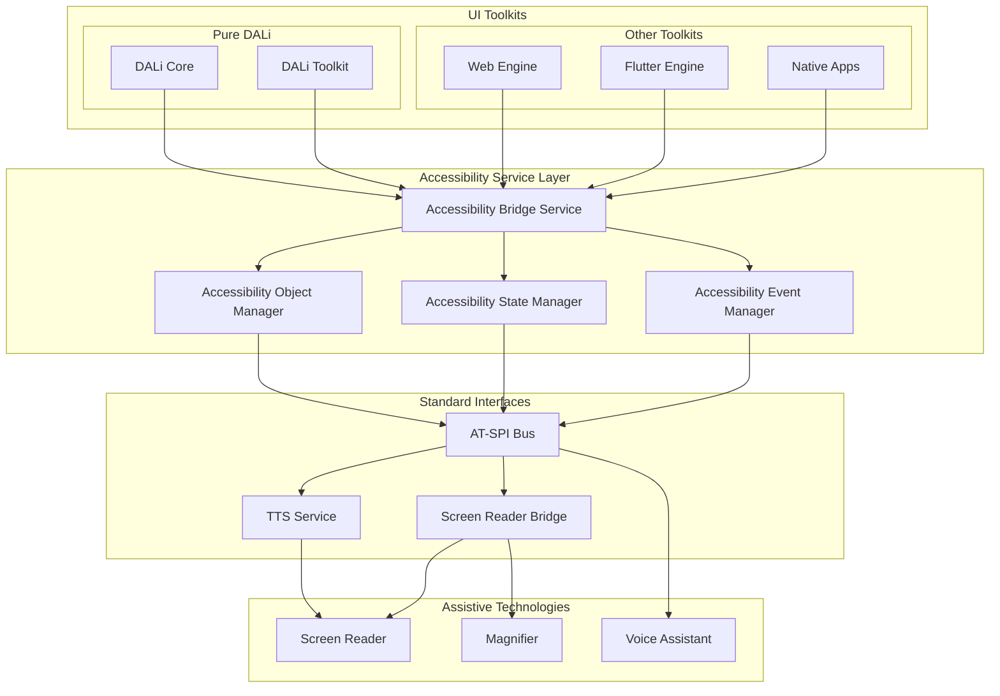
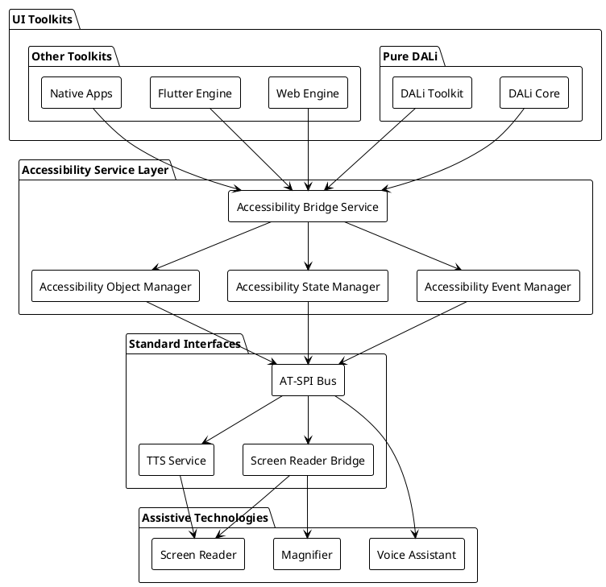
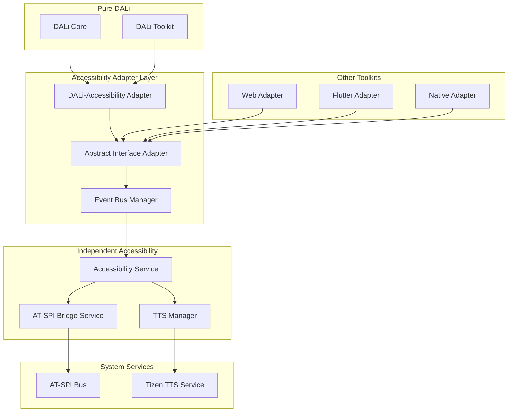
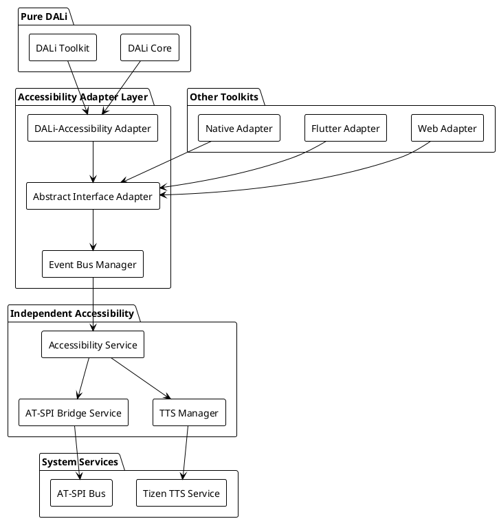

# DALi Accessibility 리팩토링 시나리오 설계

## 1. 시나리오 개요

현재 DALi Accessibility의 구조적 문제를 해결하기 위해 세 가지 주요 리팩토링 시나리오를 설계합니다. 각 시나리오는 분리 수준, 성능 영향, 구현 복잡성 측면에서 다른 접근 방식을 취합니다.

### 시나리오 분류 기준

1. **분리 수준**: DALi Core로부터의 독립성 정도
2. **성능 영향**: UI 응답성 및 메모리 사용량 변화
3. **구현 복잡성**: 개발 난이도 및 마이그레이션 비용
4. **확장성**: 다중 UI Toolkit 지원 가능성

## 2. 시나리오 1: 완전 분리 독립 모델

### 2.1 아키텍처 개념

Accessibility를 완전히 독립된 시스템 서비스로 분리하고, 각 UI Toolkit이 이를 호출하는 방식입니다. DALi Core는 Accessibility에 대한 어떠한 의존성도 가지지 않습니다.

### 2.2 아키텍처 다이어그램





### 2.3 상세 구현 설계

#### 2.3.1 독립된 Accessibility 서비스 인터페이스

```cpp
// 표준화된 Accessibility 서비스 인터페이스
namespace Accessibility::Service {
    // 표준 UI 요소 정보 구조
    struct UIElementInfo {
        ElementId id;
        ElementType type;
        std::string name;
        std::string description;
        Rect<> bounds;
        std::vector<State> states;
        std::map<std::string, std::string> attributes;
        ElementId parentId;
        std::vector<ElementId> childIds;
        ToolkitType sourceToolkit;
    };
    
    // 표준 이벤트 구조
    struct UIEvent {
        EventType type;
        ElementId elementId;
        std::chrono::system_clock::time_point timestamp;
        std::any data;
        ToolkitType sourceToolkit;
    };
    
    // 주요 서비스 인터페이스
    class IAccessibilityProvider {
    public:
        virtual ~IAccessibilityProvider() = default;
        
        // 객체 등록/관리
        virtual void RegisterElement(const UIElementInfo& element) = 0;
        virtual void UnregisterElement(ElementId id) = 0;
        virtual void UpdateElement(const UIElementInfo& element) = 0;
        
        // 상태 변경 알림
        virtual void NotifyStateChanged(ElementId id, State state, bool value) = 0;
        virtual void NotifyBoundsChanged(ElementId id, const Rect<>& bounds) = 0;
        virtual void NotifyFocusChanged(ElementId id, bool focused) = 0;
        
        // 이벤트 발행
        virtual void PublishEvent(const UIEvent& event) = 0;
        
        // 포커스 관리
        virtual void RequestFocus(ElementId id) = 0;
        virtual void ReleaseFocus(ElementId id) = 0;
        
        // 액션 수행
        virtual bool PerformAction(ElementId id, const std::string& action, 
                                 const std::any& parameters = {}) = 0;
    };
    
    // Toolkit 타입 식별
    enum class ToolkitType {
        DALI,
        WEB,
        FLUTTER,
        NATIVE,
        UNKNOWN
    };
}
```

#### 2.3.2 DALi 어댑터 구현

```cpp
// 순수한 DALi Core - Accessibility 의존성 완전 제거
namespace Dali {
    // 기존 Actor에서 Accessibility 관련 코드 완전 제거
    class Actor {
        // 기존 Accessibility 관련 코드 제거
        // 순수한 UI 로직만 유지
        
    private:
        // 기존 멤버들만 유지
        std::string mName;
        uint32_t mId;
        // ... 다른 UI 속성들
    };
    
    class Control {
        // Accessibility 데이터 완전 제거
        // 순수한 Control 로직만 유지
        
    private:
        // 기존 멤버들만 유지
        // std::unique_ptr<AccessibilityData> mAccessibilityData; // 제거
        // int32_t mAccessibilityRole; // 제거
    };
}

// 독립된 DALi Accessibility 클라이언트
class DaliAccessibilityClient {
private:
    std::shared_ptr<Accessibility::Service::IAccessibilityProvider> mProvider;
    std::unordered_map<uint32_t, Accessibility::Service::ElementId> mActorToElementMap;
    
public:
    DaliAccessibilityClient() {
        // Accessibility 서비스에 연결
        mProvider = AccessibilityServiceManager::GetInstance().GetProvider();
    }
    
    void RegisterActor(Actor actor) {
        Accessibility::Service::UIElementInfo element;
        element.id = GenerateElementId(actor.GetId());
        element.type = DetermineElementType(actor);
        element.name = actor.GetProperty<std::string>(Actor::Property::NAME);
        element.bounds = CalculateScreenBounds(actor);
        element.states = GetCurrentStates(actor);
        element.sourceToolkit = Accessibility::Service::ToolkitType::DALI;
        
        mProvider->RegisterElement(element);
        mActorToElementMap[actor.GetId()] = element.id;
    }
    
    void UnregisterActor(Actor actor) {
        auto it = mActorToElementMap.find(actor.GetId());
        if (it != mActorToElementMap.end()) {
            mProvider->UnregisterElement(it->second);
            mActorToElementMap.erase(it);
        }
    }
    
    void NotifyActorStateChanged(Actor actor, Accessibility::State state, bool value) {
        auto it = mActorToElementMap.find(actor.GetId());
        if (it != mActorToElementMap.end()) {
            mProvider->NotifyStateChanged(it->second, state, value);
        }
    }
    
private:
    Accessibility::Service::ElementId GenerateElementId(uint32_t actorId) {
        return Accessibility::Service::ElementId{
            .value = (static_cast<uint64_t>(Accessibility::Service::ToolkitType::DALI) << 32) | actorId
        };
    }
    
    Accessibility::Service::ElementType DetermineElementType(Actor actor) {
        // Actor 타입을 표준 ElementType으로 변환
        if (Dali::Toolkit::Control::DownCast(actor)) {
            auto control = Dali::Toolkit::Control::DownCast(actor);
            return ConvertControlRoleToElementType(control.GetAccessibilityRole());
        }
        return Accessibility::Service::ElementType::UNKNOWN;
    }
    
    Rect<> CalculateScreenBounds(Actor actor) {
        return actor.GetCurrentScreenExtents();
    }
    
    std::vector<Accessibility::State> GetCurrentStates(Actor actor) {
        std::vector<Accessibility::State> states;
        
        if (actor.IsVisible()) states.push_back(Accessibility::State::VISIBLE);
        if (actor.IsSensitive()) states.push_back(Accessibility::State::SENSITIVE);
        if (actor.IsKeyboardFocusable()) states.push_back(Accessibility::State::FOCUSABLE);
        if (actor.HasKeyInputFocus()) states.push_back(Accessibility::State::FOCUSED);
        
        return states;
    }
};
```

### 2.4 장점

1. **완전한 분리**: DALi Core와 독립된 생명주기
2. **다중 Toolkit 지원**: 모든 UI Toolkit에서 공통 사용
3. **경량화**: 필요한 경우에만 로드
4. **확장성**: 새로운 Toolkit 쉽게 추가
5. **테스트 용이성**: Mock 서비스로 쉬운 단위 테스트

### 2.5 단점

1. **복잡성 증가**: 추가적인 추상화 계층
2. **성능 오버헤드**: 객체 정보 변환 비용
3. **동기화 복잡성**: 상태 일관성 유지 어려움
4. **마이그레이션 비용**: 기존 코드 전면 수정 필요

## 3. 시나리오 2: 중계 어댑터 모델

### 3.1 아키텍처 개념

DALi를 순수하게 유지하고, DALi와 Accessibility를 연결하는 중계 패키지를 별도로 추출하는 방식입니다. DALi Core는 순수성을 유지하면서도 기존 구조와의 호환성을 일부 유지할 수 있습니다.

### 3.2 아키텍처 다이어그램





### 3.3 상세 구현 설계

#### 3.3.1 순수한 DALi Core

```cpp
// 순수한 DALi Core - Accessibility 의존성 완전 제거
namespace Dali {
    class Actor {
        // 기존 Accessibility 관련 코드 완전 제거
        // 순수한 UI 로직만 유지
        
    private:
        std::string mName;
        uint32_t mId;
        Vector3 mTargetPosition;
        Vector3 mTargetScale;
        Quaternion mTargetOrientation;
        Vector4 mTargetColor;
        // ... 다른 UI 속성들
    };
    
    class Control {
        // Accessibility 데이터 완전 제거
        
    private:
        // 기존 멤버들만 유지
        Control& mControlImpl;
        DevelControl::State mState;
        std::string mSubStateName;
        // Accessibility 관련 멤버들 제거
    };
}
```

#### 3.3.2 추상 인터페이스 정의

```cpp
// 표준화된 UI 요소 추상화
namespace Accessibility::Interface {
    struct UIElement {
        ElementId id;
        ElementType type;
        std::string name;
        std::string description;
        Rect<> bounds;
        std::vector<State> states;
        std::map<std::string, std::string> attributes;
        ElementId parentId;
        std::vector<ElementId> childIds;
    };
    
    // 표준 이벤트 정의
    struct UIEvent {
        EventType type;
        ElementId elementId;
        std::chrono::system_clock::time_point timestamp;
        std::any data;
    };
    
    // Toolkit 공통 인터페이스
    class IUIElementProvider {
    public:
        virtual ~IUIElementProvider() = default;
        
        // 요소 관리
        virtual std::vector<UIElement> GetRootElements() = 0;
        virtual UIElement GetElement(ElementId id) = 0;
        virtual std::vector<UIElement> GetChildren(ElementId id) = 0;
        virtual UIElement GetParent(ElementId id) = 0;
        
        // 이벤트 구독
        virtual void SubscribeToEvents(std::function<void(const UIEvent&)> handler) = 0;
        virtual void UnsubscribeFromEvents() = 0;
        
        // 액션 수행
        virtual bool PerformAction(ElementId id, const std::string& action, 
                                 const std::any& parameters) = 0;
    };
    
    // Accessibility 알림 인터페이스
    class IAccessibilityNotifier {
    public:
        virtual ~IAccessibilityNotifier() = default;
        virtual void NotifyElementCreated(const UIElement& element) = 0;
        virtual void NotifyElementDestroyed(ElementId id) = 0;
        virtual void NotifyStateChanged(ElementId id, State state, bool value) = 0;
        virtual void NotifyBoundsChanged(ElementId id, const Rect<>& bounds) = 0;
        virtual void NotifyFocusChanged(ElementId id, bool focused) = 0;
    };
}
```

#### 3.3.3 DALi-Accessibility 어댑터

```cpp
// DALi-Accessibility 어댑터 구현
class DaliAccessibilityAdapter : public Accessibility::Interface::IUIElementProvider {
private:
    std::function<void(const Accessibility::Interface::UIEvent&)> mEventHandler;
    std::weak_ptr<Accessibility::Interface::IAccessibilityNotifier> mNotifier;
    std::unordered_map<uint32_t, Accessibility::Interface::ElementId> mActorToElementMap;
    
    // DALi 이벤트 연결
    std::vector<Dali::Connection> mConnections;
    
public:
    DaliAccessibilityAdapter() {
        ConnectToDaliEvents();
    }
    
    void SetNotifier(std::shared_ptr<Accessibility::Interface::IAccessibilityNotifier> notifier) {
        mNotifier = notifier;
    }
    
    std::vector<Accessibility::Interface::UIElement> GetRootElements() override {
        std::vector<Accessibility::Interface::UIElement> roots;
        
        // DALi의 최상위 윈도우들 찾기
        auto stage = Dali::Stage::GetCurrent();
        for (uint32_t i = 0; i < stage.GetLayerCount(); ++i) {
            auto layer = stage.GetLayerAt(i);
            roots.push_back(ConvertActorToElement(layer));
        }
        
        return roots;
    }
    
    Accessibility::Interface::UIElement GetElement(Accessibility::Interface::ElementId id) override {
        // ElementId를 Actor ID로 변환
        uint32_t actorId = ExtractActorId(id);
        auto actor = Dali::Actor::Get(actorId);
        
        if (actor) {
            return ConvertActorToElement(actor);
        }
        
        return {};
    }
    
    std::vector<Accessibility::Interface::UIElement> GetChildren(Accessibility::Interface::ElementId id) override {
        std::vector<Accessibility::Interface::UIElement> children;
        
        uint32_t actorId = ExtractActorId(id);
        auto actor = Dali::Actor::Get(actorId);
        
        if (actor) {
            for (uint32_t i = 0; i < actor.GetChildCount(); ++i) {
                auto child = actor.GetChildAt(i);
                children.push_back(ConvertActorToElement(child));
            }
        }
        
        return children;
    }
    
    void SubscribeToEvents(std::function<void(const Accessibility::Interface::UIEvent&)> handler) override {
        mEventHandler = handler;
    }
    
    bool PerformAction(Accessibility::Interface::ElementId id, const std::string& action, 
                      const std::any& parameters) override {
        uint32_t actorId = ExtractActorId(id);
        auto actor = Dali::Actor::Get(actorId);
        
        if (!actor) return false;
        
        // 액션 수행 로직
        if (action == "activate") {
            if (auto control = Dali::Toolkit::Control::DownCast(actor)) {
                // Control 활성화 로직
                return true;
            }
        } else if (action == "focus") {
            if (actor.IsKeyboardFocusable()) {
                actor.SetKeyInputFocus();
                return true;
            }
        }
        
        return false;
    }
    
private:
    void ConnectToDaliEvents() {
        // DALi 이벤트 시스템 연결
        auto stage = Dali::Stage::GetCurrent();
        
        // Actor 추가/제거 이벤트
        mConnections.push_back(
            stage.ObjectAddedSignal().Connect(this, &DaliAccessibilityAdapter::OnActorAdded)
        );
        mConnections.push_back(
            stage.ObjectRemovedSignal().Connect(this, &DaliAccessibilityAdapter::OnActorRemoved)
        );
        
        // 기타 필요한 이벤트들 연결
    }
    
    void OnActorAdded(Dali::Actor actor) {
        auto element = ConvertActorToElement(actor);
        
        if (auto notifier = mNotifier.lock()) {
            notifier->NotifyElementCreated(element);
        }
        
        if (mEventHandler) {
            Accessibility::Interface::UIEvent event{
                .type = Accessibility::Interface::EventType::OBJECT_CREATED,
                .elementId = element.id,
                .timestamp = std::chrono::system_clock::now(),
                .data = element
            };
            mEventHandler(event);
        }
    }
    
    void OnActorRemoved(Dali::Actor actor) {
        auto it = mActorToElementMap.find(actor.GetId());
        if (it != mActorToElementMap.end()) {
            if (auto notifier = mNotifier.lock()) {
                notifier->NotifyElementDestroyed(it->second);
            }
            
            if (mEventHandler) {
                Accessibility::Interface::UIEvent event{
                    .type = Accessibility::Interface::EventType::OBJECT_DESTROYED,
                    .elementId = it->second,
                    .timestamp = std::chrono::system_clock::now()
                };
                mEventHandler(event);
            }
            
            mActorToElementMap.erase(it);
        }
    }
    
    Accessibility::Interface::UIElement ConvertActorToElement(Dali::Actor actor) {
        Accessibility::Interface::UIElement element;
        element.id = GenerateElementId(actor.GetId());
        element.type = DetermineElementType(actor);
        element.name = actor.GetProperty<std::string>(Dali::Actor::Property::NAME);
        element.bounds = CalculateScreenBounds(actor);
        element.states = GetCurrentStates(actor);
        element.parentId = GetParentElementId(actor);
        element.childIds = GetChildElementIds(actor);
        
        return element;
    }
    
    Accessibility::Interface::ElementId GenerateElementId(uint32_t actorId) {
        return Accessibility::Interface::ElementId{
            .value = (static_cast<uint64_t>(Accessibility::Interface::ToolkitType::DALI) << 32) | actorId
        };
    }
    
    Accessibility::Interface::ElementType DetermineElementType(Dali::Actor actor) {
        if (auto control = Dali::Toolkit::Control::DownCast(actor)) {
            // Control의 역할을 표준 타입으로 변환
            return ConvertControlRoleToElementType(control.GetAccessibilityRole());
        }
        return Accessibility::Interface::ElementType::UNKNOWN;
    }
    
    Rect<> CalculateScreenBounds(Dali::Actor actor) {
        return actor.GetCurrentScreenExtents();
    }
    
    std::vector<Accessibility::Interface::State> GetCurrentStates(Dali::Actor actor) {
        std::vector<Accessibility::Interface::State> states;
        
        if (actor.IsVisible()) states.push_back(Accessibility::Interface::State::VISIBLE);
        if (actor.IsSensitive()) states.push_back(Accessibility::Interface::State::SENSITIVE);
        if (actor.IsKeyboardFocusable()) states.push_back(Accessibility::Interface::State::FOCUSABLE);
        if (actor.HasKeyInputFocus()) states.push_back(Accessibility::Interface::State::FOCUSED);
        
        return states;
    }
};
```

### 3.4 장점

1. **DALi 순수성**: Core의 경량화 및 단순성 유지
2. **유연한 연결**: 필요에 따라 어댑터 선택적 로드
3. **점진적 마이그레이션**: 단계적인 전환 가능
4. **테스트 용이성**: Mock 어댑터로 쉬운 테스트
5. **호환성**: 기존 코드와의 부분적 호환성 유지

### 3.5 단점

1. **추가 계층**: 어댑터 계층으로 인한 복잡성
2. **성능 저하**: 간접 호출로 인한 오버헤드
3. **동기화 문제**: 상태 일관성 유지의 어려움
4. **부분적 의존성**: 여전히 DALi 구조에 대한 이해 필요

---

**다음 문서**: [시나리오 설계 (계속)](./DALi_Accessibility_리팩토링_분석_2_시나리오설계_2.md)
