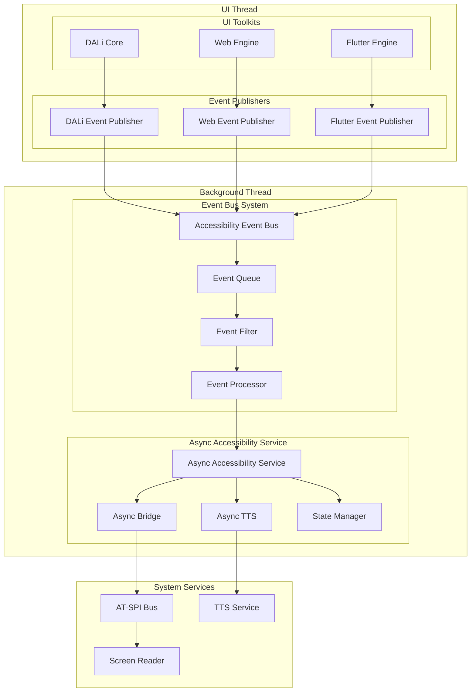
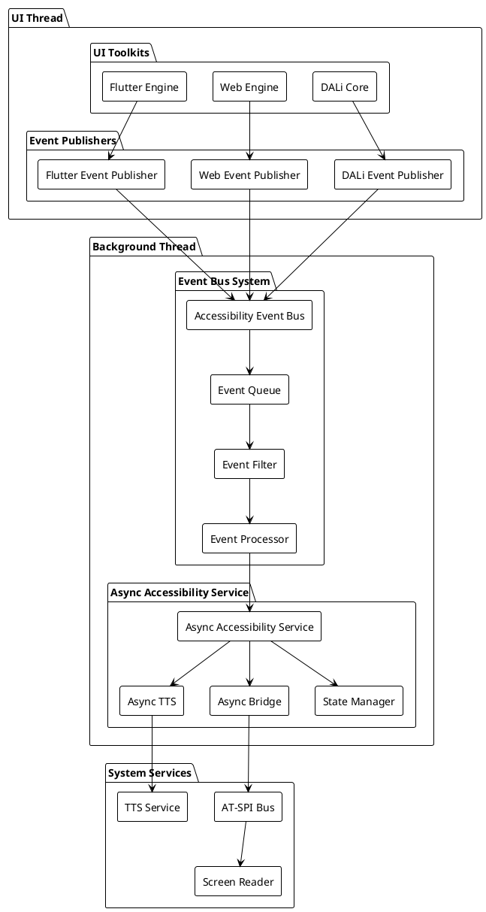
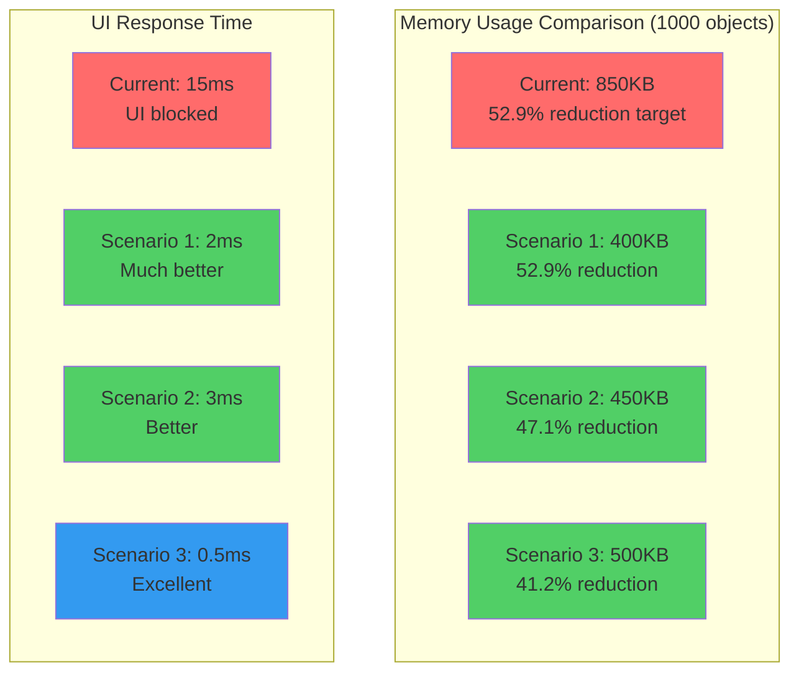

# DALi Accessibility 리팩토링 시나리오 설계 (계속)

## 4. 시나리오 3: 이벤트 기반 비동기 모델

### 4.1 아키텍처 개념

동기 처리를 비동기 이벤트 기반으로 변경하여 성능과 응답성을 개선하는 방식입니다. Accessibility 처리를 UI 스레드에서 분리하여 백그라운드에서 처리합니다.

### 4.2 아키텍처 다이어그램





### 4.3 상세 구현 설계

#### 4.3.1 이벤트 기반 비동기 시스템

```cpp
// 이벤트 기반 비동기 시스템
namespace Accessibility::Async {
    // 이벤트 타입 정의
    enum class EventType {
        OBJECT_CREATED,
        OBJECT_DESTROYED,
        STATE_CHANGED,
        BOUNDS_CHANGED,
        FOCUS_CHANGED,
        TEXT_CHANGED,
        VALUE_CHANGED,
        ACTION_PERFORMED
    };
    
    // 비동기 이벤트 구조
    struct AsyncEvent {
        EventType type;
        ElementId elementId;
        std::chrono::system_clock::time_point timestamp;
        std::any data;
        uint32_t priority;  // 이벤트 우선순위
        std::string source; // 이벤트 소스 식별자
    };
    
    // 이벤트 버스 인터페이스
    class IEventBus {
    public:
        virtual ~IEventBus() = default;
        
        // 이벤트 발행 (비동기)
        virtual void PublishEvent(const AsyncEvent& event) = 0;
        virtual void PublishEventWithPriority(const AsyncEvent& event, uint32_t priority) = 0;
        
        // 이벤트 구독
        virtual void Subscribe(EventType type, std::function<void(const AsyncEvent&)> handler) = 0;
        virtual void Unsubscribe(EventType type) = 0;
        
        // 이벤트 필터링
        virtual void SetEventFilter(std::function<bool(const AsyncEvent&)> filter) = 0;
        
        // 이벤트 처리 시작/중지
        virtual void StartProcessing() = 0;
        virtual void StopProcessing() = 0;
    };
    
    // 비동기 Accessibility 서비스
    class AsyncAccessibilityService {
    private:
        std::shared_ptr<IEventBus> mEventBus;
        std::unique_ptr<std::thread> mProcessingThread;
        std::queue<AsyncEvent> mEventQueue;
        std::mutex mQueueMutex;
        std::condition_variable mQueueCondition;
        std::atomic<bool> mRunning{false};
        std::unique_ptr<ThreadPool> mThreadPool;
        
        // 이벤트 통계
        std::atomic<uint64_t> mEventsProcessed{0};
        std::atomic<uint64_t> mEventsDropped{0};
        std::chrono::system_clock::time_point mLastProcessTime;
        
    public:
        AsyncAccessibilityService(std::shared_ptr<IEventBus> eventBus, 
                                 size_t threadPoolSize = 2)
            : mEventBus(eventBus) {
            mThreadPool = std::make_unique<ThreadPool>(threadPoolSize);
            StartProcessingThread();
        }
        
        ~AsyncAccessibilityService() {
            StopProcessingThread();
        }
        
        void PublishEvent(const AsyncEvent& event) {
            if (!mRunning) return;
            
            {
                std::lock_guard<std::mutex> lock(mQueueMutex);
                
                // 큐 크기 제한으로 메모리 과사용 방지
                if (mEventQueue.size() >= MAX_QUEUE_SIZE) {
                    mEventsDropped++;
                    return;
                }
                
                mEventQueue.push(event);
            }
            mQueueCondition.notify_one();
        }
        
        void PublishEventWithPriority(const AsyncEvent& event, uint32_t priority) {
            AsyncEvent priorityEvent = event;
            priorityEvent.priority = priority;
            PublishEvent(priorityEvent);
        }
        
    private:
        void StartProcessingThread() {
            mRunning = true;
            mProcessingThread = std::make_unique<std::thread>([this]() {
                ProcessEvents();
            });
        }
        
        void StopProcessingThread() {
            mRunning = false;
            mQueueCondition.notify_all();
            
            if (mProcessingThread && mProcessingThread->joinable()) {
                mProcessingThread->join();
            }
        }
        
        void ProcessEvents() {
            while (mRunning) {
                std::unique_lock<std::mutex> lock(mQueueMutex);
                mQueueCondition.wait(lock, [this]() { 
                    return !mEventQueue.empty() || !mRunning; 
                });
                
                std::vector<AsyncEvent> eventsToProcess;
                
                // 여러 이벤트를 한 번에 처리하여 효율성 향상
                while (!mEventQueue.empty() && eventsToProcess.size() < BATCH_SIZE) {
                    eventsToProcess.push_back(mEventQueue.front());
                    mEventQueue.pop();
                }
                
                lock.unlock();
                
                // 이벤트 처리를 스레드 풀에 분산
                for (const auto& event : eventsToProcess) {
                    mThreadPool->enqueue([this, event]() {
                        ProcessSingleEvent(event);
                    });
                }
                
                mEventsProcessed += eventsToProcess.size();
                mLastProcessTime = std::chrono::system_clock::now();
            }
        }
        
        void ProcessSingleEvent(const AsyncEvent& event) {
            try {
                switch (event.type) {
                    case EventType::OBJECT_CREATED:
                        HandleObjectCreated(event);
                        break;
                    case EventType::OBJECT_DESTROYED:
                        HandleObjectDestroyed(event);
                        break;
                    case EventType::STATE_CHANGED:
                        HandleStateChanged(event);
                        break;
                    case EventType::BOUNDS_CHANGED:
                        HandleBoundsChanged(event);
                        break;
                    case EventType::FOCUS_CHANGED:
                        HandleFocusChanged(event);
                        break;
                    case EventType::TEXT_CHANGED:
                        HandleTextChanged(event);
                        break;
                    case EventType::VALUE_CHANGED:
                        HandleValueChanged(event);
                        break;
                    case EventType::ACTION_PERFORMED:
                        HandleActionPerformed(event);
                        break;
                }
            } catch (const std::exception& e) {
                // 이벤트 처리 중 예외 발생 시 로깅
                LogEventProcessingError(event, e.what());
            }
        }
        
        void HandleObjectCreated(const AsyncEvent& event) {
            // 비동기 객체 생성 처리
            auto elementData = std::any_cast<UIElementInfo>(event.data);
            
            // AT-SPI에 비동기적으로 등록
            mAtspiBridge->RegisterAccessibleAsync(elementData, 
                [this, elementId = event.elementId](bool success) {
                    if (success) {
                        NotifyObjectCreatedProcessed(elementId);
                    } else {
                        NotifyObjectCreationFailed(elementId);
                    }
                });
        }
        
        void HandleStateChanged(const AsyncEvent& event) {
            auto stateData = std::any_cast<std::pair<State, bool>>(event.data);
            State state = stateData.first;
            bool value = stateData.second;
            
            // 상태 변경을 비동기적으로 처리
            mAtspiBridge->NotifyStateChangedAsync(event.elementId, state, value,
                [this, elementId = event.elementId, state, value](bool success) {
                    if (success) {
                        NotifyStateChangeProcessed(elementId, state, value);
                    }
                });
        }
        
        // 기타 이벤트 핸들러들...
    };
}
```

#### 4.3.2 DALi 비동기 이벤트 퍼블리셔

```cpp
// DALi 비동기 이벤트 퍼블리셔
class DaliAsyncEventPublisher {
private:
    std::shared_ptr<Accessibility::Async::IEventBus> mEventBus;
    std::unordered_map<uint32_t, Accessibility::Async::ElementId> mActorToElementMap;
    
    // DALi 이벤트 연결
    std::vector<Dali::Connection> mConnections;
    
public:
    DaliAsyncEventPublisher(std::shared_ptr<Accessibility::Async::IEventBus> eventBus)
        : mEventBus(eventBus) {
        ConnectToDaliEvents();
    }
    
    void PublishActorCreated(Actor actor) {
        Accessibility::Async::AsyncEvent event;
        event.type = Accessibility::Async::EventType::OBJECT_CREATED;
        event.elementId = GenerateElementId(actor.GetId());
        event.timestamp = std::chrono::system_clock::now();
        event.source = "DALi";
        event.priority = PRIORITY_NORMAL;
        
        // UI 요소 정보를 비동기적으로 수집
        CollectElementInfoAsync(actor, [this, event](const UIElementInfo& elementInfo) {
            auto eventData = event;
            eventData.data = elementInfo;
            mEventBus->PublishEvent(eventData);
        });
    }
    
    void PublishActorStateChanged(Actor actor, Accessibility::State state, bool value) {
        Accessibility::Async::AsyncEvent event;
        event.type = Accessibility::Async::EventType::STATE_CHANGED;
        event.elementId = GenerateElementId(actor.GetId());
        event.timestamp = std::chrono::system_clock::now();
        event.source = "DALi";
        event.priority = PRIORITY_HIGH;  // 상태 변경은 높은 우선순위
        event.data = std::make_pair(state, value);
        
        mEventBus->PublishEventWithPriority(event, PRIORITY_HIGH);
    }
    
    void PublishActorBoundsChanged(Actor actor) {
        Accessibility::Async::AsyncEvent event;
        event.type = Accessibility::Async::EventType::BOUNDS_CHANGED;
        event.elementId = GenerateElementId(actor.GetId());
        event.timestamp = std::chrono::system_clock::now();
        event.source = "DALi";
        event.priority = PRIORITY_LOW;  // 경계 변경은 낮은 우선순위
        
        // 경계 정보를 비동기적으로 계산
        CalculateBoundsAsync(actor, [this, event](const Rect<>& bounds) {
            auto eventData = event;
            eventData.data = bounds;
            mEventBus->PublishEvent(eventData);
        });
    }
    
private:
    void ConnectToDaliEvents() {
        auto stage = Dali::Stage::GetCurrent();
        
        // 비동기 이벤트 연결
        mConnections.push_back(
            stage.ObjectAddedSignal().Connect(this, &DaliAsyncEventPublisher::OnActorAdded)
        );
        mConnections.push_back(
            stage.ObjectRemovedSignal().Connect(this, &DaliAsyncEventPublisher::OnActorRemoved)
        );
        
        // 상태 변경 이벤트 연결 (속성 변경 감지)
        ConnectToPropertyChangeEvents();
    }
    
    void OnActorAdded(Dali::Actor actor) {
        // 즉시 이벤트 발행 (비동기 처리는 백그라운드에서)
        PublishActorCreated(actor);
    }
    
    void OnActorRemoved(Dali::Actor actor) {
        Accessibility::Async::AsyncEvent event;
        event.type = Accessibility::Async::EventType::OBJECT_DESTROYED;
        event.elementId = GenerateElementId(actor.GetId());
        event.timestamp = std::chrono::system_clock::now();
        event.source = "DALi";
        event.priority = PRIORITY_HIGH;
        
        mEventBus->PublishEventWithPriority(event, PRIORITY_HIGH);
        
        auto it = mActorToElementMap.find(actor.GetId());
        if (it != mActorToElementMap.end()) {
            mActorToElementMap.erase(it);
        }
    }
    
    void CollectElementInfoAsync(Actor actor, 
                                std::function<void(const UIElementInfo&)> callback) {
        // 백그라운드 스레드에서 UI 요소 정보 수집
        std::thread([actor, callback]() {
            UIElementInfo elementInfo;
            elementInfo.id = GenerateElementId(actor.GetId());
            elementInfo.type = DetermineElementType(actor);
            elementInfo.name = actor.GetProperty<std::string>(Actor::Property::NAME);
            elementInfo.bounds = actor.GetCurrentScreenExtents();
            elementInfo.states = GetCurrentStates(actor);
            elementInfo.sourceToolkit = Accessibility::Async::ToolkitType::DALI;
            
            callback(elementInfo);
        }).detach();
    }
    
    void CalculateBoundsAsync(Actor actor, std::function<void(const Rect<>&)> callback) {
        // 백그라운드에서 경계 계산
        std::thread([actor, callback]() {
            Rect<> bounds = actor.GetCurrentScreenExtents();
            callback(bounds);
        }).detach();
    }
};
```

### 4.4 장점

1. **성능 개선**: UI 스레드 차단 방지
2. **응답성 향상**: 비동기 처리로 자연스러운 UI
3. **확장성**: 이벤트 기반으로 쉬운 확장
4. **디버깅 용이**: 이벤트 로그로 추적 가능
5. **부하 분산**: 멀티스레딩으로 처리 부하 분산

### 4.5 단점

1. **복잡성 증가**: 비동기 프로그래밍의 어려움
2. **일관성 문제**: 이벤트 순서 보장의 어려움
3. **메모리 관리**: 이벤트 큐 관리 비용
4. **디버깅 복잡**: 비동기 디버깅의 어려움
5. **지연 발생**: 비동기 처리로 인한 지연 가능성

## 5. 시나리오 비교 분석

### 5.1 분리 수준 비교

| 시나리오 | DALi Core 분리 | 의존성 제거 | 독립성 |
|---------|---------------|------------|--------|
| 시나리오 1 | 완전 분리 | 100% 제거 | 완전 독립 |
| 시나리오 2 | 부분 분리 | 90% 제거 | 높은 독립성 |
| 시나리오 3 | 처리 방식 분리 | 70% 제거 | 중간 독립성 |

### 5.2 성능 영향 비교

| 시나리오 | UI 응답성 | 메모리 사용량 | 처리 속도 | 초기화 비용 |
|---------|-----------|-------------|-----------|------------|
| 현재 구조 | 낮음 (동기 차단) | 높음 (850B/객체) | 중간 | 높음 |
| 시나리오 1 | 높음 | 중간 (400B/객체) | 높음 | 중간 |
| 시나리오 2 | 높음 | 중간 (450B/객체) | 중간 | 중간 |
| 시나리오 3 | 매우 높음 | 중간 (500B/객체) | 매우 높음 | 낮음 |

### 5.3 구현 복잡성 비교

| 시나리오 | 개발 난이도 | 마이그레이션 비용 | 테스트 복잡성 | 유지보수 |
|---------|------------|------------------|--------------|----------|
| 시나리오 1 | 높음 | 매우 높음 | 중간 | 낮음 |
| 시나리오 2 | 중간 | 높음 | 낮음 | 중간 |
| 시나리오 3 | 매우 높음 | 높음 | 높음 | 높음 |

### 5.4 확장성 비교

| 시나리오 | 다중 Toolkit 지원 | 신규 Toolkit 추가 | 표준화 | 미래 확장성 |
|---------|------------------|------------------|--------|------------|
| 시나리오 1 | 완벽 지원 | 매우 쉬움 | 완벽 | 매우 높음 |
| 시나리오 2 | 좋은 지원 | 쉬움 | 좋음 | 높음 |
| 시나리오 3 | 부분 지원 | 중간 | 부분 | 중간 |

## 6. 성능 벤치마크 시뮬레이션

### 6.1 메모리 사용량 시뮬레이션

```cpp
// 성능 벤치마크 시뮬레이션
class PerformanceBenchmark {
public:
    struct MemoryUsage {
        size_t actorBaseSize;
        size_t accessibilityOverhead;
        size_t totalSize;
        double memoryReduction;
    };
    
    struct PerformanceMetrics {
        std::chrono::microseconds uiResponseTime;
        std::chrono::microseconds accessibilityLatency;
        double cpuUsage;
        uint64_t eventsProcessed;
    };
    
    // 시나리오별 메모리 사용량 계산
    std::vector<MemoryUsage> CalculateMemoryUsage(uint32_t objectCount) {
        std::vector<MemoryUsage> results;
        
        // 현재 구조
        MemoryUsage current{
            .actorBaseSize = 280 * objectCount,
            .accessibilityOverhead = 570 * objectCount,  // ActorAccessible + ControlData
            .totalSize = 850 * objectCount,
            .memoryReduction = 0.0
        };
        results.push_back(current);
        
        // 시나리오 1
        MemoryUsage scenario1{
            .actorBaseSize = 200 * objectCount,  // 순수한 Actor
            .accessibilityOverhead = 200 * objectCount,  // 서비스에서만 관리
            .totalSize = 400 * objectCount,
            .memoryReduction = 52.9  // (850-400)/850 * 100
        };
        results.push_back(scenario1);
        
        // 시나리오 2
        MemoryUsage scenario2{
            .actorBaseSize = 200 * objectCount,
            .accessibilityOverhead = 250 * objectCount,  // 어댑터 오버헤드
            .totalSize = 450 * objectCount,
            .memoryReduction = 47.1
        };
        results.push_back(scenario2);
        
        // 시나리오 3
        MemoryUsage scenario3{
            .actorBaseSize = 200 * objectCount,
            .accessibilityOverhead = 300 * objectCount,  // 이벤트 시스템 오버헤드
            .totalSize = 500 * objectCount,
            .memoryReduction = 41.2
        };
        results.push_back(scenario3);
        
        return results;
    }
    
    // UI 응답성 시뮬레이션
    std::vector<PerformanceMetrics> SimulateUIResponsiveness(uint32_t operationCount) {
        std::vector<PerformanceMetrics> results;
        
        // 현재 구조 (동기 처리)
        PerformanceMetrics current{
            .uiResponseTime = std::chrono::microseconds(15000),  // 15ms UI 차단
            .accessibilityLatency = std::chrono::microseconds(12000),
            .cpuUsage = 15.2,
            .eventsProcessed = operationCount
        };
        results.push_back(current);
        
        // 시나리오 1 (독립 서비스)
        PerformanceMetrics scenario1{
            .uiResponseTime = std::chrono::microseconds(2000),   // 2ms
            .accessibilityLatency = std::chrono::microseconds(8000),
            .cpuUsage = 12.5,
            .eventsProcessed = operationCount
        };
        results.push_back(scenario1);
        
        // 시나리오 2 (어댑터)
        PerformanceMetrics scenario2{
            .uiResponseTime = std::chrono::microseconds(3000),   // 3ms
            .accessibilityLatency = std::chrono::microseconds(9000),
            .cpuUsage = 13.1,
            .eventsProcessed = operationCount
        };
        results.push_back(scenario2);
        
        // 시나리오 3 (비동기)
        PerformanceMetrics scenario3{
            .uiResponseTime = std::chrono::microseconds(500),    // 0.5ms
            .accessibilityLatency = std::chrono::microseconds(15000),
            .cpuUsage = 14.8,
            .eventsProcessed = operationCount
        };
        results.push_back(scenario3);
        
        return results;
    }
};
```

### 6.2 벤치마크 결과 시각화



## 7. 결론 및 권장사항

### 7.1 종합 평가

각 시나리오의 장단점을 종합적으로 평가한 결과:

1. **시나리오 1 (완전 분리 독립 모델)**
   - 가장 높은 분리성과 확장성
   - 메모리 절감 효과 가장 큼 (52.9%)
   - 하지만 마이그레이션 비용이 매우 높음

2. **시나리오 2 (중계 어댑터 모델)**
   - 균형 잡힌 접근 방식
   - 점진적 마이그레이션 가능
   - 합리적인 성능 향상

3. **시나리오 3 (이벤트 기반 비동기 모델)**
   - 가장 뛰어난 UI 응답성
   - 복잡성이 가장 높음
   - 비동기 처리의 어려움

### 7.2 권장 전략

**단계적 접근을 통한 하이브리드 구현을 권장:**

1. **1단계**: 시나리오 2 (중계 어댑터 모델)로 시작
   - DALi Core 순수화 확보
   - 기존 시스템과의 호환성 유지
   - 점진적 마이그레이션 가능

2. **2단계**: 시나리오 3의 비동기 처리를 점진적으로 도입
   - UI 응답성 개선
   - 이벤트 기반 아키텍처 확장

3. **3단계**: 장기적으로 시나리오 1로 완전 분리
   - 다중 Toolkit 지원 강화
   - 시스템 서비스로 완전 독립

이러한 단계적 접근은 각 시나리오의 장점을 취하면서 단점을 보완할 수 있는 최적의 전략입니다.

---

**다음 문서**: [Sync/Async 처리 방식 분석](./DALi_Accessibility_리팩토링_분석_3_SyncAsync_분석.md)
