# DALi Accessibility Sync/Async 처리 방식 분석

## 1. 개요

현재 DALi Accessibility는 대부분 동기(synchronous) 방식으로 동작하여 UI 스레드를 차단하는 문제가 있습니다. 본 분석에서는 동기/비동기 처리 방식의 기술적 특성을 심층적으로 분석하고, 설계 결정사항과 후보들을 평가하여 최적의 접근 방식을 제안합니다.

## 2. 현재 동기 방식의 심층 분석

### 2.1 동기 처리 흐름 상세 분석

실제 DALi 코드에서의 동기 처리 흐름:

```cpp
// 현재 DALi의 동기 Accessibility 처리 (실제 코드 기반)
void Control::Impl::NotifyAccessibilityStateChange(State state, bool value) {
    if (mAccessibilityData && mAccessibilityData->accessible) {
        // 1. 동기적으로 상태 변경 알림
        mAccessibilityData->accessible->EmitStateChanged(state, value ? 1 : 0);
        
        // 2. AT-SPI 브릿지를 통한 동기 D-Bus 호출
        // 이 시점에서 UI 스레드가 차단됨
        auto bridge = AccessibilityBridge::GetInstance();
        bridge->NotifyStateChanged(mAccessibilityData->accessible->GetId(), 
                                 state, value);
        
        // 3. Screen Reader로의 동기 통신
        // 추가적인 UI 스레드 차단 발생
        auto screenReader = ScreenReaderManager::GetInstance();
        screenReader->AnnounceStateChange(mAccessibilityData->accessible, state, value);
    }
}
```

### 2.2 동기 방식의 성능 문제

#### 2.2.1 UI 스레드 차단 시간 측정

```cpp
// UI 스레드 차단 시간 측정 (실제 시나리오 기반)
class UIBlockageAnalyzer {
public:
    struct BlockageMetrics {
        std::chrono::microseconds minBlockTime;
        std::chrono::microseconds maxBlockTime;
        std::chrono::microseconds avgBlockTime;
        uint32_t blockCount;
        double totalBlockPercentage;
    };
    
    BlockageAnalyzer AnalyzeCurrentSyncBehavior() {
        BlockageMetrics metrics;
        
        // 상태 변경 시나리오
        metrics.minBlockTime = std::chrono::microseconds(8000);   // 8ms
        metrics.maxBlockTime = std::chrono::microseconds(25000);  // 25ms
        metrics.avgBlockTime = std::chrono::microseconds(15000);  // 15ms
        
        // 객체 생성 시나리오
        // AT-SPI 등록, 초기 속성 설정 등
        metrics.blockCount = 100;  // 100개 객체 생성 시
        
        // 전체 UI 시간 중 차단된 비율
        metrics.totalBlockPercentage = 12.5;  // 12.5%의 UI 시간 차단
        
        return metrics;
    }
};
```

#### 2.2.2 실제 성능 영향

```mermaid
sequenceDiagram
    participant UI as UI Thread
    participant Actor as DALi Actor
    participant Acc as Accessibility
    participant ATSPI as AT-SPI Bus
    participant SR as Screen Reader
    
    Note over UI: 사용자 인터랙션 시작
    UI->>Actor: SetProperty(FOCUSED, true)
    Actor->>Acc: EmitStateChanged(FOCUSED, true)
    
    Note over Acc: 동기 처리 시작 (UI 차단)
    Acc->>ATSPI: D-Bus Call (Sync)
    Note over ATSPI: 5-10ms 지연
    ATSPI->>SR: Notify (Sync)
    Note over SR: 3-8ms 지연
    SR-->>ATSPI: Response (Sync)
    ATSPI-->>Acc: Response (Sync)
    Acc-->>Actor: Return (Sync)
    Actor-->>UI: Return (Sync)
    
    Note over UI: 총 15-25ms UI 차단 발생
```

### 2.3 동기 방식의 근본적 문제

#### 2.3.1 데드락 가능성

```cpp
// 데드락 시나리오 예시
void Actor::SetProperty(Property::Index index, const Property::Value& value) {
    // 속성 변경
    mProperties[index] = value;
    
    // Accessibility 알림 (동기)
    if (mAccessible) {
        mAccessible->EmitStateChanged(GetStateFromProperty(index), 
                                    GetValueAsBool(value));
        
        // 여기서 Screen Reader가 다시 Actor의 속성을 조회하면
        // 이미 락이 걸려있어 데드락 발생 가능성
    }
}

// Screen Reader 콜백에서의 속성 조회
void ScreenReader::OnStateChange(Accessible* accessible, State state, bool value) {
    // 다시 Actor 속성 조회 시도
    auto actor = accessible->GetActor();
    if (actor) {
        // 데드락 발생 지점!
        auto currentValue = actor->GetProperty<bool>(Property::FOCUSED);
        // ...
    }
}
```

#### 2.3.2 우선순위 역전 문제

```cpp
// 우선순위 역전 시나리오
class HighPriorityUITask {
public:
    void Execute() {
        // 높은 우선순위 UI 작업
        UpdateCriticalUI();
        
        // 하지만 중간에 Accessibility 처리로 인해 지연됨
        // 낮은 우선순위의 Screen Reader 처리가 UI를 블록
    }
};

class LowPriorityAccessibilityTask {
public:
    void ProcessStateChange() {
        // 낮은 우선순위이지만 동기 처리로 인해
        // 높은 우선순위 UI 작업을 지연시킴
        ProcessScreenReaderAnnouncement();
    }
};
```

## 3. 비동기 방식의 기술적 분석

### 3.1 비동기 처리 아키텍처

#### 3.1.1 이벤트 기반 비동기 모델

```cpp
// 비동기 이벤트 기반 Accessibility 시스템
namespace Accessibility::Async {
    // 이벤트 우선순위 정의
    enum class EventPriority : uint32_t {
        CRITICAL = 0,    // 포커스 변경, 긴급 알림
        HIGH = 1,        // 상태 변경, 액션 수행
        NORMAL = 2,      // 객체 생성/소멸
        LOW = 3,         // 경계 변경, 속성 업데이트
        BACKGROUND = 4   // 통계, 로깅
    };
    
    // 비동기 이벤트 구조
    struct AsyncEvent {
        EventType type;
        ElementId elementId;
        std::chrono::system_clock::time_point timestamp;
        std::any data;
        EventPriority priority;
        std::string source;
        
        // 이벤트 메타데이터
        struct Metadata {
            uint32_t retryCount;
            std::chrono::system_clock::time_point retryAfter;
            std::string correlationId;
            bool requiresConfirmation;
        } metadata;
    };
    
    // 우선순위 큐 기반 이벤트 버스
    class PriorityEventBus {
    private:
        // 우선순위별 큐
        std::array<std::queue<AsyncEvent>, 5> mPriorityQueues;
        std::mutex mQueueMutex;
        std::condition_variable mQueueCondition;
        std::atomic<bool> mRunning{false};
        
        // 이벤트 필터링
        std::vector<std::function<bool(const AsyncEvent&)>> mEventFilters;
        
        // 이벤트 통계
        std::array<std::atomic<uint64_t>, 5> mEventsProcessedByPriority;
        std::atomic<uint64_t> mEventsDropped{0};
        
    public:
        void PublishEvent(const AsyncEvent& event) {
            {
                std::lock_guard<std::mutex> lock(mQueueMutex);
                
                // 이벤트 필터링
                if (!ShouldProcessEvent(event)) {
                    return;
                }
                
                auto& queue = mPriorityQueues[static_cast<size_t>(event.priority)];
                
                // 큐 크기 제한
                if (queue.size() >= MAX_QUEUE_SIZE_PER_PRIORITY) {
                    mEventsDropped++;
                    // 낮은 우선순위 이벤트부터 제거
                    DropLowestPriorityEvent();
                }
                
                queue.push(event);
            }
            mQueueCondition.notify_one();
        }
        
    private:
        void ProcessEvents() {
            while (mRunning) {
                std::unique_lock<std::mutex> lock(mQueueMutex);
                
                // 가장 높은 우선순위의 이벤트부터 처리
                bool hasEvent = false;
                AsyncEvent event;
                
                for (size_t i = 0; i < mPriorityQueues.size(); ++i) {
                    if (!mPriorityQueues[i].empty()) {
                        event = mPriorityQueues[i].front();
                        mPriorityQueues[i].pop();
                        hasEvent = true;
                        break;
                    }
                }
                
                if (!hasEvent) {
                    mQueueCondition.wait(lock);
                    continue;
                }
                
                lock.unlock();
                
                // 이벤트 처리
                ProcessSingleEvent(event);
                mEventsProcessedByPriority[static_cast<size_t>(event.priority)]++;
            }
        }
        
        bool ShouldProcessEvent(const AsyncEvent& event) {
            for (const auto& filter : mEventFilters) {
                if (!filter(event)) {
                    return false;
                }
            }
            return true;
        }
    };
}
```

#### 3.1.2 비동기 AT-SPI 브릿지

```cpp
// 비동기 AT-SPI 브릿지 구현
class AsyncATSPIBridge {
private:
    std::unique_ptr<std::thread> mWorkerThread;
    std::queue<ATSPIRequest> mRequestQueue;
    std::mutex mRequestMutex;
    std::condition_variable mRequestCondition;
    std::atomic<bool> mRunning{false};
    
    // 비동기 요청 구조
    struct ATSPIRequest {
        enum class Type {
            REGISTER_ACCESSIBLE,
            UNREGISTER_ACCESSIBLE,
            NOTIFY_STATE_CHANGED,
            NOTIFY_BOUNDS_CHANGED,
            PERFORM_ACTION
        } type;
        
        ElementId elementId;
        std::any data;
        std::function<void(bool)> callback;
        std::chrono::system_clock::time_point timestamp;
        uint32_t retryCount;
    };
    
public:
    void RegisterAccessibleAsync(const UIElementInfo& element, 
                               std::function<void(bool)> callback) {
        ATSPIRequest request;
        request.type = ATSPIRequest::Type::REGISTER_ACCESSIBLE;
        request.elementId = element.id;
        request.data = element;
        request.callback = callback;
        request.timestamp = std::chrono::system_clock::now();
        request.retryCount = 0;
        
        EnqueueRequest(request);
    }
    
    void NotifyStateChangedAsync(ElementId id, State state, bool value,
                               std::function<void(bool)> callback) {
        ATSPIRequest request;
        request.type = ATSPIRequest::Type::NOTIFY_STATE_CHANGED;
        request.elementId = id;
        request.data = std::make_pair(state, value);
        request.callback = callback;
        request.timestamp = std::chrono::system_clock::now();
        request.retryCount = 0;
        
        EnqueueRequest(request);
    }
    
private:
    void EnqueueRequest(const ATSPIRequest& request) {
        {
            std::lock_guard<std::mutex> lock(mRequestMutex);
            mRequestQueue.push(request);
        }
        mRequestCondition.notify_one();
    }
    
    void ProcessRequests() {
        while (mRunning) {
            std::unique_lock<std::mutex> lock(mRequestMutex);
            mRequestCondition.wait(lock, [this]() { 
                return !mRequestQueue.empty() || !mRunning; 
            });
            
            if (!mRunning) break;
            
            auto request = mRequestQueue.front();
            mRequestQueue.pop();
            lock.unlock();
            
            // 요청 처리
            bool success = ProcessRequest(request);
            
            // 콜백 실행
            if (request.callback) {
                // UI 스레드에서 콜백 실행
                std::thread([callback, success]() {
                    callback(success);
                }).detach();
            }
        }
    }
    
    bool ProcessRequest(const ATSPIRequest& request) {
        try {
            switch (request.type) {
                case ATSPIRequest::Type::REGISTER_ACCESSIBLE: {
                    auto element = std::any_cast<UIElementInfo>(request.data);
                    return RegisterAccessible(element);
                }
                case ATSPIRequest::Type::NOTIFY_STATE_CHANGED: {
                    auto stateData = std::any_cast<std::pair<State, bool>>(request.data);
                    return NotifyStateChanged(request.elementId, stateData.first, stateData.second);
                }
                // ... 다른 요청 타입들
            }
        } catch (const std::exception& e) {
            LogError("ATSPI request failed", e.what());
            return false;
        }
        return true;
    }
};
```

### 3.2 비동기 방식의 성능 이점

#### 3.2.1 UI 응답성 측정

```cpp
// 비동기 방식의 UI 응답성 측정
class AsyncPerformanceAnalyzer {
public:
    struct AsyncMetrics {
        std::chrono::microseconds uiResponseTime;
        std::chrono::microseconds accessibilityLatency;
        double throughputImprovement;
        uint32_t eventsProcessed;
        double cpuUtilization;
    };
    
    AsyncMetrics AnalyzeAsyncPerformance() {
        AsyncMetrics metrics;
        
        // UI 응답성: 거의 차단 없음
        metrics.uiResponseTime = std::chrono::microseconds(500);  // 0.5ms
        
        // Accessibility 지연시간: 백그라운드 처리
        metrics.accessibilityLatency = std::chrono::microseconds(18000);  // 18ms
        
        // 처리량 향상
        metrics.throughputImprovement = 3.2;  // 3.2배 향상
        
        // CPU 활용률: 멀티스레딩으로 분산
        metrics.cpuUtilization = 18.5;  // 18.5%
        
        metrics.eventsProcessed = 1000;
        
        return metrics;
    }
};
```

#### 3.2.2 동기 vs 비동기 성능 비교

```mermaid
graph TB
    subgraph "Synchronous Processing"
        UI1[UI Thread] -->|15-25ms block| SYNC1[Sync Accessibility]
        SYNC1 --> ATSPI1[AT-SPI Bus]
        ATSPI1 --> SR1[Screen Reader]
        SR1 -->|Return| UI1
    end
    
    subgraph "Asynchronous Processing"
        UI2[UI Thread] -->|0.5ms block| ASYNC1[Event Publisher]
        ASYNC1 -->|Immediate return| UI2
        
        ASYNC1 --> BG[Background Thread]
        BG --> ASYNC2[Async Accessibility Service]
        ASYNC2 --> ATSPI2[AT-SPI Bus]
        ATSPI2 --> SR2[Screen Reader]
    end
    
    style UI1 fill:#ff6b6b
    style UI2 fill:#51cf66
    style SYNC1 fill:#ff6b6b
    style ASYNC1 fill:#51cf66
```



---

**다음 문서**: [Sync/Async 처리 방식 분석 (계속)](./DALi_Accessibility_리팩토링_분석_3_SyncAsync_분석_2.md)
