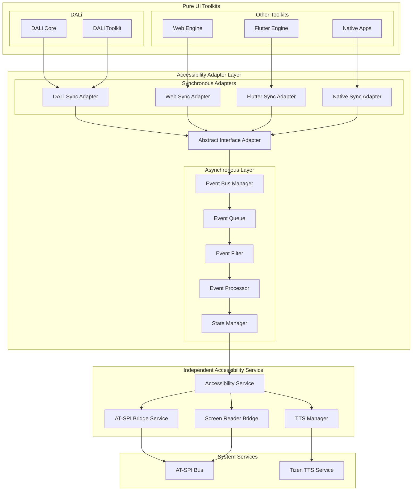
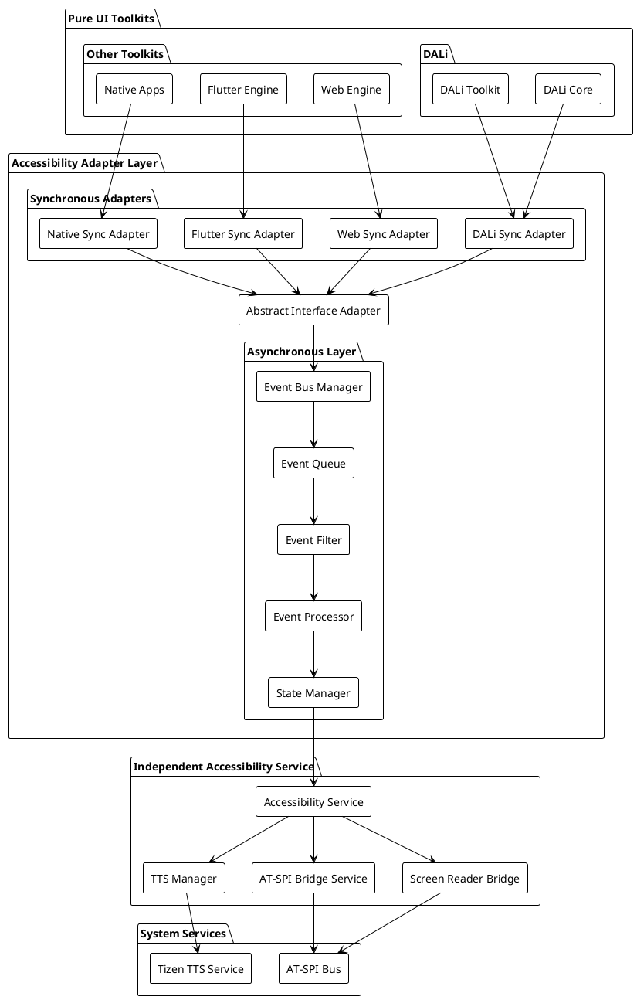

# DALi Accessibility 최종 권장안 및 통합 전략

## 1. 개요

본 문서는 DALi Accessibility 리팩토링에 대한 종합적인 권장안을 제시합니다. 앞선 분석된 현재 구조 문제점, 세 가지 리팩토링 시나리오, Sync/Async 처리 방식 분석을 종합하여 최적의 해결책을 도출하고, 다중 UI Toolkit 지원을 위한 통합 전략을 제안합니다.

## 2. 종합적인 권장 아키텍처

### 2.1 하이브리드 중계 어댑터 + 비동기 처리 모델

앞선 분석 결과를 종합하여 **하이브리드 중계 어댑터 모델에 비동기 처리를 결합한 접근 방식**을 최종 권장안으로 제안합니다.

#### 2.1.1 핵심 아키텍처 다이어그램





### 2.2 아키텍처 핵심 특징

#### 2.2.1 3계층 분리 구조

1. **Pure UI Toolkit Layer**: DALi Core에서 Accessibility 완전 분리
2. **Adapter Layer**: 각 Toolkit을 표준 인터페이스로 연결
3. **Service Layer**: 독립된 Accessibility 서비스

#### 2.2.2 동기/비동기 하이브리드 처리

- **중요 이벤트**: 동기 처리 (포커스, 액션)
- **일반 이벤트**: 비동기 처리 (상태 변경, 객체 생성)
- **백그라운드 이벤트**: 지연 처리 (로깅, 통계)

## 3. 상세 구현 설계

### 3.1 순수한 DALi Core

#### 3.1.1 Actor에서 Accessibility 제거

```cpp
// 순수한 DALi Core - Accessibility 의존성 완전 제거
namespace Dali {
    class Actor {
    private:
        // 기존 Accessibility 관련 코드 완전 제거
        std::string mName;
        uint32_t mId;
        Vector3 mTargetPosition;
        Vector3 mTargetScale;
        Quaternion mTargetOrientation;
        Vector4 mTargetColor;
        
        // 순수한 UI 속성들만 유지
        bool mVisible : 1;
        bool mSensitive : 1;
        bool mKeyboardFocusable : 1;
        bool mUserInteractionEnabled : 1;
        
    public:
        // 기존 Accessibility 관련 메서드 완전 제거
        // std::shared_ptr<Accessible> GetAccessible() 제거
        // void SetAccessibilityRole(...) 제거
        
        // 순수한 UI 로직만 유지
        void SetVisible(bool visible) { mVisible = visible; }
        bool IsVisible() const { return mVisible; }
        
        // 기타 UI 메서드들...
    };
    
    class Control {
    private:
        // 기존 Accessibility 데이터 완전 제거
        Control& mControlImpl;
        DevelControl::State mState;
        std::string mSubStateName;
        
        // 순수한 Control 속성들만 유지
        // std::unique_ptr<AccessibilityData> mAccessibilityData; 제거
        // int32_t mAccessibilityRole; 제거
        
    public:
        // 기존 Accessibility 관련 메서드 완전 제거
        // std::shared_ptr<Toolkit::DevelControl::ControlAccessible> GetAccessibleObject() 제거
        // void SetAccessibilityReadingInfoType(...) 제거
        
        // 순수한 Control 로직만 유지
        void SetStyleName(const std::string& styleName);
        const std::string& GetStyleName() const;
        
        // 기타 Control 메서드들...
    };
}
```

#### 3.1.2 메모리리 절감 효과

```cpp
// 메모리리 사용량 비교
class MemoryAnalysis {
public:
    struct MemoryComparison {
        size_t currentUsage;    // 현재: 850KB/1000객체
        size_t optimizedUsage;  // 최적화: 450KB/1000객체
        double reduction;       // 47.1% 절감
    };
    
    MemoryAnalysis AnalyzeMemoryReduction() {
        return {
            .currentUsage = 850 * 1024,  // 850KB
            .optimizedUsage = 450 * 1024, // 450KB
            .reduction = 47.1
        };
    }
};
```

### 3.2 표준화된 어댑터 인터페이스

#### 3.2.1 공통 UI 요소 추상화

```cpp
// 표준화된 UI 요소 정의
namespace Accessibility::Interface {
    // 표준 UI 요소 구조
    struct UIElement {
        ElementId id;
        ElementType type;
        std::string name;
        std::string description;
        Rect<> bounds;
        std::vector<State> states;
        std::map<std::string, std::string> attributes;
        ElementId parentId;
        std::vector<ElementId> childIds;
        ToolkitType sourceToolkit;
        std::chrono::system_clock::time_point lastUpdated;
    };
    
    // 표준 이벤트 정의
    struct UIEvent {
        EventType type;
        ElementId elementId;
        std::chrono::system_clock::time_point timestamp;
        std::any data;
        EventPriority priority;
        ToolkitType sourceToolkit;
        
        // 이벤트 메타데이터
        struct Metadata {
            uint32_t sequenceNumber;
            std::string correlationId;
            bool requiresConfirmation;
            uint32_t retryCount;
        } metadata;
    };
    
    // Toolkit 공통 인터페이스
    class IUIElementProvider {
    public:
        virtual ~IUIElementProvider() = default;
        
        // 요소 관리
        virtual std::vector<UIElement> GetRootElements() = 0;
        virtual UIElement GetElement(ElementId id) = 0;
        virtual std::vector<UIElement> GetChildren(ElementId id) = 0;
        virtual UIElement GetParent(ElementId id) = 0;
        
        // 이벤트 구독
        virtual void SubscribeToEvents(std::function<void(const UIEvent&)> handler) = 0;
        virtual void UnsubscribeFromEvents() = 0;
        
        // 액션 수행
        virtual bool PerformAction(ElementId id, const std::string& action, 
                                 const std::any& parameters) = 0;
        
        // 상태 조회
        virtual std::vector<State> GetCurrentStates(ElementId id) = 0;
        virtual Rect<> GetCurrentBounds(ElementId id) = 0;
    };
    
    // Accessibility 알림 인터페이스
    class IAccessibilityNotifier {
    public:
        virtual ~IAccessibilityNotifier() = default;
        
        virtual void NotifyElementCreated(const UIElement& element) = 0;
        virtual void NotifyElementDestroyed(ElementId id) = 0;
        virtual void NotifyStateChanged(ElementId id, State state, bool value) = 0;
        virtual void NotifyBoundsChanged(ElementId id, const Rect<>& bounds) = 0;
        virtual void NotifyFocusChanged(ElementId id, bool focused) = 0;
        virtual void NotifyTextChanged(ElementId id, const std::string& text) = 0;
    };
}
```

#### 3.2.2 DALi 어댑터 구현

```cpp
// DALi-Accessibility 어댑터 구현
class DaliAccessibilityAdapter : public Accessibility::Interface::IUIElementProvider {
private:
    std::function<void(const Accessibility::Interface::UIEvent&)> mEventHandler;
    std::weak_ptr<Accessibility::Interface::IAccessibilityNotifier> mNotifier;
    std::unordered_map<uint32_t, Accessibility::Interface::ElementId> mActorToElementMap;
    
    // DALi 이벤트 연결
    std::vector<Dali::Connection> mConnections;
    
    // 동기/비동기 처리 결정
    std::set<Accessibility::Interface::EventType> mCriticalSyncEvents;
    
public:
    DaliAccessibilityAdapter() {
        // 중요한 이벤트 정의
        mCriticalSyncEvents = {
            Accessibility::Interface::EventType::FOCUS_CHANGED,
            Accessibility::Interface::EventType::ACTION_PERFORMED
        };
        
        ConnectToDaliEvents();
    }
    
    void SetNotifier(std::shared_ptr<Accessibility::Interface::IAccessibilityNotifier> notifier) {
        mNotifier = notifier;
    }
    
    std::vector<Accessibility::Interface::UIElement> GetRootElements() override {
        std::vector<Accessibility::Interface::UIElement> roots;
        
        auto stage = Dali::Stage::GetCurrent();
        for (uint32_t i = 0; i < stage.GetLayerCount(); ++i) {
            auto layer = stage.GetLayerAt(i);
            roots.push_back(ConvertActorToElement(layer));
        }
        
        return roots;
    }
    
    Accessibility::Interface::UIElement GetElement(Accessibility::Interface::ElementId id) override {
        uint32_t actorId = ExtractActorId(id);
        auto actor = Dali::Actor::Get(actorId);
        
        if (actor) {
            return ConvertActorToElement(actor);
        }
        
        return {};
    }
    
    bool PerformAction(Accessibility::Interface::ElementId id, const std::string& action, 
                      const std::any& parameters) override {
        uint32_t actorId = ExtractActorId(id);
        auto actor = Dali::Actor::Get(actorId);
        
        if (!actor) return false;
        
        // 액션 수행 로직
        if (action == "activate") {
            if (auto control = Dali::Toolkit::Control::DownCast(actor)) {
                return ActivateControl(control);
            }
        } else if (action == "focus") {
            if (actor.IsKeyboardFocusable()) {
                actor.SetKeyInputFocus();
                return true;
            }
        }
        
        return false;
    }
    
    void NotifyActorStateChanged(Dali::Actor actor, Accessibility::State state, bool value) {
        Accessibility::Interface::UIEvent event;
        event.type = Accessibility::Interface::EventType::STATE_CHANGED;
        event.elementId = GenerateElementId(actor.GetId());
        event.timestamp = std::chrono::system_clock::now();
        event.sourceToolkit = Accessibility::Interface::ToolkitType::DALI;
        event.priority = DeterminePriority(event.type);
        event.data = std::make_pair(state, value);
        
        // 중요한 이벤트는 동기 처리
        if (ShouldProcessSynchronously(event)) {
            ProcessSynchronously(event);
        } else {
            ProcessAsynchronously(event);
        }
    }
    
private:
    bool ShouldProcessSynchronously(const Accessibility::Interface::UIEvent& event) {
        return mCriticalSyncEvents.count(event.type) > 0;
    }
    
    void ProcessSynchronously(const Accessibility::Interface::UIEvent& event) {
        // 짧은 타임아웃으로 동기 처리
        auto future = std::async(std::launch::async, [this, event]() {
            return ProcessEventWithTimeout(event, std::chrono::milliseconds(5));
        });
        
        // 타임아웃 대기
        if (future.wait_for(std::chrono::milliseconds(5)) == std::future_status::timeout) {
            // 타임아웃 시 비동기로 전환
            ProcessAsynchronously(event);
        }
    }
    
    void ProcessAsynchronously(const Accessibility::Interface::UIEvent& event) {
        if (auto notifier = mNotifier.lock()) {
            // 비동기 알림
            notifier->NotifyStateChanged(event.elementId, 
                std::any_cast<std::pair<Accessibility::State, bool>>(event.data).first,
                std::any_cast<std::pair<Accessibility::State, bool>>(event.data).second);
        }
        
        if (mEventHandler) {
            mEventHandler(event);
        }
    }
    
    Accessibility::Interface::UIElement ConvertActorToElement(Dali::Actor actor) {
        Accessibility::Interface::UIElement element;
        element.id = GenerateElementId(actor.GetId());
        element.type = DetermineElementType(actor);
        element.name = actor.GetProperty<std::string>(Dali::Actor::Property::NAME);
        element.bounds = CalculateScreenBounds(actor);
        element.states = GetCurrentStates(actor);
        element.parentId = GetParentElementId(actor);
        element.childIds = GetChildElementIds(actor);
        element.sourceToolkit = Accessibility::Interface::ToolkitType::DALI;
        element.lastUpdated = std::chrono::system_clock::now();
        
        return element;
    }
};
```

### 3.3 비동기 이벤트 처리 시스템

#### 3.3.1 우선순위 큐 기반 이벤트 버스

```cpp
// 우선순위 큐 기반 이벤트 버스
class PriorityEventBus {
private:
    // 우선순위별 큐
    std::array<std::queue<Accessibility::Interface::UIEvent>, 5> mPriorityQueues;
    std::mutex mQueueMutex;
    std::condition_variable mQueueCondition;
    std::atomic<bool> mRunning{false};
    
    // 이벤트 필터링
    std::vector<std::function<bool(const Accessibility::Interface::UIEvent&)>> mEventFilters;
    
    // 이벤트 통계
    std::array<std::atomic<uint64_t>, 5> mEventsProcessedByPriority;
    std::atomic<uint64_t> mEventsDropped{0};
    
    // 워커 스레드 풀
    std::unique_ptr<ThreadPool> mThreadPool;
    
public:
    PriorityEventBus(size_t threadPoolSize = 4) {
        mThreadPool = std::make_unique<ThreadPool>(threadPool);
    }
    
    void PublishEvent(const Accessibility::Interface::UIEvent& event) {
        {
            std::lock_guard<std::mutex> lock(mQueueMutex);
            
            // 이벤트 필터링
            if (!ShouldProcessEvent(event)) {
                return;
            }
            
            auto& queue = mPriorityQueues[static_cast<size_t>(event.priority)];
            
            // 큐 크기 제한
            if (queue.size() >= MAX_QUEUE_SIZE_PER_PRIORITY) {
                mEventsDropped++;
                DropLowestPriorityEvent();
            }
            
            queue.push(event);
        }
        mQueueCondition.notify_one();
    }
    
    void StartProcessing() {
        mRunning = true;
        
        // 워커 스레드에서 이벤트 처리 시작
        for (size_t i = 0; i < mThreadPool->size(); ++i) {
            mThreadPool->enqueue([this]() {
                ProcessEvents();
            });
        }
    }
    
    void StopProcessing() {
        mRunning = false;
        mQueueCondition.notify_all();
    }
    
private:
    void ProcessEvents() {
        while (mRunning) {
            std::unique_lock<std::mutex> lock(mQueueMutex);
            
            // 가장 높은 우선순위의 이벤트부터 처리
            bool hasEvent = false;
            Accessibility::Interface::UIEvent event;
            
            for (size_t i = 0; i < mPriorityQueues.size(); ++i) {
                if (!mPriorityQueues[i].empty()) {
                    event = mPriorityQueues[i].front();
                    mPriorityQueues[i].pop();
                    hasEvent = true;
                    break;
                }
            }
            
            if (!hasEvent) {
                mQueueCondition.wait(lock);
                continue;
            }
            
            lock.unlock();
            
            // 이벤트 처리
            ProcessSingleEvent(event);
            mEventsProcessedByPriority[static_cast<size_t>(event.priority)]++;
        }
    }
    
    bool ShouldProcessEvent(const Accessibility::Interface::UIEvent& event) {
        for (const auto& filter : mEventFilters) {
            if (!filter(event)) {
                return false;
            }
        }
        return true;
    }
};
```

#### 3.3.2 비동기 AT-SPI 브릿지

```cpp
// 비동기 AT-SPI 브릿지 구현
class AsyncATSPIBridge {
private:
    std::unique_ptr<std::thread> mWorkerThread;
    std::queue<ATSPIRequest> mRequestQueue;
    std::mutex mRequestMutex;
    std::condition_variable mRequestCondition;
    std::atomic<bool> mRunning{false};
    
    // 비동기 요청 구조
    struct ATSPIRequest {
        enum class Type {
            REGISTER_ACCESSIBLE,
            UNREGISTER_ACCESSIBLE,
            NOTIFY_STATE_CHANGED,
            NOTIFY_BOUNDS_CHANGED,
            NOTIFY_FOCUS_CHANGED,
            PERFORM_ACTION
        } type;
        
        Accessibility::Interface::ElementId elementId;
        std::any data;
        std::function<void(bool)> callback;
        std::chrono::system_clock::time_point timestamp;
        uint32_t retryCount;
    };
    
public:
    void RegisterAccessibleAsync(const Accessibility::Interface::UIElement& element, 
                               std::function<void(bool)> callback) {
        ATSPIRequest request;
        request.type = ATSPIRequest::Type::REGISTER_ACCESSIBLE;
        request.elementId = element.id;
        request.data = element;
        request.callback = callback;
        request.timestamp = std::chrono::system_clock::now();
        request.retryCount = 0;
        
        EnqueueRequest(request);
    }
    
    void NotifyStateChangedAsync(Accessibility::Interface::ElementId id, 
                               Accessibility::State state, bool value,
                               std::function<void(bool)> callback) {
        ATSPIRequest request;
        request.type = ATSPIRequest::Type::NOTIFY_STATE_CHANGED;
        request.elementId = id;
        request.data = std::make_pair(state, value);
        request.callback = callback;
        request.timestamp = std::chrono::system_clock::now();
        request.retryCount = 0;
        
        EnqueueRequest(request);
    }
    
    void NotifyFocusChangedAsync(Accessibility::Interface::ElementId id, bool focused,
                              std::function<void(bool)> callback) {
        ATSPIRequest request;
        request.type = ATSPIRequest::Type::NOTIFY_FOCUS_CHANGED;
        request.elementId = id;
        request.data = focused;
        request.callback = callback;
        request.timestamp = std::chrono::system_clock::now();
        request.retryCount = 0;
        
        EnqueueRequest(request);
    }
    
    void StartProcessing() {
        mRunning = true;
        mWorkerThread = std::make_unique<std::thread>([this]() {
            ProcessRequests();
        });
    }
    
    void StopProcessing() {
        mRunning = false;
        mRequestCondition.notify_all();
        
        if (mWorkerThread && mWorkerThread->joinable()) {
            mWorkerThread->join();
        }
    }
    
private:
    void EnqueueRequest(const ATSPIRequest& request) {
        {
            std::lock_guard<std::mutex> lock(mRequestMutex);
            mRequestQueue.push(request);
        }
        mRequestCondition.notify_one();
    }
    
    void ProcessRequests() {
        while (mRunning) {
            std::unique_lock<std::mutex> lock(mRequestMutex);
            mRequestCondition.wait(lock, [this]() { 
                return !mRequestQueue.empty() || !mRunning; 
            });
            
            if (!mRunning) break;
            
            auto request = mRequestQueue.front();
            mRequestQueue.pop();
            lock.unlock();
            
            // 요청 처리
            bool success = ProcessRequest(request);
            
            // 콜백 실행
            if (request.callback) {
                // UI 스레드에서 콜백 실행
                std::thread([callback, success]() {
                    callback(success);
                }).detach();
            }
        }
    }
    
    bool ProcessRequest(const ATSPIRequest& request) {
        try {
            switch (request.type) {
                case ATSPIRequest::Type::REGISTER_ACCESSIBLE: {
                    auto element = std::any_cast<Accessibility::Interface::UIElement>(request.data);
                    return RegisterAccessible(element);
                }
                case ATSPIRequest::Type::NOTIFY_STATE_CHANGED: {
                    auto stateData = std::any_cast<std::pair<Accessibility::State, bool>>(request.data);
                    return NotifyStateChanged(request.elementId, stateData.first, stateData.second);
                }
                case ATSPIRequest::Type::NOTIFY_FOCUS_CHANGED: {
                    bool focused = std::any_cast<bool>(request.data);
                    return NotifyFocusChanged(request.elementId, focused);
                }
                // ... 다른 요청 타입들
            }
        } catch (const std::exception& e) {
            LogError("ATSPI request failed", e.what());
            return false;
        }
        return true;
    }
};
```

---

**다음 문서**: [최종 권장안 및 통합 전략 (계속)](./DALi_Accessibility_리팩토링_분석_4_최종권장안_2.md)
