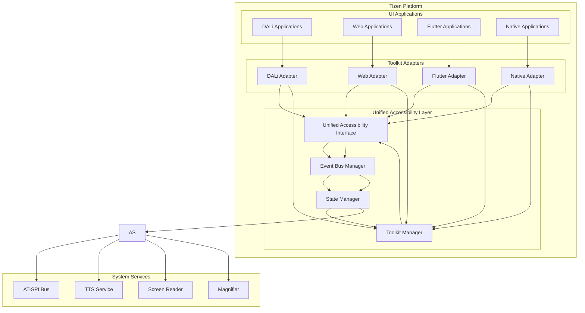
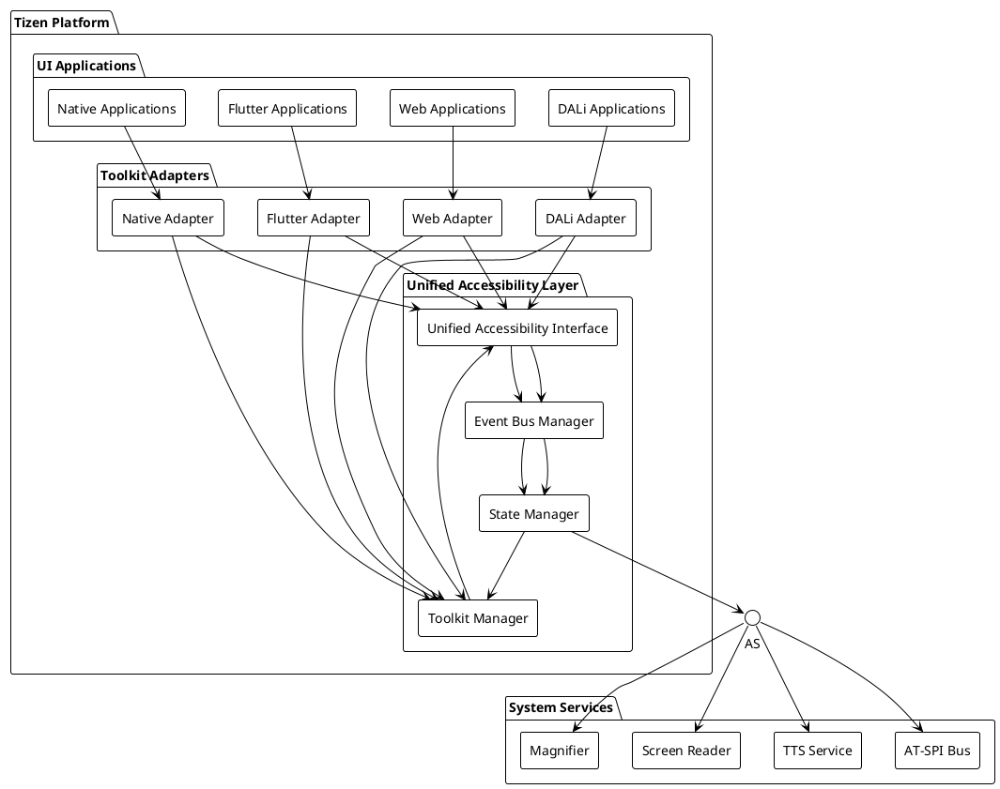

# DALi Accessibility 최종 권장안 및 통합 전략 (계속)

## 4. 다중 UI Toolkit 통합 전략

### 4.1 통합 아키텍처

#### 4.1.1 표준화된 접근 방식





#### 4.1.2 표준화된 인터페이스 확장

```cpp
// 다중 Toolkit 지원을 위한 표준화된 인터페이스
namespace Accessibility::Unified {
    // Toolkit 타입 식별
    enum class ToolkitType {
        DALI,
        WEB,
        FLUTTER,
        NATIVE,
        UNKNOWN
    };
    
    // 확장된 UI 요소 구조
    struct ExtendedUIElement : public UIElement {
        // 기존 필드들...
        
        // Toolkit별 확장 정보
        std::map<std::string, std::any> toolkitSpecificData;
        
        // 렌더링 정보
        std::vector<std::string> localizedNames;
        std::map<std::string, std::string> localizedDescriptions;
        
        // 접근성 정보
        AccessibilityLevel accessibilityLevel;
        std::vector<std::string> accessibilityActions;
        
        // 렌더링 속성
        std::map<std::string, std::string> extendedAttributes;
    };
    
    // 확장된 이벤트 구조
    struct ExtendedUIEvent : public UIEvent {
        // 기존 필드들...
        
        // Toolkit별 확장 데이터
        std::any toolkitSpecificData;
        
        // 이벤트 전파 정보
        std::vector<std::string> propagationPath;
        bool requiresConfirmation;
        
        // 성능 메타데이터
        std::chrono::milliseconds processingDeadline;
        uint32_t priorityBoost;
    };
    
    // Toolkit 관리자 인터페이스
    class IToolkitManager {
    public:
        virtual ~IToolkitManager() = default;
        
        // Toolkit 등록
        virtual void RegisterToolkit(ToolkitType type, 
                               std::shared_ptr<IUIElementProvider> provider) = 0;
        virtual void UnregisterToolkit(ToolkitType type) = 0;
        
        // Toolkit 조회
        virtual std::shared_ptr<IUIElementProvider> GetToolkit(ToolkitType type) = 0;
        virtual std::vector<ToolkitType> GetRegisteredToolkits() = 0;
        
        // 크로스-툴킷 이벤트 처리
        virtual void PublishCrossToolkitEvent(const ExtendedUIEvent& event) = 0;
        
        // 상태 동기화
        virtual void SynchronizeStates() = 0;
    };
    
    // 통합 상태 관리자
    class IUnifiedStateManager {
    public:
        virtual ~IUnifiedStateManager() = default;
        
        // 전역 상태 관리
        virtual ElementId GetGlobalFocusOwner() = 0;
        virtual std::vector<ElementId> GetActiveElements() = 0;
        virtual void SetGlobalFocus(ElementId id) = 0;
        virtual void ClearGlobalFocus() = 0;
        
        // 상태 충돌 감지
        virtual bool DetectStateConflict(const ExtendedUIEvent& event) = 0;
        virtual void ResolveStateConflict(const ExtendedUIEvent& event) = 0;
    };
}
```

### 4.2 Web 엔진 어댑터

#### 4.2.1 Web Accessibility 연동

```cpp
// Web 엔진 어댑터 구현
class WebAccessibilityAdapter : public Accessibility::Interface::IUIElementProvider {
private:
    std::unique_ptr<WebEngine> mWebEngine;
    std::function<void(const Accessibility::Interface::UIEvent&)> mEventHandler;
    std::weak_ptr<Accessibility::Interface::IAccessibilityNotifier> mNotifier;
    std::unordered_map<std::string, Accessibility::Interface::ElementId> mWebElementToElementMap;
    
public:
    WebAccessibilityAdapter(std::unique_ptr<WebEngine> webEngine)
        : mWebEngine(std::move(webEngine)) {
        ConnectToWebEvents();
    }
    
    void SetNotifier(std::shared_ptr<Accessibility::Interface::IAccessibilityNotifier> notifier) {
        mNotifier = notifier;
    }
    
    std::vector<Accessibility::Interface::UIElement> GetRootElements() override {
        std::vector<Accessibility::Interface::UIElement> roots;
        
        // Web 페이지의 최상위 요소들 찾기
        auto webElements = mWebEngine->GetAccessibilityTree();
        for (const auto& webElement : webElements) {
            if (webElement.parentId.empty()) {  // 루트 요소
                roots.push_back(ConvertWebElementToElement(webElement));
            }
        }
        
        return roots;
    }
    
    Accessibility::Interface::UIElement GetElement(Accessibility::Interface::ElementId id) override {
        std::string webElementId = ExtractWebElementId(id);
        auto webElement = mWebEngine->GetAccessibilityElement(webElementId);
        
        return ConvertWebElementToElement(webElement);
    }
    
    std::vector<Accessibility::Interface::UIElement> GetChildren(Accessibility::Interface::ElementId id) override {
        std::string webElementId = ExtractWebElementId(id);
        auto webElement = mWebEngine->GetAccessibilityElement(webElementId);
        
        std::vector<Accessibility::Interface::UIElement> children;
        for (const auto& childId : webElement.childIds) {
            auto childElement = mWebEngine->GetAccessibilityElement(childId);
            children.push_back(ConvertWebElementToElement(childElement));
        }
        
        return children;
    }
    
    bool PerformAction(Accessibility::Interface::ElementId id, const std::string& action, 
                      const std::any& parameters) override {
        std::string webElementId = ExtractWebElementId(id);
        auto webElement = mWebEngine->GetAccessibilityElement(webElementId);
        
        // Web 액션 수행
        if (action == "click") {
            return mWebEngine->ExecuteJavaScript(webElementId, "this.click()");
        } else if (action == "focus") {
            return mWebEngine->SetFocus(webElementId);
        } else if (action == "scroll") {
            auto scrollParams = std::any_cast<std::pair<int, int>>(parameters);
            return mWebEngine->ScrollTo(webElementId, scrollParams.first, scrollParams.second);
        }
        
        return false;
    }
    
private:
    void ConnectToWebEvents() {
        // Web 엔진 Accessibility 이벤트 구독
        mWebEngine->SetAccessibilityEventListener([this](const WebAccessibilityEvent& webEvent) {
            auto unifiedEvent = ConvertWebEventToUnified(webEvent);
            if (mEventHandler) {
                mEventHandler(unifiedEvent);
            }
            
            if (auto notifier = mNotifier.lock()) {
                switch (webEvent.type) {
                    case WebAccessibilityEvent::TYPE_FOCUS_CHANGED:
                        notifier->NotifyFocusChanged(
                            GenerateElementId(webEvent.elementId), 
                            webEvent.focused);
                        break;
                    case WebAccessibilityEvent::TYPE_STATE_CHANGED:
                        auto stateData = std::any_cast<std::pair<std::string, bool>>(webEvent.data);
                        auto state = ConvertWebStateToUnified(stateData.first);
                        notifier->NotifyStateChanged(
                            GenerateElementId(webEvent.elementId), 
                            state, stateData.second);
                        break;
                    // ... 다른 이벤트 타입들
                }
            }
        });
    }
    
    Accessibility::Interface::UIElement ConvertWebElementToElement(const WebAccessibilityElement& webElement) {
        Accessibility::Interface::UIElement element;
        element.id = GenerateElementId(webElement.id);
        element.type = ConvertWebRoleToUnified(webElement.role);
        element.name = webElement.name;
        element.description = webElement.description;
        element.bounds = webElement.bounds;
        element.states = ConvertWebStatesToUnified(webElement.states);
        element.sourceToolkit = Accessibility::Interface::ToolkitType::WEB;
        element.lastUpdated = std::chrono::system_clock::now();
        
        // Web 특정 속성 추가
        element.toolkitSpecificData["tagName"] = webElement.tagName;
        element.toolkitSpecificData["className"] = webElement.className;
        element.toolkitSpecificData["id"] = webElement.id;
        
        return element;
    }
    
    Accessibility::State ConvertWebStateToUnified(const std::string& webState) {
        // Web ARIA 상태를 표준 상태로 변환
        if (webState == "disabled") return Accessibility::State::DISABLED;
        if (webState == "hidden") return Accessibility::State::INVISIBLE;
        if (webState == "selected") return Accessibility::State::SELECTED;
        if (webState == "focused") return Accessibility::State::FOCUSED;
        
        return Accessibility::State::ENABLED;
    }
};
```

#### 4.2.2 Web-AT-SPI 연동

```cpp
// Web-AT-SPI 연동 브릿지
class WebATSPIBridge {
private:
    std::unique_ptr<AsyncATSPIBridge> mAsyncBridge;
    std::unordered_map<std::string, Accessibility::Interface::ElementId> mWebElementToUnifiedIdMap;
    
public:
    void RegisterWebElementAsync(const WebAccessibilityElement& webElement,
                               std::function<void(bool)> callback) {
        Accessibility::Interface::UIElement unifiedElement = ConvertWebElementToUnified(webElement);
        
        mAsyncBridge->RegisterAccessibleAsync(unifiedElement, [this, webElement, callback](bool success) {
            if (success) {
                mWebElementToUnifiedIdMap[webElement.id] = unifiedElement.id;
            }
            callback(success);
        });
    }
    
    void NotifyWebStateChangedAsync(const std::string& webElementId, 
                                 const std::string& state, bool value,
                                 std::function<void(bool)> callback) {
        auto it = mWebElementToUnifiedIdMap.find(webElementId);
        if (it != mWebElementToUnifiedIdMap.end()) {
            auto unifiedState = ConvertWebStateToUnified(state);
            mAsyncBridge->NotifyStateChangedAsync(it->second, unifiedState, value, callback);
        }
    }
    
private:
    Accessibility::Interface::UIElement ConvertWebElementToUnified(const WebAccessibilityElement& webElement) {
        Accessibility::Interface::UIElement element;
        element.id = GenerateElementId(webElement.id);
        element.type = ConvertWebRoleToUnified(webElement.role);
        element.name = webElement.name;
        element.description = webElement.description;
        element.bounds = webElement.bounds;
        element.states = ConvertWebStatesToUnified(webElement.states);
        element.sourceToolkit = Accessibility::Interface::ToolkitType::WEB;
        
        return element;
    }
};
```

### 4.3 Flutter 엔진 어댑터

#### 4.3.1 Flutter Accessibility 연동

```cpp
// Flutter 엔진 어댑터 구현
class FlutterAccessibilityAdapter : public Accessibility::Interface::IUIElementProvider {
private:
    std::unique_ptr<FlutterEngine> mFlutterEngine;
    std::function<void(const Accessibility::Interface::UIEvent&)> mEventHandler;
    std::weak_ptr<Accessibility::Interface::IAccessibilityNotifier> mNotifier;
    std::unordered_map<intptr_t, Accessibility::Interface::ElementId> mFlutterViewToElementMap;
    
public:
    FlutterAccessibilityAdapter(std::unique_ptr<FlutterEngine> flutterEngine)
        : mFlutterEngine(std::move(flutterEngine)) {
        ConnectToFlutterEvents();
    }
    
    void SetNotifier(std::shared_ptr<Accessibility::Interface::IAccessibilityNotifier> notifier) {
        mNotifier = notifier;
    }
    
    std::vector<Accessibility::Interface::UIElement> GetRootElements() override {
        std::vector<Accessibility::Interface::UIElement> roots;
        
        // Flutter의 최상위 위젯들 찾기
        auto flutterViews = mFlutterEngine->GetAccessibilityTree();
        for (const auto& flutterView : flutterViews) {
            if (flutterView.parentId == 0) {  // 루트 뷰
                roots.push_back(ConvertFlutterViewToElement(flutterView));
            }
        }
        
        return roots;
    }
    
    Accessibility::Interface::UIElement GetElement(Accessibility::Interface::ElementId id) override {
        intptr_t flutterViewId = ExtractFlutterViewId(id);
        auto flutterView = mFlutterEngine->GetAccessibilityView(flutterViewId);
        
        return ConvertFlutterViewToElement(flutterView);
    }
    
    bool PerformAction(Accessibility::Interface::ElementId id, const std::string& action, 
                      const std::any& parameters) = 0;
    
private:
    void ConnectToFlutterEvents() {
        // Flutter 엔진 Accessibility 이벤트 구독
        mFlutterEngine->SetAccessibilityEventListener([this](const FlutterAccessibilityEvent& flutterEvent) {
            auto unifiedEvent = ConvertFlutterEventToUnified(flutterEvent);
            if (mEventHandler) {
                mEventHandler(unifiedEvent);
            }
            
            if (auto notifier = mNotifier.lock()) {
                switch (flutterEvent.type) {
                    case FlutterAccessibilityEvent::TYPE_FOCUS_CHANGED:
                        notifier->NotifyFocusChanged(
                            GenerateElementId(flutterEvent.viewId), 
                            flutterEvent.focused);
                        break;
                    case FlutterAccessibilityEvent::TYPE_STATE_CHANGED:
                        auto stateData = std::any_cast<std::pair<std::string, bool>>(flutterEvent.data);
                        auto state = ConvertFlutterStateToUnified(stateData.first);
                        notifier->NotifyStateChanged(
                            GenerateElementId(flutterEvent.viewId), 
                            state, stateData.second);
                        break;
                    // ... 다른 이벤트 타입들
                }
            }
        });
    }
    
    Accessibility::Interface::UIElement ConvertFlutterViewToElement(const FlutterAccessibilityView& flutterView) {
        Accessibility::Interface::UIElement element;
        element.id = GenerateElementId(flutterView.viewId);
        element.type = ConvertFlutterRoleToUnified(flutterView.role);
        element.name = flutterView.name;
        element.description = flutterView.description;
        element.bounds = flutterView.bounds;
        element.states = ConvertFlutterStatesToUnified(flutterView.states);
        element.sourceToolkit = Accessibility::Interface::ToolkitType::FLUTTER;
        element.lastUpdated = std::chrono::system_clock::now();
        
        // Flutter 특정 속성 추가
        element.toolkitSpecificData["semantics"] = flutterView.semantics;
        element.toolkitSpecificData["label"] = flutterView.label;
        element.toolkitElementId = flutterView.viewId;
        
        return element;
    }
    
    Accessibility::State ConvertFlutterStateToUnified(const std::string& flutterState) {
        // Flutter 시맨틱스 상태를 표준 상태로 변환
        if (flutterState == "disabled") return Accessibility::State::DISABLED;
        if (flutterState == "hidden") return Accessibility::State::INVISIBLE;
        if (flutterState == "selected") return Accessibility::State::SELECTED;
        if (flutterState == "focused") return Accessibility::State::FOCUSED;
        if (flutterState == "obscured") return Accessibility::State::HIDDEN;
        
        return Accessibility::State::ENABLED;
    }
};
```

### 4.4 Native 앱플리케이션 어댑터

#### 4.4.1 Native 애플리케이션 연동

```cpp
// Native 애플리케이션 어댑터 구현
class NativeAccessibilityAdapter : public Accessibility::Interface::IUIElementProvider {
private:
    std::unique_ptr<NativeWindowManager> mWindowManager;
    std::function<void(const Accessibility::Interface::UIEvent&)> mEventHandler;
    std::weak_ptr<Accessibility::Interface::IAccessibilityNotifier> mNotifier;
    std::unordered_map<NativeWindowHandle, Accessibility::Interface::ElementId> mWindowToElementMap;
    
public:
    NativeAccessibilityAdapter(std::unique_ptr<NativeWindowManager> windowManager)
        : mWindowManager(std::move(windowManager)) {
        ConnectToNativeEvents();
    }
    
    void SetNotifier(std::shared_ptr<Accessibility::Interface::IAccessibilityNotifier> notifier) {
        mNotifier = notifier;
    }
    
    std::vector<Accessibility::Interface::UIElement> GetRootElements() override {
        std::vector<Accessibility::Interface::UIElement> roots;
        
        // Native 윈도우 찾기
        auto nativeWindows = mWindowManager->GetAllWindows();
        for (const auto& window : nativeWindows) {
            if (!window.parentHandle) {  // 루트 윈도
                roots.push_back(ConvertNativeWindowToElement(window));
            }
        }
        
        return roots;
    }
    
    Accessibility::Interface::UIElement GetElement(Accessibility::Interface::ElementId id) override {
        NativeWindowHandle windowHandle = ExtractWindowHandle(id);
        auto window = mWindowManager->GetWindow(windowHandle);
        
        return ConvertNativeWindowToElement(window);
    }
    
    bool PerformAction(Accessibility::Interface::ElementId id, const std::string& action, 
                      const std::any& parameters) = 0;
    
private:
    void ConnectToNativeEvents() {
        // Native 윈도 이벤트 구독
        mWindowManager->SetAccessibilityEventListener([this](const NativeAccessibilityEvent& nativeEvent) {
            auto unifiedEvent = ConvertNativeEventToUnified(nativeEvent);
            if (mEventHandler) {
                mEventHandler(unifiedEvent);
            }
            
            if (auto notifier = mNotifier.lock()) {
                switch (nativeEvent.type) {
                    case NativeAccessibilityEvent::TYPE_FOCUS_CHANGED:
                        notifier->NotifyFocusChanged(
                            GenerateElementId(nativeEvent.windowHandle), 
                            nativeEvent.focused);
                        break;
                    case NativeAccessibilityEvent::TYPE_STATE_CHANGED:
                        auto stateData = std::any_cast<std::pair<std::string, bool>>(nativeEvent.data);
                        auto state = ConvertNativeStateToUnified(stateData.first);
                        notifier->NotifyStateChanged(
                            GenerateElementId(nativeEvent.windowHandle), 
                            state, stateData.second);
                        break;
                    // ... 다른 이벤트 타입들
                }
            }
        });
    }
    
    Accessibility::Interface::UIElement ConvertNativeWindowToElement(const NativeWindow& window) {
        Accessibility::Interface::UIElement element;
        element.id = GenerateElementId(window.handle);
        element.type = ConvertNativeRoleToUnified(window.role);
        element.name = window.title;
        element.description = window.description;
        element.bounds = window.bounds;
        element.states = ConvertNativeStatesToUnified(window.states);
        element.sourceToolkit = Accessibility::Interface::ToolkitType::NATIVE;
        element.lastUpdated = std::chrono::system_clock::now();
        
        // Native 특정 속성 추가
        element.toolkitSpecificData["windowClass"] = window.windowClass;
        element.toolkitSpecificData["processId"] = window.processId;
        element.toolkitSpecificData["instanceId"] = window.instanceId;
        
        return element;
    }
    
    Accessibility::State ConvertNativeStateToUnified(const std::string& nativeState) {
        // Native 상태를 표준 상태로 변환
        if (nativeState == "disabled") return Accessibility::State::DISABLED;
        if (nativeState == "hidden") return Accessibility::State::INVISIBLE;
        if (nativeState == "focused") return Accessibility::State::FOCUSED;
        if (nativeState == "minimized") return Accessibility::State::MINIMIZED;
        
        return Accessibility::State::ENABLED;
    }
};
```

---

**다음 문서**: [최종 권장안 및 통합 전략 (계속)](./DALi_Accessibility_리팩토링_분석_4_최종권장안_3.md)
