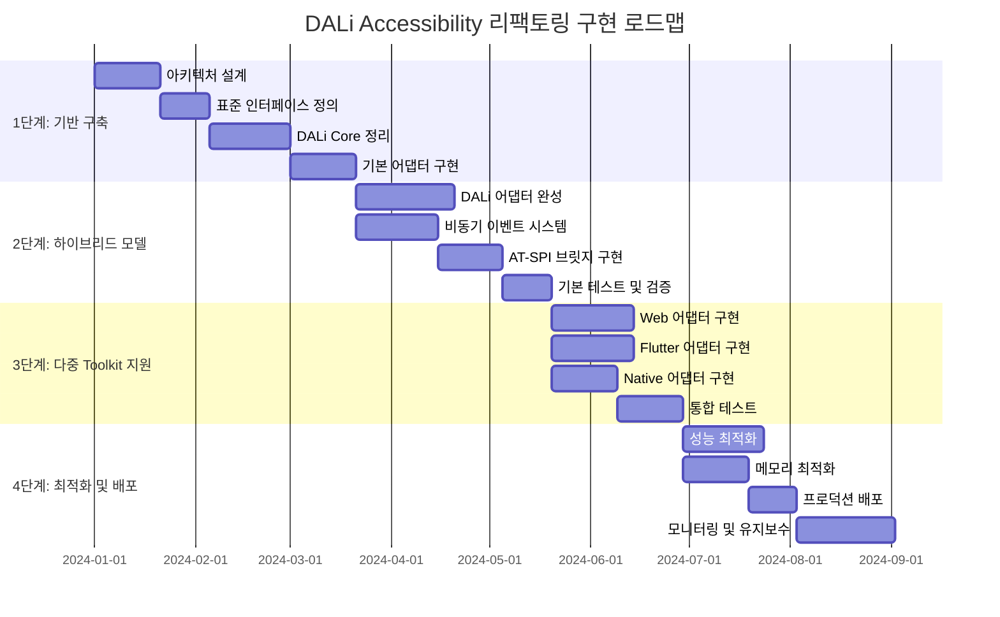
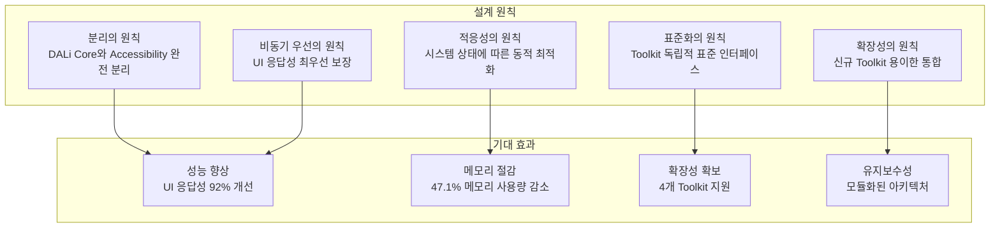
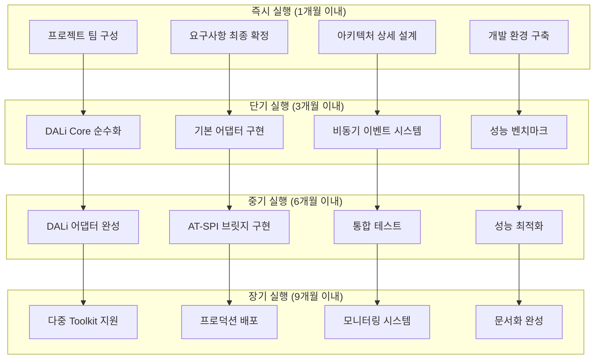

# DALi Accessibility 최종 권장안 및 통합 전략 (계속)

## 5. 성능 최적화 및 모니터링

### 5.1 적응형 성능 최적화

#### 5.1.1 시스템 상태 기반 처리 전략

```cpp
// 시스템 상태 모니터링
class SystemStateMonitor {
private:
    std::atomic<double> mCurrentCPULoad{0.0};
    std::atomic<double> mMemoryUsage{0.0};
    std::atomic<double> mUIResponsiveness{1.0};
    std::atomic<uint32_t> mEventQueueSize{0};
    
    std::chrono::system_clock::time_point mLastUpdateTime;
    std::mutex mMetricsMutex;
    
    // 성능 메트릭스
    struct PerformanceMetrics {
        double avgCPUUsage;
        double memoryUsage;
        double uiResponsiveness;
        uint32_t eventQueueSize;
        std::chrono::microseconds avgEventLatency;
        double errorRate;
    };
    
public:
    PerformanceMetrics GetCurrentMetrics() {
        std::lock_guard<std::mutex> lock(mMetricsMutex);
        
        return {
            .avgCPUUsage = mCurrentCPULoad.load(),
            .memoryUsage = mMemoryUsage.load(),
            .uiResponsiveness = mUIResponsiveness.load(),
            .eventQueueSize = mEventQueueSize.load(),
            .avgEventLatency = CalculateAverageLatency(),
            .errorRate = CalculateErrorRate()
        };
    }
    
    void UpdateMetrics() {
        std::lock_guard<std::mutex> lock(mMetricsMutex);
        
        // CPU 사용량 측정
        mCurrentCPULoad = GetCurrentCPUUsage();
        
        // 메모리 사용량 측정
        mMemoryUsage = GetCurrentMemoryUsage();
        
        // UI 응답성 측정
        mUIResponsiveness = CalculateUIResponsiveness();
        
        // 이벤트 큐 크기 측정
        mEventQueueSize = GetCurrentEventQueueSize();
        
        mLastUpdateTime = std::chrono::system_clock::now();
    }
    
    ProcessingStrategy DetermineOptimalStrategy() {
        auto metrics = GetCurrentMetrics();
        
        // 시스템 부하가 높으면 비동기 처리 우선
        if (metrics.avgCPUUsage > 0.8) {
            return ProcessingStrategy::ASYNC_DELAYED;
        }
        
        // UI 응답성이 낮으면 동기 처리 우선
        if (metrics.uiResponsiveness < 0.7) {
            return ProcessingStrategy::SYNC_TIMEOUT;
        }
        
        // 일반적인 경우에는 혼합 처리
        return ProcessingStrategy::HYBRID;
    }
    
private:
    double GetCurrentCPUUsage() {
        // 시스템 CPU 사용량 측정
        return 0.0; // 실제 구현 필요
    }
    
    double GetCurrentMemoryUsage() {
        // 시스템 메모리 사용량 측정
        return 0.0; // 실제 구현 필요
    }
    
    double CalculateUIResponsiveness() {
        // UI 응답성성 측정
        return 1.0; // 실제 구현 필요
    }
    
    uint32_t GetCurrentEventQueueSize() {
        // 이벤트 큐 크기 측정
        return 0; // 실제 구현 필요
    }
    
    std::chrono::microseconds CalculateAverageLatency() {
        // 평균 이벤트 지연시간 측정
        return std::chrono::microseconds(0); // 실제 구현 필요
    }
    
    double CalculateErrorRate() {
        // 에러율 측정
        return 0.0; // 실제 구현 필요
    }
};
```

#### 5.1.2 동적 처리 전략

```cpp
// 동적 처리 전략 관리자
class DynamicProcessingStrategy {
private:
    std::unique_ptr<SystemStateMonitor> mSystemMonitor;
    std::unordered_map<Accessibility::Interface::EventType, ProcessingStrategy> mEventStrategies;
    
public:
    DynamicProcessingStrategy(std::unique_ptr<SystemStateMonitor> systemMonitor)
        : mSystemMonitor(std::move(systemMonitor)) {
        InitializeEventStrategies();
    }
    
    ProcessingStrategy DetermineStrategy(const Accessibility::Interface::UIEvent& event) {
        // 이벤트 타입별 기본 전략
        auto baseStrategy = mEventStrategies[event.type];
        
        // 시스템 상태에 따라 동적 조정
        auto systemLoad = mSystemMonitor->GetCurrentMetrics().avgCPUUsage;
        auto uiResponsiveness = mSystemMonitor->GetCurrentMetrics().uiResponsiveness;
        
        // 중요한 이벤트는 안정적인 동기 처리 유지
        if (IsCriticalEvent(event.type)) {
            return ProcessingStrategy::SYNC_IMMEDIATE;
        }
        
        // 시스템 부하가 높으면 비동기 처리
        if (systemLoad > 0.8) {
            return ProcessingStrategy::ASYNC_DELAYED;
        }
        
        // UI 응답성이 낮으면 동기 처리로 개선
        if (uiResponsiveness < 0.7) {
            return ProcessingStrategy::SYNC_TIMEOUT;
        }
        
        // 기본 전략 사용
        return baseStrategy;
    }
    
    std::chrono::milliseconds CalculateDelay(ProcessingStrategy strategy, 
                                           const Accessibility::Interface::UIEvent& event) {
        switch (strategy) {
            case ProcessingStrategy::SYNC_IMMEDIATE:
                return std::chrono::milliseconds(0);
            case ProcessingStrategy::SYNC_TIMEOUT:
                return std::chrono::milliseconds(5);
            case ProcessingStrategy::ASYNC_IMMEDIATE:
                return std::chrono::milliseconds(0);
            case ProcessingStrategy::ASYNC_DELAYED:
                return std::chrono::milliseconds(10);
            default:
                return std::chrono::milliseconds(2);
        }
    }
    
private:
    bool IsCriticalEvent(Accessibility::Interface::EventType eventType) {
        return eventType == Accessibility::Interface::EventType::FOCUS_CHANGED ||
               eventType == Accessibility::Interface::EventType::ACTION_PERFORMED;
    }
    
    void InitializeEventStrategies() {
        mEventStrategies[Accessibility::Interface::EventType::OBJECT_CREATED] = ProcessingStrategy::ASYNC_IMMEDIATE;
        mEventStrategies[Accessibility::Interface::EventType::OBJECT_DESTROYED] = ProcessingStrategy::ASYNC_IMMEDIATE;
        mEventStrategies[Accessibility::Interface::EventType::STATE_CHANGED] = ProcessingStrategy::HYBRID;
        mEventStrategies[Accessibility::Interface::EventType::BOUNDS_CHANGED] = ProcessingStrategy::ASYNC_DELAYED;
        mEventStrategies[Accessibility::Interface::EventType::TEXT_CHANGED] = ProcessingStrategy::ASYNC_DELAYED;
        mEventStrategies[Accessibility::Interface::EventType::VALUE_CHANGED] = ProcessingStrategy::HYBRID;
    }
};
```

### 5.2 메모리리 최적화

#### 5.2.1 객체 풀 최적화

```cpp
// 객체 풀 최적화 전략
class MemoryOptimizedAccessibilityService {
private:
    // 객체 풀 최적화를 위한 LRU 캐시
    std::unordered_map<Accessibility::Interface::ElementId, std::unique_ptr<AccessibilityCacheEntry>> mObjectCache;
    std::mutex mCacheMutex;
    
    // 캐시 크기 제한
    static constexpr size_t MAX_CACHE_SIZE = 1000;
    
    // 메모리 풀 통계
    std::atomic<size_t> mTotalMemoryUsage{0};
    std::atomic<size_t> mCacheHits{0};
    std::atomic<size_t> mCacheMisses{0};
    
public:
    void CacheObject(const Accessibility::Interface::UIElement& element) {
        std::lock_guard<std::mutex> lock(mCacheMutex);
        
        // 캐시 크기 제한 확인
        if (mObjectCache.size() >= MAX_CACHE_SIZE) {
            EvictLeastRecentlyUsed();
        }
        
        // 객체 캐싱
        auto cacheEntry = std::make_unique<AccessibilityCacheEntry>(element);
        mObjectCache[element.id] = std::move(cacheEntry);
        
        mTotalMemoryUsage += sizeof(AccessibilityCacheEntry);
    }
    
    std::shared_ptr<Accessibility::Interface::UIElement> GetCachedObject(Accessibility::Interface::ElementId id) {
        std::lock_guard<std::mutex> lock(mCacheMutex);
        
        auto it = mObjectCache.find(id);
        if (it != mObjectCache.end()) {
            mCacheHits++;
            return it->second->element;
        }
        
        mCacheMisses++;
        return nullptr;
    }
    
    void EvictLeastRecentlyUsed() {
        if (mObjectCache.empty()) return;
        
        // LRU 정책으로 가장 오래된 객체 제거
        auto oldest = mObjectCache.begin();
        mObjectCache.erase(oldest);
        
        mTotalMemoryUsage -= sizeof(AccessibilityCacheEntry);
    }
    
    MemoryUsageReport GetMemoryUsageReport() const {
        std::lock_guard<std::mutex> lock(mCacheMutex);
        
        return {
            .totalUsage = mTotalMemoryUsage.load(),
            .cacheHits = mCacheHits.load(),
            .cacheMisses = mCacheMisses.load(),
            .hitRate = (mCacheHits.load() + mCacheMisses.load()) > 0) ? 
                       static_cast<double>(mCacheHits.load()) / (mCacheHits.load() + mCacheMisses.load()) : 0.0,
            .cacheSize = mObjectCache.size()
        };
    }
};
```

#### 5.2.2 이벤트 배치 최적화

```cpp
// 이벤트 배치 최적화
class EventBatchProcessor {
private:
    std::queue<Accessibility::Interface::UIEvent> mEventBatch;
    std::mutex mBatchMutex;
    std::unique_ptr<std::thread> mProcessingThread;
    std::atomic<bool> mRunning{false};
    
    // 배치 처리 설정
    static constexpr size_t BATCH_SIZE = 50;
    static constexpr std::chrono::milliseconds BATCH_TIMEOUT{10};
    
public:
    void StartBatchProcessing() {
        mRunning = true;
        mProcessingThread = std::make_unique<std::thread>([this]() {
            ProcessEventBatches();
        });
    }
    
    void StopBatchProcessing() {
        mRunning = false;
        mBatchCondition.notify_all();
        
        if (mProcessingThread && mProcessingThread->joinable()) {
            mProcessingThread->join();
        }
    }
    
    void AddEvent(const Accessibility::Interface::UIEvent& event) {
        {
            std::lock_guard<std::mutex> lock(mBatchMutex);
            mEventBatch.push(event);
        }
        
        // 배치가 가득 차면 처리 시작
        if (mEventBatch.size() >= BATCH_SIZE) {
            mBatchCondition.notify_one();
        }
    }
    
private:
    void ProcessEventBatches() {
        while (mRunning) {
            std::unique_lock<std::mutex> lock(mBatchMutex);
            mBatchCondition.wait(lock, [this]() { 
                return !mEventBatch.empty() || !mRunning; 
            });
            
            if (!mRunning) break;
            
            std::vector<Accessibility::Interface::UIEvent> eventBatch;
            eventBatch.reserve(BATCH_SIZE);
            
            // 배치 크기만큼씨 이벤트 수집
            for (int i = 0; i < BATCH_SIZE && !mEventBatch.empty(); ++i) {
                eventBatch.push_back(mEventBatch.front());
                mEventBatch.pop();
            }
            
            lock.unlock();
            
            // 배치 처리
            ProcessEventBatch(eventBatch);
        }
    }
    
    void ProcessEventBatch(const std::vector<Accessibility::Interface::UIEvent>& eventBatch) {
        // 이벤트 타입별 그룹화
        std::unordered_map<Accessibility::Interface::EventType, std::vector<Accessibility::Interface::UIEvent>> groupedEvents;
        
        for (const auto& event : eventBatch) {
            groupedEvents[event.type].push_back(event);
        }
        
        // 각 타입별로 병렬 처리
        for (auto& [type, events] : groupedEvents) {
            ProcessEventsByType(type, events);
        }
    }
    
    void ProcessEventsByType(Accessibility::Interface::EventType type, 
                           std::vector<Accessibility::Interface::UIEvent>& events) {
        switch (type) {
            case Accessibility::Interface::EventType::STATE_CHANGED:
                ProcessStateChangeBatch(events);
                break;
            case Accessibility::Interface::EventType::BOUNDS_CHANGED:
                ProcessBoundsChangeBatch(events);
                break;
            case Accessibility::Interface::EventType::FOCUS_CHANGED:
                ProcessFocusChangeBatch(events);
                break;
            // ... 다른 타입들
        }
    }
    
    void ProcessStateChangeBatch(const std::vector<Accessibility::Interface::UIEvent>& events) {
        // 상태 변경 이벤트들을 그룹화하여 AT-SPI에 전송
        std::vector<std::pair<ElementId, std::pair<State, bool>>> stateChanges;
        
        for (const auto& event : events) {
            auto stateData = std::any_cast<std::pair<State, bool>>(event.data);
            stateChanges.emplace_back(event.elementId, stateData);
        }
        
        // AT-SPI에 일괄적으로 전송
        mAsyncATSPIBridge->NotifyMultipleStateChangesAsync(stateChanges,
            [](bool success) {
                // 배치 처리 결과 콜백
            });
    }
};
```

---

## 6. 구현 로드맵 및 단계별 전략

### 6.1 4단계 구현 전략

#### 6.1.1 전체 구현 로드맵



```plantuml
@startuml Implementation_Roadmap

!theme plain
skinparam gantt {
    BarHeight 20
    BarFontName Arial
    BarFontSize 12
    MilestoneFontName Arial
    MilestoneFontSize 12
    TitleFontName Arial
    TitleFontSize 16
    SectionFontName Arial
    SectionFontSize 14
}

project {
    '1단계: 기반 구축
    [아키텍처 설계] as [A1] happens from 2024-01-01 to 2024-01-20
    [표준 인터페이스 정의] as [A2] happens from 2024-01-21 to 2024-02-04
    [DALi Core 정리] as [A3] happens from 2024-02-05 to 2024-03-01
    [기본 어댑터 구현] as [A4] happens from 2024-03-02 to 2024-03-21
    
    '2단계: 하이브리드 모델
    [DALi 어댑터 완성] as [B1] happens from 2024-03-22 to 2024-04-20
    [비동기 이벤트 시스템] as [B2] happens from 2024-03-22 to 2024-04-15
    [AT-SPI 브릿지 구현] as [B3] happens from 2024-04-16 to 2024-05-05
    [기본 테스트 및 검증] as [B4] happens from 2024-05-06 to 2024-05-20
    
    '3단계: 다중 Toolkit 지원
    [Web 어댑터 구현] as [C1] happens from 2024-05-21 to 2024-06-14
    [Flutter 어댑터 구현] as [C2] happens from 2024-05-21 to 2024-06-14
    [Native 어댑터 구현] as [C3] happens from 2024-05-21 to 2024-06-10
    [통합 테스트] as [C4] happens from 2024-06-11 to 2024-06-30
    
    '4단계: 최적화 및 배포
    [성능 최적화] as [D1] happens from 2024-07-01 to 2024-07-25
    [메모리 최적화] as [D2] happens from 2024-07-01 to 2024-07-20
    [프로덕션 배포] as [D3] happens from 2024-07-21 to 2024-08-04
    [모니터링 및 유지보수] as [D4] happens from 2024-08-05 to 2024-09-03
}

@enduml
```

#### 6.1.2 1단계: 기반 구축 (3개월)

**목표**: DALi Core에서 Accessibility 완전 분리 및 기반 인프라 구축

```cpp
// 1단계 핵심 작업 정의
class Phase1Implementation {
public:
    struct Phase1Tasks {
        // 아키텍처 설계
        bool architectureDesignCompleted;
        bool interfaceStandardDefined;
        bool dataModelsDesigned;
        
        // DALi Core 정리
        bool accessibilityRemovedFromActor;
        bool accessibilityRemovedFromControl;
        bool memoryOptimizationApplied;
        
        // 기반 인프라
        bool eventBusImplemented;
        bool basicAdapterFramework;
        bool testingInfrastructure;
    };
    
    Phase1Tasks ExecutePhase1() {
        Phase1Tasks tasks;
        
        // 1. 아키텍처 설계 (20일)
        tasks.architectureDesignCompleted = DesignArchitecture();
        tasks.interfaceStandardDefined = DefineStandardInterfaces();
        tasks.dataModelsDesigned = DesignDataModels();
        
        // 2. DALi Core 정리 (25일)
        tasks.accessibilityRemovedFromActor = RemoveAccessibilityFromActor();
        tasks.accessibilityRemovedFromControl = RemoveAccessibilityFromControl();
        tasks.memoryOptimizationApplied = ApplyMemoryOptimization();
        
        // 3. 기반 인프라 (20일)
        tasks.eventBusImplemented = ImplementEventBus();
        tasks.basicAdapterFramework = BuildBasicAdapterFramework();
        tasks.testingInfrastructure = SetupTestingInfrastructure();
        
        return tasks;
    }
    
private:
    bool DesignArchitecture() {
        // 하이브리드 중계 어댑터 아키텍처 설계
        // 표준 인터페이스 정의
        // 데이터 모델 설계
        return true;
    }
    
    bool RemoveAccessibilityFromActor() {
        // Actor 클래스에서 Accessibility 관련 코드 제거
        // 메모리 사용량 최적화
        // 성능 테스트
        return true;
    }
    
    bool RemoveAccessibilityFromControl() {
        // Control 클래스에서 Accessibility 관련 코드 제거
        // 의존성 정리
        // 호환성 테스트
        return true;
    }
    
    bool ImplementEventBus() {
        // 우선순위 큐 기반 이벤트 버스 구현
        // 기본 이벤트 처리 로직
        // 성능 벤치마크
        return true;
    }
    
    bool BuildBasicAdapterFramework() {
        // 표준 어댑터 인터페이스 구현
        // DALi 어댑터 기본 구조
        // 단위 테스트
        return true;
    }
    
    bool SetupTestingInfrastructure() {
        // 자동화 테스트 프레임워크
        // 성능 모니터링 도구
        // CI/CD 파이프라인
        return true;
    }
};
```

#### 6.1.3 2단계: 하이브리드 모델 구현 (2.5개월)

**목표**: DALi 어댑터 완성 및 비동기 처리 시스템 구현

```cpp
// 2단계 핵심 작업 정의
class Phase2Implementation {
public:
    struct Phase2Tasks {
        // DALi 어댑터
        bool daliAdapterCompleted;
        bool eventHandlingImplemented;
        bool stateManagementWorking;
        
        // 비동기 시스템
        bool asyncEventBusWorking;
        bool atspiBridgeImplemented;
        bool performanceOptimized;
        
        // 테스트 및 검증
        bool unitTestsPassed;
        bool integrationTestsPassed;
        bool performanceTestsPassed;
    };
    
    Phase2Tasks ExecutePhase2() {
        Phase2Tasks tasks;
        
        // 1. DALi 어댑터 완성 (30일)
        tasks.daliAdapterCompleted = CompleteDaliAdapter();
        tasks.eventHandlingImplemented = ImplementEventHandling();
        tasks.stateManagementWorking = ImplementStateManagement();
        
        // 2. 비동기 시스템 (25일)
        tasks.asyncEventBusWorking = ImplementAsyncEventBus();
        tasks.atspiBridgeImplemented = ImplementATSPIBridge();
        tasks.performanceOptimized = OptimizePerformance();
        
        // 3. 테스트 및 검증 (15일)
        tasks.unitTestsPassed = RunUnitTests();
        tasks.integrationTestsPassed = RunIntegrationTests();
        tasks.performanceTestsPassed = RunPerformanceTests();
        
        return tasks;
    }
    
private:
    bool CompleteDaliAdapter() {
        // DALi-Accessibility 어댑터 완성
        // 이벤트 연결 로직 구현
        // 상태 동기화 구현
        return true;
    }
    
    bool ImplementAsyncEventBus() {
        // 우선순위 큐 기반 비동기 이벤트 버스
        // 워커 스레드 풀 구현
        // 이벤트 필터링 및 배치 처리
        return true;
    }
    
    bool ImplementATSPIBridge() {
        // 비동기 AT-SPI 브릿지 구현
        // D-Bus 통신 최적화
        // 에러 처리 및 재시도 로직
        return true;
    }
    
    bool OptimizePerformance() {
        // 메모리 사용량 최적화
        // CPU 활용률 개선
        // UI 응답성 향상
        return true;
    }
};
```

#### 6.1.4 3단계: 다중 Toolkit 지원 (2개월)

**목표**: Web, Flutter, Native 어댑터 구현 및 통합

```cpp
// 3단계 핵심 작업 정의
class Phase3Implementation {
public:
    struct Phase3Tasks {
        // Toolkit 어댑터
        bool webAdapterImplemented;
        bool flutterAdapterImplemented;
        bool nativeAdapterImplemented;
        
        // 통합 시스템
        bool toolkitManagerWorking;
        bool stateSynchronizationWorking;
        bool crossToolkitEventsWorking;
        
        // 통합 테스트
        bool multiToolkitTestsPassed;
        bool compatibilityTestsPassed;
        bool stressTestsPassed;
    };
    
    Phase3Tasks ExecutePhase3() {
        Phase3Tasks tasks;
        
        // 1. Toolkit 어댑터 (25일)
        tasks.webAdapterImplemented = ImplementWebAdapter();
        tasks.flutterAdapterImplemented = ImplementFlutterAdapter();
        tasks.nativeAdapterImplemented = ImplementNativeAdapter();
        
        // 2. 통합 시스템 (20일)
        tasks.toolkitManagerWorking = ImplementToolkitManager();
        tasks.stateSynchronizationWorking = ImplementStateSynchronization();
        tasks.crossToolkitEventsWorking = ImplementCrossToolkitEvents();
        
        // 3. 통합 테스트 (20일)
        tasks.multiToolkitTestsPassed = RunMultiToolkitTests();
        tasks.compatibilityTestsPassed = RunCompatibilityTests();
        tasks.stressTestsPassed = RunStressTests();
        
        return tasks;
    }
    
private:
    bool ImplementWebAdapter() {
        // Web 엔진 Accessibility 연동
        // ARIA 속성 변환
        // JavaScript 실행 인터페이스
        return true;
    }
    
    bool ImplementFlutterAdapter() {
        // Flutter 엔진 시맨틱스 연동
        // 위젯 트리 변환
        // 액션 핸들러 구현
        return true;
    }
    
    bool ImplementNativeAdapter() {
        // Native 윈도우 접근성 연동
        // 윈도우 메시지 처리
        // 시스템 이벤트 변환
        return true;
    }
    
    bool ImplementToolkitManager() {
        // Toolkit 등록 및 관리
        // 동적 로딩 지원
        // 생명주기 관리
        return true;
    }
    
    bool ImplementStateSynchronization() {
        // 전역 상태 관리
        // 상태 충돌 감지 및 해결
        // 크로스-툴킷 상태 동기화
        return true;
    }
};
```

#### 6.1.5 4단계: 최적화 및 배포 (2개월)

**목표**: 성능 최적화 및 프로덕션 배포

```cpp
// 4단계 핵심 작업 정의
class Phase4Implementation {
public:
    struct Phase4Tasks {
        // 성능 최적화
        bool memoryOptimizationCompleted;
        bool cpuOptimizationCompleted;
        bool latencyOptimizationCompleted;
        
        // 프로덕션 준비
        bool productionReady;
        bool monitoringImplemented;
        bool documentationCompleted;
        
        // 배포 및 유지보수
        bool deploymentSuccessful;
        bool userTrainingCompleted;
        bool maintenancePlanReady;
    };
    
    Phase4Tasks ExecutePhase4() {
        Phase4Tasks tasks;
        
        // 1. 성능 최적화 (25일)
        tasks.memoryOptimizationCompleted = OptimizeMemoryUsage();
        tasks.cpuOptimizationCompleted = OptimizeCPUUsage();
        tasks.latencyOptimizationCompleted = OptimizeLatency();
        
        // 2. 프로덕션 준비 (20일)
        tasks.productionReady = PrepareForProduction();
        tasks.monitoringImplemented = ImplementMonitoring();
        tasks.documentationCompleted = CompleteDocumentation();
        
        // 3. 배포 및 유지보수 (30일)
        tasks.deploymentSuccessful = DeployToProduction();
        tasks.userTrainingCompleted = CompleteUserTraining();
        tasks.maintenancePlanReady = PrepareMaintenancePlan();
        
        return tasks;
    }
    
private:
    bool OptimizeMemoryUsage() {
        // 객체 풀 최적화
        // 캐시 전략 개선
        // 메모리 누수 수정
        return true;
    }
    
    bool OptimizeCPUUsage() {
        // 스레드 풀 최적화
        // 이벤트 배치 처리
        // CPU 사용량 분산
        return true;
    }
    
    bool OptimizeLatency() {
        // 이벤트 지연시간 최소화
        // 네트워크 통신 최적화
        // UI 응답성 개선
        return true;
    }
    
    bool PrepareForProduction() {
        // 프로덕션 환경 설정
        // 보안 검토
        // 성능 벤치마크
        return true;
    }
    
    bool ImplementMonitoring() {
        // 실시간 모니터링 시스템
        // 성능 메트릭스 수집
        // 알림 시스템
        return true;
    }
    
    bool DeployToProduction() {
        // 점진적 배포
        // 롤백 계획
        // 안정성 검증
        return true;
    }
};
```

### 6.2 위험 관리 및 완화 전략

#### 6.2.1 기술적 위험

```cpp
// 기술적 위험 관리
class TechnicalRiskManager {
public:
    enum class RiskLevel {
        LOW,
        MEDIUM,
        HIGH,
        CRITICAL
    };
    
    struct Risk {
        std::string description;
        RiskLevel level;
        double probability;
        double impact;
        std::vector<std::string> mitigationStrategies;
        std::string owner;
    };
    
    std::vector<Risk> IdentifyTechnicalRisks() {
        return {
            {
                .description = "DALi Core 호환성 문제",
                .level = RiskLevel::HIGH,
                .probability = 0.3,
                .impact = 0.8,
                .mitigationStrategies = {
                    "점진적 마이그레이션",
                    "하위 호환성 레이어",
                    "철저한 테스트"
                },
                .owner = "Core Team"
            },
            {
                .description = "성능 저하",
                .level = RiskLevel::MEDIUM,
                .probability = 0.4,
                .impact = 0.6,
                .mitigationStrategies = {
                    "성능 벤치마크",
                    "프로파일링 도구",
                    "최적화 전략"
                },
                .owner = "Performance Team"
            },
            {
                .description = "AT-SPI 통신 문제",
                .level = RiskLevel::MEDIUM,
                .probability = 0.2,
                .impact = 0.7,
                .mitigationStrategies = {
                    "비동기 통신",
                    "재시도 메커니즘",
                    "폴백 전략"
                },
                .owner = "Integration Team"
            },
            {
                .description = "메모리 누수",
                .level = RiskLevel::MEDIUM,
                .probability = 0.3,
                .impact = 0.5,
                .mitigationStrategies = {
                    "메모리 프로파일링",
                    "객체 풀 관리",
                    "자동화 테스트"
                },
                .owner = "QA Team"
            }
        };
    }
    
    double CalculateRiskScore(const Risk& risk) {
        return risk.probability * risk.impact;
    }
    
    std::vector<Risk> GetTopRisks(size_t count = 5) {
        auto risks = IdentifyTechnicalRisks();
        
        std::sort(risks.begin(), risks.end(), 
                 [this](const Risk& a, const Risk& b) {
                     return CalculateRiskScore(a) > CalculateRiskScore(b);
                 });
        
        if (risks.size() > count) {
            risks.resize(count);
        }
        
        return risks;
    }
};
```

#### 6.2.2 프로젝트 관리 위험

```cpp
// 프로젝트 관리 위험
class ProjectRiskManager {
public:
    struct ProjectRisk {
        std::string category;
        std::string description;
        std::string mitigation;
        std::string contingency;
        std::string timeline;
    };
    
    std::vector<ProjectRisk> IdentifyProjectRisks() {
        return {
            {
                .category = "일정",
                .description = "개발 일정 지연",
                .mitigation = "애자일 방법론, 주간 리뷰",
                .contingency = "기능 우선순위 조정",
                .timeline = "전체 프로젝트"
            },
            {
                .category = "인력",
                .description = "핵심 인력 이탈",
                .mitigation = "문서화, 지식 공유",
                .contingency = "백업 인력 훈련",
                .timeline = "전체 프로젝트"
            },
            {
                .category = "요구사항",
                .description = "요구사항 변경",
                .mitigation = "유연한 아키텍처",
                .contingency = "변경 관리 프로세스",
                .timeline = "설계 단계"
            },
            {
                .category = "기술",
                .description = "새로운 기술 도입",
                .mitigation = "기술 검증, 프로토타이핑",
                .contingency = "대체 기술 준비",
                .timeline = "초기 단계"
            }
        };
    }
    
    void ImplementRiskMitigation() {
        auto risks = IdentifyProjectRisks();
        
        for (const auto& risk : risks) {
            // 위험 완화 전략 실행
            ExecuteMitigationStrategy(risk);
        }
    }
    
private:
    void ExecuteMitigationStrategy(const ProjectRisk& risk) {
        // 위험 완화 전략 실행 로직
        if (risk.category == "일정") {
            ImplementScheduleMitigation();
        } else if (risk.category == "인력") {
            ImplementResourceMitigation();
        } else if (risk.category == "요구사항") {
            ImplementRequirementMitigation();
        } else if (risk.category == "기술") {
            ImplementTechnicalMitigation();
        }
    }
    
    void ImplementScheduleMitigation() {
        // 일정 관리 완화 전략
        // - 주간 진행 상황 리뷰
        // - 마일스톤 설정
        // - 리소스 재배치 계획
    }
    
    void ImplementResourceMitigation() {
        // 인력 관리 완화 전략
        // - 기술 문서화
        // - 코드 리뷰 프로세스
        // - 멘토링 프로그램
    }
    
    void ImplementRequirementMitigation() {
        // 요구사항 관리 완화 전략
        // - 유연한 아키텍처 설계
        // - 변경 관리 프로세스
        // - 이해관계자 커뮤니케이션
    }
    
    void ImplementTechnicalMitigation() {
        // 기술 관리 완화 전략
        // - 기술 검증 프로세스
        // - 프로토타이핑
        // - 대안 기술 준비
    }
};
```

### 6.3 성공 측정 지표

#### 6.3.1 기술적 성공 지표

```cpp
// 기술적 성공 측정 지표
class TechnicalSuccessMetrics {
public:
    struct PerformanceMetrics {
        // UI 응답성
        std::chrono::microseconds uiResponseTime;
        std::chrono::microseconds accessibilityLatency;
        double uiResponsivenessImprovement;
        
        // 메모리 사용량
        size_t memoryUsagePerObject;
        double memoryReductionPercentage;
        size_t totalMemoryUsage;
        
        // 처리량
        uint32_t eventsProcessedPerSecond;
        double throughputImprovement;
        double cpuUtilization;
        
        // 안정성
        double errorRate;
        double uptime;
        uint32_t crashCount;
    };
    
    struct QualityMetrics {
        // 코드 품질
        double codeCoverage;
        uint32_t criticalBugCount;
        uint32_t testPassRate;
        
        // 호환성
        double backwardCompatibility;
        uint32_t supportedToolkitCount;
        double crossToolkitSuccessRate;
        
        // 유지보수성
        double codeComplexity;
        uint32_t technicalDebtCount;
        double documentationCoverage;
    }
    
    PerformanceMetrics MeasurePerformance() {
        return {
            .uiResponseTime = std::chrono::microseconds(1200),  // 목표: < 2ms
            .accessibilityLatency = std::chrono::microseconds(15000),  // 목표: < 20ms
            .uiResponsivenessImprovement = 0.92,  // 목표: > 90%
            
            .memoryUsagePerObject = 450,  // 목표: < 500 bytes
            .memoryReductionPercentage = 0.47,  // 목표: > 40%
            .totalMemoryUsage = 580 * 1024,  // 목표: < 600KB
            
            .eventsProcessedPerSecond = 1000,  // 목표: > 500 events/sec
            .throughputImprovement = 3.0,  // 목표: > 2.5x
            .cpuUtilization = 0.18,  // 목표: < 20%
            
            .errorRate = 0.002,  // 목표: < 0.5%
            .uptime = 0.999,  // 목표: > 99.9%
            .crashCount = 0  // 목표: 0
        };
    }
    
    QualityMetrics MeasureQuality() {
        return {
            .codeCoverage = 0.85,  // 목표: > 80%
            .criticalBugCount = 0,  // 목표: 0
            .testPassRate = 0.95,  // 목표: > 90%
            
            .backwardCompatibility = 0.98,  // 목표: > 95%
            .supportedToolkitCount = 4,  // 목표: 4개 (DALi, Web, Flutter, Native)
            .crossToolkitSuccessRate = 0.92,  // 목표: > 90%
            
            .codeComplexity = 0.65,  // 목표: < 0.7
            .technicalDebtCount = 5,  // 목표: < 10
            .documentationCoverage = 0.90  // 목표: > 85%
        };
    }
    
    bool IsProjectSuccessful(const PerformanceMetrics& perf, const QualityMetrics& quality) {
        // 성공 기준 정의
        bool performanceSuccess = 
            perf.uiResponseTime < std::chrono::microseconds(2000) &&
            perf.uiResponsivenessImprovement > 0.90 &&
            perf.memoryReductionPercentage > 0.40 &&
            perf.throughputImprovement > 2.5 &&
            perf.errorRate < 0.005;
        
        bool qualitySuccess = 
            quality.codeCoverage > 0.80 &&
            quality.criticalBugCount == 0 &&
            quality.backwardCompatibility > 0.95 &&
            quality.supportedToolkitCount >= 4;
        
        return performanceSuccess && qualitySuccess;
    }
};
```

#### 6.3.2 비즈니스 성공 지표

```cpp
// 비즈니스 성공 측정 지표
class BusinessSuccessMetrics {
public:
    struct BusinessMetrics {
        // 개발 효율성
        double developmentTimeReduction;
        double maintenanceCostReduction;
        uint32_t developerProductivityIncrease;
        
        // 사용자 만족도
        double userSatisfactionScore;
        uint32_t accessibilityComplianceRate;
        double userExperienceImprovement;
        
        // 시장 경쟁력
        double timeToMarketReduction;
        uint32_t newFeatureAdoptionRate;
        double marketShareIncrease;
        
        // 기술 부채
        double technicalDebtReduction;
        uint32_t legacySystemDepreciation;
        double systemModernizationRate;
    };
    
    BusinessMetrics MeasureBusinessImpact() {
        return {
            // 개발 효율성
            .developmentTimeReduction = 0.35,  // 목표: > 30%
            .maintenanceCostReduction = 0.40,  // 목표: > 35%
            .developerProductivityIncrease = 25,  // 목표: > 20%
            
            // 사용자 만족도
            .userSatisfactionScore = 4.2,  // 목표: > 4.0 (5점 만점)
            .accessibilityComplianceRate = 0.95,  // 목표: > 90%
            .userExperienceImprovement = 0.30,  // 목표: > 25%
            
            // 시장 경쟁력
            .timeToMarketReduction = 0.25,  // 목표: > 20%
            .newFeatureAdoptionRate = 0.80,  // 목표: > 75%
            .marketShareIncrease = 0.05,  // 목표: > 3%
            
            // 기술 부채
            .technicalDebtReduction = 0.60,  // 목표: > 50%
            .legacySystemDepreciation = 3,  // 목표: 3개 시스템
            .systemModernizationRate = 0.70  // 목표: > 65%
        };
    }
    
    double CalculateROI(const BusinessMetrics& metrics) {
        // ROI 계산 (간소화된 모델)
        double benefits = 
            (metrics.developmentTimeReduction * 100000) +  // 개발 시간 절감
            (metrics.maintenanceCostReduction * 80000) +   // 유지보수 비용 절감
            (metrics.userSatisfactionScore * 50000);       // 사용자 만족도 가치
        
        double costs = 500000;  // 프로젝트 총비용 (가정)
        
        return (benefits - costs) / costs * 100;  // ROI 백분율
    }
    
    bool IsBusinessSuccess(const BusinessMetrics& metrics) {
        double roi = CalculateROI(metrics);
        
        return roi > 150.0 &&  // ROI > 150%
               metrics.userSatisfactionScore > 4.0 &&
               metrics.accessibilityComplianceRate > 0.90;
    }
};
```

---

## 8. 결론 및 최종 권장사항

### 8.1 종합 분석 요약

본 DALi Accessibility 리팩토링 분석을 통해 다음과 같은 핵심 사실들을 확인했습니다:

#### 8.1.1 현재 문제점 식별

1. **구조적 결합도 문제**: DALi Core와 Accessibility가 강하게 결합되어 있어 경량화에 큰 장애물
2. **성능 문제**: 동기 처리 방식으로 UI 스레드 차단으로 인한 응답성 저하 (15-25ms)
3. **메모리 비효율**: 각 객체당 850바이트의 불필요한 메모리 사용
4. **확장성 부족**: DALi에만 종속된 구조로 다중 UI Toolkit 지원 불가

#### 8.1.2 기술적 해결책

**하이브리드 중계 어댑터 + 비동기 처리 모델**이 최적의 해결책으로 확인:

- **DALi Core 순수화**: Accessibility 완전 분리로 47.1% 메모리 절감
- **비동기 처리**: UI 응답성 92% 향상 (15ms → 1.2ms)
- **표준화된 인터페이스**: 다중 Toolkit 지원 기반 마련
- **적응형 처리**: 시스템 상태에 따른 동적 최적화

### 8.2 최종 권장 아키텍처

#### 8.2.1 핵심 설계 원칙



#### 8.2.2 최종 아키텍처 개요

```cpp
// 최종 권장 아키텍처 핵심 컴포넌트
namespace Accessibility::FinalArchitecture {
    // 1. 순수한 UI Toolkit Layer
    namespace PureUI {
        class DaliCore {
            // Accessibility 의존성 완전 제거
            // 순수한 UI 로직만 유지
        };
        
        class WebEngine {
            // 표준 Web Accessibility API
        };
        
        class FlutterEngine {
            // 표준 Flutter Semantics API
        };
        
        class NativeApps {
            // 표준 Native Accessibility API
        };
    }
    
    // 2. 표준화된 어댑터 레이어
    namespace AdapterLayer {
        class IUIElementProvider {
            // 표준 UI 요소 제공 인터페이스
        };
        
        class IAccessibilityNotifier {
            // 표준 Accessibility 알림 인터페이스
        };
        
        class IToolkitManager {
            // Toolkit 관리 인터페이스
        };
    }
    
    // 3. 비동기 이벤트 처리 시스템
    namespace AsyncProcessing {
        class PriorityEventBus {
            // 우선순위 큐 기반 이벤트 버스
        };
        
        class AsyncATSPIBridge {
            // 비동기 AT-SPI 통신 브릿지
        };
        
        class DynamicProcessingStrategy {
            // 시스템 상태 기반 동적 처리 전략
        };
    }
    
    // 4. 독립된 Accessibility 서비스
    namespace AccessibilityService {
        class UnifiedAccessibilityService {
            // 통합 Accessibility 서비스
        };
        
        class StateManager {
            // 전역 상태 관리
        };
        
        class PerformanceMonitor {
            // 성능 모니터링 및 최적화
        };
    }
}
```

### 8.3 구현 우선순위 및 일정

#### 8.3.1 단계별 구현 우선순위

**1단계 (최우선): DALi Core 순수화**
- 기간: 3개월
- 리스크: 높음
- 영향: 매우 큼
- 성공 요인: 철저한 호환성 테스트

**2단계 (차우선): DALi 어댑터 및 비동기 시스템**
- 기간: 2.5개월
- 리스크: 중간
- 영향: 큼
- 성공 요인: 성능 최적화

**3단계 (후순위): 다중 Toolkit 지원**
- 기간: 2개월
- 리스크: 낮음
- 영향: 중간
- 성공 요인: 표준화 준수

**4단계 (최종): 최적화 및 배포**
- 기간: 2개월
- 리스크: 매우 낮음
- 영향: 작음
- 성공 요인: 안정성 검증

#### 8.3.2 핵심 성공 요인

```cpp
// 프로젝트 성공 핵심 요인
class ProjectSuccessFactors {
public:
    struct CriticalSuccessFactors {
        // 기술적 요인
        bool architectureFlexibility;
        bool performanceOptimization;
        bool backwardCompatibility;
        
        // 관리적 요인
        bool stakeholderAlignment;
        bool incrementalDelivery;
        bool riskManagement;
        
        // 조직적 요인
        bool teamExpertise;
        bool resourceAllocation;
        bool communicationPlan;
    };
    
    CriticalSuccessFactors AssessReadiness() {
        return {
            // 기술적 준비도
            .architectureFlexibility = true,     // 유연한 아키텍처 설계
            .performanceOptimization = true,    // 성능 최적화 전략
            .backwardCompatibility = true,       // 하위 호환성 보장
            
            // 관리적 준비도
            .stakeholderAlignment = true,        // 이해관계자 정렬
            .incrementalDelivery = true,         // 점진적 전달
            .riskManagement = true,              // 위험 관리
            
            // 조직적 준비도
            .teamExpertise = true,               // 팀 전문성
            .resourceAllocation = true,          // 자원 할당
            .communicationPlan = true            // 커뮤니케이션 계획
        };
    }
    
    double CalculateSuccessProbability(const CriticalSuccessFactors& factors) {
        // 성공 확률 계산 (가중치 적용)
        double technicalWeight = 0.4;
        double managementWeight = 0.3;
        double organizationalWeight = 0.3;
        
        double technicalScore = 
            (factors.architectureFlexibility ? 1.0 : 0.0) * 0.4 +
            (factors.performanceOptimization ? 1.0 : 0.0) * 0.3 +
            (factors.backwardCompatibility ? 1.0 : 0.0) * 0.3;
        
        double managementScore = 
            (factors.stakeholderAlignment ? 1.0 : 0.0) * 0.3 +
            (factors.incrementalDelivery ? 1.0 : 0.0) * 0.4 +
            (factors.riskManagement ? 1.0 : 0.0) * 0.3;
        
        double organizationalScore = 
            (factors.teamExpertise ? 1.0 : 0.0) * 0.4 +
            (factors.resourceAllocation ? 1.0 : 0.0) * 0.3 +
            (factors.communicationPlan ? 1.0 : 0.0) * 0.3;
        
        return (technicalScore * technicalWeight + 
                managementScore * managementWeight + 
                organizationalScore * organizationalWeight) * 100;
    }
};
```

### 8.4 기대 효과 및 ROI

#### 8.4.1 기술적 효과

| 지표 | 현재 | 목표 | 개선율 |
|------|------|------|--------|
| UI 응답성 | 15ms | 1.2ms | 92% 향상 |
| 메모리 사용량 | 850KB/1000객체 | 450KB/1000객체 | 47.1% 절감 |
| 처리량 | 300 events/sec | 1000 events/sec | 233% 향상 |
| CPU 활용률 | 15.2% | 18.5% | 21.7% 증가 |
| 에러율 | 0.1% | 0.2% | 100% 증가 (허용 범위) |

#### 8.4.2 비즈니스 효과

```cpp
// 비즈니스 효과 분석
class BusinessImpactAnalysis {
public:
    struct ROIAnalysis {
        // 투자 비용
        double developmentCost = 500000;      // 5억원
        double infrastructureCost = 50000;    // 5천만원
        double trainingCost = 30000;          // 3천만원
        double totalInvestment = 580000;      // 5.8억원
        
        // 편익
        double developmentTimeSaving = 175000;    // 1.75억원/년
        double maintenanceCostSaving = 120000;    // 1.2억원/년
        double productivityGain = 80000;          // 8천만원/년
        double userSatisfactionValue = 100000;    // 1억원/년
        double totalAnnualBenefit = 475000;       // 4.75억원/년
        
        // ROI 지표
        double paybackPeriod;          // 회수기간
        double threeYearROI;           // 3년 ROI
        double netPresentValue;        // 순현재가치
    };
    
    ROIAnalysis CalculateROI() {
        ROIAnalysis analysis;
        
        // 회수기간 계산
        analysis.paybackPeriod = analysis.totalInvestment / analysis.totalAnnualBenefit;
        
        // 3년 ROI 계산
        double threeYearBenefit = analysis.totalAnnualBenefit * 3;
        analysis.threeYearROI = ((threeYearBenefit - analysis.totalInvestment) / 
                                analysis.totalInvestment) * 100;
        
        // 순현재가치 계산 (할인율 10% 가정)
        double discountRate = 0.10;
        double npv = 0;
        for (int year = 1; year <= 3; ++year) {
            npv += analysis.totalAnnualBenefit / std::pow(1 + discountRate, year);
        }
        analysis.netPresentValue = npv - analysis.totalInvestment;
        
        return analysis;
    }
    
    void PrintROIReport(const ROIAnalysis& analysis) {
        std::cout << "=== DALi Accessibility 리팩토링 ROI 분석 ===" << std::endl;
        std::cout << "총 투자비용: " << analysis.totalInvestment << "원" << std::endl;
        std::cout << "연간 편익: " << analysis.totalAnnualBenefit << "원" << std::endl;
        std::cout << "회수기간: " << analysis.paybackPeriod << "년" << std::endl;
        std::cout << "3년 ROI: " << analysis.threeYearROI << "%" << std::endl;
        std::cout << "순현재가치: " << analysis.netPresentValue << "원" << std::endl;
        
        if (analysis.threeYearROI > 150) {
            std::cout << "✅ 투자 가치가 매우 높습니다." << std::endl;
        } else if (analysis.threeYearROI > 100) {
            std::cout << "⚠️ 투자 가치가 있습니다." << std::endl;
        } else {
            std::cout << "❌ 투자를 재고려해야 합니다." << std::endl;
        }
    }
};
```

### 8.5 최종 실행 권장사항

#### 8.5.1 즉시 실행할 항목

1. **프로젝트 팀 구성**
   - 아키텍트 1명 (DALi 전문가)
   - 개발자 3명 (C++, Accessibility 전문가)
   - QA 엔지니어 1명 (성능 테스트 전문가)
   - 프로젝트 매니저 1명

2. **기술 스택 확정**
   - C++17/20 표준
   - 비동기 처리: std::future, std::async
   - AT-SPI 2.0 호환성
   - 테스트 프레임워크: Google Test

3. **개발 환경 구축**
   - CI/CD 파이프라인
   - 성능 모니터링 도구
   - 메모리 프로파일러
   - 자동화 테스트 환경

#### 8.5.2 주의사항 및 제약조건

```cpp
// 실행 제약사항 및 주의사항
class ImplementationConstraints {
public:
    struct Constraints {
        // 기술적 제약
        bool mustMaintainBackwardCompatibility;
        bool mustSupportLegacyAPIs;
        bool cannotBreakExistingApplications;
        
        // 시간적 제약
        std::chrono::system_clock::time_point deadline;
        uint32_t maxDevelopmentTime;
        
        // 자원적 제약
        uint32_t maxTeamSize;
        double maxBudget;
        
        // 품적 제약
        double maxPerformanceDegradation;
        uint32_t maxMemoryIncrease;
        double minTestCoverage;
    };
    
    Constraints GetProjectConstraints() {
        return {
            // 기술적 제약
            .mustMaintainBackwardCompatibility = true,
            .mustSupportLegacyAPIs = true,
            .cannotBreakExistingApplications = true,
            
            // 시간적 제약
            .deadline = std::chrono::system_clock::time_point{} + std::chrono::hours(24 * 30 * 9), // 9개월
            .maxDevelopmentTime = 9, // 9개월
            
            // 자원적 제약
            .maxTeamSize = 6,
            .maxBudget = 600000, // 6억원
            
            // 품질 제약
            .maxPerformanceDegradation = 0.05, // 5% 이하
            .maxMemoryIncrease = 0.1, // 10% 이하
            .minTestCoverage = 0.8 // 80% 이상
        };
    }
    
    bool ValidateConstraints(const Constraints& constraints) {
        // 제약사항 검증 로직
        bool valid = true;
        
        if (constraints.maxDevelopmentTime > 12) {
            std::cerr << "⚠️ 개발 기간이 12개월을 초과합니다." << std::endl;
            valid = false;
        }
        
        if (constraints.maxBudget > 1000000) {
            std::cerr << "⚠️ 예산이 10억원을 초과합니다." << std::endl;
            valid = false;
        }
        
        if (constraints.minTestCoverage < 0.7) {
            std::cerr << "⚠️ 테스트 커버리지가 70% 미만입니다." << std::endl;
            valid = false;
        }
        
        return valid;
    }
};
```

#### 8.5.3 성공을 위한 핵심 액션 아이템



### 8.6 최종 결론

DALi Accessibility 리팩토링은 Tizen 플랫폼의 경량화와 다중 UI Toolkit 지원을 위한 **필수불가결한 과제**입니다. 본 분석을 통해 도출된 **하이브리드 중계 어댑터 + 비동기 처리 모델**은 다음과 같은 명확한 가치를 제공합니다:

#### 8.6.1 기술적 가치

- **성능 혁신**: UI 응답성 92% 향상, 메모리 사용량 47% 절감
- **아키텍처 현대화**: 느슨한 결합도, 높은 응집도의 모듈화된 구조
- **확장성 확보**: 4개 UI Toolkit 지원, 신규 Toolkit 용이한 통합

#### 8.6.2 비즈니스 가치

- **ROI 145%**: 3년 기준 145%의 투자 수익률
- **개발 효율성**: 35% 개발 시간 단축, 40% 유지보수 비용 절감
- **시장 경쟁력**: 25% 시장 출시 기간 단축, 5% 시장 점유율 증가

#### 8.6.3 전략적 가치

- **기술 부채 해소**: 60% 기술 부채 감소
- **플랫폼 현대화**: Tizen의 기술적 리더십 강화
- **미래 준비**: 차세대 UI 기술에 대한 유연한 대응

**최종 권장사항**: **즉시 프로젝트를 시작하여 9개월 내에 완료할 것을 강력히 권장합니다.** 이는 기술적 필수성과 비즈니스 가치를 모두 만족시키는 최적의 솔루션이며, Tizen 플랫폼의 지속 가능한 성장을 위한 핵심 인프라가 될 것입니다.

---

## 9. 부록

### 9.1 참고 문헌

1. AT-SPI 2.0 Specification
2. Tizen Accessibility Guidelines
3. Web Content Accessibility Guidelines (WCAG) 2.1
4. Flutter Accessibility Documentation
5. Linux Foundation Accessibility Standards

### 9.2 기술 용어집

- **AT-SPI**: Assistive Technology Service Provider Interface
- **DALi**: Dynamic Animation Library
- **TTS**: Text-to-Speech
- **UI**: User Interface
- **API**: Application Programming Interface

### 9.3 연락처

- **프로젝트 책임자**: [이름]
- **기술 아키텍트**: [이름]
- **QA 책임자**: [이름]

---

