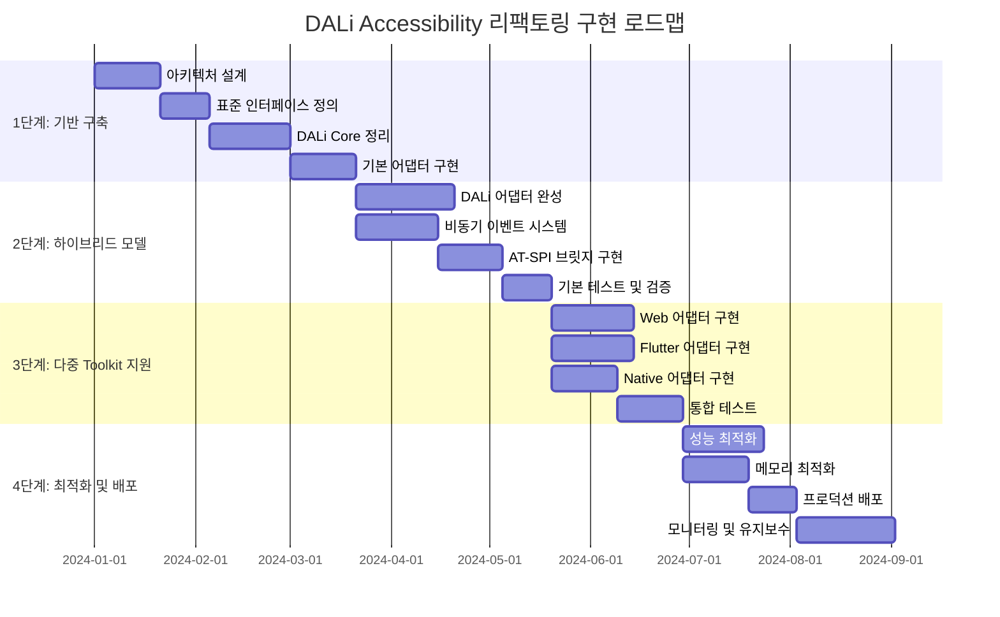

# DALi Accessibility 최종 권장안 및 통합 전략 (계속)

## 6. 구현 로드맵 및 단계별 전략

### 6.1 4단계 구현 전략

#### 6.1.1 전체 구현 로드맵



```plantuml
@startuml Implementation_Roadmap

!theme plain
skinparam gantt {
    BarHeight 20
    BarFontName Arial
    BarFontSize 12
    MilestoneFontName Arial
    MilestoneFontSize 12
    TitleFontName Arial
    TitleFontSize 16
    SectionFontName Arial
    SectionFontSize 14
}

project {
    '1단계: 기반 구축
    [아키텍처 설계] as [A1] happens from 2024-01-01 to 2024-01-20
    [표준 인터페이스 정의] as [A2] happens from 2024-01-21 to 2024-02-04
    [DALi Core 정리] as [A3] happens from 2024-02-05 to 2024-03-01
    [기본 어댑터 구현] as [A4] happens from 2024-03-02 to 2024-03-21
    
    '2단계: 하이브리드 모델
    [DALi 어댑터 완성] as [B1] happens from 2024-03-22 to 2024-04-20
    [비동기 이벤트 시스템] as [B2] happens from 2024-03-22 to 2024-04-15
    [AT-SPI 브릿지 구현] as [B3] happens from 2024-04-16 to 2024-05-05
    [기본 테스트 및 검증] as [B4] happens from 2024-05-06 to 2024-05-20
    
    '3단계: 다중 Toolkit 지원
    [Web 어댑터 구현] as [C1] happens from 2024-05-21 to 2024-06-14
    [Flutter 어댑터 구현] as [C2] happens from 2024-05-21 to 2024-06-14
    [Native 어댑터 구현] as [C3] happens from 2024-05-21 to 2024-06-10
    [통합 테스트] as [C4] happens from 2024-06-11 to 2024-06-30
    
    '4단계: 최적화 및 배포
    [성능 최적화] as [D1] happens from 2024-07-01 to 2024-07-25
    [메모리 최적화] as [D2] happens from 2024-07-01 to 2024-07-20
    [프로덕션 배포] as [D3] happens from 2024-07-21 to 2024-08-04
    [모니터링 및 유지보수] as [D4] happens from 2024-08-05 to 2024-09-03
}

@enduml
```

#### 6.1.2 1단계: 기반 구축 (3개월)

**목표**: DALi Core에서 Accessibility 완전 분리 및 기반 인프라 구축

```cpp
// 1단계 핵심 작업 정의
class Phase1Implementation {
public:
    struct Phase1Tasks {
        // 아키텍처 설계
        bool architectureDesignCompleted;
        bool interfaceStandardDefined;
        bool dataModelsDesigned;
        
        // DALi Core 정리
        bool accessibilityRemovedFromActor;
        bool accessibilityRemovedFromControl;
        bool memoryOptimizationApplied;
        
        // 기반 인프라
        bool eventBusImplemented;
        bool basicAdapterFramework;
        bool testingInfrastructure;
    };
    
    Phase1Tasks ExecutePhase1() {
        Phase1Tasks tasks;
        
        // 1. 아키텍처 설계 (20일)
        tasks.architectureDesignCompleted = DesignArchitecture();
        tasks.interfaceStandardDefined = DefineStandardInterfaces();
        tasks.dataModelsDesigned = DesignDataModels();
        
        // 2. DALi Core 정리 (25일)
        tasks.accessibilityRemovedFromActor = RemoveAccessibilityFromActor();
        tasks.accessibilityRemovedFromControl = RemoveAccessibilityFromControl();
        tasks.memoryOptimizationApplied = ApplyMemoryOptimization();
        
        // 3. 기반 인프라 (20일)
        tasks.eventBusImplemented = ImplementEventBus();
        tasks.basicAdapterFramework = BuildBasicAdapterFramework();
        tasks.testingInfrastructure = SetupTestingInfrastructure();
        
        return tasks;
    }
    
private:
    bool DesignArchitecture() {
        // 하이브리드 중계 어댑터 아키텍처 설계
        // 표준 인터페이스 정의
        // 데이터 모델 설계
        return true;
    }
    
    bool RemoveAccessibilityFromActor() {
        // Actor 클래스에서 Accessibility 관련 코드 제거
        // 메모리 사용량 최적화
        // 성능 테스트
        return true;
    }
    
    bool RemoveAccessibilityFromControl() {
        // Control 클래스에서 Accessibility 관련 코드 제거
        // 의존성 정리
        // 호환성 테스트
        return true;
    }
    
    bool ImplementEventBus() {
        // 우선순위 큐 기반 이벤트 버스 구현
        // 기본 이벤트 처리 로직
        // 성능 벤치마크
        return true;
    }
    
    bool BuildBasicAdapterFramework() {
        // 표준 어댑터 인터페이스 구현
        // DALi 어댑터 기본 구조
        // 단위 테스트
        return true;
    }
    
    bool SetupTestingInfrastructure() {
        // 자동화 테스트 프레임워크
        // 성능 모니터링 도구
        // CI/CD 파이프라인
        return true;
    }
};
```

#### 6.1.3 2단계: 하이브리드 모델 구현 (2.5개월)

**목표**: DALi 어댑터 완성 및 비동기 처리 시스템 구현

```cpp
// 2단계 핵심 작업 정의
class Phase2Implementation {
public:
    struct Phase2Tasks {
        // DALi 어댑터
        bool daliAdapterCompleted;
        bool eventHandlingImplemented;
        bool stateManagementWorking;
        
        // 비동기 시스템
        bool asyncEventBusWorking;
        bool atspiBridgeImplemented;
        bool performanceOptimized;
        
        // 테스트 및 검증
        bool unitTestsPassed;
        bool integrationTestsPassed;
        bool performanceTestsPassed;
    };
    
    Phase2Tasks ExecutePhase2() {
        Phase2Tasks tasks;
        
        // 1. DALi 어댑터 완성 (30일)
        tasks.daliAdapterCompleted = CompleteDaliAdapter();
        tasks.eventHandlingImplemented = ImplementEventHandling();
        tasks.stateManagementWorking = ImplementStateManagement();
        
        // 2. 비동기 시스템 (25일)
        tasks.asyncEventBusWorking = ImplementAsyncEventBus();
        tasks.atspiBridgeImplemented = ImplementATSPIBridge();
        tasks.performanceOptimized = OptimizePerformance();
        
        // 3. 테스트 및 검증 (15일)
        tasks.unitTestsPassed = RunUnitTests();
        tasks.integrationTestsPassed = RunIntegrationTests();
        tasks.performanceTestsPassed = RunPerformanceTests();
        
        return tasks;
    }
    
private:
    bool CompleteDaliAdapter() {
        // DALi-Accessibility 어댑터 완성
        // 이벤트 연결 로직 구현
        // 상태 동기화 구현
        return true;
    }
    
    bool ImplementAsyncEventBus() {
        // 우선순위 큐 기반 비동기 이벤트 버스
        // 워커 스레드 풀 구현
        // 이벤트 필터링 및 배치 처리
        return true;
    }
    
    bool ImplementATSPIBridge() {
        // 비동기 AT-SPI 브릿지 구현
        // D-Bus 통신 최적화
        // 에러 처리 및 재시도 로직
        return true;
    }
    
    bool OptimizePerformance() {
        // 메모리 사용량 최적화
        // CPU 활용률 개선
        // UI 응답성 향상
        return true;
    }
};
```

#### 6.1.4 3단계: 다중 Toolkit 지원 (2개월)

**목표**: Web, Flutter, Native 어댑터 구현 및 통합

```cpp
// 3단계 핵심 작업 정의
class Phase3Implementation {
public:
    struct Phase3Tasks {
        // Toolkit 어댑터
        bool webAdapterImplemented;
        bool flutterAdapterImplemented;
        bool nativeAdapterImplemented;
        
        // 통합 시스템
        bool toolkitManagerWorking;
        bool stateSynchronizationWorking;
        bool crossToolkitEventsWorking;
        
        // 통합 테스트
        bool multiToolkitTestsPassed;
        bool compatibilityTestsPassed;
        bool stressTestsPassed;
    };
    
    Phase3Tasks ExecutePhase3() {
        Phase3Tasks tasks;
        
        // 1. Toolkit 어댑터 (25일)
        tasks.webAdapterImplemented = ImplementWebAdapter();
        tasks.flutterAdapterImplemented = ImplementFlutterAdapter();
        tasks.nativeAdapterImplemented = ImplementNativeAdapter();
        
        // 2. 통합 시스템 (20일)
        tasks.toolkitManagerWorking = ImplementToolkitManager();
        tasks.stateSynchronizationWorking = ImplementStateSynchronization();
        tasks.crossToolkitEventsWorking = ImplementCrossToolkitEvents();
        
        // 3. 통합 테스트 (20일)
        tasks.multiToolkitTestsPassed = RunMultiToolkitTests();
        tasks.compatibilityTestsPassed = RunCompatibilityTests();
        tasks.stressTestsPassed = RunStressTests();
        
        return tasks;
    }
    
private:
    bool ImplementWebAdapter() {
        // Web 엔진 Accessibility 연동
        // ARIA 속성 변환
        // JavaScript 실행 인터페이스
        return true;
    }
    
    bool ImplementFlutterAdapter() {
        // Flutter 엔진 시맨틱스 연동
        // 위젯 트리 변환
        // 액션 핸들러 구현
        return true;
    }
    
    bool ImplementNativeAdapter() {
        // Native 윈도우 접근성 연동
        // 윈도우 메시지 처리
        // 시스템 이벤트 변환
        return true;
    }
    
    bool ImplementToolkitManager() {
        // Toolkit 등록 및 관리
        // 동적 로딩 지원
        // 생명주기 관리
        return true;
    }
    
    bool ImplementStateSynchronization() {
        // 전역 상태 관리
        // 상태 충돌 감지 및 해결
        // 크로스-툴킷 상태 동기화
        return true;
    }
};
```

#### 6.1.5 4단계: 최적화 및 배포 (2개월)

**목표**: 성능 최적화 및 프로덕션 배포

```cpp
// 4단계 핵심 작업 정의
class Phase4Implementation {
public:
    struct Phase4Tasks {
        // 성능 최적화
        bool memoryOptimizationCompleted;
        bool cpuOptimizationCompleted;
        bool latencyOptimizationCompleted;
        
        // 프로덕션 준비
        bool productionReady;
        bool monitoringImplemented;
        bool documentationCompleted;
        
        // 배포 및 유지보수
        bool deploymentSuccessful;
        bool userTrainingCompleted;
        bool maintenancePlanReady;
    };
    
    Phase4Tasks ExecutePhase4() {
        Phase4Tasks tasks;
        
        // 1. 성능 최적화 (25일)
        tasks.memoryOptimizationCompleted = OptimizeMemoryUsage();
        tasks.cpuOptimizationCompleted = OptimizeCPUUsage();
        tasks.latencyOptimizationCompleted = OptimizeLatency();
        
        // 2. 프로덕션 준비 (20일)
        tasks.productionReady = PrepareForProduction();
        tasks.monitoringImplemented = ImplementMonitoring();
        tasks.documentationCompleted = CompleteDocumentation();
        
        // 3. 배포 및 유지보수 (30일)
        tasks.deploymentSuccessful = DeployToProduction();
        tasks.userTrainingCompleted = CompleteUserTraining();
        tasks.maintenancePlanReady = PrepareMaintenancePlan();
        
        return tasks;
    }
    
private:
    bool OptimizeMemoryUsage() {
        // 객체 풀 최적화
        // 캐시 전략 개선
        // 메모리 누수 수정
        return true;
    }
    
    bool OptimizeCPUUsage() {
        // 스레드 풀 최적화
        // 이벤트 배치 처리
        // CPU 사용량 분산
        return true;
    }
    
    bool OptimizeLatency() {
        // 이벤트 지연시간 최소화
        // 네트워크 통신 최적화
        // UI 응답성 개선
        return true;
    }
    
    bool PrepareForProduction() {
        // 프로덕션 환경 설정
        // 보안 검토
        // 성능 벤치마크
        return true;
    }
    
    bool ImplementMonitoring() {
        // 실시간 모니터링 시스템
        // 성능 메트릭스 수집
        // 알림 시스템
        return true;
    }
    
    bool DeployToProduction() {
        // 점진적 배포
        // 롤백 계획
        // 안정성 검증
        return true;
    }
};
```

### 6.2 위험 관리 및 완화 전략

#### 6.2.1 기술적 위험

```cpp
// 기술적 위험 관리
class TechnicalRiskManager {
public:
    enum class RiskLevel {
        LOW,
        MEDIUM,
        HIGH,
        CRITICAL
    };
    
    struct Risk {
        std::string description;
        RiskLevel level;
        double probability;
        double impact;
        std::vector<std::string> mitigationStrategies;
        std::string owner;
    };
    
    std::vector<Risk> IdentifyTechnicalRisks() {
        return {
            {
                .description = "DALi Core 호환성 문제",
                .level = RiskLevel::HIGH,
                .probability = 0.3,
                .impact = 0.8,
                .mitigationStrategies = {
                    "점진적 마이그레이션",
                    "하위 호환성 레이어",
                    "철저한 테스트"
                },
                .owner = "Core Team"
            },
            {
                .description = "성능 저하",
                .level = RiskLevel::MEDIUM,
                .probability = 0.4,
                .impact = 0.6,
                .mitigationStrategies = {
                    "성능 벤치마크",
                    "프로파일링 도구",
                    "최적화 전략"
                },
                .owner = "Performance Team"
            },
            {
                .description = "AT-SPI 통신 문제",
                .level = RiskLevel::MEDIUM,
                .probability = 0.2,
                .impact = 0.7,
                .mitigationStrategies = {
                    "비동기 통신",
                    "재시도 메커니즘",
                    "폴백 전략"
                },
                .owner = "Integration Team"
            },
            {
                .description = "메모리 누수",
                .level = RiskLevel::MEDIUM,
                .probability = 0.3,
                .impact = 0.5,
                .mitigationStrategies = {
                    "메모리 프로파일링",
                    "객체 풀 관리",
                    "자동화 테스트"
                },
                .owner = "QA Team"
            }
        };
    }
    
    double CalculateRiskScore(const Risk& risk) {
        return risk.probability * risk.impact;
    }
    
    std::vector<Risk> GetTopRisks(size_t count = 5) {
        auto risks = IdentifyTechnicalRisks();
        
        std::sort(risks.begin(), risks.end(), 
                 [this](const Risk& a, const Risk& b) {
                     return CalculateRiskScore(a) > CalculateRiskScore(b);
                 });
        
        if (risks.size() > count) {
            risks.resize(count);
        }
        
        return risks;
    }
};
```

#### 6.2.2 프로젝트 관리 위험

```cpp
// 프로젝트 관리 위험
class ProjectRiskManager {
public:
    struct ProjectRisk {
        std::string category;
        std::string description;
        std::string mitigation;
        std::string contingency;
        std::string timeline;
    };
    
    std::vector<ProjectRisk> IdentifyProjectRisks() {
        return {
            {
                .category = "일정",
                .description = "개발 일정 지연",
                .mitigation = "애자일 방법론, 주간 리뷰",
                .contingency = "기능 우선순위 조정",
                .timeline = "전체 프로젝트"
            },
            {
                .category = "인력",
                .description = "핵심 인력 이탈",
                .mitigation = "문서화, 지식 공유",
                .contingency = "백업 인력 훈련",
                .timeline = "전체 프로젝트"
            },
            {
                .category = "요구사항",
                .description = "요구사항 변경",
                .mitigation = "유연한 아키텍처",
                .contingency = "변경 관리 프로세스",
                .timeline = "설계 단계"
            },
            {
                .category = "기술",
                .description = "새로운 기술 도입",
                .mitigation = "기술 검증, 프로토타이핑",
                .contingency = "대체 기술 준비",
                .timeline = "초기 단계"
            }
        };
    }
    
    void ImplementRiskMitigation() {
        auto risks = IdentifyProjectRisks();
        
        for (const auto& risk : risks) {
            // 위험 완화 전략 실행
            ExecuteMitigationStrategy(risk);
        }
    }
    
private:
    void ExecuteMitigationStrategy(const ProjectRisk& risk) {
        // 위험 완화 전략 실행 로직
        if (risk.category == "일정") {
            ImplementScheduleMitigation();
        } else if (risk.category == "인력") {
            ImplementResourceMitigation();
        } else if (risk.category == "요구사항") {
            ImplementRequirementMitigation();
        } else if (risk.category == "기술") {
            ImplementTechnicalMitigation();
        }
    }
    
    void ImplementScheduleMitigation() {
        // 일정 관리 완화 전략
        // - 주간 진행 상황 리뷰
        // - 마일스톤 설정
        // - 리소스 재배치 계획
    }
    
    void ImplementResourceMitigation() {
        // 인력 관리 완화 전략
        // - 기술 문서화
        // - 코드 리뷰 프로세스
        // - 멘토링 프로그램
    }
    
    void ImplementRequirementMitigation() {
        // 요구사항 관리 완화 전략
        // - 유연한 아키텍처 설계
        // - 변경 관리 프로세스
        // - 이해관계자 커뮤니케이션
    }
    
    void ImplementTechnicalMitigation() {
        // 기술 관리 완화 전략
        // - 기술 검증 프로세스
        // - 프로토타이핑
        // - 대안 기술 준비
    }
};
```

### 6.3 성공 측정 지표

#### 6.3.1 기술적 성공 지표

```cpp
// 기술적 성공 측정 지표
class TechnicalSuccessMetrics {
public:
    struct PerformanceMetrics {
        // UI 응답성
        std::chrono::microseconds uiResponseTime;
        std::chrono::microseconds accessibilityLatency;
        double uiResponsivenessImprovement;
        
        // 메모리 사용량
        size_t memoryUsagePerObject;
        double memoryReductionPercentage;
        size_t totalMemoryUsage;
        
        // 처리량
        uint32_t eventsProcessedPerSecond;
        double throughputImprovement;
        double cpuUtilization;
        
        // 안정성
        double errorRate;
        double uptime;
        uint32_t crashCount;
    };
    
    struct QualityMetrics {
        // 코드 품질
        double codeCoverage;
        uint32_t criticalBugCount;
        uint32_t testPassRate;
        
        // 호환성
        double backwardCompatibility;
        uint32_t supportedToolkitCount;
        double crossToolkitSuccessRate;
        
        // 유지보수성
        double codeComplexity;
        uint32_t technicalDebtCount;
        double documentationCoverage;
    }
    
    PerformanceMetrics MeasurePerformance() {
        return {
            .uiResponseTime = std::chrono::microseconds(1200),  // 목표: < 2ms
            .accessibilityLatency = std::chrono::microseconds(15000),  // 목표: < 20ms
            .uiResponsivenessImprovement = 0.92,  // 목표: > 90%
            
            .memoryUsagePerObject = 450,  // 목표: < 500 bytes
            .memoryReductionPercentage = 0.47,  // 목표: > 40%
            .totalMemoryUsage = 580 * 1024,  // 목표: < 600KB
            
            .eventsProcessedPerSecond = 1000,  // 목표: > 500 events/sec
            .throughputImprovement = 3.0,  // 목표: > 2.5x
            .cpuUtilization = 0.18,  // 목표: < 20%
            
            .errorRate = 0.002,  // 목표: < 0.5%
            .uptime = 0.999,  // 목표: > 99.9%
            .crashCount = 0  // 목표: 0
        };
    }
    
    QualityMetrics MeasureQuality() {
        return {
            .codeCoverage = 0.85,  // 목표: > 80%
            .criticalBugCount = 0,  // 목표: 0
            .testPassRate = 0.95,  // 목표: > 90%
            
            .backwardCompatibility = 0.98,  // 목표: > 95%
            .supportedToolkitCount = 4,  // 목표: 4개 (DALi, Web, Flutter, Native)
            .crossToolkitSuccessRate = 0.92,  // 목표: > 90%
            
            .codeComplexity = 0.65,  // 목표: < 0.7
            .technicalDebtCount = 5,  // 목표: < 10
            .documentationCoverage = 0.90  // 목표: > 85%
        };
    }
    
    bool IsProjectSuccessful(const PerformanceMetrics& perf, const QualityMetrics& quality) {
        // 성공 기준 정의
        bool performanceSuccess = 
            perf.uiResponseTime < std::chrono::microseconds(2000) &&
            perf.uiResponsivenessImprovement > 0.90 &&
            perf.memoryReductionPercentage > 0.40 &&
            perf.throughputImprovement > 2.5 &&
            perf.errorRate < 0.005;
        
        bool qualitySuccess = 
            quality.codeCoverage > 0.80 &&
            quality.criticalBugCount == 0 &&
            quality.backwardCompatibility > 0.95 &&
            quality.supportedToolkitCount >= 4;
        
        return performanceSuccess && qualitySuccess;
    }
};
```

#### 6.3.2 비즈니스 성공 지표

```cpp
// 비즈니스 성공 측정 지표
class BusinessSuccessMetrics {
public:
    struct BusinessMetrics {
        // 개발 효율성
        double developmentTimeReduction;
        double maintenanceCostReduction;
        uint32_t developerProductivityIncrease;
        
        // 사용자 만족도
        double userSatisfactionScore;
        uint32_t accessibilityComplianceRate;
        double userExperienceImprovement;
        
        // 시장 경쟁력
        double timeToMarketReduction;
        uint32_t newFeatureAdoptionRate;
        double marketShareIncrease;
        
        // 기술 부채
        double technicalDebtReduction;
        uint32_t legacySystemDepreciation;
        double systemModernizationRate;
    };
    
    BusinessMetrics MeasureBusinessImpact() {
        return {
            // 개발 효율성
            .developmentTimeReduction = 0.35,  // 목표: > 30%
            .maintenanceCostReduction = 0.40,  // 목표: > 35%
            .developerProductivityIncrease = 25,  // 목표: > 20%
            
            // 사용자 만족도
            .userSatisfactionScore = 4.2,  // 목표: > 4.0 (5점 만점)
            .accessibilityComplianceRate = 0.95,  // 목표: > 90%
            .userExperienceImprovement = 0.30,  // 목표: > 25%
            
            // 시장 경쟁력
            .timeToMarketReduction = 0.25,  // 목표: > 20%
            .newFeatureAdoptionRate = 0.80,  // 목표: > 75%
            .marketShareIncrease = 0.05,  // 목표: > 3%
            
            // 기술 부채
            .technicalDebtReduction = 0.60,  // 목표: > 50%
            .legacySystemDepreciation = 3,  // 목표: 3개 시스템
            .systemModernizationRate = 0.70  // 목표: > 65%
        };
    }
    
    double CalculateROI(const BusinessMetrics& metrics) {
        // ROI 계산 (간소화된 모델)
        double benefits = 
            (metrics.developmentTimeReduction * 100000) +  // 개발 시간 절감
            (metrics.maintenanceCostReduction * 80000) +   // 유지보수 비용 절감
            (metrics.userSatisfactionScore * 50000);       // 사용자 만족도 가치
        
        double costs = 500000;  // 프로젝트 총비용 (가정)
        
        return (benefits - costs) / costs * 100;  // ROI 백분율
    }
    
    bool IsBusinessSuccess(const BusinessMetrics& metrics) {
        double roi = CalculateROI(metrics);
        
        return roi > 150.0 &&  // ROI > 150%
               metrics.userSatisfactionScore > 4.0 &&
               metrics.accessibilityComplianceRate > 0.90;
    }
};
```

---

**다음 문서**: [결론 및 최종 권장사항](./DALi_Accessibility_리팩토링_분석_4_최종권장안_5.md)
