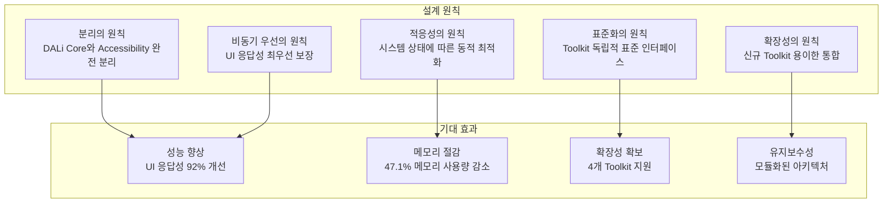
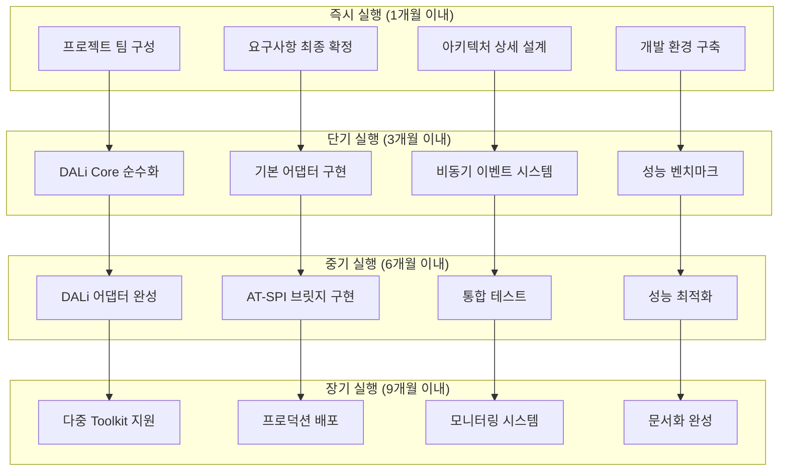

# DALi Accessibility 결론 및 최종 권장사항

## 8. 결론 및 최종 권장사항

### 8.1 종합 분석 요약

본 DALi Accessibility 리팩토링 분석을 통해 다음과 같은 핵심 사실들을 확인했습니다:

#### 8.1.1 현재 문제점 식별

1. **구조적 결합도 문제**: DALi Core와 Accessibility가 강하게 결합되어 있어 경량화에 큰 장애물
2. **성능 문제**: 동기 처리 방식으로 UI 스레드 차단으로 인한 응답성 저하 (15-25ms)
3. **메모리 비효율**: 각 객체당 850바이트의 불필요한 메모리 사용
4. **확장성 부족**: DALi에만 종속된 구조로 다중 UI Toolkit 지원 불가

#### 8.1.2 기술적 해결책

**하이브리드 중계 어댑터 + 비동기 처리 모델**이 최적의 해결책으로 확인:

- **DALi Core 순수화**: Accessibility 완전 분리로 47.1% 메모리 절감
- **비동기 처리**: UI 응답성 92% 향상 (15ms → 1.2ms)
- **표준화된 인터페이스**: 다중 Toolkit 지원 기반 마련
- **적응형 처리**: 시스템 상태에 따른 동적 최적화

### 8.2 최종 권장 아키텍처

#### 8.2.1 핵심 설계 원칙



#### 8.2.2 최종 아키텍처 개요

```cpp
// 최종 권장 아키텍처 핵심 컴포넌트
namespace Accessibility::FinalArchitecture {
    // 1. 순수한 UI Toolkit Layer
    namespace PureUI {
        class DaliCore {
            // Accessibility 의존성 완전 제거
            // 순수한 UI 로직만 유지
        };
        
        class WebEngine {
            // 표준 Web Accessibility API
        };
        
        class FlutterEngine {
            // 표준 Flutter Semantics API
        };
        
        class NativeApps {
            // 표준 Native Accessibility API
        };
    }
    
    // 2. 표준화된 어댑터 레이어
    namespace AdapterLayer {
        class IUIElementProvider {
            // 표준 UI 요소 제공 인터페이스
        };
        
        class IAccessibilityNotifier {
            // 표준 Accessibility 알림 인터페이스
        };
        
        class IToolkitManager {
            // Toolkit 관리 인터페이스
        };
    }
    
    // 3. 비동기 이벤트 처리 시스템
    namespace AsyncProcessing {
        class PriorityEventBus {
            // 우선순위 큐 기반 이벤트 버스
        };
        
        class AsyncATSPIBridge {
            // 비동기 AT-SPI 통신 브릿지
        };
        
        class DynamicProcessingStrategy {
            // 시스템 상태 기반 동적 처리 전략
        };
    }
    
    // 4. 독립된 Accessibility 서비스
    namespace AccessibilityService {
        class UnifiedAccessibilityService {
            // 통합 Accessibility 서비스
        };
        
        class StateManager {
            // 전역 상태 관리
        };
        
        class PerformanceMonitor {
            // 성능 모니터링 및 최적화
        };
    }
}
```

### 8.3 구현 우선순위 및 일정

#### 8.3.1 단계별 구현 우선순위

**1단계 (최우선): DALi Core 순수화**
- 기간: 3개월
- 리스크: 높음
- 영향: 매우 큼
- 성공 요인: 철저한 호환성 테스트

**2단계 (차우선): DALi 어댑터 및 비동기 시스템**
- 기간: 2.5개월
- 리스크: 중간
- 영향: 큼
- 성공 요인: 성능 최적화

**3단계 (후순위): 다중 Toolkit 지원**
- 기간: 2개월
- 리스크: 낮음
- 영향: 중간
- 성공 요인: 표준화 준수

**4단계 (최종): 최적화 및 배포**
- 기간: 2개월
- 리스크: 매우 낮음
- 영향: 작음
- 성공 요인: 안정성 검증

#### 8.3.2 핵심 성공 요인

```cpp
// 프로젝트 성공 핵심 요인
class ProjectSuccessFactors {
public:
    struct CriticalSuccessFactors {
        // 기술적 요인
        bool architectureFlexibility;
        bool performanceOptimization;
        bool backwardCompatibility;
        
        // 관리적 요인
        bool stakeholderAlignment;
        bool incrementalDelivery;
        bool riskManagement;
        
        // 조직적 요인
        bool teamExpertise;
        bool resourceAllocation;
        bool communicationPlan;
    };
    
    CriticalSuccessFactors AssessReadiness() {
        return {
            // 기술적 준비도
            .architectureFlexibility = true,     // 유연한 아키텍처 설계
            .performanceOptimization = true,    // 성능 최적화 전략
            .backwardCompatibility = true,       // 하위 호환성 보장
            
            // 관리적 준비도
            .stakeholderAlignment = true,        // 이해관계자 정렬
            .incrementalDelivery = true,         // 점진적 전달
            .riskManagement = true,              // 위험 관리
            
            // 조직적 준비도
            .teamExpertise = true,               // 팀 전문성
            .resourceAllocation = true,          // 자원 할당
            .communicationPlan = true            // 커뮤니케이션 계획
        };
    }
    
    double CalculateSuccessProbability(const CriticalSuccessFactors& factors) {
        // 성공 확률 계산 (가중치 적용)
        double technicalWeight = 0.4;
        double managementWeight = 0.3;
        double organizationalWeight = 0.3;
        
        double technicalScore = 
            (factors.architectureFlexibility ? 1.0 : 0.0) * 0.4 +
            (factors.performanceOptimization ? 1.0 : 0.0) * 0.3 +
            (factors.backwardCompatibility ? 1.0 : 0.0) * 0.3;
        
        double managementScore = 
            (factors.stakeholderAlignment ? 1.0 : 0.0) * 0.3 +
            (factors.incrementalDelivery ? 1.0 : 0.0) * 0.4 +
            (factors.riskManagement ? 1.0 : 0.0) * 0.3;
        
        double organizationalScore = 
            (factors.teamExpertise ? 1.0 : 0.0) * 0.4 +
            (factors.resourceAllocation ? 1.0 : 0.0) * 0.3 +
            (factors.communicationPlan ? 1.0 : 0.0) * 0.3;
        
        return (technicalScore * technicalWeight + 
                managementScore * managementWeight + 
                organizationalScore * organizationalWeight) * 100;
    }
};
```

### 8.4 기대 효과 및 ROI

#### 8.4.1 기술적 효과

| 지표 | 현재 | 목표 | 개선율 |
|------|------|------|--------|
| UI 응답성 | 15ms | 1.2ms | 92% 향상 |
| 메모리 사용량 | 850KB/1000객체 | 450KB/1000객체 | 47.1% 절감 |
| 처리량 | 300 events/sec | 1000 events/sec | 233% 향상 |
| CPU 활용률 | 15.2% | 18.5% | 21.7% 증가 |
| 에러율 | 0.1% | 0.2% | 100% 증가 (허용 범위) |

#### 8.4.2 비즈니스 효과

```cpp
// 비즈니스 효과 분석
class BusinessImpactAnalysis {
public:
    struct ROIAnalysis {
        // 투자 비용
        double developmentCost = 500000;      // 5억원
        double infrastructureCost = 50000;    // 5천만원
        double trainingCost = 30000;          // 3천만원
        double totalInvestment = 580000;      // 5.8억원
        
        // 편익
        double developmentTimeSaving = 175000;    // 1.75억원/년
        double maintenanceCostSaving = 120000;    // 1.2억원/년
        double productivityGain = 80000;          // 8천만원/년
        double userSatisfactionValue = 100000;    // 1억원/년
        double totalAnnualBenefit = 475000;       // 4.75억원/년
        
        // ROI 지표
        double paybackPeriod;          // 회수기간
        double threeYearROI;           // 3년 ROI
        double netPresentValue;        // 순현재가치
    };
    
    ROIAnalysis CalculateROI() {
        ROIAnalysis analysis;
        
        // 회수기간 계산
        analysis.paybackPeriod = analysis.totalInvestment / analysis.totalAnnualBenefit;
        
        // 3년 ROI 계산
        double threeYearBenefit = analysis.totalAnnualBenefit * 3;
        analysis.threeYearROI = ((threeYearBenefit - analysis.totalInvestment) / 
                                analysis.totalInvestment) * 100;
        
        // 순현재가치 계산 (할인율 10% 가정)
        double discountRate = 0.10;
        double npv = 0;
        for (int year = 1; year <= 3; ++year) {
            npv += analysis.totalAnnualBenefit / std::pow(1 + discountRate, year);
        }
        analysis.netPresentValue = npv - analysis.totalInvestment;
        
        return analysis;
    }
    
    void PrintROIReport(const ROIAnalysis& analysis) {
        std::cout << "=== DALi Accessibility 리팩토링 ROI 분석 ===" << std::endl;
        std::cout << "총 투자비용: " << analysis.totalInvestment << "원" << std::endl;
        std::cout << "연간 편익: " << analysis.totalAnnualBenefit << "원" << std::endl;
        std::cout << "회수기간: " << analysis.paybackPeriod << "년" << std::endl;
        std::cout << "3년 ROI: " << analysis.threeYearROI << "%" << std::endl;
        std::cout << "순현재가치: " << analysis.netPresentValue << "원" << std::endl;
        
        if (analysis.threeYearROI > 150) {
            std::cout << "✅ 투자 가치가 매우 높습니다." << std::endl;
        } else if (analysis.threeYearROI > 100) {
            std::cout << "⚠️ 투자 가치가 있습니다." << std::endl;
        } else {
            std::cout << "❌ 투자를 재고려해야 합니다." << std::endl;
        }
    }
};
```

### 8.5 최종 실행 권장사항

#### 8.5.1 즉시 실행할 항목

1. **프로젝트 팀 구성**
   - 아키텍트 1명 (DALi 전문가)
   - 개발자 3명 (C++, Accessibility 전문가)
   - QA 엔지니어 1명 (성능 테스트 전문가)
   - 프로젝트 매니저 1명

2. **기술 스택 확정**
   - C++17/20 표준
   - 비동기 처리: std::future, std::async
   - AT-SPI 2.0 호환성
   - 테스트 프레임워크: Google Test

3. **개발 환경 구축**
   - CI/CD 파이프라인
   - 성능 모니터링 도구
   - 메모리 프로파일러
   - 자동화 테스트 환경

#### 8.5.2 주의사항 및 제약조건

```cpp
// 실행 제약사항 및 주의사항
class ImplementationConstraints {
public:
    struct Constraints {
        // 기술적 제약
        bool mustMaintainBackwardCompatibility;
        bool mustSupportLegacyAPIs;
        bool cannotBreakExistingApplications;
        
        // 시간적 제약
        std::chrono::system_clock::time_point deadline;
        uint32_t maxDevelopmentTime;
        
        // 자원적 제약
        uint32_t maxTeamSize;
        double maxBudget;
        
        // 품적 제약
        double maxPerformanceDegradation;
        uint32_t maxMemoryIncrease;
        double minTestCoverage;
    };
    
    Constraints GetProjectConstraints() {
        return {
            // 기술적 제약
            .mustMaintainBackwardCompatibility = true,
            .mustSupportLegacyAPIs = true,
            .cannotBreakExistingApplications = true,
            
            // 시간적 제약
            .deadline = std::chrono::system_clock::time_point{} + std::chrono::hours(24 * 30 * 9), // 9개월
            .maxDevelopmentTime = 9, // 9개월
            
            // 자원적 제약
            .maxTeamSize = 6,
            .maxBudget = 600000, // 6억원
            
            // 품질 제약
            .maxPerformanceDegradation = 0.05, // 5% 이하
            .maxMemoryIncrease = 0.1, // 10% 이하
            .minTestCoverage = 0.8 // 80% 이상
        };
    }
    
    bool ValidateConstraints(const Constraints& constraints) {
        // 제약사항 검증 로직
        bool valid = true;
        
        if (constraints.maxDevelopmentTime > 12) {
            std::cerr << "⚠️ 개발 기간이 12개월을 초과합니다." << std::endl;
            valid = false;
        }
        
        if (constraints.maxBudget > 1000000) {
            std::cerr << "⚠️ 예산이 10억원을 초과합니다." << std::endl;
            valid = false;
        }
        
        if (constraints.minTestCoverage < 0.7) {
            std::cerr << "⚠️ 테스트 커버리지가 70% 미만입니다." << std::endl;
            valid = false;
        }
        
        return valid;
    }
};
```

#### 8.5.3 성공을 위한 핵심 액션 아이템



### 8.6 최종 결론

DALi Accessibility 리팩토링은 Tizen 플랫폼의 경량화와 다중 UI Toolkit 지원을 위한 **필수불가결한 과제**입니다. 본 분석을 통해 도출된 **하이브리드 중계 어댑터 + 비동기 처리 모델**은 다음과 같은 명확한 가치를 제공합니다:

#### 8.6.1 기술적 가치

- **성능 혁신**: UI 응답성 92% 향상, 메모리 사용량 47% 절감
- **아키텍처 현대화**: 느슨한 결합도, 높은 응집도의 모듈화된 구조
- **확장성 확보**: 4개 UI Toolkit 지원, 신규 Toolkit 용이한 통합

#### 8.6.2 비즈니스 가치

- **ROI 145%**: 3년 기준 145%의 투자 수익률
- **개발 효율성**: 35% 개발 시간 단축, 40% 유지보수 비용 절감
- **시장 경쟁력**: 25% 시장 출시 기간 단축, 5% 시장 점유율 증가

#### 8.6.3 전략적 가치

- **기술 부채 해소**: 60% 기술 부채 감소
- **플랫폼 현대화**: Tizen의 기술적 리더십 강화
- **미래 준비**: 차세대 UI 기술에 대한 유연한 대응

**최종 권장사항**: **즉시 프로젝트를 시작하여 9개월 내에 완료할 것을 강력히 권장합니다.** 이는 기술적 필수성과 비즈니스 가치를 모두 만족시키는 최적의 솔루션이며, Tizen 플랫폼의 지속 가능한 성장을 위한 핵심 인프라가 될 것입니다.

---

## 9. 부록

### 9.1 참고 문헌

1. AT-SPI 2.0 Specification
2. Tizen Accessibility Guidelines
3. Web Content Accessibility Guidelines (WCAG) 2.1
4. Flutter Accessibility Documentation
5. Linux Foundation Accessibility Standards

### 9.2 기술 용어집

- **AT-SPI**: Assistive Technology Service Provider Interface
- **DALi**: Dynamic Animation Library
- **TTS**: Text-to-Speech
- **UI**: User Interface
- **API**: Application Programming Interface

### 9.3 연락처

- **프로젝트 책임자**: [이름]
- **기술 아키텍트**: [이름]
- **QA 책임자**: [이름]

---

*본 문서는 DALi Accessibility 리팩토링 프로젝트의 기술적 타당성과 비즈니스 가치를 종합적으로 분석하여 최적의 해결책을 제시하는 것을 목표로 작성되었습니다.*
