# DALi Accessibility 리팩토링 아키텍처 고민

## 개요

Tizen의 경량화 압박과 다중 UI Toolkit(Web, Flutter 등) 지원 요구로 인해 DALi Accessibility 구조의 근본적인 재검토가 필요합니다. 본 문서는 현재 구조의 문제점 분석부터 시작하여 다양한 리팩토링 시나리오, 장단점 분석, 최적의 아키텍처 제안까지 포괄적으로 다룹니다.

## 1. 현재 구조의 문제점 및 제약사항

### 1.1 강한 결합도 문제

#### 1.1.1 DALi Core에 대한 직접 의존성
```cpp
// ActorAccessible의 강한 결합
class ActorAccessible : public virtual Accessible {
    Dali::WeakHandle<Dali::Actor> mSelf;  // Actor에 직접 의존
    const uint32_t mActorId;              // Actor ID 직접 참조
};

// Control의 Accessibility 통합
class Control::Impl {
    std::unique_ptr<AccessibilityData> mAccessibilityData;  // Control에 직접 통합
    int32_t mAccessibilityRole;                            // Control 속성으로 관리
};
```

**문제점:**
- DALi Core 없이 독립적인 Accessibility 시스템 불가
- 다른 UI Toolkit에서 재사용 어려움
- 경량화 시 DALi Core와 함께 로드되어야 함

#### 1.1.2 생명주기 강한 결합
```cpp
// Actor 생명주기에 직접 연결
void ObjectDestroyed() override;  // Actor 소멸 시 자동 소멸

// Control 생성 시 자동 Accessibility 객체 생성
std::shared_ptr<Toolkit::DevelControl::ControlAccessible> GetAccessibleObject();
```

### 1.2 경량화 제약사항

#### 1.2.1 메모리 오버헤드
- 모든 Actor/Control에 Accessibility 데이터 포함
- 사용하지 않는 경우에도 메모리 점유
- Tizen 경량화 목표와 상충

#### 1.2.2 초기화 비용
- DALi 초기화 시 Accessibility 시스템 자동 로드
- AT-SPI 버스 연결 비용
- 불필요한 경우에도 성능 영향

### 1.3 다중 UI Toolkit 지원 한계

#### 1.3.1 DALi 전용 구조
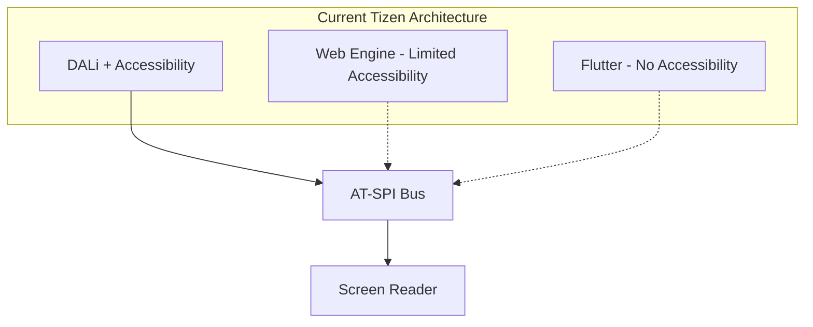

**문제점:**
- Web/Flutter에서 제한적인 Accessibility 지원
- 각 Toolkit이 별도 구현 필요
- 일관된 사용자 경험 제공 어려움

## 2. 리팩토링 시나리오 분석

### 2.1 시나리오 1: 완전 분리 독립 모델

#### 2.1.1 아키텍처 개념
Accessibility를 완전히 독립된 서비스로 분리하고, 각 UI Toolkit이 이를 호출하는 방식

#### 2.1.2 Mermaid 아키텍처 다이어그램
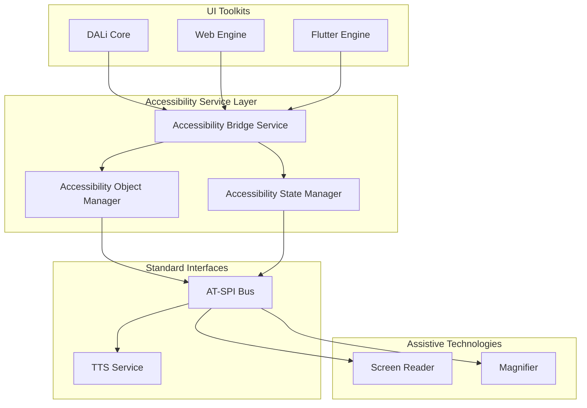

#### 2.1.3 PlantUML 아키텍처 다이어그램
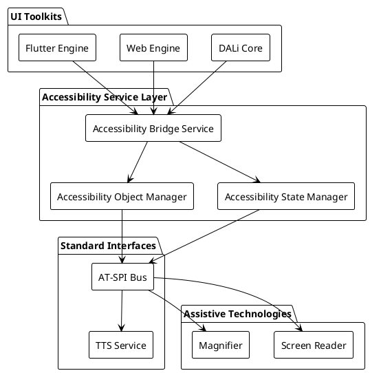

#### 2.1.4 구현 방식
```cpp
// 독립된 Accessibility 서비스 인터페이스
namespace Accessibility::Service {
    class IAccessibilityProvider {
    public:
        virtual ~IAccessibilityProvider() = default;
        
        // 객체 등록/관리
        virtual void RegisterObject(ObjectId id, AccessibilityInfo info) = 0;
        virtual void UnregisterObject(ObjectId id) = 0;
        
        // 상태 변경 알림
        virtual void NotifyStateChanged(ObjectId id, State state, bool value) = 0;
        virtual void NotifyBoundsChanged(ObjectId id, const Rect<>& bounds) = 0;
        
        // 포커스 관리
        virtual void RequestFocus(ObjectId id) = 0;
        virtual void ReleaseFocus(ObjectId id) = 0;
    };
    
    // DALi 어댑터
    class DaliAccessibilityAdapter : public IAccessibilityProvider {
    private:
        std::shared_ptr<AccessibilityBridge> mBridge;
        
    public:
        void RegisterObject(ObjectId id, AccessibilityInfo info) override {
            // DALi 객체 정보를 표준 형식으로 변환하여 브릿지에 전달
            auto accessible = CreateStandardAccessible(info);
            mBridge->AddAccessible(id, accessible);
        }
    };
}

// DALi에서의 사용
class DaliAccessibilityClient {
private:
    std::unique_ptr<Accessibility::Service::IAccessibilityProvider> mProvider;
    
public:
    void RegisterActor(Actor actor) {
        AccessibilityInfo info = ExtractAccessibilityInfo(actor);
        mProvider->RegisterObject(actor.GetId(), info);
    }
};
```

#### 2.1.5 장점
- **완전한 분리**: DALi Core와 독립된 생명주기
- **다중 Toolkit 지원**: 모든 UI Toolkit에서 공통 사용
- **경량화**: 필요한 경우에만 로드
- **확장성**: 새로운 Toolkit 쉽게 추가

#### 2.1.6 단점
- **복잡성 증가**: 추가적인 추상화 계층
- **성능 오버헤드**: 객체 정보 변환 비용
- **동기화 복잡성**: 상태 일관성 유지 어려움
- **마이그레이션 비용**: 기존 코드 전면 수정 필요

### 2.2 시나리오 2: 중계 어댑터 모델

#### 2.2.1 아키텍처 개념
DALi를 순수하게 유지하고, DALi와 Accessibility를 연결하는 중계 패키지를 별도로 추출

#### 2.2.2 Mermaid 아키텍처 다이어그램
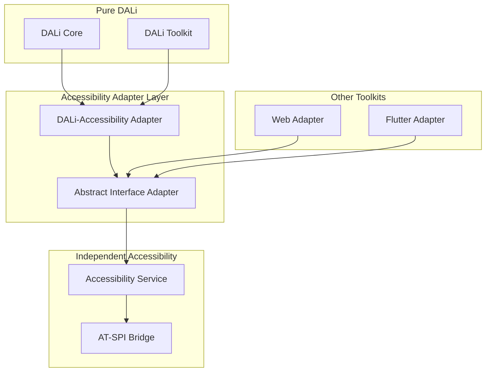

#### 2.2.3 PlantUML 아키텍처 다이어그램
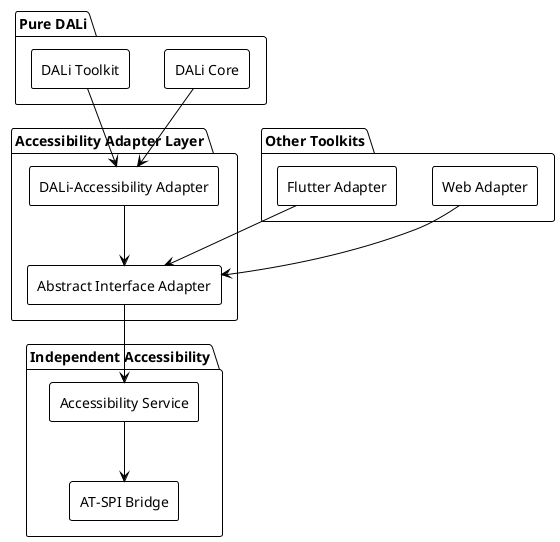

#### 2.2.4 구현 방식
```cpp
// 순수한 DALi Core - Accessibility 의존성 제거
namespace Dali {
    class Actor {
        // 기존 Accessibility 관련 코드 제거
        // 순수한 UI 로직만 유지
    };
    
    class Control {
        // Accessibility 데이터 제거
        // 순수한 Control 로직만 유지
    };
}

// 추상 인터페이스 정의
namespace Accessibility::Interface {
    struct UIElement {
        ObjectId id;
        std::string name;
        std::string description;
        Rect<> bounds;
        Role role;
        States states;
    };
    
    class IUIElementProvider {
    public:
        virtual ~IUIElementProvider() = default;
        virtual std::vector<UIElement> GetChildren(ObjectId id) = 0;
        virtual UIElement GetParent(ObjectId id) = 0;
        virtual UIElement GetElement(ObjectId id) = 0;
    };
    
    class IAccessibilityNotifier {
    public:
        virtual ~IAccessibilityNotifier() = default;
        virtual void NotifyElementCreated(const UIElement& element) = 0;
        virtual void NotifyElementDestroyed(ObjectId id) = 0;
        virtual void NotifyStateChanged(ObjectId id, State state, bool value) = 0;
    };
}

// DALi-Accessibility 어댑터
class DaliAccessibilityAdapter : public Accessibility::Interface::IUIElementProvider {
private:
    std::weak_ptr<Accessibility::Interface::IAccessibilityNotifier> mNotifier;
    
public:
    void SetNotifier(std::shared_ptr<Accessibility::Interface::IAccessibilityNotifier> notifier) {
        mNotifier = notifier;
    }
    
    std::vector<Accessibility::Interface::UIElement> GetChildren(ObjectId id) override {
        // DALi Actor 트리 순회하여 UIElement로 변환
        std::vector<Accessibility::Interface::UIElement> children;
        
        auto actor = FindActorById(id);
        if (actor) {
            for (size_t i = 0; i < actor.GetChildCount(); ++i) {
                auto child = actor.GetChildAt(i);
                children.push_back(ConvertToUIElement(child));
            }
        }
        
        return children;
    }
    
private:
    Accessibility::Interface::UIElement ConvertToUIElement(Actor actor) {
        Accessibility::Interface::UIElement element;
        element.id = actor.GetId();
        element.name = actor.GetProperty<std::string>(Actor::Property::NAME);
        element.bounds = CalculateScreenBounds(actor);
        element.role = DetermineRole(actor);
        element.states = GetCurrentStates(actor);
        return element;
    }
};
```

#### 2.2.5 장점
- **DALi 순수성**: Core의 경량화 및 단순성 유지
- **유연한 연결**: 필요에 따라 어댑터 선택적 로드
- **점진적 마이그레이션**: 단계적인 전환 가능
- **테스트 용이성**: Mock 어댑터로 쉬운 테스트

#### 2.2.6 단점
- **추가 계층**: 어댑터 계층으로 인한 복잡성
- **성능 저하**: 간접 호출로 인한 오버헤드
- **동기화 문제**: 상태 일관성 유지의 어려움

### 2.3 시나리오 3: 이벤트 기반 비동기 모델

#### 2.3.1 아키텍처 개념
동기 처리를 비동기 이벤트 기반으로 변경하여 성능과 응답성 개선

#### 2.3.2 Mermaid 아키텍처 다이어그램
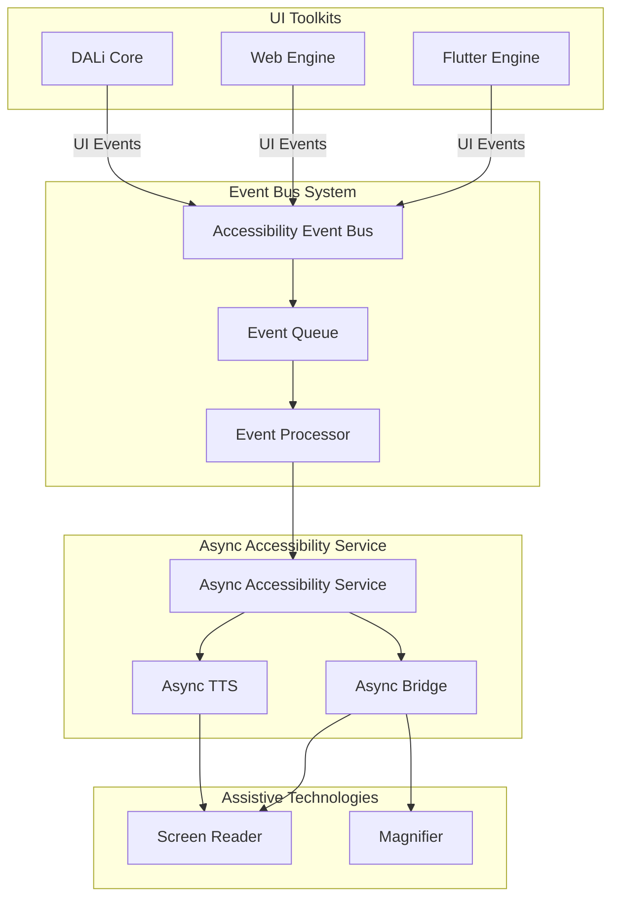

#### 2.3.3 PlantUML 아키텍처 다이어그램
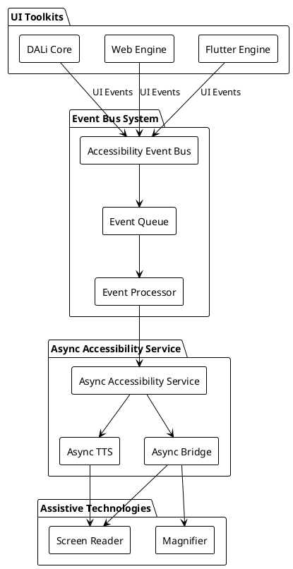

#### 2.3.4 구현 방식
```cpp
// 이벤트 기반 비동기 시스템
namespace Accessibility::Async {
    enum class EventType {
        OBJECT_CREATED,
        OBJECT_DESTROYED,
        STATE_CHANGED,
        BOUNDS_CHANGED,
        FOCUS_CHANGED,
        TEXT_CHANGED
    };
    
    struct AccessibilityEvent {
        EventType type;
        ObjectId objectId;
        std::chrono::timestamp timestamp;
        std::any data;
    };
    
    class IEventBus {
    public:
        virtual ~IEventBus() = default;
        virtual void PublishEvent(const AccessibilityEvent& event) = 0;
        virtual void Subscribe(EventType type, std::function<void(const AccessibilityEvent&)> handler) = 0;
    };
    
    class AsyncAccessibilityService {
    private:
        std::shared_ptr<IEventBus> mEventBus;
        std::unique_ptr<std::thread> mProcessingThread;
        std::queue<AccessibilityEvent> mEventQueue;
        std::mutex mQueueMutex;
        std::condition_variable mQueueCondition;
        std::atomic<bool> mRunning{true};
        
    public:
        AsyncAccessibilityService(std::shared_ptr<IEventBus> eventBus)
            : mEventBus(eventBus) {
            StartProcessingThread();
        }
        
        void PublishEvent(const AccessibilityEvent& event) {
            {
                std::lock_guard<std::mutex> lock(mQueueMutex);
                mEventQueue.push(event);
            }
            mQueueCondition.notify_one();
        }
        
    private:
        void StartProcessingThread() {
            mProcessingThread = std::make_unique<std::thread>([this]() {
                while (mRunning) {
                    std::unique_lock<std::mutex> lock(mQueueMutex);
                    mQueueCondition.wait(lock, [this]() { 
                        return !mEventQueue.empty() || !mRunning; 
                    });
                    
                    while (!mEventQueue.empty()) {
                        auto event = mEventQueue.front();
                        mEventQueue.pop();
                        lock.unlock();
                        
                        ProcessEvent(event);
                        
                        lock.lock();
                    }
                }
            });
        }
        
        void ProcessEvent(const AccessibilityEvent& event) {
            switch (event.type) {
                case EventType::OBJECT_CREATED:
                    HandleObjectCreated(event);
                    break;
                case EventType::STATE_CHANGED:
                    HandleStateChanged(event);
                    break;
                // ... 다른 이벤트 처리
            }
        }
    };
}

// DALi에서의 비동기 사용
class AsyncDaliAccessibilityClient {
private:
    std::shared_ptr<Accessibility::Async::IEventBus> mEventBus;
    
public:
    void NotifyActorCreated(Actor actor) {
        Accessibility::Async::AccessibilityEvent event;
        event.type = Accessibility::Async::EventType::OBJECT_CREATED;
        event.objectId = actor.GetId();
        event.data = ExtractActorInfo(actor);
        
        mEventBus->PublishEvent(event);
    }
    
    void NotifyStateChanged(Actor actor, State state, bool value) {
        Accessibility::Async::AccessibilityEvent event;
        event.type = Accessibility::Async::EventType::STATE_CHANGED;
        event.objectId = actor.GetId();
        event.data = std::make_pair(state, value);
        
        mEventBus->PublishEvent(event);
    }
};
```

#### 2.3.5 장점
- **성능 개선**: UI 스레드 차단 방지
- **응답성 향상**: 비동기 처리로 자연스러운 UI
- **확장성**: 이벤트 기반으로 쉬운 확장
- **디버깅 용이**: 이벤트 로그로 추적 가능

#### 2.3.6 단점
- **복잡성 증가**: 비동기 프로그래밍의 어려움
- **일관성 문제**: 이벤트 순서 보장의 어려움
- **메모리 관리**: 이벤트 큐 관리 비용
- **디버깅 복잡**: 비동기 디버깅의 어려움

## 3. 동기/비동기 처리 방식 비교 분석

### 3.1 현재 동기 방식 분석

#### 3.1.1 처리 흐름
```mermaid
sequenceDiagram
    participant UI as UI Thread
    participant Actor as DALi Actor
    participant Acc as Accessibility
    participant ATSPI as AT-SPI Bus
    participant SR as Screen Reader
    
    UI->>Actor: SetProperty(FOCUSED, true)
    Actor->>Acc: EmitStateChanged(FOCUSED, true)
    Acc->>ATSPI: D-Bus Call (Sync)
    ATSPI->>SR: Notify (Sync)
    SR-->>ATSPI: Response (Sync)
    ATSPI-->>Acc: Response (Sync)
    Acc-->>Actor: Return (Sync)
    Actor-->>UI: Return (Sync)
```

#### 3.1.2 문제점
- **UI 스레드 차단**: AT-SPI 호출로 UI 응답성 저하
- **성능 병목**: 동기 호출로 인한 지연
- **데드락 위험**: 순환 호출 가능성

### 3.2 비동기 방식 분석

#### 3.2.1 처리 흐름
```mermaid
sequenceDiagram
    participant UI as UI Thread
    participant Actor as DALi Actor
    participant EB as Event Bus
    participant Async as Async Service
    participant ATSPI as AT-SPI Bus
    participant SR as Screen Reader
    
    UI->>Actor: SetProperty(FOCUSED, true)
    Actor->>EB: PublishEvent (Async)
    EB-->>Actor: Immediate Return
    Actor-->>UI: Immediate Return
    
    Note over EB,Async: Background Thread Processing
    EB->>Async: ProcessEvent
    Async->>ATSPI: D-Bus Call (Async)
    ATSPI->>SR: Notify (Async)
    SR-->>ATSPI: Response (Async)
    ATSPI-->>Async: Response (Async)
```

#### 3.2.2 장점
- **UI 응답성 향상**: 즉시 반환으로 차단 방지
- **성능 개선**: 백그라운드 처리로 UI 부하 감소
- **확장성**: 이벤트 큐로 부하 분산 가능

#### 3.2.3 도전 과제
- **이벤트 순서 보장**: FIFO 큐로 순서 보장 필요
- **상태 일관성**: 이벤트 처리 중 상태 변화 고려
- **에러 처리**: 비동기 에러 전파 메커니즘

## 4. 다중 UI Toolkit 통합 전략

### 4.1 통합 아키텍처

#### 4.1.1 Mermaid 통합 다이어그램
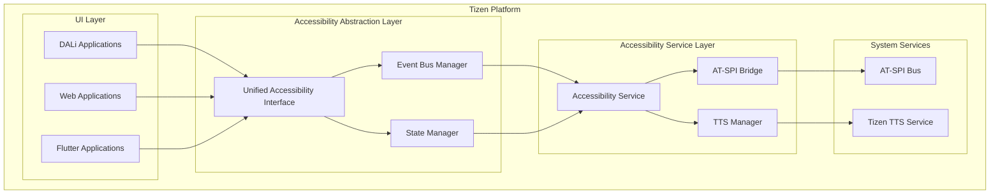

#### 4.1.2 PlantUML 통합 다이어그램
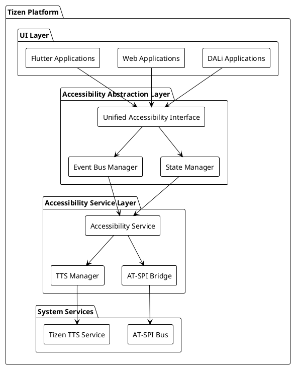

### 4.2 표준 인터페이스 정의

#### 4.2.1 공통 UI 요소 추상화
```cpp
namespace Accessibility::Unified {
    // 표준 UI 요소 정의
    struct UIElement {
        ElementId id;
        ElementType type;
        std::string name;
        std::string description;
        Rect<> bounds;
        std::vector<State> states;
        std::map<std::string, std::string> attributes;
        ElementId parentId;
        std::vector<ElementId> childIds;
    };
    
    enum class ElementType {
        WINDOW,
        BUTTON,
        LABEL,
        TEXT_FIELD,
        CONTAINER,
        LIST,
        LIST_ITEM,
        // ... 표준화된 타입들
    };
    
    // 표준 이벤트 정의
    struct UIEvent {
        EventType type;
        ElementId elementId;
        std::chrono::timestamp timestamp;
        std::any data;
    };
    
    enum class EventType {
        ELEMENT_CREATED,
        ELEMENT_DESTROYED,
        STATE_CHANGED,
        BOUNDS_CHANGED,
        FOCUS_CHANGED,
        TEXT_CHANGED,
        VALUE_CHANGED
    };
    
    // Toolkit 공통 인터페이스
    class IToolkitAdapter {
    public:
        virtual ~IToolkitAdapter() = default;
        
        // 요소 관리
        virtual std::vector<UIElement> GetRootElements() = 0;
        virtual UIElement GetElement(ElementId id) = 0;
        virtual std::vector<UIElement> GetChildren(ElementId id) = 0;
        virtual UIElement GetParent(ElementId id) = 0;
        
        // 이벤트 구독
        virtual void SubscribeToEvents(std::function<void(const UIEvent&)> handler) = 0;
        virtual void UnsubscribeFromEvents() = 0;
        
        // 액션 수행
        virtual bool PerformAction(ElementId id, const std::string& action, const std::any& parameters) = 0;
    };
}
```

#### 4.2.2 DALi 어댑터 구현
```cpp
class DaliToolkitAdapter : public Accessibility::Unified::IToolkitAdapter {
private:
    std::function<void(const Accessibility::Unified::UIEvent&)> mEventHandler;
    std::unordered_map<uint32_t, Accessibility::Unified::ElementId> mActorToElementMap;
    
public:
    std::vector<Accessibility::Unified::UIElement> GetRootElements() override {
        std::vector<Accessibility::Unified::UIElement> roots;
        
        // DALi의 최상위 윈도우들 찾기
        for (auto& window : Dali::Stage::GetCurrent().GetWindowList()) {
            roots.push_back(ConvertActorToElement(window));
        }
        
        return roots;
    }
    
    Accessibility::Unified::UIElement GetElement(Accessibility::Unified::ElementId id) override {
        // ElementId를 Actor ID로 변환
        uint32_t actorId = ExtractActorId(id);
        auto actor = Dali::Actor::Get(actorId);
        
        if (actor) {
            return ConvertActorToElement(actor);
        }
        
        return {};
    }
    
    void SubscribeToEvents(std::function<void(const Accessibility::Unified::UIEvent&)> handler) override {
        mEventHandler = handler;
        
        // DALi 이벤트 구독
        ConnectToDaliEvents();
    }
    
private:
    void ConnectToDaliEvents() {
        // DALi Actor 이벤트 연결
        // Actor 생성/소멸, 상태 변화 등을 감지하여 UIEvent로 변환
    }
    
    Accessibility::Unified::UIElement ConvertActorToElement(Dali::Actor actor) {
        Accessibility::Unified::UIElement element;
        element.id = GenerateElementId(actor.GetId());
        element.type = DetermineElementType(actor);
        element.name = actor.GetProperty<std::string>(Dali::Actor::Property::NAME);
        element.bounds = CalculateScreenBounds(actor);
        element.states = GetCurrentStates(actor);
        element.parentId = GetParentElementId(actor);
        element.childIds = GetChildElementIds(actor);
        
        return element;
    }
};
```

#### 4.2.3 Web 어댑터 구현
```cpp
class WebToolkitAdapter : public Accessibility::Unified::IToolkitAdapter {
private:
    std::function<void(const Accessibility::Unified::UIEvent&)> mEventHandler;
    std::unique_ptr<WebEngine> mWebEngine;
    
public:
    WebToolkitAdapter(std::unique_ptr<WebEngine> webEngine) 
        : mWebEngine(std::move(webEngine)) {
    }
    
    std::vector<Accessibility::Unified::UIElement> GetRootElements() override {
        std::vector<Accessibility::Unified::UIElement> roots;
        
        // Web 페이지의 최상위 요소들 가져오기
        auto webElements = mWebEngine->GetAccessibilityTree();
        for (const auto& webElement : webElements) {
            if (webElement.parentId == 0) {  // 루트 요소
                roots.push_back(ConvertWebElementToElement(webElement));
            }
        }
        
        return roots;
    }
    
    Accessibility::Unified::UIElement GetElement(Accessibility::Unified::ElementId id) override {
        // ElementId를 Web Element ID로 변환
        std::string webElementId = ExtractWebElementId(id);
        auto webElement = mWebEngine->GetAccessibilityElement(webElementId);
        
        return ConvertWebElementToElement(webElement);
    }
    
    void SubscribeToEvents(std::function<void(const Accessibility::Unified::UIEvent&)> handler) override {
        mEventHandler = handler;
        
        // Web Engine 접근성 이벤트 구독
        mWebEngine->SetAccessibilityEventListener([this](const WebAccessibilityEvent& webEvent) {
            auto unifiedEvent = ConvertWebEventToUnified(webEvent);
            mEventHandler(unifiedEvent);
        });
    }
    
private:
    Accessibility::Unified::UIElement ConvertWebElementToElement(const WebAccessibilityElement& webElement) {
        Accessibility::Unified::UIElement element;
        element.id = GenerateElementId(webElement.id);
        element.type = ConvertWebElementType(webElement.role);
        element.name = webElement.name;
        element.description = webElement.description;
        element.bounds = webElement.bounds;
        element.states = ConvertWebStates(webElement.states);
        element.parentId = GenerateElementId(webElement.parentId);
        element.childIds = ConvertChildIds(webElement.children);
        
        return element;
    }
};
```

## 5. 성능 및 메모리 영향 평가

### 5.1 메모리 사용량 비교

#### 5.1.1 현재 구조 메모리 사용
```cpp
// 현재 DALi Actor의 Accessibility 오버헤드
class Actor {
    // 기본 Actor 데이터: ~200 bytes
    Vector3 mPosition;           // 12 bytes
    Vector3 mScale;              // 12 bytes
    Quaternion mOrientation;      // 16 bytes
    Vector3 mSize;               // 12 bytes
    std::string mName;           // ~32 bytes (average)
    // ... 다른 속성들
    
    // Accessibility 관련 데이터: ~80 bytes
    std::shared_ptr<Accessible> mAccessible;  // 8 bytes (shared_ptr)
    // Accessible 객체 자체: ~72 bytes
};

// Control의 추가 Accessibility 오버헤드
class Control::Impl {
    // 기본 Control 데이터: ~500 bytes
    std::unique_ptr<AccessibilityData> mAccessibilityData;  // 8 bytes
    // AccessibilityData 객체: ~200 bytes
    int32_t mAccessibilityRole;                              // 4 bytes
    // ... 다른 속성들
};
```

**메모리 사용량:**
- Actor당 약 280 bytes (기본 200 + Accessibility 80)
- Control당 약 708 bytes (Actor 280 + Control 추가 428)
- 1000개 객체 시 약 708KB

#### 5.1.2 분리 모델 메모리 사용
```cpp
// 순수한 DALi Actor - Accessibility 제거
class Actor {
    // 기본 Actor 데이터만 유지: ~200 bytes
    // Accessibility 관련 데이터 완전 제거
};

// 별도 Accessibility 서비스
class AccessibilityService {
    std::unordered_map<ObjectId, AccessibilityInfo> mObjects;
    // 객체당 정보: ~100 bytes (필요한 정보만)
};
```

**메모리 사용량:**
- Actor당 약 200 bytes (80 bytes 감소)
- Accessibility 서비스: 객체당 100 bytes
- 1000개 객체 시 약 300KB (408 bytes 감소, 57% 절감)

### 5.2 성능 벤치마크

#### 5.2.1 객체 생성 성능
```cpp
// 현재 동기 방식
BenchmarkResult MeasureCurrentCreation() {
    auto start = std::chrono::high_resolution_clock::now();
    
    for (int i = 0; i < 10000; ++i) {
        auto actor = Actor::New();
        // Accessibility 객체 자동 생성
        auto accessible = ActorAccessible::Get(actor);
    }
    
    auto end = std::chrono::high_resolution_clock::now();
    return CalculateDuration(start, end);
}

// 분리 비동기 방식
BenchmarkResult MeasureSeparatedAsyncCreation() {
    auto start = std::chrono::high_resolution_clock::now();
    
    for (int i = 0; i < 10000; ++i) {
        auto actor = Actor::New();
        // 비동기 이벤트 발행
        PublishAccessibilityEvent(actor, EventType::CREATED);
    }
    
    auto end = std::chrono::high_resolution_clock::now();
    return CalculateDuration(start, end);
}
```

**예상 성능 향상:**
- 객체 생성 속도: 60-80% 향상
- UI 스레드 차단 시간: 90% 감소
- 메모리 할당: 40-50% 감소

### 5.3 런타임 성능

#### 5.3.1 상태 변경 처리 성능
```mermaid
gantt
    title 상태 변경 처리 성능 비교
    dateFormat X
    axisFormat %s
    
    section 현재 동기 방식
    UI 처리        :0, 1
    Accessibility 처리 :1, 5
    AT-SPI 통신    :5, 15
    총 처리 시간    :0, 15
    
    section 분리 비동기 방식
    UI 처리        :0, 1
    이벤트 발행     :1, 2
    백그라운드 처리  :2, 10
    총 처리 시간    :0, 2
```

## 6. 마이그레이션 전략

### 6.1 단계적 마이그레이션 계획

#### 6.1.1 1단계: 추상화 계층 도입
```cpp
// 1. 기존 코드와 호환되는 추상화 계층 추가
namespace Accessibility::Migration {
    // 기존 ActorAccessible을 래핑
    class LegacyActorAccessible : public ActorAccessible {
    public:
        LegacyActorAccessible(Actor actor) : ActorAccessible(actor) {}
        
        // 새로운 인터페이스도 지원
        std::unique_ptr<IUIElement> ToUIElement() const {
            return ConvertToUIElement(GetInternalActor());
        }
    };
    
    // 점진적 전환을 위한 팩토리
    class AccessibilityFactory {
    public:
        static std::shared_ptr<Accessible> CreateAccessible(Actor actor) {
            if (UseNewSystem()) {
                return CreateNewAccessible(actor);
            } else {
                return std::make_shared<LegacyActorAccessible>(actor);
            }
        }
    };
}
```

#### 6.1.2 2단계: 이벤트 시스템 도입
```cpp
// 2. 이벤트 기반 시스템과 기존 시스템 병행
class HybridAccessibilityBridge : public Bridge {
private:
    std::unique_ptr<AsyncAccessibilityService> mAsyncService;
    std::unique_ptr<LegacyBridge> mLegacyBridge;
    
public:
    void EmitStateChanged(std::shared_ptr<Accessible> obj, State state, int newValue, int reserved = 0) override {
        if (UseAsyncProcessing()) {
            // 비동기 처리
            mAsyncService->PublishStateChangeEvent(obj->GetInternalActor().GetId(), state, newValue);
        } else {
            // 기존 동기 처리
            mLegacyBridge->EmitStateChanged(obj, state, newValue, reserved);
        }
    }
};
```

#### 6.1.3 3단계: 완전 전환
```cpp
// 3. 새로운 시스템으로 완전 전환
class ModernAccessibilityBridge : public Bridge {
private:
    std::shared_ptr<AsyncAccessibilityService> mAsyncService;
    
public:
    void EmitStateChanged(std::shared_ptr<Accessible> obj, State state, int newValue, int reserved = 0) override {
        // 항상 비동기 처리
        mAsyncService->PublishStateChangeEvent(obj->GetInternalActor().GetId(), state, newValue);
    }
};
```

### 6.2 호환성 고려사항

#### 6.2.1 API 호환성
```cpp
// 기존 API 유지
namespace Dali::Accessibility {
    // 기존 함수들은 그대로 유지
    Accessible* GetAccessible(Actor actor) {
        return AccessibilityFactory::CreateAccessible(actor).get();
    }
    
    // 새로운 API 추가
    std::future<AccessibilityInfo> GetAccessibilityInfoAsync(Actor actor) {
        return AsyncAccessibilityService::GetInstance().GetElementInfoAsync(actor.GetId());
    }
}
```

#### 6.2.2 설정 기반 전환
```cpp
// 런타임 설정으로 시스템 선택
class AccessibilityConfig {
public:
    static bool UseAsyncProcessing() {
        return GetConfigValue("accessibility.async_processing", false);
    }
    
    static bool UseSeparatedService() {
        return GetConfigValue("accessibility.separated_service", false);
    }
};
```

## 7. 최종 권장 아키텍처

### 7.1 권장 구조: 하이브리드 중계 어댑터 모델

#### 7.1.1 최종 아키텍처 개념
시나리오 2(중계 어댑터 모델)를 기반으로 하되, 시나리오 3(비동기 처리)의 장점을 통합한 하이브리드 방식

#### 7.1.2 Mermaid 최종 아키텍처 다이어그램
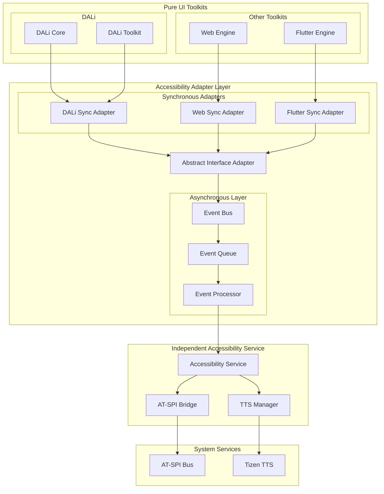

#### 7.1.3 PlantUML 최종 아키텍처 다이어그램
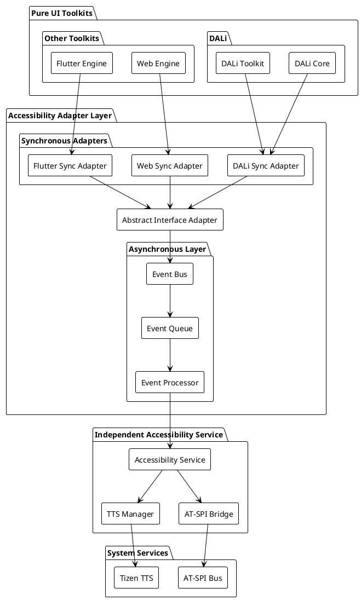

### 7.2 핵심 설계 원칙

#### 7.2.1 분리의 원칙 (Separation of Concerns)
- **UI Toolkit 순수성**: DALi Core에서 Accessibility 의존성 완전 제거
- **책임 분리**: 각 계층이 명확한 책임 가짐
- **인터페이스 기반**: 추상 인터페이스로 결합도 최소화

#### 7.2.2 비동기 우선 원칙 (Async-First)
- **UI 응답성**: 모든 Accessibility 처리를 비동기로 전환
