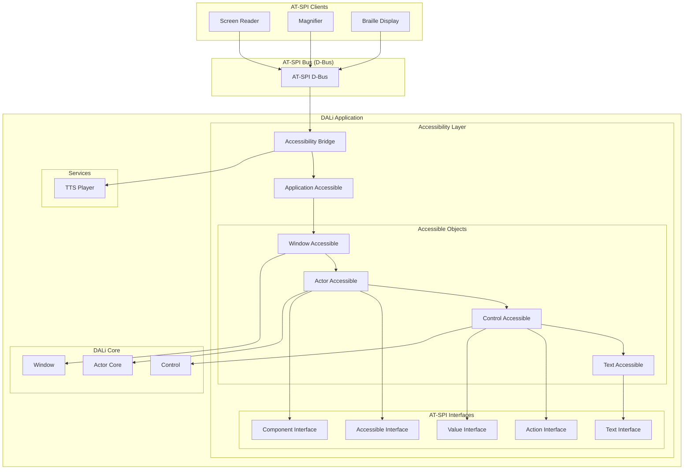
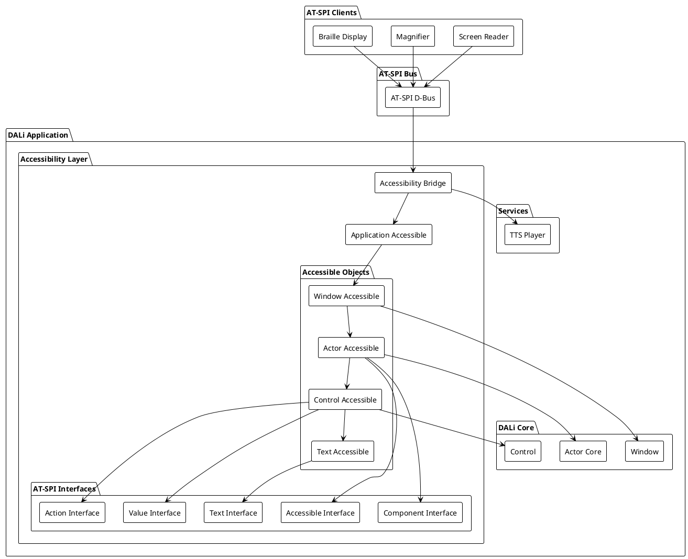
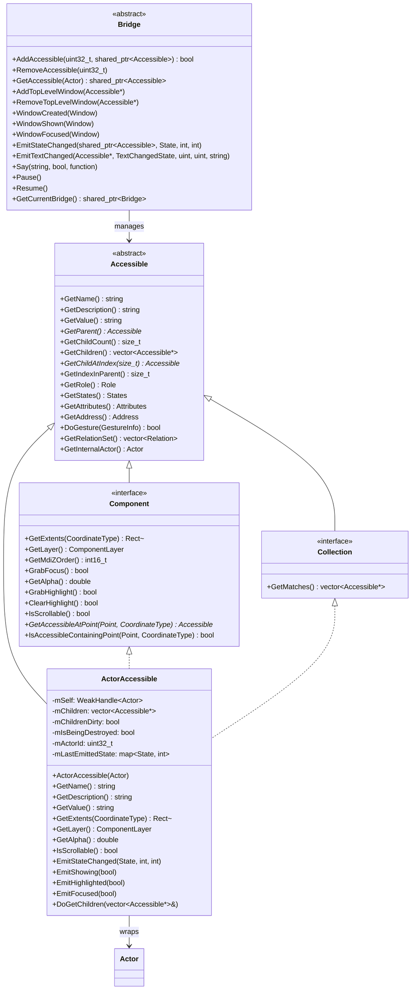
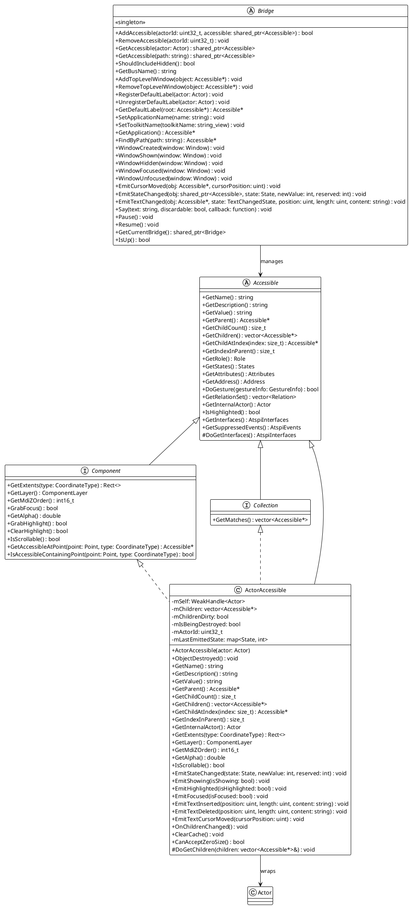
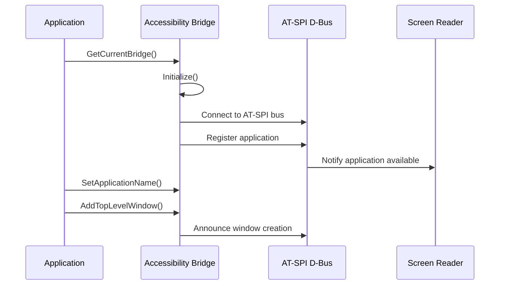
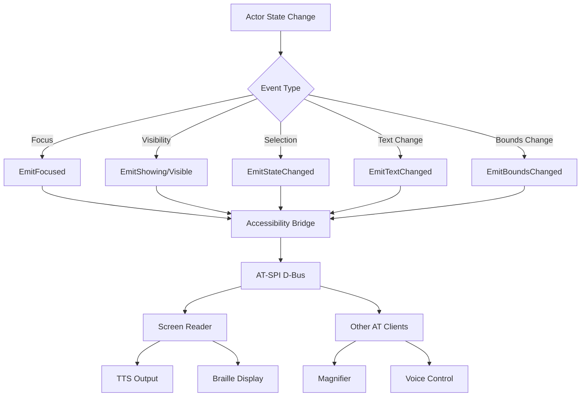
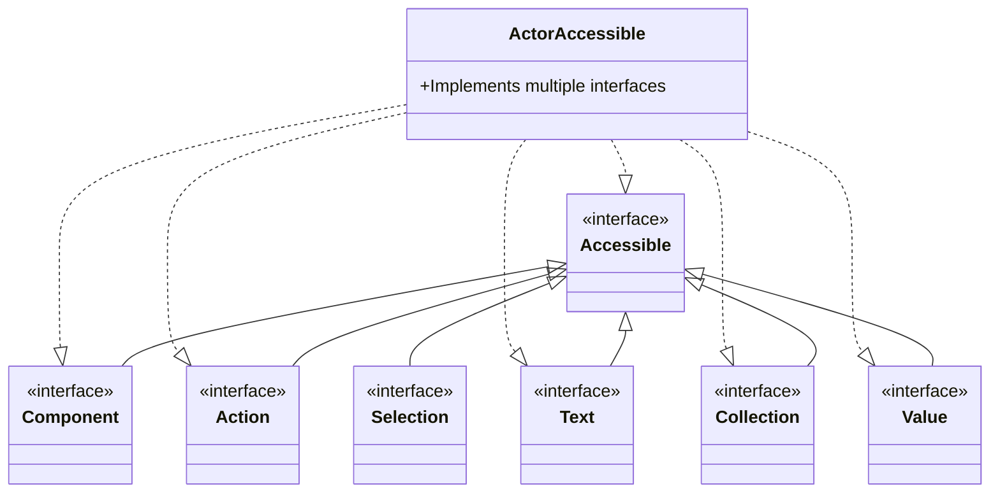

# DALi Accessibility 아키텍처 분석

## 개요

DALi의 Accessibility 시스템은 AT-SPI (Assistive Technology Service Provider Interface) 표준을 기반으로 하여 스크린 리더, 확대경, 점자 디스플레이 등 보조 기술이 UI와 상호작용할 수 있도록 지원하는 통합 프레임워크입니다. 본 문서는 DALi Accessibility의 전체 구조, 동작 방식, 클래스 관계 및 상세 구현을 분석합니다.

## 1. 전체 아키텍처

### 1.1 시스템 구조

DALi Accessibility는 다음과 같은 주요 컴포넌트로 구성됩니다:

- **Accessibility Bridge**: AT-SPI 버스와의 통신을 관리하는 핵심 브릿지
- **Accessible Objects**: UI 요소를 나타내는 접근성 객체들
- **AT-SPI Interfaces**: 표준 AT-SPI 인터페이스 구현
- **Actor Integration**: DALi Actor와 Accessibility 객체의 연동
- **TTS Player**: 텍스트 음성 변환 기능

### 1.2 Mermaid 아키텍처 다이어그램



### 1.3 PlantUML 아키텍처 다이어그램



## 2. 핵심 클래스 구조

### 2.1 기본 클래스 계층



### 2.2 PlantUML 클래스 다이어그램



## 3. 주요 컴포넌트 상세 분석

### 3.1 Accessibility Bridge

Accessibility Bridge는 DALi Accessibility 시스템의 핵심으로, 다음과 같은 역할을 수행합니다:

#### 3.1.1 주요 책임
- **AT-SPI 버스 연결 관리**: D-Bus를 통한 AT-SPI 서비스와의 통신
- **객체 등록 및 관리**: 모든 Accessible 객체의 생명주기 관리
- **이벤트 방송**: 상태 변화, 윈도우 이벤트 등을 AT-SPI 클라이언트에 전달
- **TTS 제어**: 텍스트 음성 변환 기능 조율
- **초기화 및 종료**: Accessibility 시스템의 시작/중단 관리

#### 3.1.2 주요 메서드
```cpp
// 객체 관리
virtual bool AddAccessible(uint32_t actorId, std::shared_ptr<Accessible> accessible) = 0;
virtual void RemoveAccessible(uint32_t actorId) = 0;
virtual std::shared_ptr<Accessible> GetAccessible(Actor actor) const = 0;

// 윈도우 관리
virtual void AddTopLevelWindow(Accessible* object) = 0;
virtual void RemoveTopLevelWindow(Accessible* object) = 0;
virtual void WindowCreated(Window window) = 0;
virtual void WindowShown(Window window) = 0;

// 이벤트 방송
virtual void EmitStateChanged(std::shared_ptr<Accessible> obj, State state, int newValue, int reserved = 0) = 0;
virtual void EmitTextChanged(Accessible* obj, TextChangedState state, unsigned int position, unsigned int length, const std::string& content) = 0;

// TTS 제어
virtual void Say(const std::string& text, bool discardable, std::function<void(std::string)> callback) = 0;
virtual void Pause() = 0;
virtual void Resume() = 0;
```

### 3.2 Accessible 기본 클래스

Accessible는 모든 접근성 객체의 기반이 되는 추상 클래스입니다.

#### 3.2.1 핵심 속성
- **Name**: 객체의 식별 이름
- **Description**: 객체의 상세 설명
- **Role**: 객체의 역할 (버튼, 레이블, 텍스트 등)
- **States**: 객체의 현재 상태들 (활성, 포커스, 선택 등)
- **Attributes**: 추가 속성 정보

#### 3.2.2 주요 역할 (Role) 열거형
```cpp
enum class Role : uint32_t {
    INVALID, ACCELERATOR_LABEL, ALERT, ANIMATION, ARROW, CALENDAR, CANVAS,
    CHECK_BOX, COMBO_BOX, DIALOG, FRAME, LABEL, LIST, MENU, MENU_ITEM,
    PROGRESS_BAR, PUSH_BUTTON, RADIO_BUTTON, SCROLL_BAR, SLIDER, TABLE,
    TEXT, WINDOW, UNKNOWN, // ... 더 많은 역할들
    MAX_COUNT
};
```

#### 3.2.3 주요 상태 (State) 열거형
```cpp
enum class State : uint32_t {
    INVALID, ACTIVE, ARMED, BUSY, CHECKED, COLLAPSED, DEFUNCT,
    EDITABLE, ENABLED, EXPANDABLE, EXPANDED, FOCUSABLE, FOCUSED,
    HORIZONTAL, VERTICAL, VISIBLE, SELECTABLE, SELECTED,
    SENSITIVE, SHOWING, // ... 더 많은 상태들
    MAX_COUNT
};
```

### 3.3 ActorAccessible

ActorAccessible는 DALi Actor와 Accessibility 시스템을 연결하는 핵심 클래스입니다.

#### 3.3.1 주요 특징
- **Actor 래핑**: DALi Actor 객체를 Accessible 객체로 변환
- **자동 동기화**: Actor의 상태 변화를 Accessibility 이벤트로 변환
- **계층 구조 관리**: Actor 트리를 Accessibility 트리로 매핑
- **이벤트 방송**: 상태 변화를 AT-SPI 버스에 전달

#### 3.3.2 상태 동기화 메커니즘
```cpp
// 상태 변화 이벤트 방송
void EmitStateChanged(State state, int newValue, int reserved = 0);

// 특정 상태들에 대한 이벤트
void EmitShowing(bool isShowing);
void EmitVisible(bool isVisible);
void EmitHighlighted(bool isHighlighted);
void EmitFocused(bool isFocused);

// 텍스트 관련 이벤트
void EmitTextInserted(unsigned int position, unsigned int length, const std::string& content);
void EmitTextDeleted(unsigned int position, unsigned int length, const std::string& content);
void EmitTextCursorMoved(unsigned int cursorPosition);
```

### 3.4 Component 인터페이스

Component는 화면 좌표를 가진 객체들을 위한 인터페이스입니다.

#### 3.4.1 주요 기능
- **위치 및 크기 정보**: 화면 좌표계에서의 객체 위치와 크기
- **포커스 관리**: 포커스 획득 및 해제
- **하이라이트 관리**: 시각적 강조 표시
- **스크롤 지원**: 스크롤 가능 여부 확인

#### 3.4.2 좌표계 타입
```cpp
enum class CoordinateType {
    SCREEN, ///< 화면 좌표계
    WINDOW  ///< 윈도우 좌표계
};
```

## 4. 동작 방식

### 4.1 초기화 과정



### 4.2 객체 생성 및 등록

```mermaid
sequenceDiagram
    participant Actor as DALi Actor
    participant Acc as ActorAccessible
    participant Bridge as Accessibility Bridge
    participant DBus as AT-SPI D-Bus
    
    Actor->>Acc: ActorAccessible(actor)
    Acc->>Acc: Initialize with Actor properties
    Acc->>Bridge: AddAccessible(actorId, accessible)
    Bridge->>Bridge: Register in internal map
    Bridge->>DBus: Register object path
    Note over Acc: Monitor Actor state changes
    Actor->>Acc: State change notification
    Acc->>Bridge: EmitStateChanged()
    Bridge->>DBus: Broadcast state change
```

### 4.3 이벤트 처리 흐름



## 5. AT-SPI 인터페이스 구현

### 5.1 지원되는 인터페이스

DALi는 다음 AT-SPI 인터페이스들을 구현합니다:

```cpp
enum class AtspiInterface {
    ACCESSIBLE,           ///< 기본 접근성 인터페이스
    ACTION,              ///< 액션 수행 인터페이스
    APPLICATION,         ///< 애플리케이션 인터페이스
    CACHE,               ///< 캐시 인터페이스
    COLLECTION,          ///< 컬렉션 쿼리 인터페이스
    COMPONENT,           ///< 화면 좌표 인터페이스
    DOCUMENT,            ///< 문서 인터페이스
    EDITABLE_TEXT,       ///< 편집 가능 텍스트 인터페이스
    HYPERLINK,           ///< 하이퍼링크 인터페이스
    HYPERTEXT,           ///< 하이퍼텍스트 인터페이스
    IMAGE,               ///< 이미지 인터페이스
    SELECTION,           ///< 선택 인터페이스
    TABLE,               ///< 테이블 인터페이스
    TABLE_CELL,          ///< 테이블 셀 인터페이스
    TEXT,                ///< 텍스트 인터페이스
    VALUE,               ///< 값 인터페이스
    MAX_COUNT
};
```

### 5.2 인터페이스 상속 관계



## 6. 데이터 구조 및 타입

### 6.1 핵심 데이터 타입

#### 6.1.1 Address
```cpp
class Address {
    std::string mBus;   ///< D-Bus 버스 이름
    std::string mPath;  ///< 객체 경로
    
public:
    Address(std::string bus, std::string path);
    std::string ToString() const;
    const std::string& GetBus() const;
    const std::string& GetPath() const;
    bool operator==(const Address& a) const;
};
```

#### 6.1.2 States (Bitset)
```cpp
using States = EnumBitSet<State, State::MAX_COUNT>;
```

#### 6.1.3 Attributes
```cpp
using Attributes = std::unordered_map<std::string, std::string>;
```

#### 6.1.4 Relation
```cpp
struct Relation {
    RelationType mRelationType;
    std::vector<Accessible*> mTargets;
};
```

### 6.2 이벤트 타입

#### 6.2.1 WindowEvent
```cpp
enum class WindowEvent {
    PROPERTY_CHANGE, MINIMIZE, MAXIMIZE, RESTORE, CLOSE,
    CREATE, REPARENT, DESKTOP_CREATE, DESKTOP_DESTROY,
    DESTROY, ACTIVATE, DEACTIVATE, RAISE, LOWER,
    MOVE, RESIZE, SHADE, UU_SHADE, RESTYLE, POST_RENDER
};
```

#### 6.2.2 AtspiEvent
```cpp
enum class AtspiEvent {
    PROPERTY_CHANGED, BOUNDS_CHANGED, LINK_SELECTED,
    STATE_CHANGED, CHILDREN_CHANGED, VISIBLE_DATA_CHANGED,
    SELECTION_CHANGED, TEXT_CHANGED, TEXT_CARET_MOVED,
    WINDOW_CHANGED, SCROLL_STARTED, SCROLL_FINISHED
};
```

## 7. 성능 최적화

### 7.1 캐싱 전략

- **인터페이스 캐싱**: GetInterfaces() 결과를 캐싱하여 반복 계산 방지
- **자식 객체 캐싱**: mChildrenDirty 플래그로 변경 시만 업데이트
- **상태 캐싱**: mLastEmittedState로 중복 이벤트 방지

### 7.2 지연 로딩

- **객체 생성**: 필요한 시점에만 Accessible 객체 생성
- **속성 계산**: 요청 시점에만 속성 값 계산
- **인터페이스 확인**: dynamic_cast를 통한 지연 인터페이스 확인

### 7.3 메모리 관리

- **WeakHandle**: Actor와의 순환 참조 방지
- **shared_ptr**: 자동 메모리 관리
- **Bridge 등록/해제**: 객체 생명주기 자동 관리

## 8. 확장성 및 커스터마이징

### 8.1 외부 Accessible 등록

```cpp
// 외부 Accessible 객체 등록 함수
static void RegisterExternalAccessibleGetter(
    std::function<std::pair<std::shared_ptr<Accessible>, bool>(Dali::Actor)> functor
);
```

### 8.2 커스텀 ActorAccessible

```cpp
class CustomActorAccessible : public ActorAccessible {
protected:
    void DoGetChildren(std::vector<Accessible*>& children) override {
        // 커스텀 자식 객체 로직
        ActorAccessible::DoGetChildren(children);
        
        // 추가적인 자식 객체들
        for (auto& customChild : mCustomChildren) {
            children.push_back(customChild.get());
        }
    }
    
public:
    std::string GetName() const override {
        // 커스텀 이름 로직
        return ActorAccessible::GetName() + " (Custom)";
    }
};
```

### 8.3 이벤트 억제

```cpp
// 특정 이벤트 억제
AtspiEvents& GetSuppressedEvents();
accessible->GetSuppressedEvents()[AtspiEvent::STATE_CHANGED] = true;
```

## 9. 플랫폼 통합

### 9.1 Tizen Wayland 통합

- **TTS Player**: Tizen TTS 서비스와 통합
- **Window System**: Wayland 윈도우 관리
- **Input System**: 키보드/터치 이벤트 처리

### 9.2 D-Bus 통신

- **AT-SPI 서비스**: 표준 AT-SPI D-Bus 인터페이스 구현
- **객체 등록**: D-Bus 객체 경로 자동 관리
- **이벤트 방송**: 비동기 이벤트 전달

## 10. 디버깅 및 테스트

### 10.1 트리 덤프 기능

```cpp
enum class DumpDetailLevel {
    DUMP_SHORT,              ///< 간단한 정보만
    DUMP_SHORT_SHOWING_ONLY, ///< 표시 중인 객체만
    DUMP_FULL,               ///< 전체 정보
    DUMP_FULL_SHOWING_ONLY   ///< 표시 중인 객체의 전체 정보
};

std::string DumpTree(DumpDetailLevel detailLevel);
```

### 10.2 로깅 및 모니터링

- **이벤트 로깅**: 모든 AT-SPI 이벤트 기록
- **상태 추적**: 객체 상태 변화 모니터링
- **성능 측정**: 이벤트 처리 시간 측정

## 11. 결론

DALi Accessibility 시스템은 AT-SPI 표준을 완벽하게 준수하면서도 DALi의 Actor 기반 아키텍처와 자연스럽게 통합되는 잘 설계된 프레임워크입니다. 주요 특징은 다음과 같습니다:

### 11.1 장점

1. **표준 준수**: AT-SPI 2.0 표준 완전 구현
2. **자동 통합**: DALi Actor와의 자동 동기화
3. **확장성**: 커스텀 Accessible 객체 쉽게 추가 가능
4. **성능**: 캐싱과 지연 로딩으로 최적화
5. **안정성**: 강력한 메모리 관리와 오류 처리

### 11.2 활용 사례

- **스크린 리더**: 시각 장애인을 위한 화면 읽기
- **확대경**: 저시력자를 위한 화면 확대
- **점자 디스플레이**: 점자 정보 출력
- **음성 제어**: 음성으로 UI 조작
- **자동화 테스트**: 접근성 테스트 자동화

### 11.3 향후 발전 방향

1. **더 많은 AT-SPI 인터페이스 지원**
2. **향상된 성능 최적화**
3. **더 나은 디버깅 도구**
4. **플랫폼 간 호환성 향상**
5. **AI 기반 접근성 기능 통합**

DALi Accessibility는 현대적인 애플리케이션의 접근성 요구사항을 충족시키는 강력하고 유연한 솔루션입니다.
