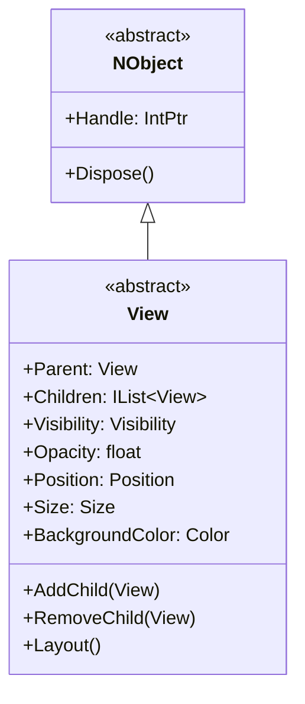
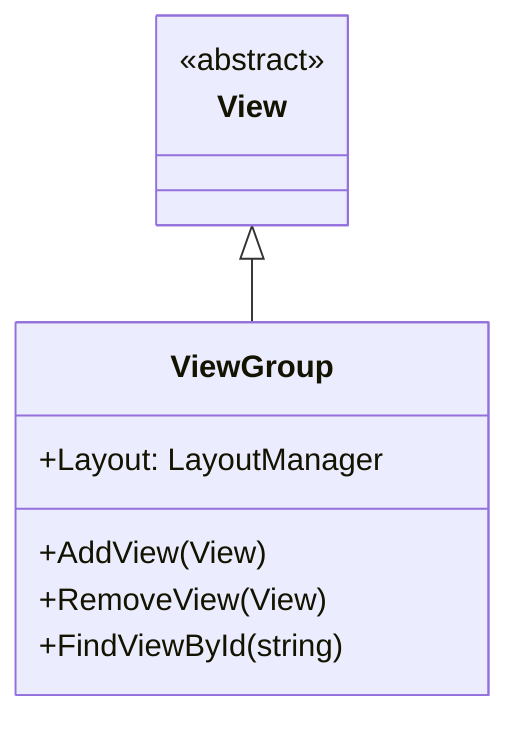
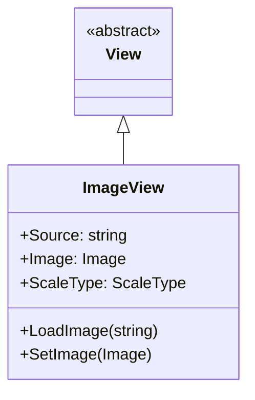
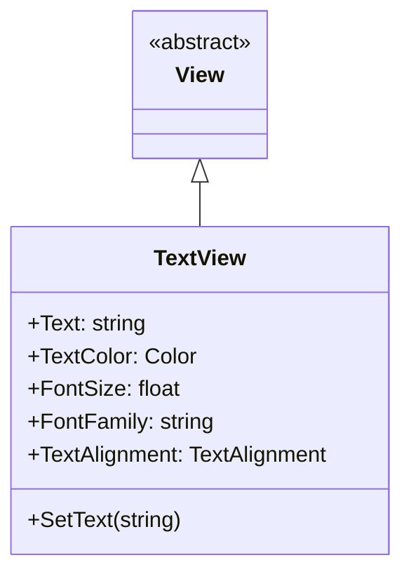
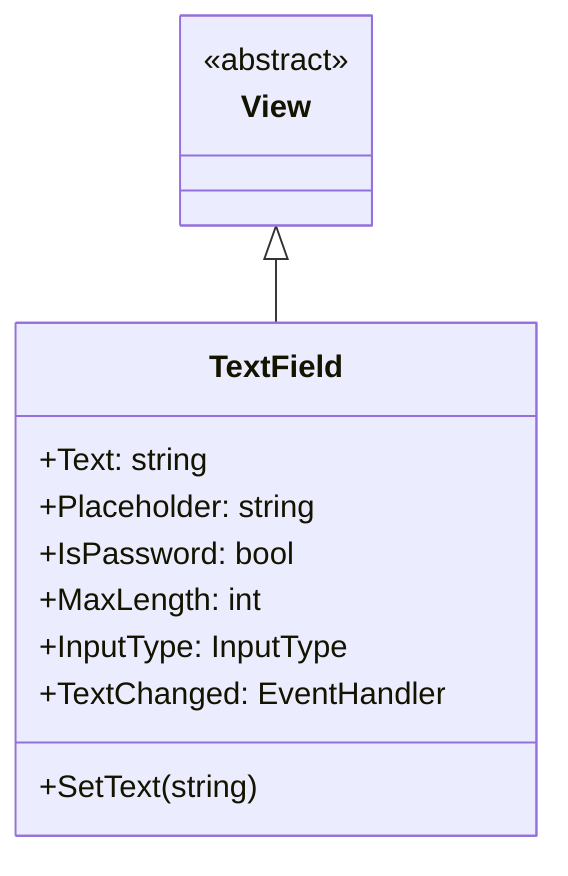
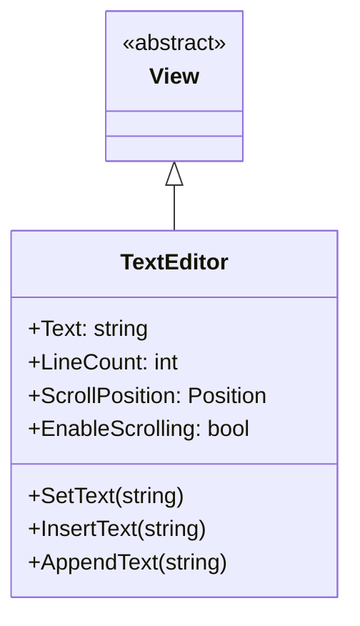
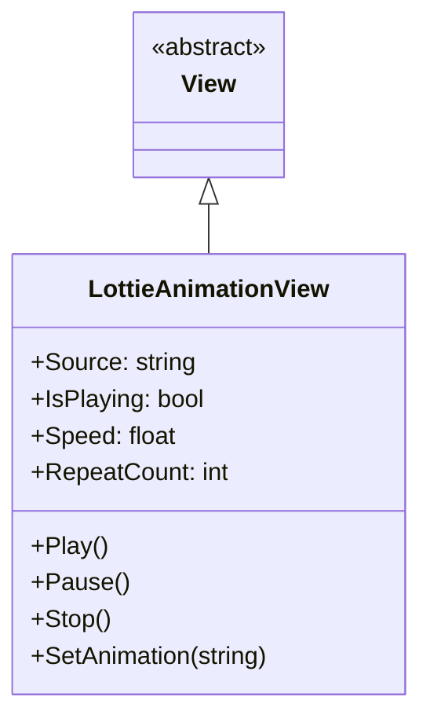
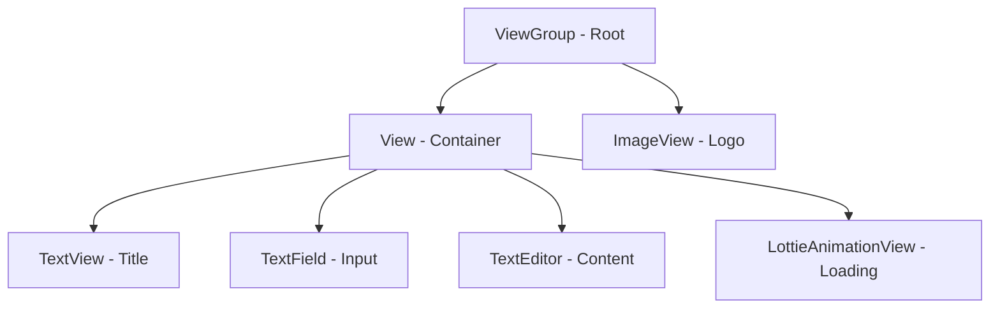
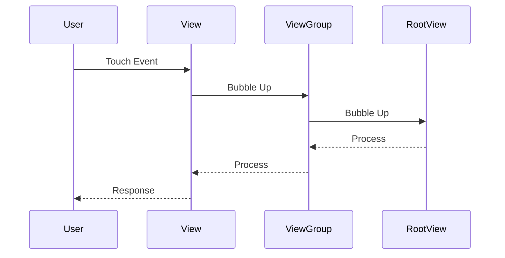

# Tizen.UI/src/core 컴포넌트

## 소개

Tizen.UI/src/core는 Tizen.UI.Components의 가장 기본적인 UI 컴포넌트들이 위치하는 계층입니다. 이 계층의 컴포넌트들은 단일 책임 원칙을 따르며, 최소한의 기능만을 제공하여 높은 성능과 안정성을 보장합니다.

## 주요 컴포넌트

### 1. View 컴포넌트

**설명**: 모든 UI 컴포넌트의 기본 클래스

**상속 관계**:


**주요 속성**:
- **Parent**: 부모 뷰
- **Children**: 자식 뷰 목록
- **Visibility**: 표시 여부
- **Opacity**: 투명도
- **Position**: 위치
- **Size**: 크기
- **BackgroundColor**: 배경색

**주요 메서드**:
- **AddChild(View)**: 자식 뷰 추가
- **RemoveChild(View)**: 자식 뷰 제거
- **Layout()**: 레이아웃 계산

**사용 예제**:
```csharp
// 기본 뷰 생성
var view = new View()
{
    Size = new Size(100, 100),
    Position = new Position(50, 50),
    BackgroundColor = Color.Blue
};

// 부모 뷰에 추가
parentView.AddChild(view);
```

### 2. ViewGroup 컴포넌트

**설명**: 다른 뷰들을 포함할 수 있는 컨테이너

**상속 관계**:


**주요 속성**:
- **Layout**: 레이아웃 관리자
- **ChildCount**: 자식 뷰 개수

**주요 메서드**:
- **AddView(View)**: 뷰 추가
- **RemoveView(View)**: 뷰 제거
- **FindViewById(string)**: ID로 뷰 찾기

**사용 예제**:
```csharp
// 뷰 그룹 생성
var viewGroup = new ViewGroup();

// 자식 뷰 추가
var childView = new View();
viewGroup.AddView(childView);

// 레이아웃 설정
viewGroup.Layout = new LinearLayout();
```

### 3. ImageView 컴포넌트

**설명**: 이미지를 표시하는 컴포넌트

**상속 관계**:


**주요 속성**:
- **Source**: 이미지 소스 경로
- **Image**: 표시할 이미지 객체
- **ScaleType**: 이미지 스케일 타입

**주요 메서드**:
- **LoadImage(string)**: 경로에서 이미지 로드
- **SetImage(Image)**: 이미지 객체 설정

**사용 예제**:
```csharp
// 이미지 뷰 생성
var imageView = new ImageView()
{
    Source = "res/images/sample.png",
    ScaleType = ScaleType.FitCenter
};

// 이미지 로드
imageView.LoadImage("res/images/icon.png");
```

### 4. TextView 컴포넌트

**설명**: 텍스트를 표시하는 컴포넌트

**상속 관계**:


**주요 속성**:
- **Text**: 표시할 텍스트
- **TextColor**: 텍스트 색상
- **FontSize**: 폰트 크기
- **FontFamily**: 폰트 패밀리
- **TextAlignment**: 텍스트 정렬

**주요 메서드**:
- **SetText(string)**: 텍스트 설정

**사용 예제**:
```csharp
// 텍스트 뷰 생성
var textView = new TextView()
{
    Text = "Hello, World!",
    TextColor = Color.Black,
    FontSize = 16.0f,
    TextAlignment = TextAlignment.Center
};
```

### 5. TextField 컴포넌트

**설명**: 텍스트 입력을 받는 컴포넌트

**상속 관계**:


**주요 속성**:
- **Text**: 입력된 텍스트
- **Placeholder**: 플레이스홀더 텍스트
- **IsPassword**: 비밀번호 입력 모드
- **MaxLength**: 최대 입력 길이
- **InputType**: 입력 타입

**주요 이벤트**:
- **TextChanged**: 텍스트 변경 이벤트

**사용 예제**:
```csharp
// 텍스트 필드 생성
var textField = new TextField()
{
    Placeholder = "Enter your name",
    MaxLength = 50,
    InputType = InputType.Text
};

// 텍스트 변경 이벤트 핸들러
textField.TextChanged += (sender, e) => {
    Console.WriteLine($"Text changed: {textField.Text}");
};
```

### 6. TextEditor 컴포넌트

**설명**: 다중 라인 텍스트 편집기

**상속 관계**:


**주요 속성**:
- **Text**: 편집된 텍스트
- **LineCount**: 라인 수
- **ScrollPosition**: 스크롤 위치
- **EnableScrolling**: 스크롤 가능 여부

**주요 메서드**:
- **SetText(string)**: 텍스트 설정
- **InsertText(string)**: 텍스트 삽입
- **AppendText(string)**: 텍스트 추가

**사용 예제**:
```csharp
// 텍스트 에디터 생성
var textEditor = new TextEditor()
{
    EnableScrolling = true
};

// 텍스트 설정
textEditor.SetText("First line\nSecond line\nThird line");
```

### 7. LottieAnimationView 컴포넌트

**설명**: Lottie 애니메이션을 표시하는 컴포넌트

**상속 관계**:


**주요 속성**:
- **Source**: 애니메이션 파일 경로
- **IsPlaying**: 재생 중 여부
- **Speed**: 재생 속도
- **RepeatCount**: 반복 횟수

**주요 메서드**:
- **Play()**: 애니메이션 재생
- **Pause()**: 애니메이션 일시정지
- **Stop()**: 애니메이션 정지
- **SetAnimation(string)**: 애니메이션 설정

**사용 예제**:
```csharp
// Lottie 애니메이션 뷰 생성
var lottieView = new LottieAnimationView()
{
    Source = "res/animations/loading.json",
    RepeatCount = -1 // 무한 반복
};

// 애니메이션 재생
lottieView.Play();
```

## 컴포넌트 간 상호작용

### 1. 뷰 계층 구조



### 2. 이벤트 전파



## 성능 최적화

### 1. 뷰 재사용

```csharp
// 뷰 풀링을 통한 성능 최적화
public class ViewPool
{
    private readonly Queue<View> _pool = new Queue<View>();
    
    public View GetView()
    {
        if (_pool.Count > 0)
        {
            return _pool.Dequeue();
        }
        return new View();
    }
    
    public void ReturnView(View view)
    {
        view.Reset(); // 상태 초기화
        _pool.Enqueue(view);
    }
}
```

### 2. 레이아웃 최적화

```csharp
// 레이아웃 요청 최소화
public class OptimizedView : View
{
    private bool _layoutRequested = false;
    
    public override void RequestLayout()
    {
        if (!_layoutRequested)
        {
            _layoutRequested = true;
            base.RequestLayout();
        }
    }
    
    public override void Layout()
    {
        _layoutRequested = false;
        // 레이아웃 계산
        base.Layout();
    }
}
```

## 접근성 지원

### 1. 스크린 리더 지원

```csharp
// 접근성 정보 제공
public class AccessibleView : View
{
    public string AccessibilityName { get; set; }
    public string AccessibilityDescription { get; set; }
    public bool IsAccessibilityFocusable { get; set; }
    
    public override string GetAccessibilityName()
    {
        return AccessibilityName ?? base.GetAccessibilityName();
    }
    
    public override string GetAccessibilityDescription()
    {
        return AccessibilityDescription ?? base.GetAccessibilityDescription();
    }
}
```

### 2. 키보드 내비게이션

```csharp
// 키보드 포커스 지원
public class FocusableView : View
{
    public View NextFocus { get; set; }
    public View PreviousFocus { get; set; }
    public bool IsFocusable { get; set; } = true;
    
    public virtual bool RequestFocus()
    {
        if (!IsFocusable) return false;
        // 포커스 요청 처리
        return true;
    }
}
```

## 결론

Tizen.UI/src/core의 컴포넌트들은 UI 프레임워크의 기반이 되는 핵심 요소들입니다. 이들은 다음과 같은 특징을 가지고 있습니다:

1. **단순성**: 최소한의 기능만을 제공하여 복잡도를 최소화
2. **성능**: 하드웨어 가속을 통한 고성능 렌더링
3. **확장성**: 상속을 통한 기능 확장 가능
4. **안정성**: 검증된 기반 위에 구축된 신뢰성 있는 컴포넌트들

이러한 코어 컴포넌트들은 상위 계층의 복합 컴포넌트들이 기능을 구현하는 데 사용되며, 전체 UI 시스템의 성능과 안정성을 보장합니다.
