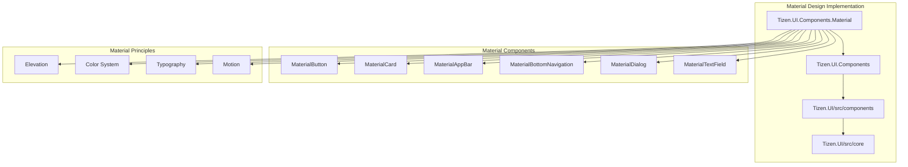
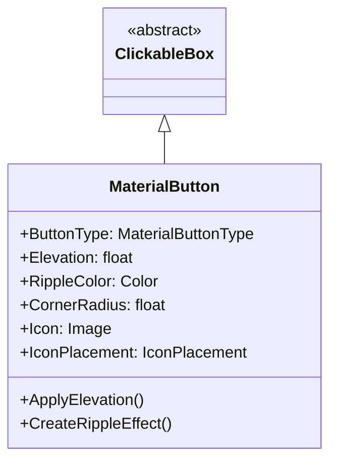
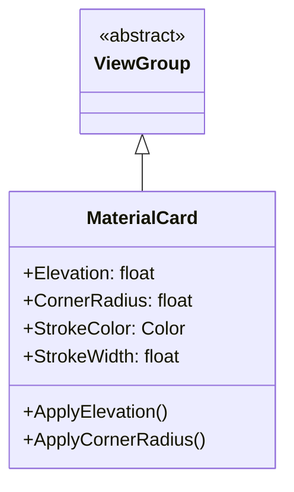
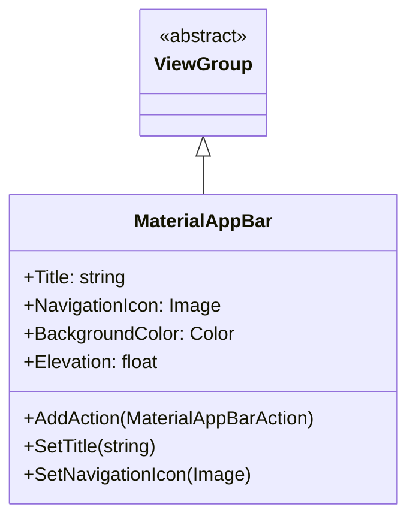
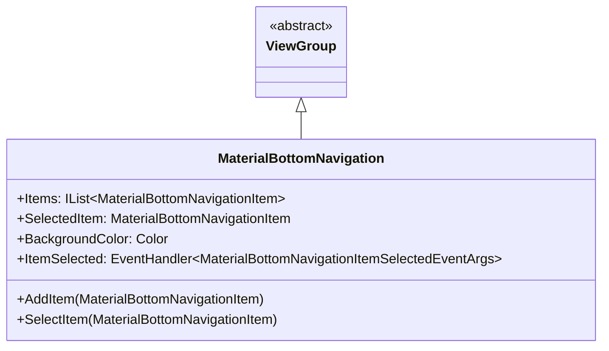
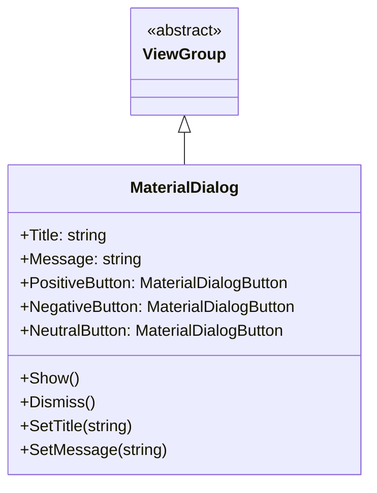
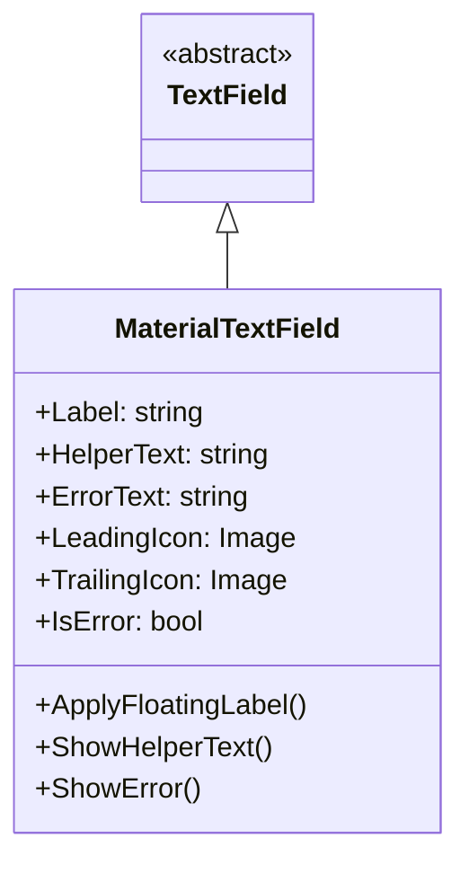

# Tizen.UI.Components.Material 구현체

## 소개

Tizen.UI.Components.Material은 Google의 Material Design 가이드라인을 따르는 UI 컴포넌트 구현체입니다. 이 구현체는 Material Design의 시각적 언어, 모션, 상호작용 패턴을 Tizen 플랫폼에 적용하여 일관되고 현대적인 사용자 인터페이스를 제공합니다.

## 아키텍처



## 주요 특징

### 1. Material Design 원칙 적용

**Elevation (표현도)**:
- 컴포넌트의 깊이와 계층 구조를 시각적으로 표현
- 그림자와 블러 효과를 통해 3D 공간감 제공

**Color System (색상 시스템)**:
- Primary, Secondary, Surface, Background, Error 색상 계층
- 다크 모드 및 라이트 모드 지원
- 접근성을 고려한 색상 대비

**Typography (타이포그래피)**:
- 제품 산스(Product Sans) 기반의 타이포그래피 시스템
- Heading, Subheading, Body, Caption 등 계층적 텍스트 스타일

**Motion (모션)**:
- 자연스러운 애니메이션과 전환 효과
- 물리 기반의 모션 원리 적용

## 주요 컴포넌트

### 1. MaterialButton

**설명**: Material Design 버튼 컴포넌트

**상속 관계**:


**버튼 타입**:
- **Filled Button**: 기본적인 강조 버튼
- **Outlined Button**: 테두리가 있는 버튼
- **Text Button**: 텍스트만 있는 버튼
- **Icon Button**: 아이콘만 있는 버튼

**사용 예제**:
```csharp
// Filled Button 생성
var filledButton = new MaterialButton()
{
    Text = "Filled Button",
    ButtonType = MaterialButtonType.Filled,
    BackgroundColor = MaterialColors.Primary,
    TextColor = MaterialColors.OnPrimary,
    CornerRadius = 4
};

// Outlined Button 생성
var outlinedButton = new MaterialButton()
{
    Text = "Outlined Button",
    ButtonType = MaterialButtonType.Outlined,
    BorderColor = MaterialColors.Primary,
    BorderWidth = 1,
    TextColor = MaterialColors.Primary,
    CornerRadius = 4
};

// Text Button 생성
var textButton = new MaterialButton()
{
    Text = "Text Button",
    ButtonType = MaterialButtonType.Text,
    TextColor = MaterialColors.Primary
};

// Icon Button 생성
var iconButton = new MaterialButton()
{
    Icon = new Image("res/icons/favorite.png"),
    ButtonType = MaterialButtonType.Icon,
    IconColor = MaterialColors.Primary
};
```

### 2. MaterialCard

**설명**: Material Design 카드 컴포넌트

**상속 관계**:


**주요 속성**:
- **Elevation**: 카드의 표현도 (0-24dp)
- **CornerRadius**: 모서리 둥글기 정도
- **StrokeColor/StrokeWidth**: 테두리 색상 및 두께

**사용 예제**:
```csharp
// Material Card 생성
var card = new MaterialCard()
{
    Elevation = 8,
    CornerRadius = 8,
    BackgroundColor = MaterialColors.Surface,
    Size = new Size(300, 200)
};

// 카드 내용 구성
var layout = new LinearLayout()
{
    Orientation = Orientation.Vertical,
    Padding = new Thickness(16)
};

var title = new TextView()
{
    Text = "Card Title",
    FontSize = MaterialTypography.Headline6.FontSize,
    TextColor = MaterialColors.OnSurface
};

var content = new TextView()
{
    Text = "This is card content with some description.",
    FontSize = MaterialTypography.Body2.FontSize,
    TextColor = MaterialColors.OnSurfaceVariant,
    Margin = new Thickness(0, 8, 0, 16)
};

var actionButton = new MaterialButton()
{
    Text = "Action",
    ButtonType = MaterialButtonType.Text,
    TextColor = MaterialColors.Primary
};

layout.AddChild(title);
layout.AddChild(content);
layout.AddChild(actionButton);

card.AddChild(layout);
```

### 3. MaterialAppBar

**설명**: Material Design 앱 바 컴포넌트

**상속 관계**:


**주요 속성**:
- **Title**: 앱 바 제목
- **NavigationIcon**: 네비게이션 아이콘
- **BackgroundColor**: 배경색
- **Elevation**: 표현도

**사용 예제**:
```csharp
// Material App Bar 생성
var appBar = new MaterialAppBar()
{
    Title = "My App",
    BackgroundColor = MaterialColors.Primary,
    Elevation = 4
};

// 네비게이션 아이콘 설정
appBar.SetNavigationIcon(new Image("res/icons/menu.png"));

// 액션 아이템 추가
var searchAction = new MaterialAppBarAction()
{
    Icon = new Image("res/icons/search.png"),
    Tooltip = "Search"
};

var moreAction = new MaterialAppBarAction()
{
    Icon = new Image("res/icons/more_vert.png"),
    Tooltip = "More options"
};

appBar.AddAction(searchAction);
appBar.AddAction(moreAction);

// 액션 이벤트 핸들러
searchAction.Clicked += (sender, e) => {
    Console.WriteLine("Search clicked");
};

moreAction.Clicked += (sender, e) => {
    Console.WriteLine("More options clicked");
};
```

### 4. MaterialBottomNavigation

**설명**: Material Design 하단 네비게이션 컴포넌트

**상속 관계**:


**사용 예제**:
```csharp
// 하단 네비게이션 생성
var bottomNav = new MaterialBottomNavigation()
{
    BackgroundColor = MaterialColors.Surface
};

// 네비게이션 아이템 추가
var homeItem = new MaterialBottomNavigationItem()
{
    Icon = new Image("res/icons/home.png"),
    SelectedIcon = new Image("res/icons/home_filled.png"),
    Label = "Home"
};

var favoritesItem = new MaterialBottomNavigationItem()
{
    Icon = new Image("res/icons/favorite.png"),
    SelectedIcon = new Image("res/icons/favorite_filled.png"),
    Label = "Favorites"
};

var profileItem = new MaterialBottomNavigationItem()
{
    Icon = new Image("res/icons/person.png"),
    SelectedIcon = new Image("res/icons/person_filled.png"),
    Label = "Profile"
};

bottomNav.AddItem(homeItem);
bottomNav.AddItem(favoritesItem);
bottomNav.AddItem(profileItem);

// 아이템 선택 이벤트
bottomNav.ItemSelected += (sender, e) => {
    switch (e.SelectedItem.Label)
    {
        case "Home":
            NavigateToHome();
            break;
        case "Favorites":
            NavigateToFavorites();
            break;
        case "Profile":
            NavigateToProfile();
            break;
    }
};
```

### 5. MaterialDialog

**설명**: Material Design 다이얼로그 컴포넌트

**상속 관계**:


**사용 예제**:
```csharp
// 다이얼로그 생성
var dialog = new MaterialDialog()
{
    Title = "Confirm Action",
    Message = "Are you sure you want to delete this item?"
};

// 버튼 설정
dialog.PositiveButton = new MaterialDialogButton()
{
    Text = "Delete",
    ButtonType = MaterialButtonType.Text
};

dialog.NegativeButton = new MaterialDialogButton()
{
    Text = "Cancel",
    ButtonType = MaterialButtonType.Text
};

// 버튼 이벤트 핸들러
dialog.PositiveButton.Clicked += (sender, e) => {
    // 삭제 로직
    DeleteItem();
    dialog.Dismiss();
};

dialog.NegativeButton.Clicked += (sender, e) => {
    dialog.Dismiss();
};

// 다이얼로그 표시
dialog.Show();
```

### 6. MaterialTextField

**설명**: Material Design 텍스트 필드 컴포넌트

**상속 관계**:


**사용 예제**:
```csharp
// Material 텍스트 필드 생성
var textField = new MaterialTextField()
{
    Label = "Email Address",
    Placeholder = "Enter your email",
    HelperText = "We'll never share your email with anyone else",
    LeadingIcon = new Image("res/icons/email.png")
};

// 유효성 검사
textField.TextChanged += (sender, e) => {
    if (!IsValidEmail(textField.Text))
    {
        textField.IsError = true;
        textField.ErrorText = "Please enter a valid email address";
    }
    else
    {
        textField.IsError = false;
        textField.ErrorText = "";
    }
};
```

## 색상 시스템

### 1. Material 색상 팔레트

```csharp
public static class MaterialColors
{
    // Primary Colors
    public static readonly Color Primary = Color.FromHex("#6200EE");
    public static readonly Color PrimaryVariant = Color.FromHex("#3700B3");
    public static readonly Color OnPrimary = Color.FromHex("#FFFFFF");
    
    // Secondary Colors
    public static readonly Color Secondary = Color.FromHex("#03DAC6");
    public static readonly Color SecondaryVariant = Color.FromHex("#018786");
    public static readonly Color OnSecondary = Color.FromHex("#000000");
    
    // Surface Colors
    public static readonly Color Surface = Color.FromHex("#FFFFFF");
    public static readonly Color OnSurface = Color.FromHex("#000000");
    public static readonly Color OnSurfaceVariant = Color.FromHex("#666666");
    
    // Background Colors
    public static readonly Color Background = Color.FromHex("#FFFFFF");
    public static readonly Color OnBackground = Color.FromHex("#000000");
    
    // Error Colors
    public static readonly Color Error = Color.FromHex("#B00020");
    public static readonly Color OnError = Color.FromHex("#FFFFFF");
}
```

### 2. 다크 모드 지원

```csharp
public class MaterialColorScheme
{
    public Color Primary { get; set; }
    public Color OnPrimary { get; set; }
    public Color Surface { get; set; }
    public Color OnSurface { get; set; }
    // ... 기타 색상
    
    public static MaterialColorScheme Light => new MaterialColorScheme()
    {
        Primary = Color.FromHex("#6200EE"),
        OnPrimary = Color.FromHex("#FFFFFF"),
        Surface = Color.FromHex("#FFFFFF"),
        OnSurface = Color.FromHex("#000000")
    };
    
    public static MaterialColorScheme Dark => new MaterialColorScheme()
    {
        Primary = Color.FromHex("#BB86FC"),
        OnPrimary = Color.FromHex("#000000"),
        Surface = Color.FromHex("#121212"),
        OnSurface = Color.FromHex("#FFFFFF")
    };
}
```

## 타이포그래피 시스템

### 1. Material 타이포그래피 스타일

```csharp
public static class MaterialTypography
{
    public static readonly TextStyle Headline1 = new TextStyle()
    {
        FontSize = 96,
        FontWeight = FontWeight.Light,
        LetterSpacing = -1.5f
    };
    
    public static readonly TextStyle Headline2 = new TextStyle()
    {
        FontSize = 60,
        FontWeight = FontWeight.Light,
        LetterSpacing = -0.5f
    };
    
    public static readonly TextStyle Headline3 = new TextStyle()
    {
        FontSize = 48,
        FontWeight = FontWeight.Normal,
        LetterSpacing = 0
    };
    
    public static readonly TextStyle Headline4 = new TextStyle()
    {
        FontSize = 34,
        FontWeight = FontWeight.Normal,
        LetterSpacing = 0.25f
    };
    
    public static readonly TextStyle Headline5 = new TextStyle()
    {
        FontSize = 24,
        FontWeight = FontWeight.Normal,
        LetterSpacing = 0
    };
    
    public static readonly TextStyle Headline6 = new TextStyle()
    {
        FontSize = 20,
        FontWeight = FontWeight.Medium,
        LetterSpacing = 0.15f
    };
    
    public static readonly TextStyle Subtitle1 = new TextStyle()
    {
        FontSize = 16,
        FontWeight = FontWeight.Normal,
        LetterSpacing = 0.15f
    };
    
    public static readonly TextStyle Subtitle2 = new TextStyle()
    {
        FontSize = 14,
        FontWeight = FontWeight.Medium,
        LetterSpacing = 0.1f
    };
    
    public static readonly TextStyle Body1 = new TextStyle()
    {
        FontSize = 16,
        FontWeight = FontWeight.Normal,
        LetterSpacing = 0.5f
    };
    
    public static readonly TextStyle Body2 = new TextStyle()
    {
        FontSize = 14,
        FontWeight = FontWeight.Normal,
        LetterSpacing = 0.25f
    };
}
```

## 모션 시스템

### 1. 표준 이징 커브

```csharp
public static class MaterialEasing
{
    // 표준 곡선
    public static readonly Easing Standard = Easing.CubicBezier(0.4, 0.0, 0.2, 1.0);
    
    // 감속 곡선
    public static readonly Easing Decelerate = Easing.CubicBezier(0.0, 0.0, 0.2, 1.0);
    
    // 가속 곡선
    public static readonly Easing Accelerate = Easing.CubicBezier(0.4, 0.0, 1.0, 1.0);
    
    // 터치 곡선
    public static readonly Easing Emphasized = Easing.CubicBezier(0.2, 0.0, 0.0, 1.0);
}
```

### 2. 표준 지속 시간

```csharp
public static class MaterialDuration
{
    public static readonly int Short1 = 75;   // 들어오기
    public static readonly int Short2 = 150;  // 나가기
    public static readonly int Medium1 = 150; // 들어오기
    public static readonly int Medium2 = 200; // 나가기
    public static readonly int Long1 = 200;   // 들어오기
    public static readonly int Long2 = 300;   // 나가기
    public static readonly int ExtraLong1 = 300; // 들어오기
    public static readonly int ExtraLong2 = 400; // 나가기
}
```

## 테마 시스템

### 1. 테마 적용

```csharp
public class MaterialTheme : ITheme
{
    public MaterialColorScheme ColorScheme { get; set; }
    public MaterialTypography Typography { get; set; }
    public MaterialShape Shape { get; set; }
    
    public void ApplyTheme(View view)
    {
        // 뷰에 테마 적용
        if (view is MaterialButton button)
        {
            ApplyButtonTheme(button);
        }
        else if (view is MaterialCard card)
        {
            ApplyCardTheme(card);
        }
        // ... 기타 컴포넌트들
    }
    
    private void ApplyButtonTheme(MaterialButton button)
    {
        button.BackgroundColor = ColorScheme.Primary;
        button.TextColor = ColorScheme.OnPrimary;
        // ... 기타 스타일 적용
    }
    
    private void ApplyCardTheme(MaterialCard card)
    {
        card.BackgroundColor = ColorScheme.Surface;
        card.Elevation = 1;
        // ... 기타 스타일 적용
    }
}
```

### 2. 동적 테마 변경

```csharp
public class ThemeManager
{
    private static ThemeManager _instance;
    public static ThemeManager Instance => _instance ??= new ThemeManager();
    
    public event EventHandler<ThemeChangedEventArgs> ThemeChanged;
    
    private ITheme _currentTheme;
    public ITheme CurrentTheme
    {
        get => _currentTheme;
        set
        {
            _currentTheme = value;
            ThemeChanged?.Invoke(this, new ThemeChangedEventArgs(value));
        }
    }
    
    public void ToggleDarkMode()
    {
        CurrentTheme = CurrentTheme is MaterialLightTheme 
            ? (ITheme)new MaterialDarkTheme() 
            : new MaterialLightTheme();
    }
}
```

## 결론

Tizen.UI.Components.Material은 Google의 Material Design 가이드라인을 충실히 구현하여 다음과 같은 이점을 제공합니다:

1. **일관성**: Material Design 원칙에 따라 일관된 UI/UX 제공
2. **현대성**: 최신 디자인 트렌드 반영
3. **접근성**: WCAG 기준을 고려한 접근성 지원
4. **유연성**: 테마 시스템을 통한 커스터마이징 가능
5. **성능**: 최적화된 렌더링 및 애니메이션

이 구현체는 Tizen 애플리케이션 개발자들이 고품질의 사용자 인터페이스를 빠르고 쉽게 구축할 수 있도록 도와줍니다.
