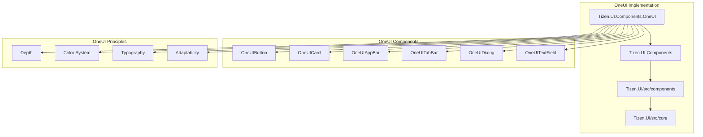
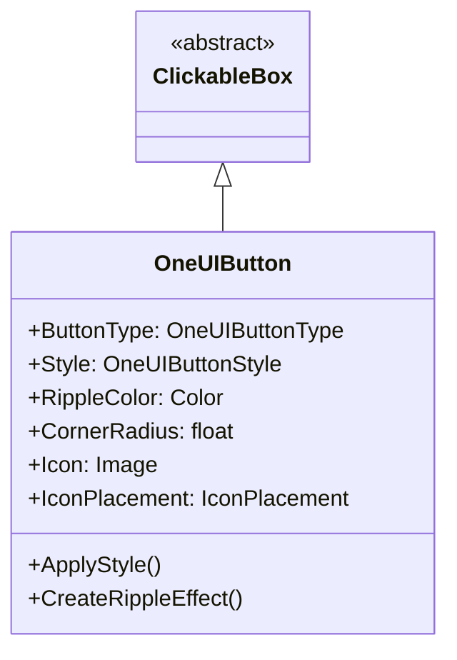
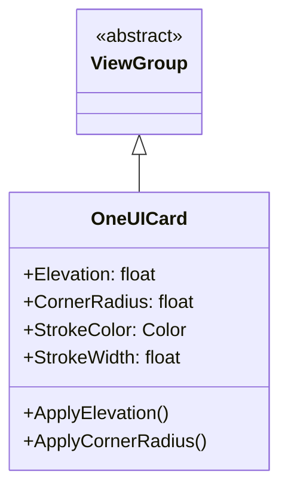
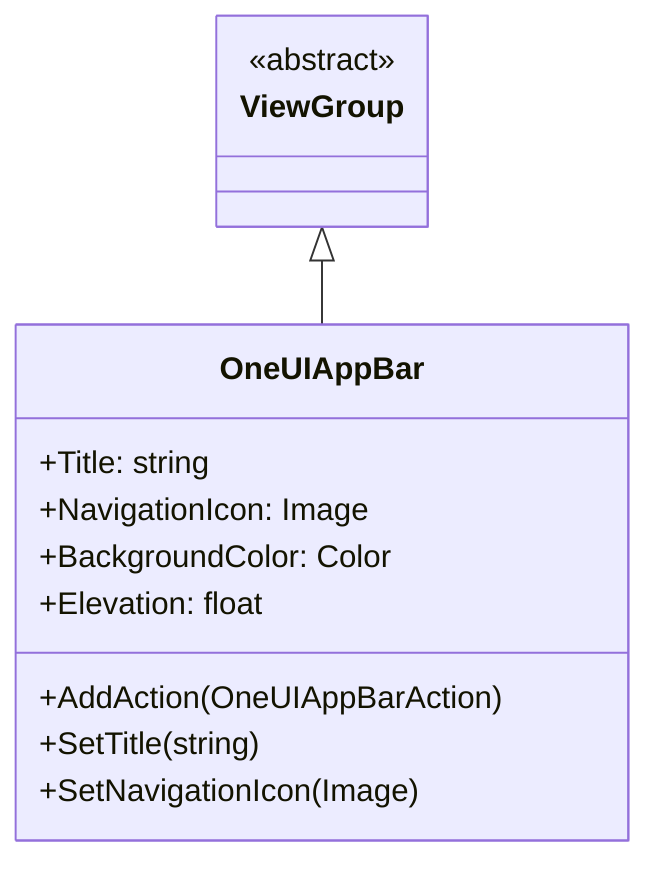
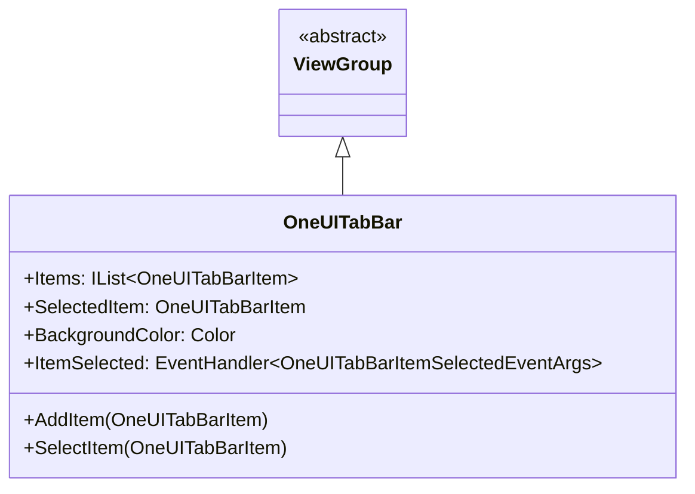
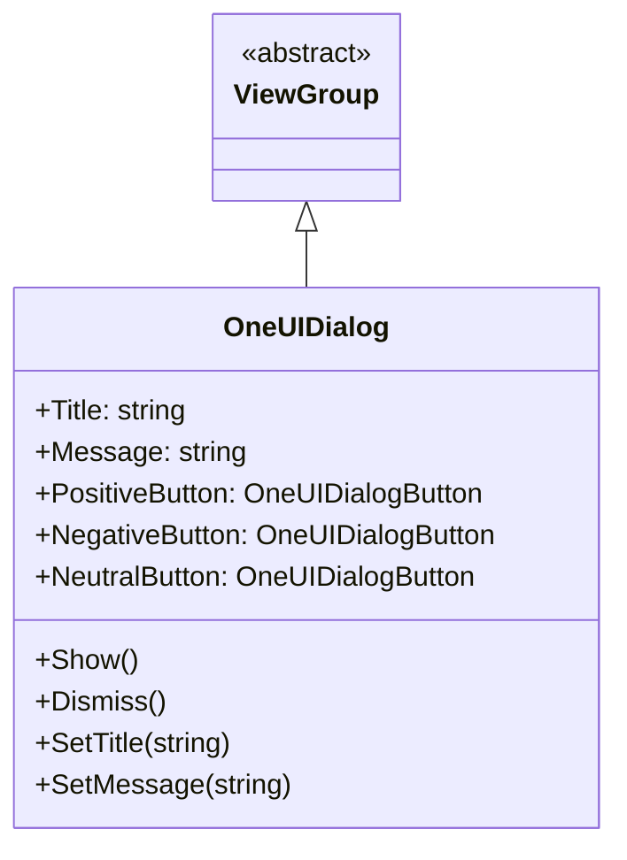
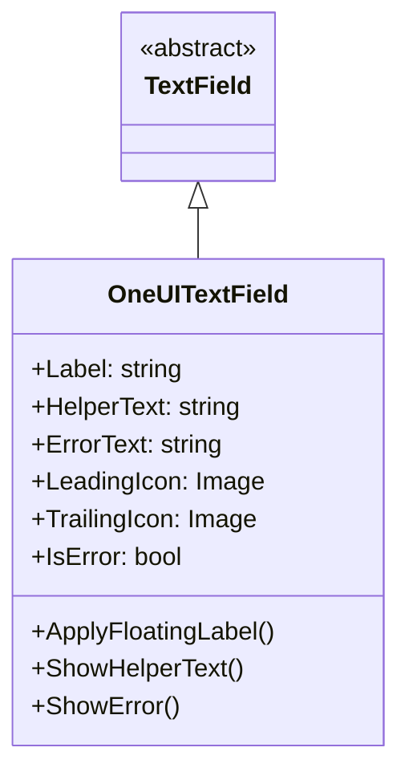

# Tizen.UI.Components.OneUI 구현체

## 소개

Tizen.UI.Components.OneUI는 Samsung의 OneUI 디자인 시스템을 따르는 UI 컴포넌트 구현체입니다. 이 구현체는 Samsung 기기에서 일관되고 친숙한 사용자 경험을 제공하며, Tizen 플랫폼의 특성을 고려하여 최적화되어 있습니다.

## 아키텍처



## 주요 특징

### 1. OneUI 디자인 원칙

**Depth (깊이)**:
- 컴포넌트의 계층 구조를 시각적으로 표현
- 그림자와 투명도를 통해 깊이감 제공
- Samsung 기기의 디스플레이 특성 고려

**Color System (색상 시스템)**:
- Samsung 브랜드 색상 적용
- 시스템 색상과의 조화
- 고대비 모드 및 색약 모드 지원

**Typography (타이포그래피)**:
- Samsung Sans 기반의 타이포그래피 시스템
- 다양한 언어에 대한 최적화
- 가독성 향상을 위한 글꼴 크기 및 간격 조정

**Adaptability (적응성)**:
- 다양한 기기 크기 및 해상도 지원
- 테마 변경에 대한 적응
- 사용자 선호도에 따른 커스터마이징

## 주요 컴포넌트

### 1. OneUIButton

**설명**: OneUI 버튼 컴포넌트

**상속 관계**:


**버튼 타입**:
- **Primary Button**: 주요 액션 버튼
- **Secondary Button**: 보조 액션 버튼
- **Ghost Button**: 배경 없는 버튼
- **Icon Button**: 아이콘만 있는 버튼

**사용 예제**:
```csharp
// Primary Button 생성
var primaryButton = new OneUIButton()
{
    Text = "Primary Button",
    ButtonType = OneUIButtonType.Primary,
    BackgroundColor = OneUIColors.Primary,
    TextColor = OneUIColors.OnPrimary,
    CornerRadius = 6
};

// Secondary Button 생성
var secondaryButton = new OneUIButton()
{
    Text = "Secondary Button",
    ButtonType = OneUIButtonType.Secondary,
    BorderColor = OneUIColors.Primary,
    BorderWidth = 1,
    TextColor = OneUIColors.Primary,
    CornerRadius = 6
};

// Ghost Button 생성
var ghostButton = new OneUIButton()
{
    Text = "Ghost Button",
    ButtonType = OneUIButtonType.Ghost,
    TextColor = OneUIColors.Primary
};

// Icon Button 생성
var iconButton = new OneUIButton()
{
    Icon = new Image("res/icons/favorite.png"),
    ButtonType = OneUIButtonType.Icon,
    IconColor = OneUIColors.Primary
};
```

### 2. OneUICard

**설명**: OneUI 카드 컴포넌트

**상속 관계**:


**주요 속성**:
- **Elevation**: 카드의 깊이 표현
- **CornerRadius**: 모서리 둥글기 정도
- **StrokeColor/StrokeWidth**: 테두리 색상 및 두께

**사용 예제**:
```csharp
// OneUI Card 생성
var card = new OneUICard()
{
    Elevation = 4,
    CornerRadius = 12,
    BackgroundColor = OneUIColors.Surface,
    Size = new Size(300, 200)
};

// 카드 내용 구성
var layout = new LinearLayout()
{
    Orientation = Orientation.Vertical,
    Padding = new Thickness(16)
};

var title = new TextView()
{
    Text = "Card Title",
    FontSize = OneUITypography.TitleLarge.FontSize,
    TextColor = OneUIColors.OnSurface
};

var content = new TextView()
{
    Text = "This is card content with some description.",
    FontSize = OneUITypography.BodyMedium.FontSize,
    TextColor = OneUIColors.OnSurfaceVariant,
    Margin = new Thickness(0, 8, 0, 16)
};

var actionButton = new OneUIButton()
{
    Text = "Action",
    ButtonType = OneUIButtonType.Ghost,
    TextColor = OneUIColors.Primary
};

layout.AddChild(title);
layout.AddChild(content);
layout.AddChild(actionButton);

card.AddChild(layout);
```

### 3. OneUIAppBar

**설명**: OneUI 앱 바 컴포넌트

**상속 관계**:


**주요 속성**:
- **Title**: 앱 바 제목
- **NavigationIcon**: 네비게이션 아이콘
- **BackgroundColor**: 배경색
- **Elevation**: 깊이 표현

**사용 예제**:
```csharp
// OneUI App Bar 생성
var appBar = new OneUIAppBar()
{
    Title = "My App",
    BackgroundColor = OneUIColors.Primary,
    Elevation = 2
};

// 네비게이션 아이콘 설정
appBar.SetNavigationIcon(new Image("res/icons/menu.png"));

// 액션 아이템 추가
var searchAction = new OneUIAppBarAction()
{
    Icon = new Image("res/icons/search.png"),
    Tooltip = "Search"
};

var moreAction = new OneUIAppBarAction()
{
    Icon = new Image("res/icons/more_vert.png"),
    Tooltip = "More options"
};

appBar.AddAction(searchAction);
appBar.AddAction(moreAction);

// 액션 이벤트 핸들러
searchAction.Clicked += (sender, e) => {
    Console.WriteLine("Search clicked");
};

moreAction.Clicked += (sender, e) => {
    Console.WriteLine("More options clicked");
};
```

### 4. OneUITabBar

**설명**: OneUI 탭 바 컴포넌트

**상속 관계**:


**사용 예제**:
```csharp
// 탭 바 생성
var tabBar = new OneUITabBar()
{
    BackgroundColor = OneUIColors.Surface
};

// 탭 아이템 추가
var homeItem = new OneUITabBarItem()
{
    Icon = new Image("res/icons/home.png"),
    SelectedIcon = new Image("res/icons/home_filled.png"),
    Label = "Home"
};

var favoritesItem = new OneUITabBarItem()
{
    Icon = new Image("res/icons/favorite.png"),
    SelectedIcon = new Image("res/icons/favorite_filled.png"),
    Label = "Favorites"
};

var profileItem = new OneUITabBarItem()
{
    Icon = new Image("res/icons/person.png"),
    SelectedIcon = new Image("res/icons/person_filled.png"),
    Label = "Profile"
};

tabBar.AddItem(homeItem);
tabBar.AddItem(favoritesItem);
tabBar.AddItem(profileItem);

// 아이템 선택 이벤트
tabBar.ItemSelected += (sender, e) => {
    switch (e.SelectedItem.Label)
    {
        case "Home":
            NavigateToHome();
            break;
        case "Favorites":
            NavigateToFavorites();
            break;
        case "Profile":
            NavigateToProfile();
            break;
    }
};
```

### 5. OneUIDialog

**설명**: OneUI 다이얼로그 컴포넌트

**상속 관계**:


**사용 예제**:
```csharp
// 다이얼로그 생성
var dialog = new OneUIDialog()
{
    Title = "Confirm Action",
    Message = "Are you sure you want to delete this item?"
};

// 버튼 설정
dialog.PositiveButton = new OneUIDialogButton()
{
    Text = "Delete",
    ButtonType = OneUIButtonType.Ghost
};

dialog.NegativeButton = new OneUIDialogButton()
{
    Text = "Cancel",
    ButtonType = OneUIButtonType.Ghost
};

// 버튼 이벤트 핸들러
dialog.PositiveButton.Clicked += (sender, e) => {
    // 삭제 로직
    DeleteItem();
    dialog.Dismiss();
};

dialog.NegativeButton.Clicked += (sender, e) => {
    dialog.Dismiss();
};

// 다이얼로그 표시
dialog.Show();
```

### 6. OneUITextField

**설명**: OneUI 텍스트 필드 컴포넌트

**상속 관계**:


**사용 예제**:
```csharp
// OneUI 텍스트 필드 생성
var textField = new OneUITextField()
{
    Label = "Email Address",
    Placeholder = "Enter your email",
    HelperText = "We'll never share your email with anyone else",
    LeadingIcon = new Image("res/icons/email.png")
};

// 유효성 검사
textField.TextChanged += (sender, e) => {
    if (!IsValidEmail(textField.Text))
    {
        textField.IsError = true;
        textField.ErrorText = "Please enter a valid email address";
    }
    else
    {
        textField.IsError = false;
        textField.ErrorText = "";
    }
};
```

## 색상 시스템

### 1. OneUI 색상 팔레트

```csharp
public static class OneUIColors
{
    // Primary Colors
    public static readonly Color Primary = Color.FromHex("#1428A0");
    public static readonly Color PrimaryVariant = Color.FromHex("#0F1F7A");
    public static readonly Color OnPrimary = Color.FromHex("#FFFFFF");
    
    // Secondary Colors
    public static readonly Color Secondary = Color.FromHex("#008000");
    public static readonly Color SecondaryVariant = Color.FromHex("#006600");
    public static readonly Color OnSecondary = Color.FromHex("#FFFFFF");
    
    // Surface Colors
    public static readonly Color Surface = Color.FromHex("#FFFFFF");
    public static readonly Color OnSurface = Color.FromHex("#000000");
    public static readonly Color OnSurfaceVariant = Color.FromHex("#666666");
    
    // Background Colors
    public static readonly Color Background = Color.FromHex("#F5F5F5");
    public static readonly Color OnBackground = Color.FromHex("#000000");
    
    // Error Colors
    public static readonly Color Error = Color.FromHex("#D93025");
    public static readonly Color OnError = Color.FromHex("#FFFFFF");
}
```

### 2. 다크 모드 지원

```csharp
public class OneUIColorScheme
{
    public Color Primary { get; set; }
    public Color OnPrimary { get; set; }
    public Color Surface { get; set; }
    public Color OnSurface { get; set; }
    // ... 기타 색상
    
    public static OneUIColorScheme Light => new OneUIColorScheme()
    {
        Primary = Color.FromHex("#1428A0"),
        OnPrimary = Color.FromHex("#FFFFFF"),
        Surface = Color.FromHex("#FFFFFF"),
        OnSurface = Color.FromHex("#000000")
    };
    
    public static OneUIColorScheme Dark => new OneUIColorScheme()
    {
        Primary = Color.FromHex("#A0B4FF"),
        OnPrimary = Color.FromHex("#000000"),
        Surface = Color.FromHex("#121212"),
        OnSurface = Color.FromHex("#FFFFFF")
    };
}
```

## 타이포그래피 시스템

### 1. OneUI 타이포그래피 스타일

```csharp
public static class OneUITypography
{
    public static readonly TextStyle DisplayLarge = new TextStyle()
    {
        FontSize = 57,
        FontWeight = FontWeight.Normal,
        LetterSpacing = -0.25f
    };
    
    public static readonly TextStyle DisplayMedium = new TextStyle()
    {
        FontSize = 45,
        FontWeight = FontWeight.Normal,
        LetterSpacing = 0
    };
    
    public static readonly TextStyle DisplaySmall = new TextStyle()
    {
        FontSize = 36,
        FontWeight = FontWeight.Normal,
        LetterSpacing = 0
    };
    
    public static readonly TextStyle HeadlineLarge = new TextStyle()
    {
        FontSize = 32,
        FontWeight = FontWeight.Normal,
        LetterSpacing = 0
    };
    
    public static readonly TextStyle HeadlineMedium = new TextStyle()
    {
        FontSize = 28,
        FontWeight = FontWeight.Normal,
        LetterSpacing = 0
    };
    
    public static readonly TextStyle HeadlineSmall = new TextStyle()
    {
        FontSize = 24,
        FontWeight = FontWeight.Normal,
        LetterSpacing = 0
    };
    
    public static readonly TextStyle TitleLarge = new TextStyle()
    {
        FontSize = 22,
        FontWeight = FontWeight.Medium,
        LetterSpacing = 0
    };
    
    public static readonly TextStyle TitleMedium = new TextStyle()
    {
        FontSize = 16,
        FontWeight = FontWeight.Medium,
        LetterSpacing = 0.15f
    };
    
    public static readonly TextStyle TitleSmall = new TextStyle()
    {
        FontSize = 14,
        FontWeight = FontWeight.Medium,
        LetterSpacing = 0.1f
    };
    
    public static readonly TextStyle BodyLarge = new TextStyle()
    {
        FontSize = 16,
        FontWeight = FontWeight.Normal,
        LetterSpacing = 0.5f
    };
    
    public static readonly TextStyle BodyMedium = new TextStyle()
    {
        FontSize = 14,
        FontWeight = FontWeight.Normal,
        LetterSpacing = 0.25f
    };
    
    public static readonly TextStyle BodySmall = new TextStyle()
    {
        FontSize = 12,
        FontWeight = FontWeight.Normal,
        LetterSpacing = 0.4f
    };
}
```

## 적응성 시스템

### 1. 기기별 레이아웃 조정

```csharp
public class OneUIDeviceAdaptation
{
    public static float GetAdaptiveSize(float baseSize)
    {
        var screenSize = DisplayMetrics.ScreenSize;
        var density = DisplayMetrics.Density;
        
        // 화면 크기에 따른 크기 조정
        if (screenSize.Width < 720) // 작은 화면
        {
            return baseSize * 0.9f;
        }
        else if (screenSize.Width > 1440) // 큰 화면
        {
            return baseSize * 1.1f;
        }
        
        return baseSize; // 표준 크기
    }
    
    public static Thickness GetAdaptivePadding(Thickness basePadding)
    {
        var screenSize = DisplayMetrics.ScreenSize;
        
        // 화면 크기에 따른 패딩 조정
        if (screenSize.Width < 720)
        {
            return new Thickness(
                basePadding.Left * 0.8f,
                basePadding.Top * 0.8f,
                basePadding.Right * 0.8f,
                basePadding.Bottom * 0.8f
            );
        }
        
        return basePadding;
    }
}
```

### 2. 언어별 레이아웃 조정

```csharp
public class OneUILanguageAdaptation
{
    public static HorizontalAlignment GetTextAlignment(string languageCode)
    {
        // RTL 언어 지원 (아랍어, 히브리어 등)
        if (languageCode == "ar" || languageCode == "he")
        {
            return HorizontalAlignment.Right;
        }
        
        return HorizontalAlignment.Left;
    }
    
    public static IconPlacement GetIconPlacement(string languageCode)
    {
        // RTL 언어에서는 아이콘 위치 조정
        if (languageCode == "ar" || languageCode == "he")
        {
            return IconPlacement.Right;
        }
        
        return IconPlacement.Left;
    }
}
```

## 테마 시스템

### 1. 테마 적용

```csharp
public class OneUITheme : ITheme
{
    public OneUIColorScheme ColorScheme { get; set; }
    public OneUITypography Typography { get; set; }
    public OneUIShape Shape { get; set; }
    
    public void ApplyTheme(View view)
    {
        // 뷰에 테마 적용
        if (view is OneUIButton button)
        {
            ApplyButtonTheme(button);
        }
        else if (view is OneUICard card)
        {
            ApplyCardTheme(card);
        }
        // ... 기타 컴포넌트들
    }
    
    private void ApplyButtonTheme(OneUIButton button)
    {
        button.BackgroundColor = ColorScheme.Primary;
        button.TextColor = ColorScheme.OnPrimary;
        // ... 기타 스타일 적용
    }
    
    private void ApplyCardTheme(OneUICard card)
    {
        card.BackgroundColor = ColorScheme.Surface;
        card.Elevation = 2;
        // ... 기타 스타일 적용
    }
}
```

### 2. 동적 테마 변경

```csharp
public class OneUIThemeManager
{
    private static OneUIThemeManager _instance;
    public static OneUIThemeManager Instance => _instance ??= new OneUIThemeManager();
    
    public event EventHandler<ThemeChangedEventArgs> ThemeChanged;
    
    private ITheme _currentTheme;
    public ITheme CurrentTheme
    {
        get => _currentTheme;
        set
        {
            _currentTheme = value;
            ThemeChanged?.Invoke(this, new ThemeChangedEventArgs(value));
        }
    }
    
    public void ToggleDarkMode()
    {
        CurrentTheme = CurrentTheme is OneUILightTheme 
            ? (ITheme)new OneUIDarkTheme() 
            : new OneUILightTheme();
    }
    
    public void ApplySystemTheme()
    {
        // 시스템 테마 설정에 따라 테마 변경
        var systemTheme = SystemSettings.GetTheme();
        CurrentTheme = systemTheme == SystemTheme.Dark 
            ? (ITheme)new OneUIDarkTheme() 
            : new OneUILightTheme();
    }
}
```

## 결론

Tizen.UI.Components.OneUI는 Samsung의 OneUI 디자인 시스템을 충실히 구현하여 다음과 같은 이점을 제공합니다:

1. **브랜드 일관성**: Samsung 기기에서 친숙한 UI/UX 제공
2. **적응성**: 다양한 기기와 환경에 최적화
3. **접근성**: 다양한 사용자 요구사항 고려
4. **유연성**: 테마 시스템을 통한 커스터마이징 가능
5. **성능**: Samsung 기기에서 최적화된 성능

이 구현체는 Samsung Tizen 애플리케이션 개발자들이 고품질의 사용자 인터페이스를 빠르고 쉽게 구축할 수 있도록 도와줍니다.
