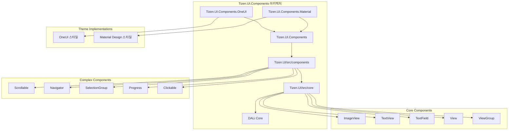
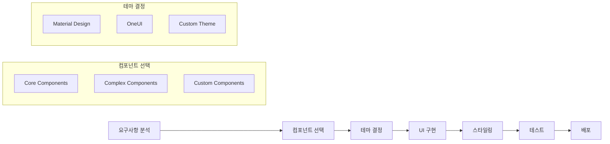

# Tizen.UI.Components 개요

## 소개

Tizen.UI.Components는 Tizen 플랫폼에서 UI 애플리케이션을 개발하기 위한 종합적인 컴포넌트 라이브러리입니다. 이 라이브러리는 기본적인 UI 요소부터 복잡한 레이아웃 컴포넌트까지 다양한 계층의 컴포넌트를 제공하여 개발자가 일관되고 아름다운 사용자 인터페이스를 구축할 수 있도록 지원합니다.

## 프로젝트 구조

Tizen.UI.Components는 계층적인 아키텍처로 설계되어 있으며, 각 계층은 특정 역할과 책임을 가집니다.

## 핵심 구성 요소

### 1. Tizen.UI/src/core
기본적인 UI 컴포넌트들이 위치하는 핵심 계층입니다.

- **View**: 모든 UI 컴포넌트의 기본 클래스
- **ViewGroup**: 다른 뷰들을 포함할 수 있는 컨테이너
- **ImageView**: 이미지를 표시하는 컴포넌트
- **TextView**: 텍스트를 표시하는 컴포넌트
- **TextField**: 텍스트 입력을 받는 컴포넌트
- **TextEditor**: 다중 라인 텍스트 편집기
- **LottieAnimationView**: Lottie 애니메이션을 표시하는 컴포넌트

### 2. Tizen.UI/src/components
복합적인 기능과 레이아웃이 필요한 컴포넌트들이 위치합니다.

- **Scrollable**: 스크롤 가능한 컨테이너
- **Navigator**: 화면 전환 내비게이션
- **SelectionGroup**: 선택 가능한 항목 그룹
- **Progress**: 진행 상태 표시
- **Clickable**: 클릭 가능한 컴포넌트
- **Pressable**: 누름 상태를 처리하는 컴포넌트

### 3. Tizen.UI.Components
컴포넌트의 코어 인터페이스와 기본 기능을 정의하는 추상화 계층입니다.

- **인터페이스 정의**: IClickable, ISelectable, IGroupSelectable 등
- **기본 구현**: Selectable, Clickable, Pressable 등
- **상태 관리**: UIStateManager, UIState 등
- **속성 설정**: PropertySetter, IPropertySetter 등

### 4. 테마 구현체
특정 디자인 시스템을 구현하는 구체적인 컴포넌트들입니다.

- **Tizen.UI.Components.Material**: Google Material Design 가이드라인을 따르는 컴포넌트
- **Tizen.UI.Components.OneUI**: Samsung OneUI 디자인 시스템을 따르는 컴포넌트

## 설계 원칙

### 1. 계층적 아키텍처
- **분리의 원칙**: 각 계층은 명확한 책임을 가지며, 하위 계층에 의존합니다.
- **추상화**: 상위 계층일수록 추상적이고, 하위 계층일수록 구체적입니다.

### 2. 인터페이스 기반 설계
- **다형성**: 동일한 인터페이스를 구현하는 다양한 컴포넌트 제공
- **확장성**: 새로운 테마나 컴포넌트를 쉽게 추가할 수 있음

### 3. 재사용성
- **모듈화**: 각 컴포넌트는 독립적으로 사용 가능
- **조합**: 작은 컴포넌트들을 조합하여 복잡한 UI 구성

### 4. 테마 지원
- **플랫폼 적응**: Tizen, Android, iOS 등 다양한 플랫폼 지원
- **브랜드 일관성**: Samsung OneUI, Material Design 등 브랜드 가이드라인 준수

## 주요 특징

### 1. 크로스 플랫폼 지원
- Tizen을 포함한 다양한 플랫폼에서 동일한 API 제공
- 플랫폼별 최적화된 렌더링

### 2. 고성능 렌더링
- DALi 엔진 기반의 하드웨어 가속
- 최적화된 렌더링 파이프라인

### 3. 풍부한 컴포넌트 라이브러리
- 기본 컴포넌트부터 복합 컴포넌트까지 완벽한 지원
- 애니메이션 및 트랜지션 효과

### 4. 유연한 스타일링
- CSS와 유사한 스타일링 시스템
- 동적 테마 변경 지원

### 5. 접근성 지원
- 스크린 리더 지원
- 키보드 내비게이션
- 고대비 모드

## 사용 사례

### 1. Tizen 애플리케이션 개발
- TV, 웨어러블, 모바일 기기용 애플리케이션
- 일관된 사용자 경험 제공

### 2. 엔터프라이즈 애플리케이션
- 복잡한 비즈니스 로직을 가진 애플리케이션
- 대규모 데이터 표시 및 조작

### 3. 미디어 애플리케이션
- 비디오 플레이어
- 이미지 갤러리
- 오디오 플레이어

## 개발 워크플로우

## 결론

Tizen.UI.Components는 현대적인 UI 애플리케이션 개발을 위한 강력하고 유연한 프레임워크입니다. 계층적인 아키텍처, 풍부한 컴포넌트 라이브러리, 그리고 다양한 테마 지원을 통해 개발자는 빠르고 효율적으로 고품질의 사용자 인터페이스를 구축할 수 있습니다.

다음 문서에서는 각 계층의 상세한 아키텍처와 구체적인 컴포넌트들에 대해 자세히 살펴보겠습니다.
