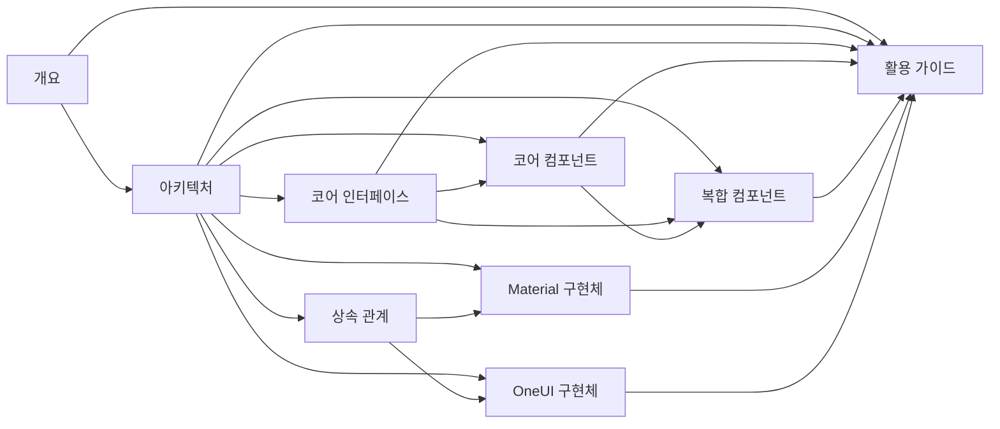

# Tizen.UI.Components 문서 인덱스

## 소개

이 문서는 Tizen.UI.Components 관련 모든 문서의 인덱스를 제공합니다. 각 문서는 Tizen.UI.Components의 특정 측면이나 기능을 자세히 설명합니다.

## 문서 목록

### 1. 개요 및 기본 개념
- **[Tizen_UI_Components_개요.md](Tizen_UI_Components_개요.md)**
  - Tizen.UI.Components의 전체적인 소개
  - 프로젝트 구조 및 핵심 구성 요소
  - 설계 원칙 및 주요 특징
  - 사용 사례 및 개발 워크플로우

### 2. 아키텍처 및 설계
- **[Tizen_UI_Components_아키텍처.md](Tizen_UI_Components_아키텍처.md)**
  - 전체 아키텍처 개요
  - 계층별 상세 분석
  - 설계 패턴 적용
  - 데이터 흐름 및 성능 최적화 전략
  - 확장성 설계 및 테스트 전략

### 3. 코어 인터페이스
- **[Tizen_UI_Components_코어_인터페이스.md](Tizen_UI_Components_코어_인터페이스.md)**
  - 주요 인터페이스 소개 (IClickable, ISelectable 등)
  - 인터페이스 상속 관계
  - 인터페이스 구현 예제
  - 인터페이스 활용 패턴
  - 인터페이스 설계 원칙

### 4. 코어 컴포넌트
- **[Tizen_UI_Components_Core_컴포넌트.md](Tizen_UI_Components_Core_컴포넌트.md)**
  - View, ViewGroup, ImageView, TextView 등 기본 컴포넌트
  - 컴포넌트 상속 관계
  - 주요 속성 및 메서드
  - 사용 예제
  - 컴포넌트 간 상호작용
  - 성능 최적화 및 접근성 지원

### 5. 복합 컴포넌트
- **[Tizen_UI_Components_복합_컴포넌트.md](Tizen_UI_Components_복합_컴포넌트.md)**
  - Scrollable, Navigator, SelectionGroup 등 복합 컴포넌트
  - 컴포넌트 카테고리별 설명
  - 컴포넌트 조합 예제
  - 데이터 바인딩 시스템
  - 이벤트 처리 및 상태 관리

### 6. Material Design 구현체
- **[Tizen_UI_Components_Material.md](Tizen_UI_Components_Material.md)**
  - Material Design 원칙 적용
  - MaterialButton, MaterialCard, MaterialAppBar 등 주요 컴포넌트
  - 색상 시스템 및 타이포그래피
  - 모션 시스템 및 테마 시스템
  - 다크 모드 지원

### 7. OneUI 구현체
- **[Tizen_UI_Components_OneUI.md](Tizen_UI_Components_OneUI.md)**
  - OneUI 디자인 원칙 적용
  - OneUIButton, OneUICard, OneUIAppBar 등 주요 컴포넌트
  - 색상 시스템 및 타이포그래피
  - 적응성 시스템 및 테마 시스템
  - Samsung 기기 최적화

### 8. 상속 관계
- **[Tizen_UI_Components_상속_관계.md](Tizen_UI_Components_상속_관계.md)**
  - 전체 상속 구조 다이어그램
  - 코어 컴포넌트 상속 구조
  - 레이아웃 컴포넌트 상속 구조
  - 인터랙티브 컴포넌트 상속 구조
  - 테마 구현체 상속 구조
  - 인터페이스 구현 관계
  - 컴포넌트 조합 예제

### 9. 활용 가이드
- **[Tizen_UI_Components_활용_가이드.md](Tizen_UI_Components_활용_가이드.md)**
  - 기본 사용법 및 테마 적용
  - 데이터 바인딩 및 리스트 처리
  - 내비게이션 및 화면 전환
  - 성능 최적화 기법
  - 접근성 지원 방법
  - 테스트 및 디버깅
  - 모범 사례

## 문서 간 관계

## 시작하기

Tizen.UI.Components를 처음 접하시는 분들은 다음 순서로 문서를 읽는 것을 권장합니다:

1. **[Tizen_UI_Components_개요.md](Tizen_UI_Components_개요.md)** - 전체적인 개념 이해
2. **[Tizen_UI_Components_아키텍처.md](Tizen_UI_Components_아키텍처.md)** - 아키텍처 및 설계 원칙 이해
3. **[Tizen_UI_Components_코어_인터페이스.md](Tizen_UI_Components_코어_인터페이스.md)** - 인터페이스 기반 설계 이해
4. 선택적으로 관심 있는 컴포넌트 문서 참조:
   - **[Tizen_UI_Components_Core_컴포넌트.md](Tizen_UI_Components_Core_컴포넌트.md)**
   - **[Tizen_UI_Components_복합_컴포넌트.md](Tizen_UI_Components_복합_컴포넌트.md)**
5. 테마 구현체 문서 참조:
   - **[Tizen_UI_Components_Material.md](Tizen_UI_Components_Material.md)**
   - **[Tizen_UI_Components_OneUI.md](Tizen_UI_Components_OneUI.md)**
6. **[Tizen_UI_Components_상속_관계.md](Tizen_UI_Components_상속_관계.md)** - 상속 구조 이해
7. **[Tizen_UI_Components_활용_가이드.md](Tizen_UI_Components_활용_가이드.md)** - 실제 활용 방법 학습

## 기여 및 유지보수

이 문서들은 Tizen.UI.Components의 지속적인 발전에 따라 업데이트됩니다. 최신 정보를 확인하려면 주기적으로 이 인덱스를 확인하시기 바랍니다.

문서에 대한 피드백이나 수정 요청이 있으시면 다음 방법으로 기여해 주세요:
- 각 문서의 마지막에 있는 "결론" 섹션에 의견 추가
- GitHub 저장소의 Issues 섹션에 피드백 제출
- 직접 Pull Request를 통해 수정 내용 제안

## 관련 리소스

- [Tizen.UI 공식 문서](https://docs.tizen.org/)
- [Material Design 가이드라인](https://material.io/)
- [Samsung OneUI 디자인 시스템](https://developer.samsung.com/one-ui)
- Tizen.UI.Components GitHub 저장소
- Tizen.UI.Components 샘플 애플리케이션

## 라이선스

이 문서들은 Tizen.UI.Components 프로젝트와 동일한 라이선스를 따릅니다. 자세한 내용은 각 문서의 헤더 섹션을 참조하세요.
