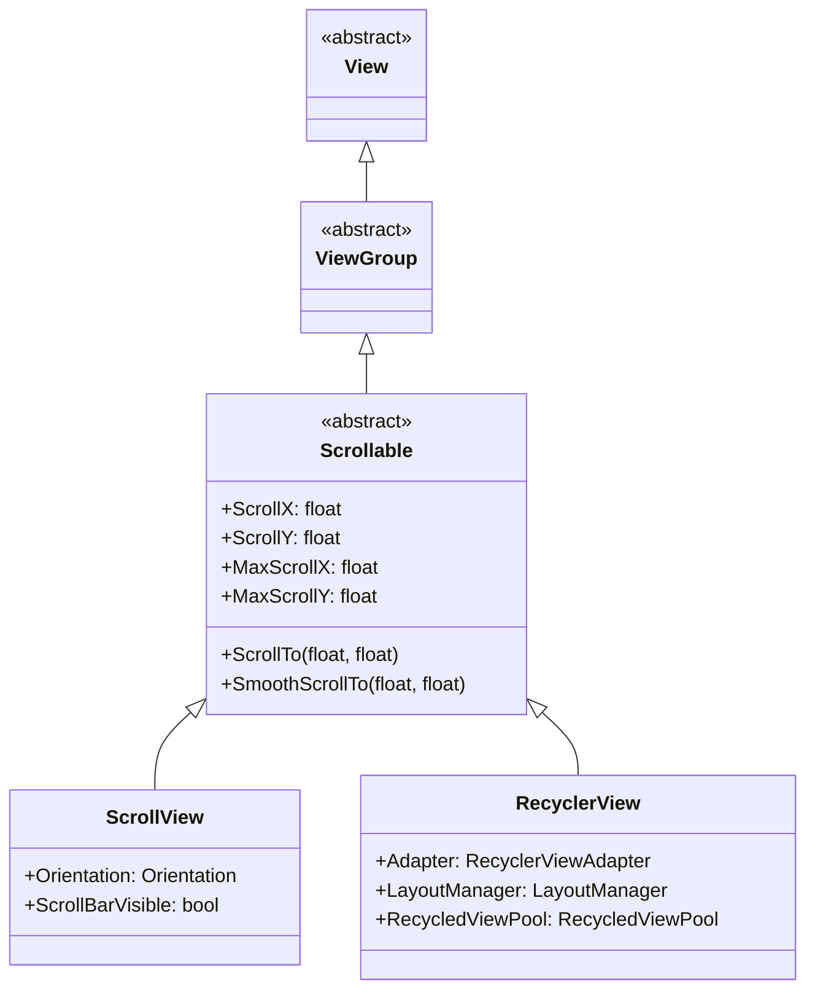
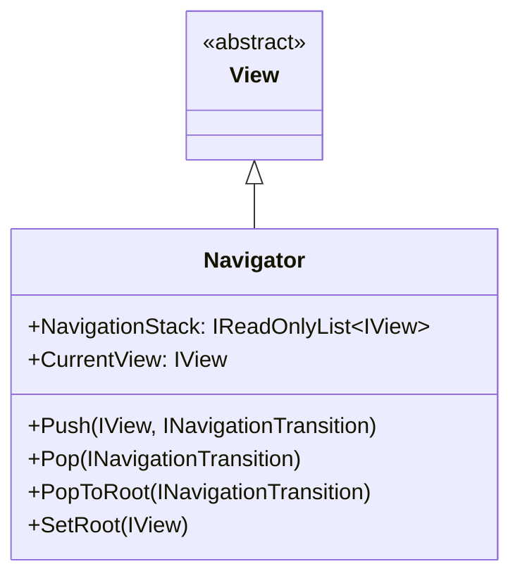
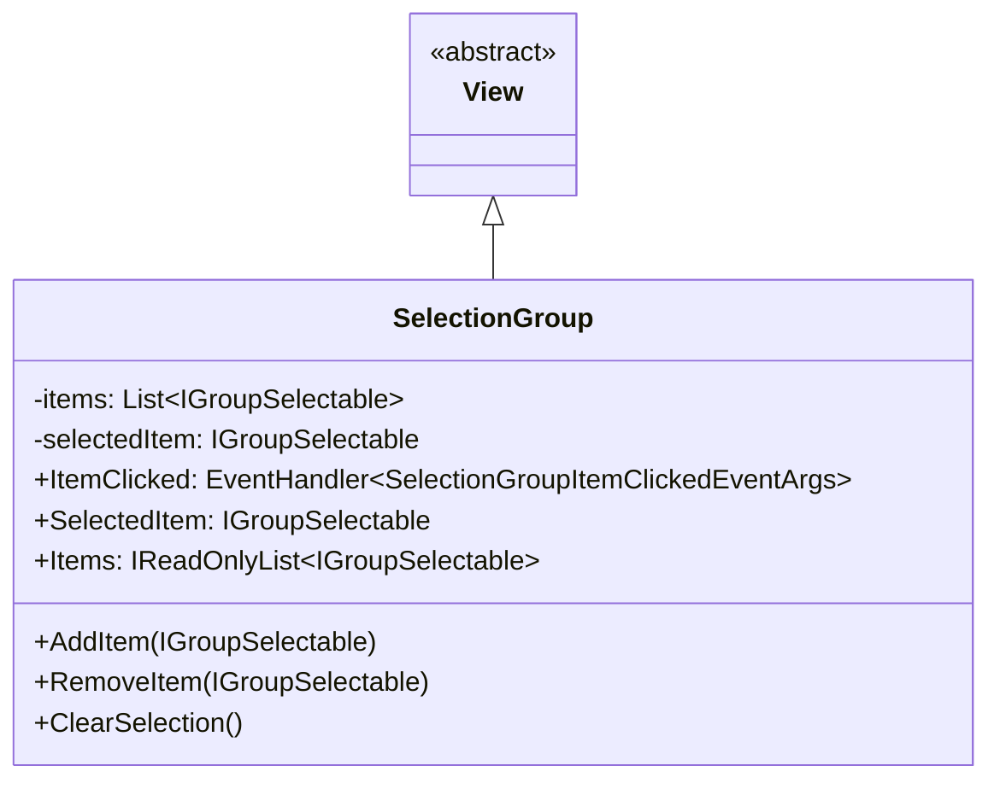
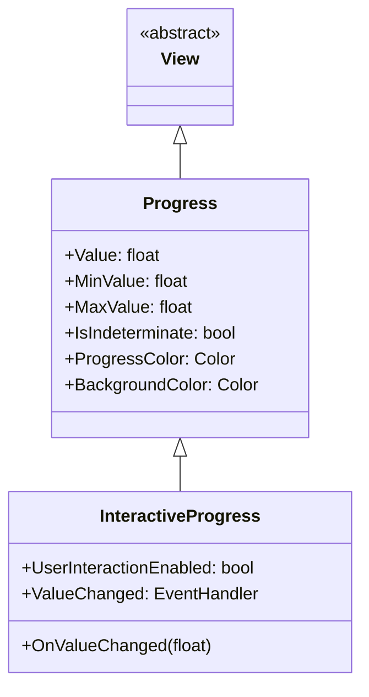
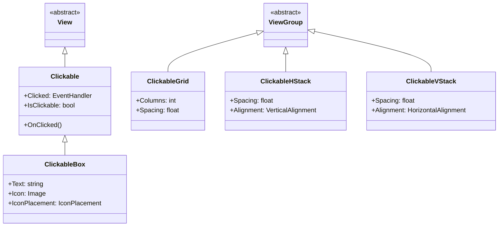
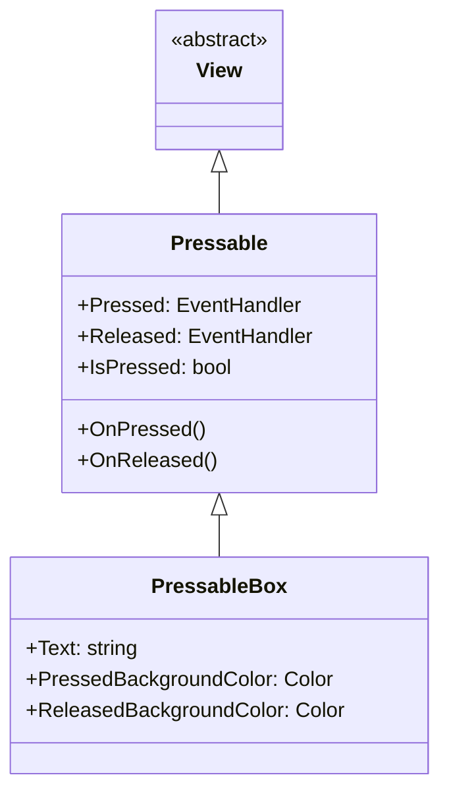

# Tizen.UI/src/components 컴포넌트

## 소개

Tizen.UI/src/components는 Tizen.UI/src/core의 기본 컴포넌트들을 조합하여 복잡한 기능과 레이아웃을 제공하는 컴포넌트들이 위치하는 계층입니다. 이 계층의 컴포넌트들은 사용자 인터랙션, 데이터 바인딩, 레이아웃 관리 등 고급 기능을 제공합니다.

## 주요 컴포넌트 카테고리

### 1. Scrollable 컴포넌트

**설명**: 스크롤 가능한 컨테이너 컴포넌트

**주요 컴포넌트**:
- ScrollView
- RecyclerView
- ListView
- GridView

**상속 관계**:


**주요 속성**:
- **ScrollX/ScrollY**: 현재 스크롤 위치
- **MaxScrollX/MaxScrollY**: 최대 스크롤 가능 위치
- **ScrollBarVisible**: 스크롤바 표시 여부

**주요 메서드**:
- **ScrollTo(float, float)**: 지정된 위치로 스크롤
- **SmoothScrollTo(float, float)**: 부드럽게 스크롤

**사용 예제**:
```csharp
// 스크롤 뷰 생성
var scrollView = new ScrollView()
{
    Orientation = Orientation.Vertical,
    ScrollBarVisible = true
};

// 컨텐츠 추가
var content = new ViewGroup();
for (int i = 0; i < 20; i++)
{
    var textView = new TextView()
    {
        Text = $"Item {i}",
        Size = new Size(300, 50)
    };
    content.AddChild(textView);
}
scrollView.AddChild(content);
```

### 2. Navigator 컴포넌트

**설명**: 화면 전환 및 내비게이션을 관리하는 컴포넌트

**상속 관계**:


**주요 속성**:
- **NavigationStack**: 내비게이션 스택
- **CurrentView**: 현재 화면

**주요 메서드**:
- **Push(IView, INavigationTransition)**: 새로운 화면 추가
- **Pop(INavigationTransition)**: 현재 화면 제거
- **PopToRoot(INavigationTransition)**: 루트 화면으로 이동
- **SetRoot(IView)**: 루트 화면 설정

**사용 예제**:
```csharp
// 내비게이터 생성
var navigator = new Navigator();

// 첫 번째 화면 설정
var homeView = new HomeView();
navigator.SetRoot(homeView);

// 두 번째 화면으로 이동
var detailView = new DetailView();
navigator.Push(detailView, new SlideTransition());
```

### 3. SelectionGroup 컴포넌트

**설명**: 선택 가능한 항목들의 그룹을 관리하는 컴포넌트

**상속 관계**:


**주요 속성**:
- **SelectedItem**: 현재 선택된 항목
- **Items**: 그룹 내 항목 목록

**주요 메서드**:
- **AddItem(IGroupSelectable)**: 항목 추가
- **RemoveItem(IGroupSelectable)**: 항목 제거
- **ClearSelection()**: 선택 해제

**주요 이벤트**:
- **ItemClicked**: 항목 클릭 이벤트

**사용 예제**:
```csharp
// 선택 그룹 생성
var selectionGroup = new SelectionGroup();

// 선택 가능한 항목들 추가
var item1 = new SelectableBox() { Text = "Option 1" };
var item2 = new SelectableBox() { Text = "Option 2" };
var item3 = new SelectableBox() { Text = "Option 3" };

selectionGroup.AddItem(item1);
selectionGroup.AddItem(item2);
selectionGroup.AddItem(item3);

// 항목 클릭 이벤트 핸들러
selectionGroup.ItemClicked += (sender, e) => {
    Console.WriteLine($"Selected: {e.SelectedItem.Text}");
};
```

### 4. Progress 컴포넌트

**설명**: 진행 상태를 표시하는 컴포넌트

**상속 관계**:


**주요 속성**:
- **Value**: 현재 진행 값
- **MinValue/MaxValue**: 최소/최대 값
- **IsIndeterminate**: 불확정 진행 상태
- **ProgressColor**: 진행 바 색상

**사용 예제**:
```csharp
// 진행 바 생성
var progressBar = new Progress()
{
    MinValue = 0,
    MaxValue = 100,
    Value = 50,
    ProgressColor = Color.Blue,
    Size = new Size(200, 20)
};

// 인터랙티브 진행 바
var interactiveProgress = new InteractiveProgress()
{
    UserInteractionEnabled = true
};

interactiveProgress.ValueChanged += (sender, e) => {
    Console.WriteLine($"Progress: {interactiveProgress.Value}");
};
```

### 5. Clickable 컴포넌트

**설명**: 클릭 가능한 컴포넌트들

**주요 컴포넌트**:
- Clickable
- ClickableBox
- ClickableGrid
- ClickableHStack
- ClickableVStack

**상속 관계**:


**사용 예제**:
```csharp
// 클릭 가능한 박스 생성
var clickableBox = new ClickableBox()
{
    Text = "Click Me",
    Icon = new Image("res/icons/star.png"),
    IconPlacement = IconPlacement.Left,
    Size = new Size(150, 50)
};

clickableBox.Clicked += (sender, e) => {
    Console.WriteLine("Box clicked!");
};

// 클릭 가능한 수평 스택
var hStack = new ClickableHStack()
{
    Spacing = 10,
    Alignment = VerticalAlignment.Center
};

hStack.AddChild(new ClickableBox() { Text = "Button 1" });
hStack.AddChild(new ClickableBox() { Text = "Button 2" });
hStack.AddChild(new ClickableBox() { Text = "Button 3" });
```

### 6. Pressable 컴포넌트

**설명**: 누름 상태를 처리하는 컴포넌트들

**상속 관계**:


**사용 예제**:
```csharp
// 누름 가능한 박스 생성
var pressableBox = new PressableBox()
{
    Text = "Press Me",
    PressedBackgroundColor = Color.Gray,
    ReleasedBackgroundColor = Color.White,
    Size = new Size(150, 50)
};

pressableBox.Pressed += (sender, e) => {
    Console.WriteLine("Box pressed!");
};

pressableBox.Released += (sender, e) => {
    Console.WriteLine("Box released!");
};
```

## 컴포넌트 조합 예제

### 1. 리스트 아이템 컴포넌트

```csharp
public class ListItemComponent : ClickableBox
{
    private readonly ImageView _iconView;
    private readonly TextView _titleView;
    private readonly TextView _subtitleView;
    
    public ListItemComponent()
    {
        // 레이아웃 설정
        var layout = new LinearLayout()
        {
            Orientation = Orientation.Horizontal,
            Padding = new Thickness(16)
        };
        
        // 아이콘
        _iconView = new ImageView()
        {
            Size = new Size(40, 40)
        };
        
        // 텍스트 컨테이너
        var textContainer = new ViewGroup();
        var textLayout = new LinearLayout()
        {
            Orientation = Orientation.Vertical,
            Margin = new Thickness(16, 0, 0, 0)
        };
        
        _titleView = new TextView()
        {
            FontSize = 16,
            TextColor = Color.Black
        };
        
        _subtitleView = new TextView()
        {
            FontSize = 12,
            TextColor = Color.Gray
        };
        
        textContainer.Layout = textLayout;
        textContainer.AddChild(_titleView);
        textContainer.AddChild(_subtitleView);
        
        // 자식 뷰 추가
        AddChild(_iconView);
        AddChild(textContainer);
        
        // 클릭 이벤트
        Clicked += OnItemClicked;
    }
    
    public string Title
    {
        get => _titleView.Text;
        set => _titleView.Text = value;
    }
    
    public string Subtitle
    {
        get => _subtitleView.Text;
        set => _subtitleView.Text = value;
    }
    
    public string IconSource
    {
        get => _iconView.Source;
        set => _iconView.Source = value;
    }
    
    private void OnItemClicked(object sender, EventArgs e)
    {
        // 아이템 클릭 처리
        Console.WriteLine($"Item clicked: {Title}");
    }
}
```

### 2. 카드 컴포넌트

```csharp
public class CardComponent : ViewGroup
{
    private readonly ImageView _imageView;
    private readonly TextView _titleView;
    private readonly TextView _contentView;
    private readonly ClickableBox _actionButton;
    
    public CardComponent()
    {
        // 카드 스타일 설정
        BackgroundColor = Color.White;
        Size = new Size(300, 200);
        Padding = new Thickness(16);
        
        // 그림자 효과
        Elevation = 4;
        
        // 레이아웃 설정
        Layout = new LinearLayout()
        {
            Orientation = Orientation.Vertical
        };
        
        // 이미지
        _imageView = new ImageView()
        {
            Size = new Size(268, 100),
            ScaleType = ScaleType.CropCenter
        };
        
        // 제목
        _titleView = new TextView()
        {
            FontSize = 18,
            TextColor = Color.Black,
            Margin = new Thickness(0, 8, 0, 4)
        };
        
        // 내용
        _contentView = new TextView()
        {
            FontSize = 14,
            TextColor = Color.Gray,
            Margin = new Thickness(0, 0, 0, 12)
        };
        
        // 액션 버튼
        _actionButton = new ClickableBox()
        {
            Text = "Action",
            HorizontalAlignment = HorizontalAlignment.End
        };
        
        // 자식 뷰 추가
        AddChild(_imageView);
        AddChild(_titleView);
        AddChild(_contentView);
        AddChild(_actionButton);
    }
    
    public string ImageSource
    {
        get => _imageView.Source;
        set => _imageView.Source = value;
    }
    
    public string Title
    {
        get => _titleView.Text;
        set => _titleView.Text = value;
    }
    
    public string Content
    {
        get => _contentView.Text;
        set => _contentView.Text = value;
    }
    
    public event EventHandler ActionClicked
    {
        add => _actionButton.Clicked += value;
        remove => _actionButton.Clicked -= value;
    }
}
```

## 데이터 바인딩

### 1. 바인딩 가능한 컴포넌트

```csharp
public class BindableComponent : View
{
    private readonly PropertySetter _propertySetter;
    
    public BindableComponent()
    {
        _propertySetter = new PropertySetter(this);
    }
    
    public void BindProperty<T>(string propertyName, IObservable<T> source)
    {
        source.Subscribe(value => {
            _propertySetter.SetProperty(propertyName, value);
        });
    }
    
    public void BindText(IObservable<string> textSource)
    {
        BindProperty("Text", textSource);
    }
    
    public void BindVisibility(IObservable<bool> visibilitySource)
    {
        BindProperty("Visibility", visibilitySource.Select(visible => 
            visible ? Visibility.Visible : Visibility.Collapsed));
    }
}
```

### 2. 뷰 모델 바인딩

```csharp
public class UserViewModel : INotifyPropertyChanged
{
    private string _name;
    private int _age;
    private bool _isActive;
    
    public string Name
    {
        get => _name;
        set
        {
            _name = value;
            OnPropertyChanged();
        }
    }
    
    public int Age
    {
        get => _age;
        set
        {
            _age = value;
            OnPropertyChanged();
        }
    }
    
    public bool IsActive
    {
        get => _isActive;
        set
        {
            _isActive = value;
            OnPropertyChanged();
        }
    }
    
    public event PropertyChangedEventHandler PropertyChanged;
    
    protected virtual void OnPropertyChanged([CallerMemberName] string propertyName = null)
    {
        PropertyChanged?.Invoke(this, new PropertyChangedEventArgs(propertyName));
    }
}

// 뷰에서 바인딩
var viewModel = new UserViewModel()
{
    Name = "John Doe",
    Age = 30,
    IsActive = true
};

var nameView = new TextView();
nameView.BindText(Observable.FromEventPattern<PropertyChangedEventHandler, PropertyChangedEventArgs>(
    handler => viewModel.PropertyChanged += handler,
    handler => viewModel.PropertyChanged -= handler)
    .Where(e => e.EventArgs.PropertyName == nameof(UserViewModel.Name))
    .Select(_ => viewModel.Name));
```

## 결론

Tizen.UI/src/components의 컴포넌트들은 다음과 같은 특징을 가지고 있습니다:

1. **복합성**: 여러 코어 컴포넌트의 조합으로 복잡한 기능 구현
2. **재사용성**: 다양한 시나리오에서 재사용 가능한 모듈화된 컴포넌트
3. **확장성**: 상속과 인터페이스 구현을 통한 기능 확장
4. **유연성**: 데이터 바인딩과 이벤트 시스템을 통한 유연한 사용

이러한 복합 컴포넌트들은 애플리케이션 개발 시 반복적인 UI 패턴을 쉽게 구현할 수 있도록 도와주며, 일관된 사용자 경험을 제공합니다.
