# Tizen.UI.Components 상속 관계

## 소개

이 문서는 Tizen.UI.Components의 전체 상속 관계를 시각적으로 표현하여 컴포넌트 간의 계층 구조와 관계를 명확히 이해할 수 있도록 합니다. 상속 관계는 객체 지향 프로그래밍의 핵심 개념으로, 코드 재사용성과 확장성을 제공합니다.

## 전체 상속 구조

```mermaid
graph TD
    subgraph "Tizen.UI.Components 상속 구조"
        A[NObject] --> B[View]
        B --> C[ViewGroup]
        B --> D[ImageView]
        B --> E[TextView]
        B --> F[TextField]
        B --> G[TextEditor]
        B --> H[LottieAnimationView]
        C --> I[Scrollable]
        I --> J[ScrollView]
        I --> K[RecyclerView]
        B --> L[Navigator]
        C --> M[SelectionGroup]
        B --> N[Progress]
        N --> O[InteractiveProgress]
        B --> P[Clickable]
        P --> Q[ClickableBox]
        C --> R[ClickableGrid]
        C --> S[ClickableHStack]
        C --> T[ClickableVStack]
        B --> U[Pressable]
        U --> V[PressableBox]
        B --> W[Selectable]
        W --> X[SelectableBox]
        W --> Y[SelectableHStack]
        W --> Z[SelectableVStack]
        W --> AA[GroupSelectable]
        AA --> AB[GroupSelectableBox]
    end
    
    subgraph "Theme Implementations"
        AC[Tizen.UI.Components.Material]
        AD[Tizen.UI.Components.OneUI]
        AC --> AE[MaterialButton]
        AC --> AF[MaterialCard]
        AC --> AG[MaterialAppBar]
        AD --> AH[OneUIButton]
        AD --> AI[OneUICard]
        AD --> AJ[OneUIAppBar]
    end
    
    subgraph "Interfaces"
        AI[IClickable]
        AJ[ISelectable]
        AK[IGroupSelectable]
        AL[IPressable]
        AM[ILayoutBox]
        AN[INavigation]
        AO[ISelectionGroup]
        
        P -.-> AI
        Q -.-> AI
        R -.-> AI
        S -.-> AI
        T -.-> AI
        
        W -.-> AJ
        X -.-> AJ
        Y -.-> AJ
        Z -.-> AJ
        
        AA -.-> AK
        AB -.-> AK
        
        U -.-> AL
        V -.-> AL
        
        Q -.-> AM
        X -.-> AM
        V -.-> AM
        AB -.-> AM
        
        L -.-> AN
        
        M -.-> AO
    end
    
    Q --> AE
    Q --> AH
```

## 코어 컴포넌트 상속 구조

### 1. 기본 뷰 계층

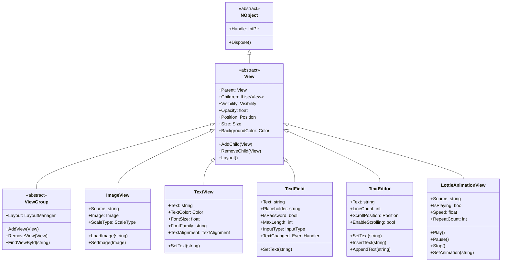

### 2. 레이아웃 컴포넌트 계층

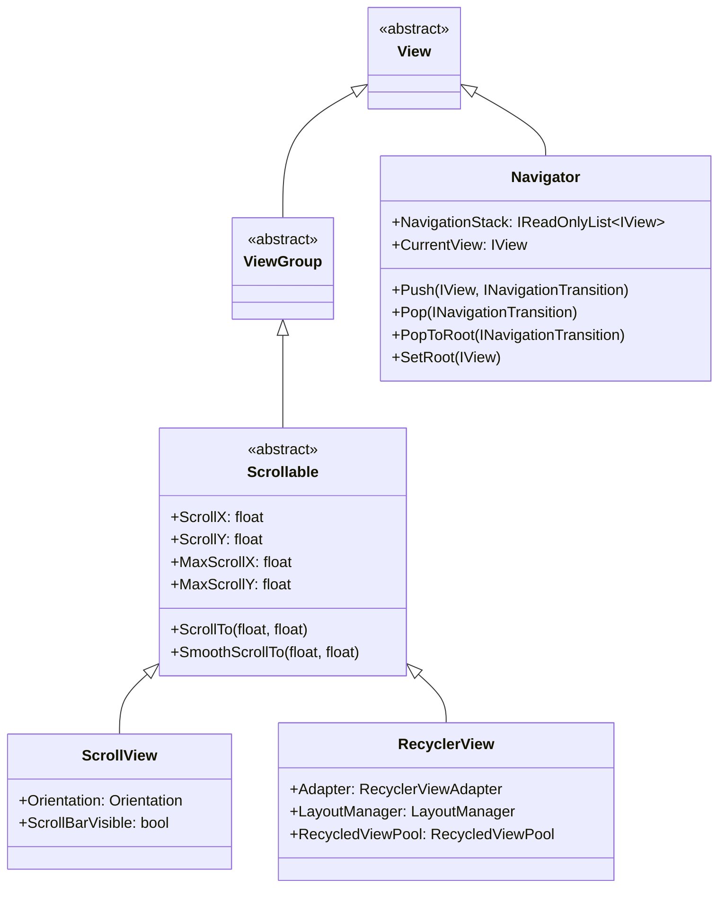

### 3. 인터랙티브 컴포넌트 계층

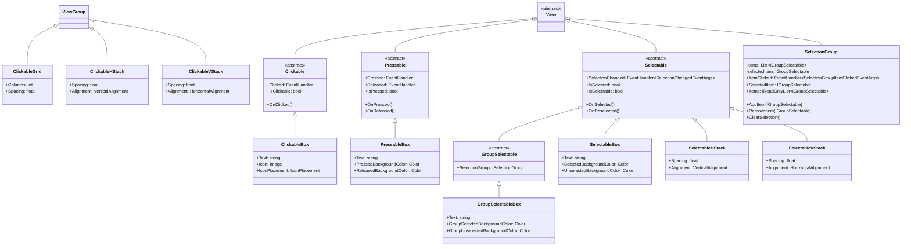

### 4. 진행 상태 컴포넌트 계층

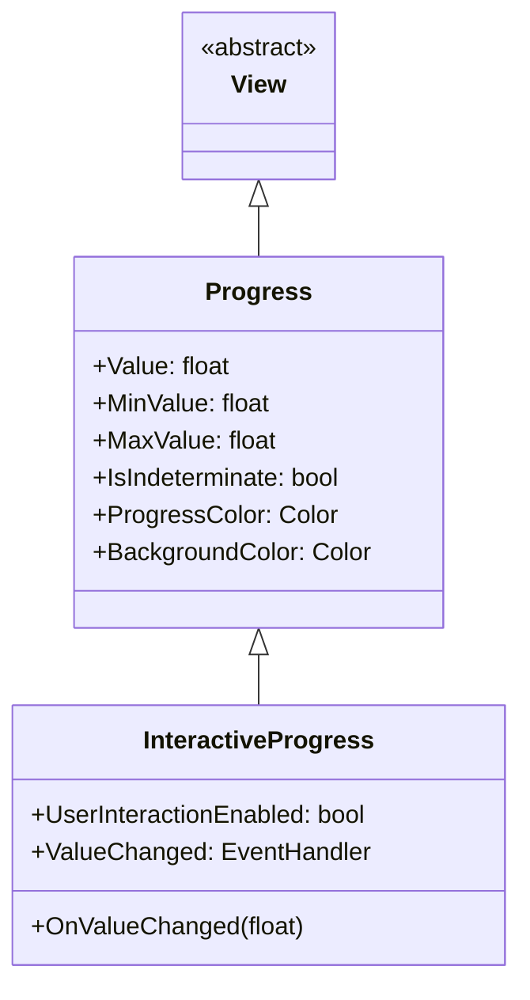

## 테마 구현체 상속 구조

### 1. Material Design 구현체

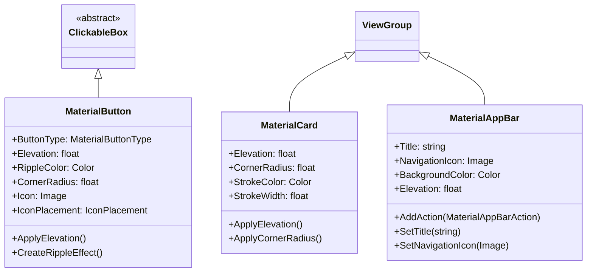

### 2. OneUI 구현체

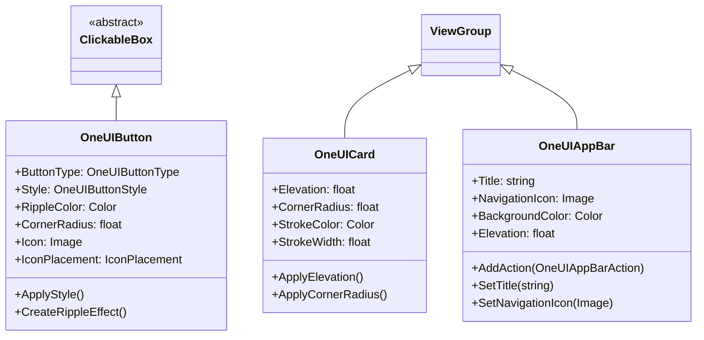

## 인터페이스 구현 관계

### 1. 클릭 가능 인터페이스

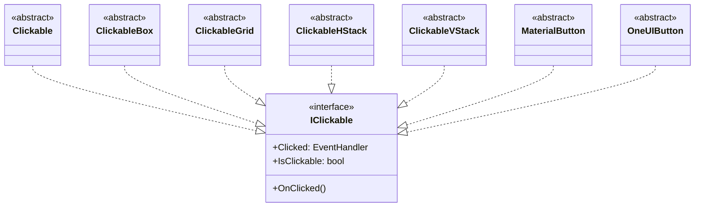

### 2. 선택 가능 인터페이스

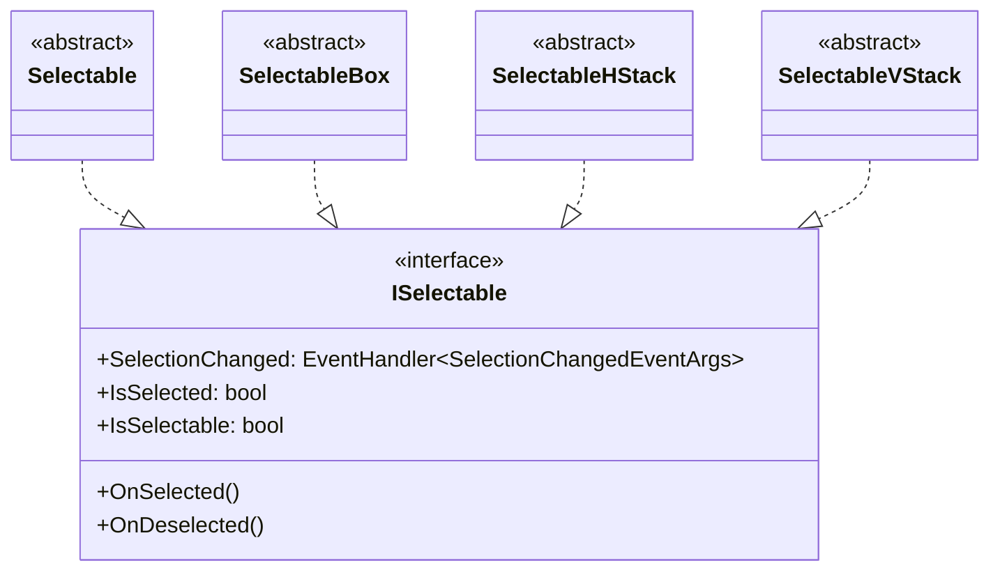

### 3. 그룹 선택 가능 인터페이스

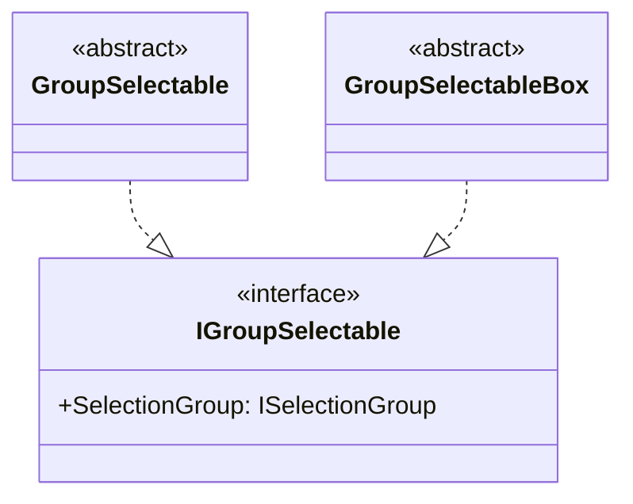

## 컴포넌트 조합 예제

### 1. 복합 컴포넌트 상속 구조

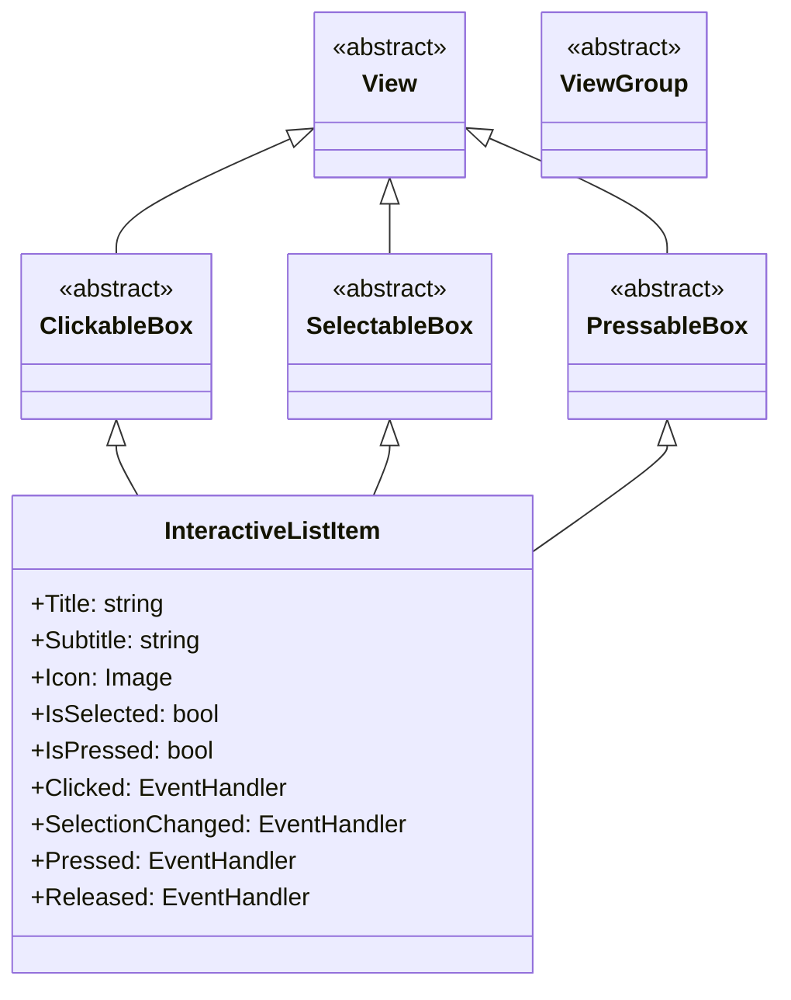

### 2. 커스텀 컴포넌트 상속 구조

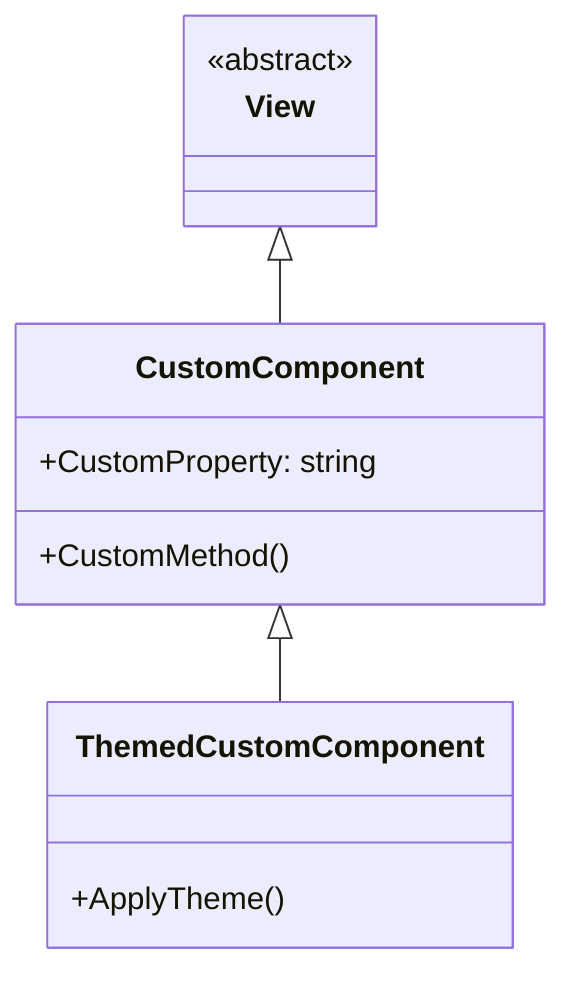

## 결론

Tizen.UI.Components의 상속 구조는 다음과 같은 특징을 가지고 있습니다:

1. **계층적 구조**: 명확한 계층 구조를 통해 코드의 조직화와 관리 용이성 제공
2. **확장성**: 추상 클래스와 인터페이스를 통해 새로운 컴포넌트의 추가가 용이
3. **재사용성**: 기존 컴포넌트를 상속받아 새로운 기능을 추가하거나 수정 가능
4. **유연성**: 인터페이스 기반 설계를 통해 다형성과 유연한 구성 가능
5. **테마 지원**: 테마 구현체를 통해 다양한 디자인 시스템 적용 가능

이러한 상속 구조는 Tizen.UI.Components가 강력하고 유연한 UI 프레임워크로 동작할 수 있도록 하며, 개발자들이 일관되고 효율적인 방식으로 UI 컴포넌트를 개발하고 확장할 수 있도록 지원합니다.
