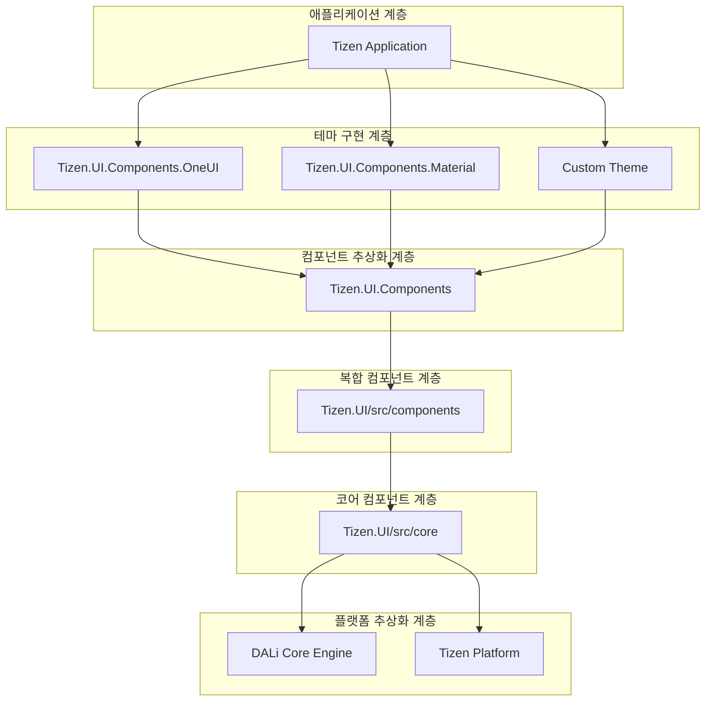
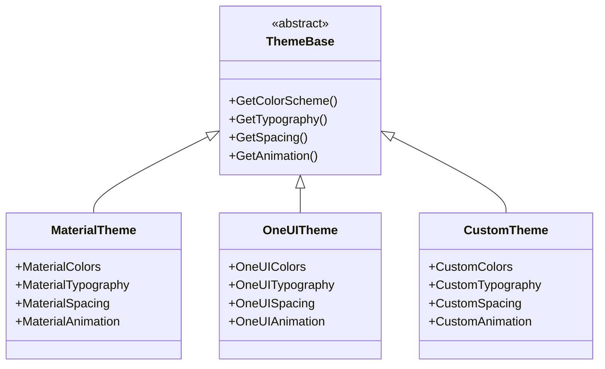
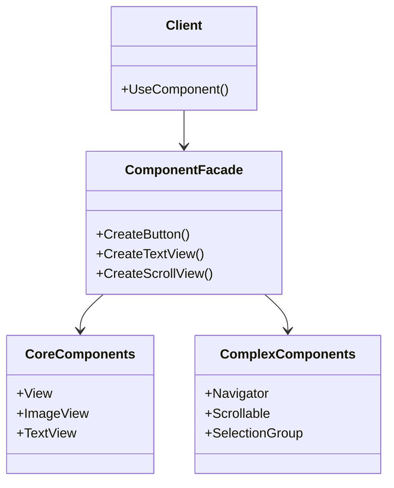
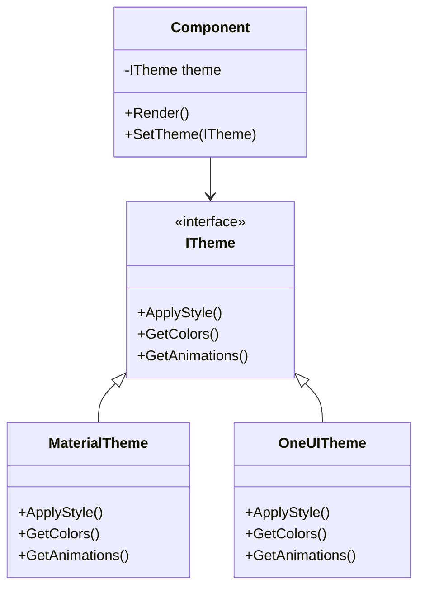
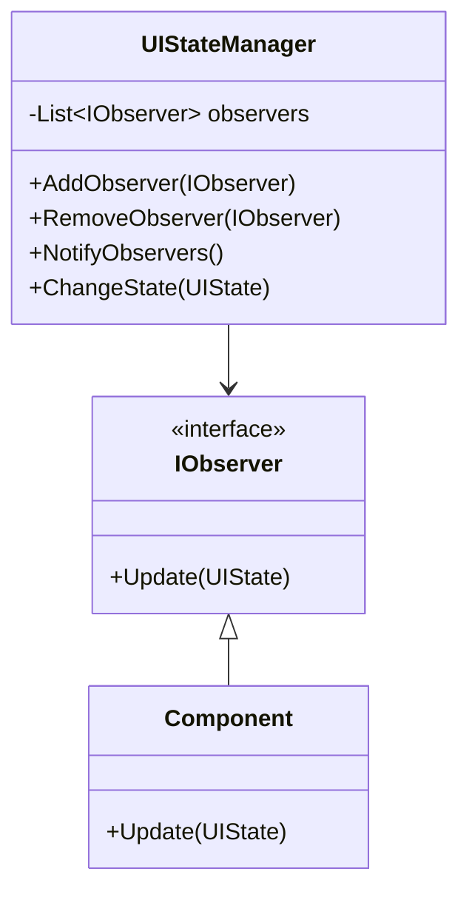
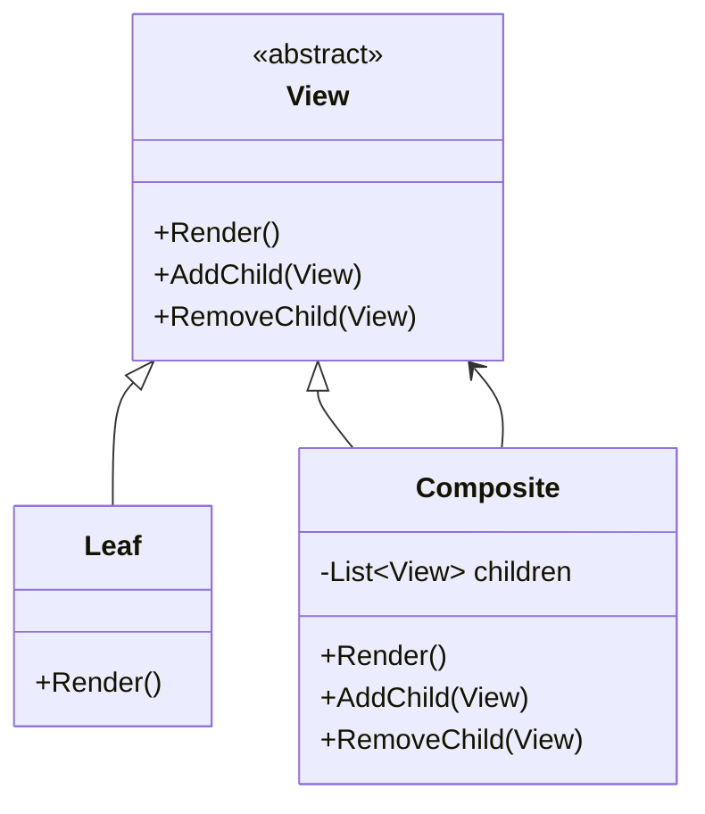
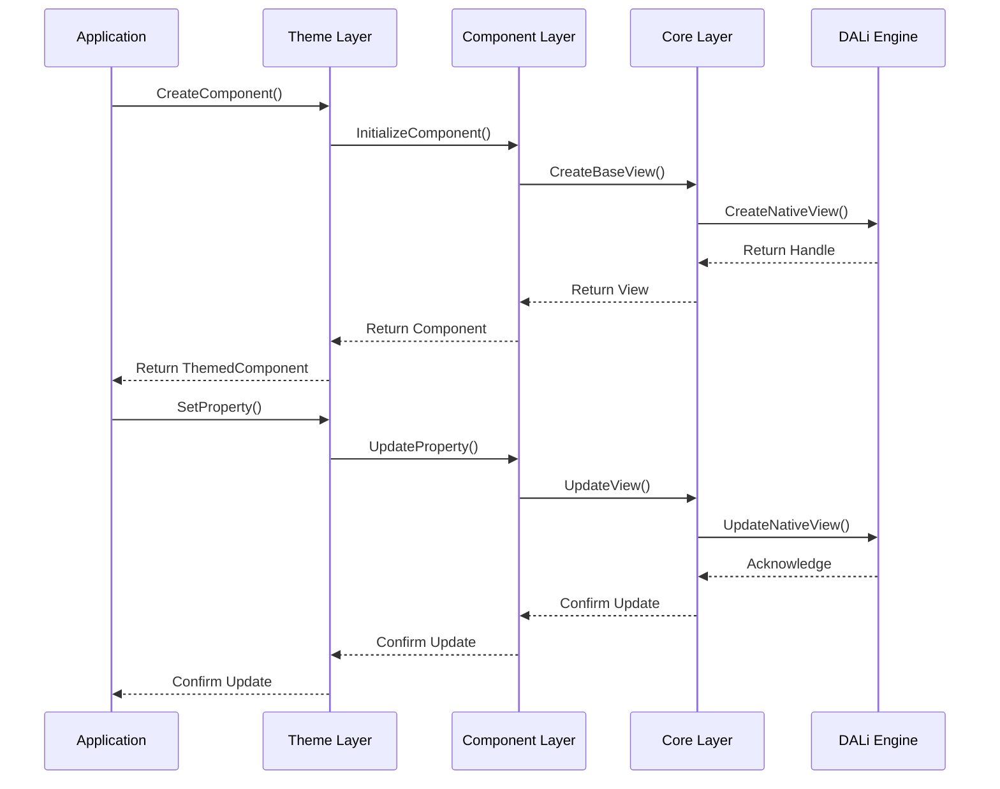
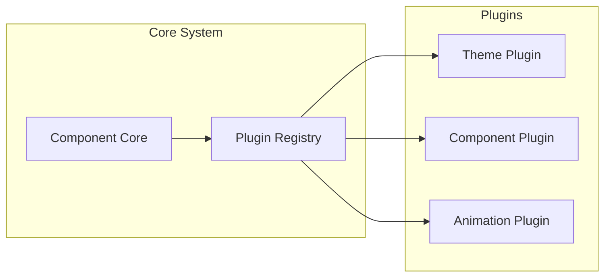

# Tizen.UI.Components 아키텍처

## 소개

Tizen.UI.Components는 계층적 아키텍처 패턴을 따라 설계된 현대적인 UI 프레임워크입니다. 이 아키텍처는 관심사의 분리, 재사용성, 확장성을 보장하며 개발자가 유연하고 유지보수가 용이한 코드를 작성할 수 있도록 지원합니다.

## 전체 아키텍처 개요

## 계층별 상세 분석

### 1. 애플리케이션 계층 (Application Layer)

**역할**: 최종 사용자 애플리케이션이 위치하는 계층

**특징**:
- 비즈니스 로직과 UI 로직 분리
- 테마 선택 및 컴포넌트 조합
- 사용자 인터랙션 처리

**주요 구성요소**:
- Tizen 애플리케이션
- 비즈니스 로직
- 데이터 모델

### 2. 테마 구현 계층 (Theme Implementation Layer)

**역할**: 특정 디자인 시스템을 구현하는 구체적인 컴포넌트들

**특징**:
- 플랫폼별 디자인 가이드라인 준수
- 시각적 스타일링 및 애니메이션
- 브랜드 정체성 구현

### 3. 컴포넌트 추상화 계층 (Component Abstraction Layer)

**역할**: 컴포넌트의 코어 인터페이스와 기본 기능 정의

**특징**:
- 인터페이스 기반 설계
- 공통 기능 추상화
- 상태 관리 시스템
- 속성 바인딩 시스템

**주요 구성요소**:
- **인터페이스**: IClickable, ISelectable, IGroupSelectable, ILayoutBox 등
- **기본 구현**: Selectable, Clickable, Pressable 등
- **상태 관리**: UIStateManager, UIState, UIStateChangedEventArgs 등
- **속성 시스템**: PropertySetter, IPropertySetter 등

### 4. 복합 컴포넌트 계층 (Complex Component Layer)

**역할**: 레이아웃과 복합적인 기능이 필요한 컴포넌트들

**특징**:
- 여러 코어 컴포넌트의 조합
- 복잡한 사용자 인터랙션 처리
- 레이아웃 관리
- 데이터 바인딩

**주요 컴포넌트**:
- **Navigator**: 화면 전환 및 내비게이션
- **Scrollable**: 스크롤 가능한 컨테이너
- **SelectionGroup**: 선택 가능한 항목 그룹
- **Progress**: 진행 상태 표시
- **Clickable/Pressable**: 인터랙티브 컴포넌트

### 5. 코어 컴포넌트 계층 (Core Component Layer)

**역할**: 가장 기본적인 UI 요소들

**특징**:
- 단일 책임 원칙 준수
- 최소한의 기능 제공
- 고성능 렌더링
- 플랫폼 독립성

**주요 컴포넌트**:
- **View**: 모든 UI 컴포넌트의 기반
- **ViewGroup**: 컨테이너 컴포넌트
- **ImageView**: 이미지 표시
- **TextView**: 텍스트 표시
- **TextField**: 텍스트 입력
- **TextEditor**: 다중 라인 텍스트 편집

### 6. 플랫폼 추상화 계층 (Platform Abstraction Layer)

**역할**: 하드웨어 및 운영체제와의 인터페이스

**특징**:
- 플랫폼 독립적인 API 제공
- 하드웨어 가속 활용
- 저수준 렌더링 관리

**주요 구성요소**:
- **DALi Core**: 3D 그래픽 렌더링 엔진
- **Tizen Platform**: 시스템 서비스 및 API

## 설계 패턴

### 1. 퍼사드 패턴 (Facade Pattern)

테마 구현체는 복잡한 내부 구조를 숨기고 간단한 API를 제공합니다.

### 2. 전략 패턴 (Strategy Pattern)

런타임에 테마를 동적으로 변경할 수 있습니다.

### 3. 옵서버 패턴 (Observer Pattern)

상태 변경 시 관련 컴포넌트들에게 자동으로 알림을 전달합니다.

### 4. 컴포지트 패턴 (Composite Pattern)

개별 컴포넌트와 컨테이너를 동일하게 처리할 수 있습니다.

## 데이터 흐름

## 성능 최적화 전략

### 1. 렌더링 최적화

- **하드웨어 가속**: DALi 엔진을 통한 GPU 활용
- **뷰 계층 최적화**: 불필요한 뷰 제거
- **레이지 로딩**: 필요한 컴포넌트만 동적 로딩

### 2. 메모리 관리

- **객체 풀링**: 자주 사용하는 컴포넌트 재사용
- **약한 참조**: 순환 참조 방지
- **가비지 컬렉션 최적화**: 메모리 누수 방지

### 3. 이벤트 처리 최적화

- **이벤트 버블링**: 효율적인 이벤트 전파
- **이벤트 디바운싱**: 불필요한 이벤트 처리 방지
- **비동기 처리**: UI 스레드 블로킹 방지

## 확장성 설계

### 1. 플러그인 아키텍처

### 2. 커스텀 컴포넌트 지원

- **상속 기반 확장**: 기존 컴포넌트 상속
- **컴포지션 기반 확장**: 여러 컴포넌트 조합
- **인터페이스 구현**: 표준 인터페이스 준수

## 테스트 전략

### 1. 단위 테스트

- 각 계층의 컴포넌트 독립 테스트
- 모의 객체를 통한 의존성 분리
- 경계 조건 및 예외 상황 테스트

### 2. 통합 테스트

- 계층 간 상호작용 테스트
- 데이터 흐름 검증
- 성능 벤치마킹

### 3. UI 테스트

- 사용자 시나리오 기반 테스트
- 접근성 테스트
- 다양한 디바이스 호환성 테스트

## 결론

Tizen.UI.Components의 아키텍처는 현대적인 소프트웨어 엔지니어링 원칙을 따라 설계되었습니다. 계층적 구조, 디자인 패턴의 적용, 그리고 확장성 고려를 통해 개발자에게 유연하고 강력한 UI 개발 환경을 제공합니다.

이 아키텍처는 다음과 같은 이점을 제공합니다:

1. **유지보수성**: 명확한 계층 분리로 코드 이해 및 수정 용이
2. **확장성**: 새로운 테마와 컴포넌트 쉽게 추가 가능
3. **재사용성**: 모듈화된 컴포넌트로 코드 재사용 극대화
4. **테스트 용이성**: 각 계층의 독립적인 테스트 지원
5. **성능**: DALi 엔진 기반의 고성능 렌더링

다음 문서에서는 각 계층의 구체적인 컴포넌트들과 인터페이스에 대해 자세히 살펴보겠습니다.
