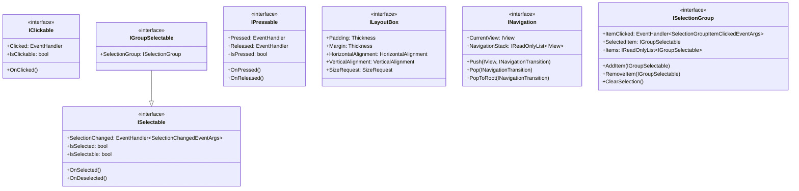

# Tizen.UI.Components 코어 인터페이스

## 소개

Tizen.UI.Components는 인터페이스 기반 설계 원칙을 따르며, 다양한 컴포넌트들이 공통된 인터페이스를 구현하도록 설계되어 있습니다. 이러한 인터페이스들은 컴포넌트 간의 일관성을 보장하고, 다형성을 통해 유연한 확장성을 제공합니다.

## 주요 인터페이스

### 1. IClickable 인터페이스

**설명**: 클릭 가능한 컴포넌트를 위한 인터페이스

**정의**:
```csharp
public interface IClickable
{
    event EventHandler Clicked;
    bool IsClickable { get; set; }
    void OnClicked();
}
```

**구현 컴포넌트**:
- Clickable
- ClickableBox
- ClickableGrid
- ClickableHStack
- ClickableVStack

**특징**:
- 클릭 이벤트 처리
- 클릭 가능 상태 관리
- 키보드 및 터치 인터랙션 지원

### 2. ISelectable 인터페이스

**설명**: 선택 가능한 컴포넌트를 위한 인터페이스

**정의**:
```csharp
public interface ISelectable
{
    event EventHandler<SelectionChangedEventArgs> SelectionChanged;
    bool IsSelected { get; set; }
    bool IsSelectable { get; set; }
    void OnSelected();
    void OnDeselected();
}
```

**구현 컴포넌트**:
- Selectable
- SelectableBox
- SelectableHStack
- SelectableVStack

**특징**:
- 선택 상태 관리
- 선택 변경 이벤트 처리
- 단일 선택 및 다중 선택 지원

### 3. IGroupSelectable 인터페이스

**설명**: 그룹 내에서 선택 가능한 컴포넌트를 위한 인터페이스

**정의**:
```csharp
public interface IGroupSelectable : ISelectable
{
    ISelectionGroup SelectionGroup { get; set; }
}
```

**구현 컴포넌트**:
- GroupSelectable
- GroupSelectableBox

**특징**:
- 그룹 내 단일 선택 보장
- 그룹 관리 기능
- 그룹 선택 변경 이벤트 처리

### 4. IPressable 인터페이스

**설명**: 누름 상태를 처리하는 컴포넌트를 위한 인터페이스

**정의**:
```csharp
public interface IPressable
{
    event EventHandler Pressed;
    event EventHandler Released;
    bool IsPressed { get; }
    void OnPressed();
    void OnReleased();
}
```

**구현 컴포넌트**:
- Pressable
- PressableBox

**특징**:
- 누름 상태 관리
- 누름/해제 이벤트 처리
- 터치 및 마우스 인터랙션 지원

### 5. ILayoutBox 인터페이스

**설명**: 레이아웃 박스 컴포넌트를 위한 인터페이스

**정의**:
```csharp
public interface ILayoutBox
{
    Thickness Padding { get; set; }
    Thickness Margin { get; set; }
    HorizontalAlignment HorizontalAlignment { get; set; }
    VerticalAlignment VerticalAlignment { get; set; }
    SizeRequest SizeRequest { get; set; }
}
```

**구현 컴포넌트**:
- SelectableBox
- ClickableBox
- PressableBox
- GroupSelectableBox

**특징**:
- 레이아웃 속성 관리
- 패딩 및 마진 설정
- 정렬 및 크기 조절

### 6. INavigation 인터페이스

**설명**: 내비게이션 기능을 제공하는 컴포넌트를 위한 인터페이스

**정의**:
```csharp
public interface INavigation
{
    void Push(IView view, INavigationTransition transition = null);
    void Pop(INavigationTransition transition = null);
    void PopToRoot(INavigationTransition transition = null);
    IView CurrentView { get; }
    IReadOnlyList<IView> NavigationStack { get; }
}
```

**구현 컴포넌트**:
- Navigator

**특징**:
- 화면 스택 관리
- 화면 전환 애니메이션
- 내비게이션 히스토리 관리

### 7. ISelectionGroup 인터페이스

**설명**: 선택 가능한 항목들의 그룹을 관리하는 인터페이스

**정의**:
```csharp
public interface ISelectionGroup
{
    event EventHandler<SelectionGroupItemClickedEventArgs> ItemClicked;
    void AddItem(IGroupSelectable item);
    void RemoveItem(IGroupSelectable item);
    void ClearSelection();
    IGroupSelectable SelectedItem { get; }
    IReadOnlyList<IGroupSelectable> Items { get; }
}
```

**구현 컴포넌트**:
- SelectionGroup
- SelectionGroupBox

**특징**:
- 그룹 내 항목 관리
- 단일 선택 보장
- 항목 클릭 이벤트 처리

## 인터페이스 상속 관계



## 인터페이스 구현 예제

### 1. ClickableBox 구현

```csharp
public class ClickableBox : SelectableBox, IClickable
{
    public event EventHandler Clicked;
    
    private bool _isClickable = true;
    
    public bool IsClickable
    {
        get => _isClickable;
        set
        {
            _isClickable = value;
            // 클릭 가능 상태에 따른 시각적 피드백 업데이트
            UpdateVisualState();
        }
    }
    
    public void OnClicked()
    {
        if (!_isClickable) return;
        
        // 클릭 이벤트 발생
        Clicked?.Invoke(this, EventArgs.Empty);
        
        // 선택 상태 토글
        IsSelected = !IsSelected;
    }
    
    protected override void OnTap(TapGestureEventArgs e)
    {
        base.OnTap(e);
        OnClicked();
    }
}
```

### 2. SelectionGroup 구현

```csharp
public class SelectionGroup : ISelectionGroup
{
    public event EventHandler<SelectionGroupItemClickedEventArgs> ItemClicked;
    
    private readonly List<IGroupSelectable> _items = new();
    private IGroupSelectable _selectedItem;
    
    public void AddItem(IGroupSelectable item)
    {
        if (item == null) return;
        
        // 이미 존재하는 항목인지 확인
        if (_items.Contains(item)) return;
        
        // 항목 추가
        _items.Add(item);
        
        // 선택 그룹 설정
        item.SelectionGroup = this;
        
        // 선택 변경 이벤트 구독
        item.SelectionChanged += OnItemSelectionChanged;
    }
    
    public void RemoveItem(IGroupSelectable item)
    {
        if (item == null || !_items.Contains(item)) return;
        
        // 선택 변경 이벤트 구독 해제
        item.SelectionChanged -= OnItemSelectionChanged;
        
        // 항목 제거
        _items.Remove(item);
        
        // 선택 그룹 해제
        item.SelectionGroup = null;
        
        // 현재 선택된 항목이 제거된 경우 선택 해제
        if (_selectedItem == item)
        {
            _selectedItem = null;
        }
    }
    
    public void ClearSelection()
    {
        if (_selectedItem != null)
        {
            _selectedItem.IsSelected = false;
            _selectedItem = null;
        }
    }
    
    public IGroupSelectable SelectedItem => _selectedItem;
    public IReadOnlyList<IGroupSelectable> Items => _items.AsReadOnly();
    
    private void OnItemSelectionChanged(object sender, SelectionChangedEventArgs e)
    {
        var item = sender as IGroupSelectable;
        if (item == null) return;
        
        // 항목 클릭 이벤트 발생
        ItemClicked?.Invoke(this, new SelectionGroupItemClickedEventArgs(item, e));
        
        // 이미 선택된 항목인 경우 처리
        if (e.IsSelected)
        {
            // 다른 항목이 선택된 상태라면 해제
            if (_selectedItem != null && _selectedItem != item)
            {
                _selectedItem.IsSelected = false;
            }
            
            // 현재 항목을 선택된 항목으로 설정
            _selectedItem = item;
        }
        else
        {
            // 선택 해제된 항목이 현재 선택된 항목인 경우
            if (_selectedItem == item)
            {
                _selectedItem = null;
            }
        }
    }
}
```

## 인터페이스 활용 패턴

### 1. 다형성 활용

```csharp
// 다양한 클릭 가능한 컴포넌트를 동일하게 처리
public void SetupClickHandlers(IEnumerable<IClickable> clickables)
{
    foreach (var clickable in clickables)
    {
        clickable.Clicked += OnComponentClicked;
        clickable.IsClickable = true;
    }
}

private void OnComponentClicked(object sender, EventArgs e)
{
    // 모든 클릭 가능한 컴포넌트에 대한 공통 처리
    Console.WriteLine("Component clicked");
}
```

### 2. 조합 패턴

```csharp
// 여러 인터페이스를 구현하는 복합 컴포넌트
public class InteractiveBox : View, IClickable, ISelectable, IPressable
{
    // IClickable 구현
    public event EventHandler Clicked;
    public bool IsClickable { get; set; } = true;
    
    // ISelectable 구현
    public event EventHandler<SelectionChangedEventArgs> SelectionChanged;
    public bool IsSelected { get; set; }
    public bool IsSelectable { get; set; } = true;
    
    // IPressable 구현
    public event EventHandler Pressed;
    public event EventHandler Released;
    public bool IsPressed { get; private set; }
    
    // 각 인터페이스 메서드 구현
    public void OnClicked() { /* 구현 */ }
    public void OnSelected() { /* 구현 */ }
    public void OnDeselected() { /* 구현 */ }
    public void OnPressed() { /* 구현 */ }
    public void OnReleased() { /* 구현 */ }
}
```

## 인터페이스 설계 원칙

### 1. 단일 책임 원칙 (SRP)

각 인터페이스는 하나의 책임만을 가지며, 명확한 목적을 가지고 있습니다.

```csharp
// 좋은 예: 단일 책임
public interface IClickable
{
    event EventHandler Clicked;
    bool IsClickable { get; set; }
    void OnClicked();
}

// 나쁜 예: 다중 책임
public interface IInteractiveComponent
{
    event EventHandler Clicked;
    event EventHandler Pressed;
    event EventHandler Released;
    event EventHandler<SelectionChangedEventArgs> SelectionChanged;
    bool IsClickable { get; set; }
    bool IsPressed { get; }
    bool IsSelected { get; set; }
    void OnClicked();
    void OnPressed();
    void OnReleased();
    void OnSelected();
    void OnDeselected();
}
```

### 2. 인터페이스 분리 원칙 (ISP)

클라이언트가 사용하지 않는 메서드에 의존하지 않도록 인터페이스를 분리합니다.

```csharp
// 필요한 기능만 노출
public interface IClickable
{
    event EventHandler Clicked;
    bool IsClickable { get; set; }
    void OnClicked();
}

public interface ISelectable
{
    event EventHandler<SelectionChangedEventArgs> SelectionChanged;
    bool IsSelected { get; set; }
    bool IsSelectable { get; set; }
    void OnSelected();
    void OnDeselected();
}
```

### 3. 의존성 역전 원칙 (DIP)

고수준 모듈은 저수준 모듈에 의존하지 않고, 모두 추상화에 의존해야 합니다.

```csharp
// 고수준 모듈
public class ComponentManager
{
    // 추상화에 의존
    private readonly IEnumerable<IClickable> _clickables;
    
    public ComponentManager(IEnumerable<IClickable> clickables)
    {
        _clickables = clickables;
    }
    
    public void EnableAllClickables()
    {
        foreach (var clickable in _clickables)
        {
            clickable.IsClickable = true;
        }
    }
}
```

## 결론

Tizen.UI.Components의 코어 인터페이스는 컴포넌트 간의 일관성과 확장성을 보장하는 핵심 요소입니다. 인터페이스 기반 설계를 통해 다음과 같은 이점을 제공합니다:

1. **다형성**: 동일한 인터페이스를 구현하는 다양한 컴포넌트를 동일하게 처리 가능
2. **확장성**: 새로운 컴포넌트를 기존 인터페이스를 구현하여 쉽게 추가 가능
3. **유지보수성**: 인터페이스 변경 시 구현체만 수정하면 됨
4. **테스트 용이성**: 모의 객체를 통해 단위 테스트 가능

다음 문서에서는 각 계층의 구체적인 컴포넌트들에 대해 자세히 살펴보겠습니다.
